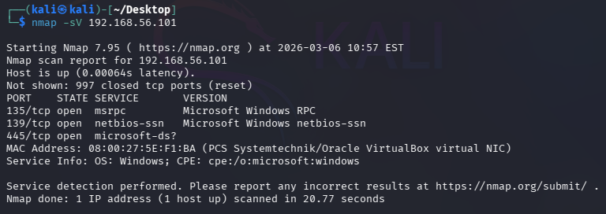
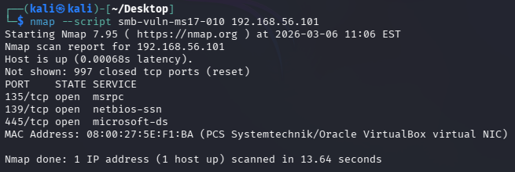

# Exercise 01 — Network Reconnaissance Scan

**Date:** 06/03/2026
**Category:** Reconnaissance
**Tools:** Nmap 7.95
**Attacker:** Kali Linux — 192.168.56.102
**Target:** Windows 10 — 192.168.56.101

---

## Objective
Identify open ports and running services on the target Windows 10 host.

---

## Commands Run
```bash
nmap -sV 192.168.56.101
nmap --script smb-vuln-ms17-010 192.168.56.101
```

---

## Results
```
PORT    STATE SERVICE       VERSION
135/tcp open  msrpc         Microsoft Windows RPC
139/tcp open  netbios-ssn   Microsoft Windows netbios-ssn
445/tcp open  microsoft-ds?
```

---

## Findings

**Port 135 (MSRPC)** — Windows RPC service exposed. Could be leveraged 
for DCOM-based attacks if unpatched.

**Port 139 (NetBIOS)** — Legacy file sharing protocol active. Can be 
used for enumeration to extract machine name, OS version, and workgroup 
information.

**Port 445 (SMB)** — File sharing service exposed with no firewall 
protection. This port was the attack vector for the EternalBlue exploit 
(MS17-010) behind the WannaCry ransomware attack of 2017.

**SMB Vulnerability Scan** — nmap smb-vuln-ms17-010 script returned no 
result. Host appears patched against EternalBlue. Firewall was disabled 
for this test to ensure accurate results.

---

## Real-World Relevance
This is the first step any attacker performs after identifying a target 
— mapping what's open and what's running. All three ports are standard 
on Windows machines but represent a significant attack surface if exposed 
to an untrusted network. The confirmed patch status against MS17-010 
demonstrates that default Windows 10 installations include critical 
security updates, but the ports remain exploitable through other means 
if left unprotected.

---

## Recommendation
Ports 135, 139 and 445 should be blocked at the firewall on any machine 
not explicitly requiring Windows file sharing. SMB port 445 should never 
be exposed to untrusted networks regardless of patch status.

---

## Screenshots


