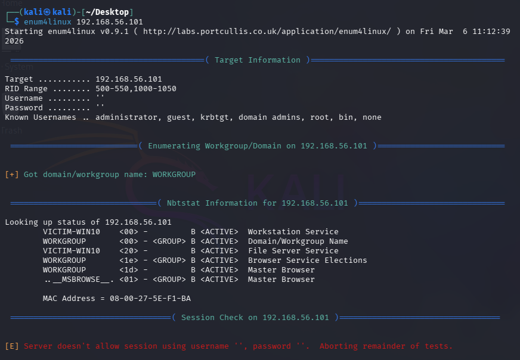

# Exercise 02 — SMB Enumeration

**Date:** 06/03/2026
**Category:** Enumeration
**Tools:** enum4linux v0.9.1
**Attacker:** Kali Linux — 192.168.56.102
**Target:** Windows 10 — 192.168.56.101

---

## Objective
Extract system information from open SMB/NetBIOS ports identified 
in Exercise 01.

---

## Command Run
```bash
enum4linux 192.168.56.101
```



---

## Results
```
Target: 192.168.56.101
Domain/Workgroup: WORKGROUP
Hostname: VICTIM-WIN10

NetBIOS Information:
VICTIM-WIN10    <00>  Workstation Service
VICTIM-WIN10    <20>  File Server Service (ACTIVE)
WORKGROUP       <00>  Domain/Workgroup Name
MAC Address: 08-00-27-5E-F1-BA (Oracle VirtualBox)

Session Check: Server rejected anonymous null session login
```

---

## Findings

- **Hostname retrieved** — `VICTIM-WIN10` exposed via NetBIOS without 
any authentication
- **Workgroup: WORKGROUP** — standalone machine, not joined to a 
corporate Active Directory domain
- **File Server Service active** — machine actively advertising SMB 
file sharing capability
- **Master Browser active** — broadcasting presence and discoverability 
to the network
- **MAC address exposed** — identifiable as Oracle VirtualBox NIC
- **Null session rejected** — Windows 10 default security policy blocks 
unauthenticated SMB sessions

---

## Real-World Relevance
Before any authentication attempt, an attacker has already learned the 
machine name, network role, and that file sharing is active. This 
information feeds directly into the next phase of an attack: credential 
attacks or targeted exploitation of the SMB service. The null session 
rejection is a positive defensive control, but the volume of information 
exposed before that point remains significant.

---

## Recommendation
NetBIOS (port 139) should be disabled on machines that do not require 
legacy file sharing. SMB port 445 should be restricted at the firewall 
to only trusted internal IPs. Machine names and network roles should 
not be discoverable by unauthenticated users.
