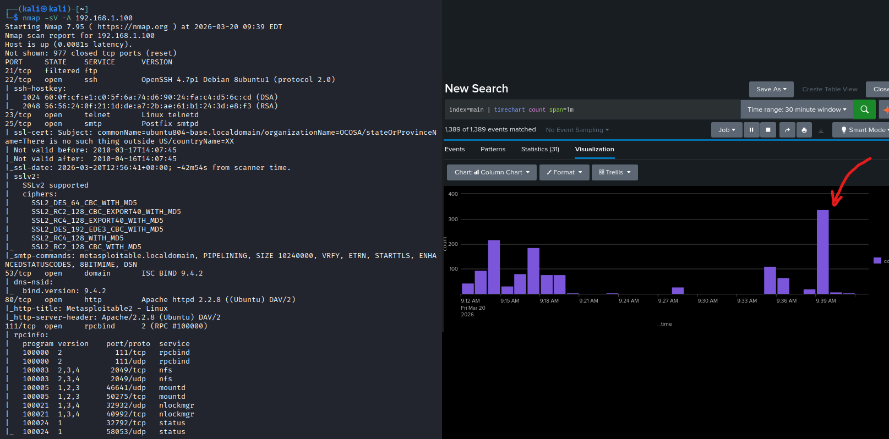
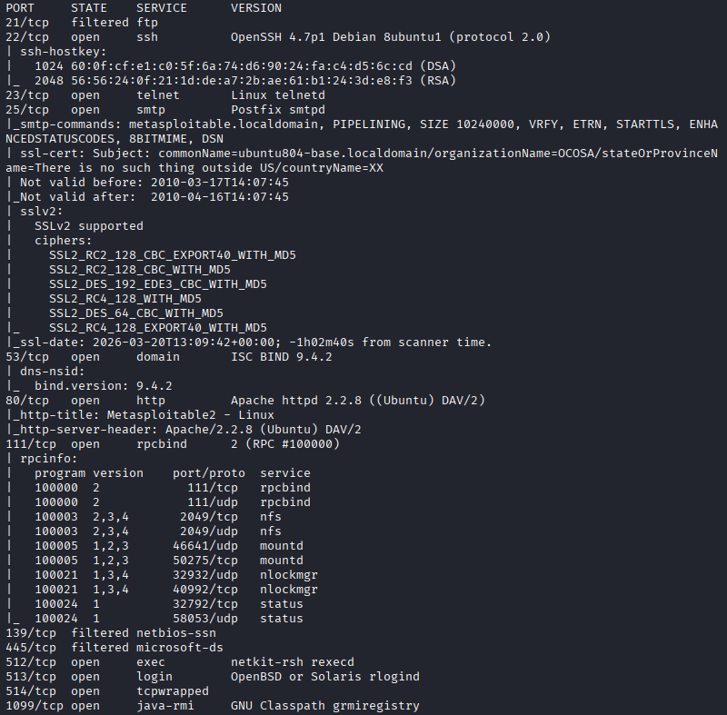
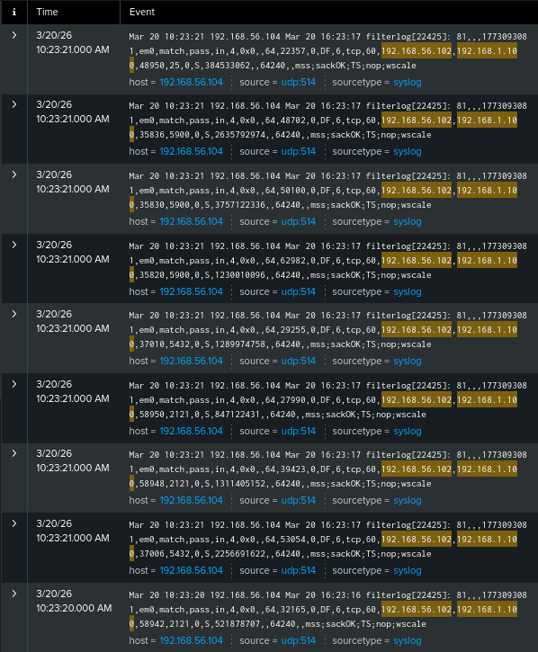

# Exercise 09 — Port Scan Detection via Splunk SIEM

**Date:** 20/03/2026
**Category:** Reconnaissance / SOC Detection
**Tools:** Nmap 7.95, Splunk Enterprise, pfSense 2.7.2
**Attacker:** Kali Linux — 192.168.56.102
**Firewall:** pfSense — WAN 192.168.56.104 / LAN 192.168.1.1
**Target:** Metasploitable2 — 192.168.1.100

---

## Objective
Perform a full aggressive port scan against Metasploitable2, observe
the resulting traffic spike in Splunk, and analyse the raw firewall
logs to identify port scan patterns a SOC analyst would recognise.

---

## Background
Port scanning is the first step of almost every attack — the attacker
maps what services are running before choosing an exploit. From a SOC
perspective, port scans are one of the most recognisable traffic
patterns: a single source IP generating rapid sequential connections
to many different destination ports in a short time window.

A full nmap `-A` scan generates hundreds of packets in seconds —
creating a visible spike in firewall logs that stands out clearly
against normal baseline traffic.

---

## Part A — Full Aggressive Port Scan

An aggressive nmap scan was run against Metasploitable2 to enumerate
all open ports, service versions, and OS information:
```bash
nmap -sV -A 192.168.1.100
```

| Flag | Meaning |
|---|---|
| `-sV` | Service version detection |
| `-A` | Aggressive — enables OS detection, version detection, script scanning and traceroute |

**Scan completed in 34.56 seconds.**

### Screenshot — Nmap Running with Simultaneous Splunk Traffic Spike


---

## Results — Open Ports Discovered

| Port | State | Service | Version |
|---|---|---|---|
| 21 | filtered | ftp | — (blocked by pfSense) |
| 22 | open | ssh | OpenSSH 4.7p1 |
| 23 | open | telnet | Linux telnetd |
| 25 | open | smtp | Postfix smtpd |
| 53 | open | dns | ISC BIND 9.4.2 |
| 80 | open | http | Apache 2.2.8 |
| 111 | open | rpcbind | v2 |
| 139 | filtered | netbios-ssn | — (blocked by pfSense) |
| 445 | filtered | microsoft-ds | — (blocked by pfSense) |
| 512 | open | exec | netkit-rsh rexecd |
| 513 | open | login | rlogind |
| 1099 | open | java-rmi | GNU Classpath |
| 1524 | open | bindshell | Metasploitable root shell |
| 2049 | open | nfs | v2-4 |
| 2121 | open | ftp | ProFTPD 1.3.1 |
| 3306 | open | mysql | MySQL 5.0.51a |
| 5432 | open | postgresql | PostgreSQL 8.3.0 |
| 5900 | open | vnc | VNC protocol 3.3 |
| 6000 | open | X11 | access denied |
| 6667 | open | irc | UnrealIRCd 3.2.8.1 |
| 8009 | open | ajp13 | Apache Jserv |
| 8180 | open | http | Apache Tomcat 5.5 |

**Notable finding:** Ports 21, 139, and 445 show as `filtered` —
confirming the pfSense block rules from Exercise 06 are still active.

### Screenshot — Open Ports Discovered


---

## Part B — Traffic Spike in Splunk

Before the scan: **1,258 events** in Splunk index.
After the scan: **1,641 events** — a jump of **383 events in 34 seconds**.

The Splunk timeline visualization showed this as a clear column spike
against the baseline — normal traffic generates a steady low volume,
while the port scan created an immediate burst.

Raw pfSense filterlog entries during the scan showed rapid sequential
TCP SYN packets from `192.168.56.102` to `192.168.1.100` across
many different destination ports — the textbook signature of a port
scan.

### Screenshot — Raw Splunk Events During Port Scan


---

## Part C — Detection Analysis

A real-time alert was configured in Splunk:

| Field | Value |
|---|---|
| Title | Port Scan Detection |
| Search | `index=main 192.168.56.102 192.168.1.100 earliest=-1m` |
| Trigger Condition | Number of results > 5 |
| Severity | High |

**Note on alert behaviour:** The port scan alert shares the same
search pattern as the SSH brute force alert from Exercise 08 —
both generate high volumes of traffic between the same two IPs.
In production environments, port scan detection rules are more
specific, using parsed fields like destination port count or
connection rate per second. With raw pfSense syslog, the most
reliable indicator is the traffic volume spike visible in the
timeline visualization rather than a port-specific rule.

This is a realistic SOC constraint — log source quality directly
affects detection precision. Higher fidelity detection would
require a fully parsed data source or a dedicated IDS such as
Snort or Suricata feeding structured alerts into the SIEM.

---

## Real-World Relevance

**What a SOC analyst looks for:**
- Single source IP connecting to many different destination ports
  in rapid succession
- Traffic volume spike against established baseline
- Mix of SYN packets with RST responses — characteristic of a
  closed port scan
- Filtered ports showing in scan results indicate firewall rules
  are working

**Port scan → exploit chain:** The nmap results directly inform
attack selection. Port 1524 (Metasploitable root shell) and port
6667 (UnrealIRCd — used in a known backdoor exploit) are
immediately visible. A real attacker would use these results to
choose their next move within minutes of the scan completing.

**pfSense block rules working:** Ports 21, 139, and 445 appear
as `filtered` in nmap output — confirming the firewall rules from
Exercise 06 are blocking those services from the attacker's
perspective even though the services are running on Metasploitable.

---

## Recommendation
- Deploy a dedicated IDS (Snort/Suricata) to detect port scans
  with higher precision than firewall logs alone
- Alert on more than 15 unique destination ports from a single
  source IP within 60 seconds
- Baseline normal traffic patterns — anomaly detection is more
  reliable than static thresholds
- Block or rate-limit inbound SYN packets from unknown source IPs
  at the perimeter firewall
