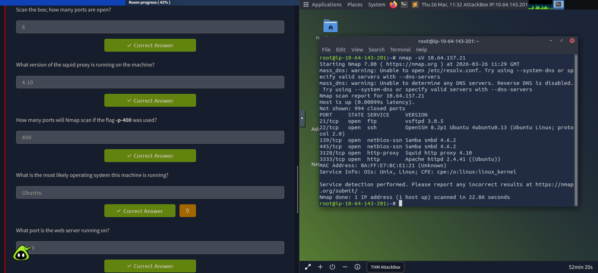
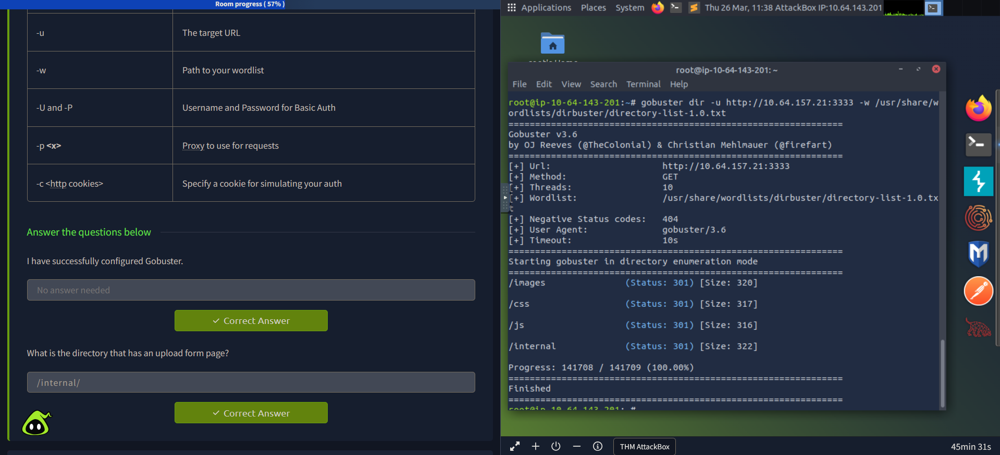

# Exercise 16 — Web Reconnaissance: Nmap Service Scanning & Gobuster Directory Enumeration

**Date:** 26/03/2026
**Category:** Reconnaissance
**Tools:** Nmap 7.80, Gobuster 3.6
**Attacker:** TryHackMe AttackBox
**Target:** TryHackMe — 10.64.157.21

---

## Objective
Perform web-focused reconnaissance against a target machine using Nmap
to identify open ports and running services, then use Gobuster to
brute-force hidden directories on the web server — replicating the
initial reconnaissance phase of a real-world web application assessment.

---

## Background
Reconnaissance is the first phase of every attack. Before attempting
exploitation, an attacker maps the target's attack surface — what ports
are open, what services are running, what versions are exposed, and what
web directories exist. Two tools are standard for this phase:

**Nmap** identifies open ports and service versions through active
probing. Service version information directly informs exploit selection
— a vsftpd 2.3.4 server is immediately recognisable as a backdoor
target, while an outdated Apache version may be vulnerable to known CVEs.

**Gobuster** brute-forces web directories by testing each entry in a
wordlist against the target URL. Web applications frequently have
hidden admin panels, upload forms, and configuration pages that are not
linked from the main site but remain accessible if you know the path.
Finding these is a critical step before attempting web exploitation.

---

## Part A — Nmap Service Version Scan

An Nmap service version scan was run against the target to identify all
open ports and their associated services:
```bash
nmap -sV 10.64.157.21
```

| Flag | Meaning |
|---|---|
| `-sV` | Service version detection — probes open ports to determine application name and version |

**Scan completed in 22.86 seconds.**

**Results — 6 open ports identified:**

| Port | State | Service | Version |
|---|---|---|---|
| 21/tcp | open | ftp | vsftpd 3.0.5 |
| 22/tcp | open | ssh | OpenSSH 8.2p1 Ubuntu |
| 139/tcp | open | netbios-ssn | Samba smbd 4.6.2 |
| 445/tcp | open | netbios-ssn | Samba smbd 4.6.2 |
| 3128/tcp | open | http-proxy | Squid http proxy 4.10 |
| 3333/tcp | open | http | Apache httpd 2.4.41 |

**Key observations:**
- Web server running on non-standard port **3333** — would be missed
  without a full port scan
- Squid proxy version **4.10** visible — version disclosure is a
  misconfiguration that aids attacker reconnaissance
- OS identified as **Ubuntu Linux** from SSH banner information
- FTP, SMB, and HTTP all exposed — multiple potential attack surfaces

### Screenshot — Nmap Service Scan Results


---

## Part B — Gobuster Directory Enumeration

With the web server identified on port 3333, Gobuster was used to
brute-force hidden directories:
```bash
gobuster dir -u http://10.64.157.21:3333 -w /usr/share/wordlists/dirbuster/directory-list-1.0.txt
```

| Flag | Meaning |
|---|---|
| `dir` | Directory enumeration mode |
| `-u` | Target URL including port |
| `-w` | Wordlist path — each entry tested as a directory name |

**Result — 4 directories discovered:**

| Directory | Status Code |
|---|---|
| /images | 301 (redirect) |
| /css | 301 (redirect) |
| /js | 301 (redirect) |
| /internal | 301 (redirect) |

**Key finding:** `/internal` — not linked from the main site, contains
an upload form. This is the target for the next phase of the attack.
A status 301 indicates the directory exists and redirects — confirming
it is accessible.

### Screenshot — Gobuster Directory Enumeration Results


---

## Attack Chain Summary
```
Nmap -sV identifies 6 open ports and service versions
    → Web server found on non-standard port 3333
        → Gobuster brute-forces directories against port 3333
            → /internal discovered — hidden upload form
                → Foundation set for web exploitation (file upload attack)
```

---

## Real-World Relevance

**Non-standard ports are commonly overlooked.** Automated scanners and
casual analysts often check only ports 80 and 443 for web services.
Running a full port scan first ensures nothing is missed — in this case
the entire web application was running on port 3333.

**Version disclosure aids attackers significantly.** Every service
returned its exact version in the Nmap output — vsftpd 3.0.5, Squid
4.10, Apache 2.4.41. In production environments, service banners should
be suppressed or obscured to slow attacker reconnaissance.

**Hidden directories are a common finding in web assessments.** The
`/internal` upload page was not linked anywhere on the site but remained
fully accessible. Directory brute-forcing is a standard step in every
web application penetration test and bug bounty assessment.

**Gobuster is standard in SOC and red team toolkits.** Analysts
investigating web-based incidents use directory enumeration to understand
what paths an attacker may have accessed. Web server access logs showing
a burst of sequential 404 responses followed by a 200 is the classic
signature of a Gobuster scan.

---

## Recommendation
- Suppress service version banners — configure Apache, vsftpd and SSH
  to withhold version information from unauthenticated requests
- Restrict access to administrative and upload directories by IP
  allowlist or authentication — `/internal` should never be publicly
  accessible without authentication
- Run web services on standard ports where possible — non-standard ports
  reduce casual exposure but are trivially identified by any port scan
- Monitor web server access logs for directory brute-force patterns —
  high volumes of 404 responses from a single IP in a short time window
  is a reliable detection signal
- Deploy a WAF to rate-limit and block automated directory enumeration
  tools based on request frequency and user agent signatures
