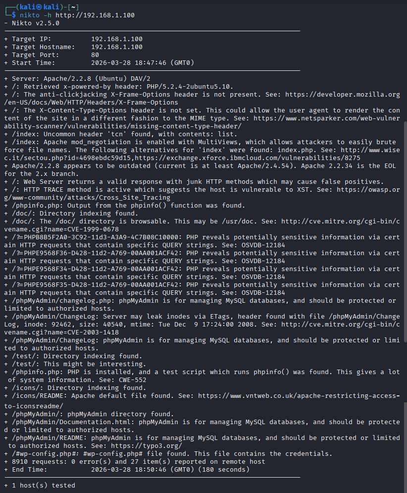
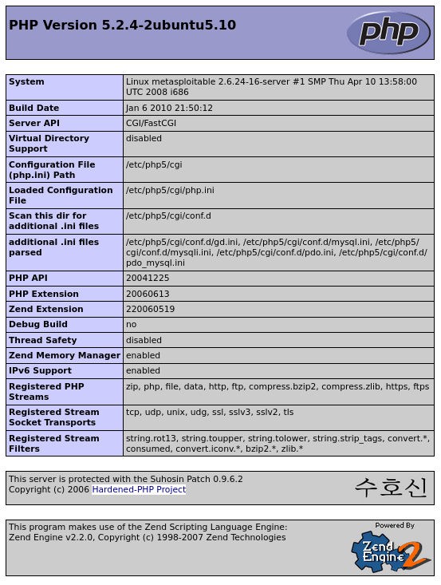
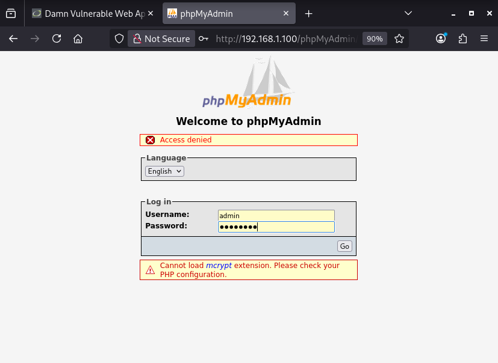

# Exercise 19 — Nikto Web Vulnerability Scanner

**Date:** 28/03/2026
**Category:** Reconnaissance
**Tools:** Nikto 2.5.0, Firefox
**Attacker:** Kali Linux — 192.168.56.102
**Firewall:** pfSense — WAN 192.168.56.104 / LAN 192.168.1.1
**Target:** Metasploitable2 — 192.168.1.100

---

## Objective
Use Nikto to perform automated web vulnerability scanning against
Metasploitable2, identify misconfigurations, exposed sensitive files,
and outdated software versions — then manually verify the most critical
findings in the browser to demonstrate real-world impact.

---

## Background
Manual web exploitation (SQLi, XSS, command injection, file upload)
requires knowing where to look. In practice, attackers first run
automated scanners to rapidly map the attack surface before choosing
which vulnerabilities to pursue manually.

**Nikto** is an open-source web server scanner that tests for over
6,700 potentially dangerous files, outdated server versions, and
common misconfigurations. It is not a stealth tool — it generates
significant traffic and will appear in web server logs — but it is
extremely effective at quickly identifying low-hanging fruit.

From a SOC perspective, a Nikto scan against a production server is
a high-confidence indicator of active reconnaissance. The volume and
pattern of requests it generates — thousands of sequential probes in
minutes — is immediately visible in web server access logs and WAF
alerts.

---

## Lab Setup

VMs running from previous exercises. Routes already applied. Target
web server confirmed accessible at `http://192.168.1.100`.

### Screenshot — Lab Setup: All VMs Running


---

## Part A — Running the Nikto Scan

Nikto was run against the Metasploitable2 web server:
```bash
nikto -h http://192.168.1.100
```

| Flag | Meaning |
|---|---|
| `-h` | Target host — accepts IP, hostname, or full URL |

**Scan completed in 180 seconds (3 minutes). 27 findings identified.**

### Screenshot — Full Nikto Scan Output


---

## Part B — Key Findings Analysis

**27 findings** were returned. The most significant are categorised
below:

**Outdated and Vulnerable Software:**

| Finding | Risk |
|---|---|
| Apache/2.2.8 — end of life, current is 2.4.54+ | Known CVEs, no security patches |
| PHP/5.2.4 — severely outdated | Multiple known RCE vulnerabilities |

**Sensitive Files and Directories Exposed:**

| Path | Finding |
|---|---|
| `/phpinfo.php` | Full PHP configuration exposed — server paths, modules, environment variables |
| `/phpMyAdmin/` | Database admin panel publicly accessible |
| `/phpMyAdmin/ChangeLog` | Version disclosure via ETag header (CVE-2003-1418) |
| `/doc/` | Directory indexing enabled — `/usr/doc` browsable |
| `/icons/README` | Apache default file present — indicates default installation |
| `/#wp-config.php#` | WordPress config file found — may contain database credentials |

**Missing Security Headers:**

| Header | Risk |
|---|---|
| `X-Frame-Options` missing | Clickjacking attacks possible |
| `X-Content-Type-Options` missing | MIME type sniffing attacks possible |

**Dangerous Methods Enabled:**

| Finding | Risk |
|---|---|
| HTTP TRACE active | Cross-Site Tracing (XST) attack possible |
| Junk HTTP methods return valid response | May cause false negatives in security tools |

**PHP Information Disclosure:**

Multiple query strings (`?=PHPB8B5F2A0...`) trigger PHP to reveal
sensitive internal information — a known PHP behaviour documented
under OSVDB-12184.

---

## Part C — Manual Verification of Critical Findings

The two most critical findings were verified manually in the browser.

**Finding 1 — phpinfo.php exposed:**

Navigating to `http://192.168.1.100/phpinfo.php` revealed the full
PHP configuration — server software versions, loaded modules, file
system paths, environment variables, and compilation options. This
information directly aids an attacker in selecting targeted exploits.

### Screenshot — phpinfo.php Exposed in Browser


**Finding 2 — phpMyAdmin publicly accessible:**

Navigating to `http://192.168.1.100/phpMyAdmin/` revealed a live
database administration panel with no IP restriction. phpMyAdmin
provides a full GUI interface to the MySQL database — if credentials
are obtained or guessed, an attacker has complete control over all
databases on the server. The panel being exposed to the network at
all represents a significant misconfiguration regardless of whether
authentication succeeds.

### Screenshot — phpMyAdmin Login Panel Exposed


---

## Nikto vs Manual Testing

| Approach | Strength | Limitation |
|---|---|---|
| Nikto (automated) | Fast, comprehensive, consistent | Noisy — visible in logs, false positives possible |
| Manual testing | Precise, context-aware, stealthy | Slow, dependent on tester knowledge |

In practice both are used together — Nikto maps the surface quickly,
manual testing exploits what Nikto finds. Exercises 10-18 in this
portfolio are the manual testing phase of what Nikto detects
automatically here.

---

## Attack Chain Summary
```
Nikto scans 8,910 requests in 180 seconds
    → 27 findings identified automatically
        → phpinfo.php exposes full server configuration
            → phpMyAdmin panel exposed — database admin accessible
                → Outdated Apache/PHP versions confirmed — known CVEs applicable
                    → Attack surface fully mapped for targeted manual exploitation
```

---

## Real-World Relevance

**Automated scanners are the first step of every web assessment.**
Bug bounty hunters, penetration testers, and malicious attackers all
run automated tools before manual exploitation. Nikto, Burp Suite,
and OWASP ZAP are the standard toolkit for this phase.

**27 findings on a default installation is realistic.** Many
production servers — particularly older ones or those set up by
non-security-focused teams — have similar profiles. Default files
left in place, missing security headers, and exposed admin panels
are among the most common findings in real web application assessments.

**phpMyAdmin exposure is a critical finding in real environments.**
Exposed database admin panels with weak or default credentials have
been the entry point in numerous real-world breaches. Any internet-
facing phpMyAdmin installation should be considered a high-severity
finding.

**SOC detection of Nikto is straightforward.** The tool sends
thousands of requests in minutes including many with distinctive
signatures in the User-Agent header (`Nikto/2.5.0`). Web server
access logs and WAF alerts will show an obvious spike with the
Nikto user agent string — making it one of the easiest scanners
to detect and block.

---

## Recommendation
- Remove default files immediately after installation — `/phpinfo.php`,
  `/icons/README`, `/doc/` and similar files should never exist on a
  production server
- Restrict phpMyAdmin to localhost or a specific admin IP range —
  it should never be accessible from the public internet or an
  untrusted network
- Update Apache and PHP to supported versions — Apache 2.2.8 and
  PHP 5.2.4 have been end-of-life for over a decade with dozens of
  known unpatched vulnerabilities
- Implement security headers — `X-Frame-Options`, `X-Content-Type-Options`,
  and `Content-Security-Policy` should be standard on all web servers
- Disable HTTP TRACE method — add `TraceEnable Off` to Apache
  configuration to eliminate XST attack surface
- Enable WAF rules to detect and block Nikto and similar scanner
  signatures — User-Agent blocking and rate limiting on 404 responses
  are effective first steps
- Run Nikto or equivalent scanners against your own web applications
  regularly — find your misconfigurations before attackers do
  
