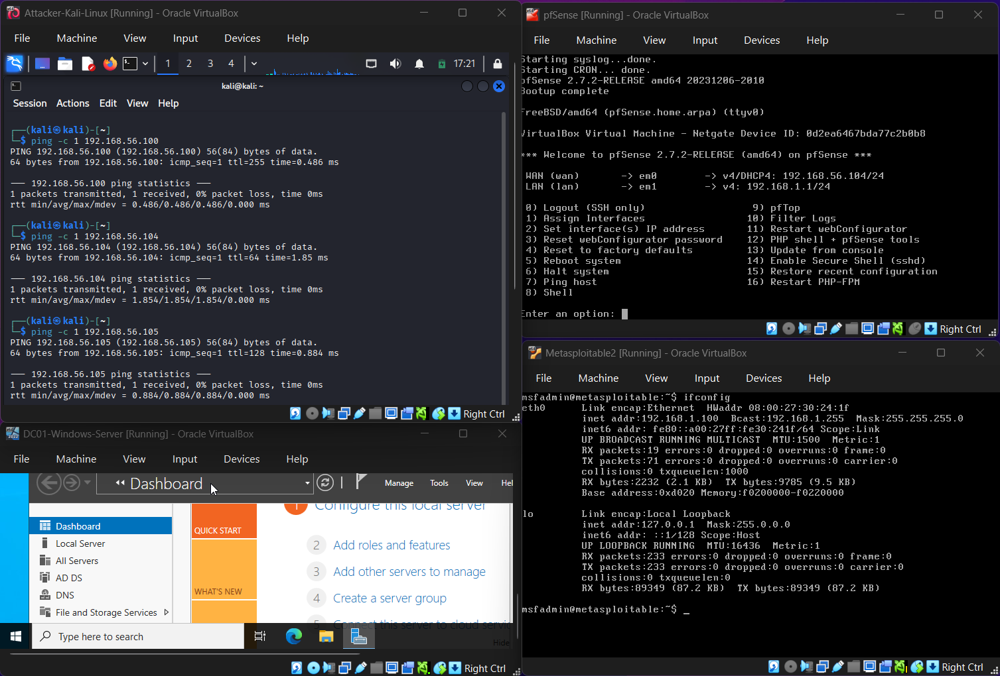
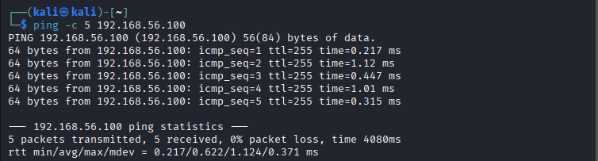
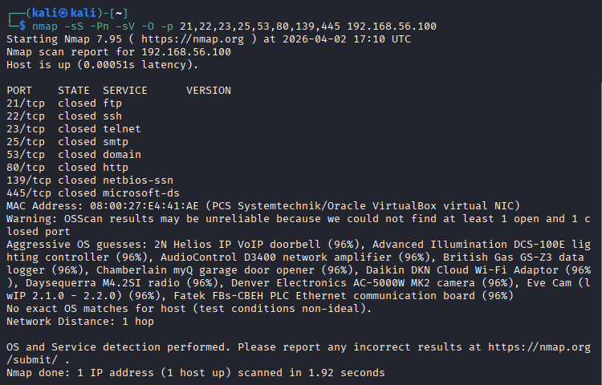
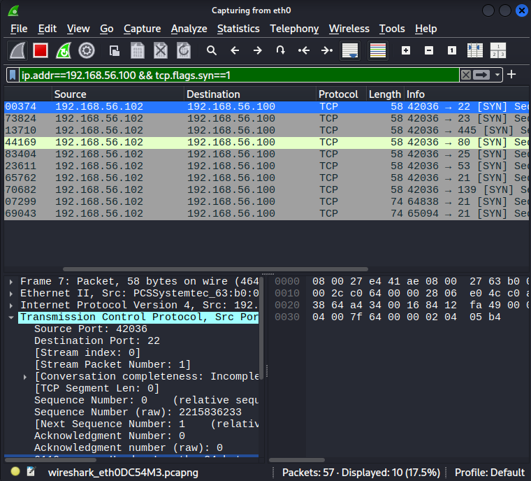
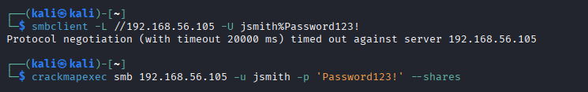
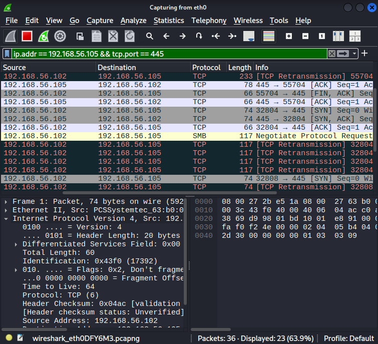
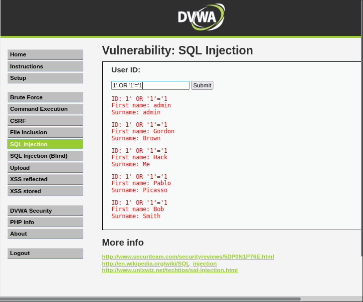
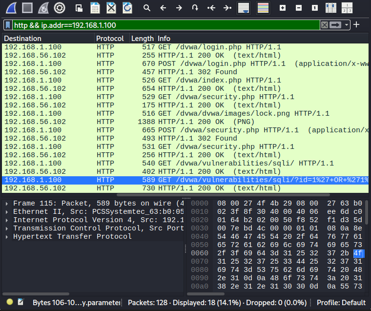
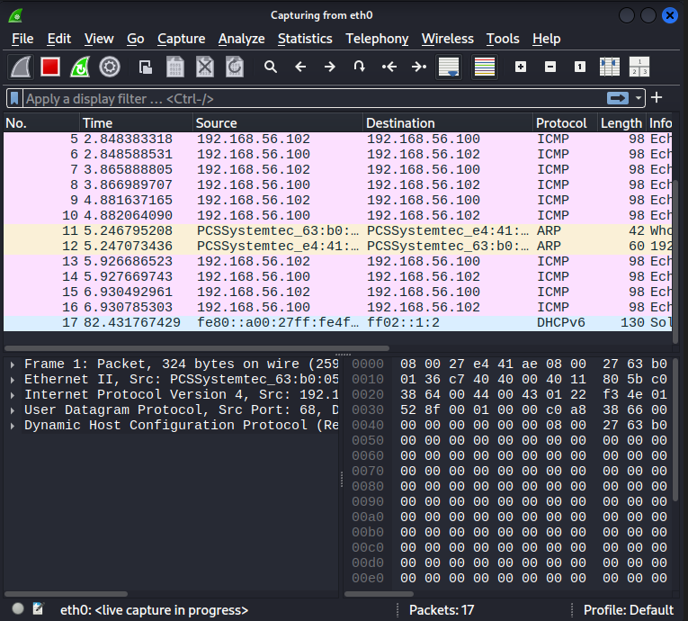

# Exercise 22 — Wireshark Packet Analysis

**Date:** 01/04/2026
**Category:** Reconnaissance / SOC Analysis
**Tools:** Wireshark, Nmap, CrackMapExec, DVWA
**Attacker:** Kali Linux — 192.168.56.102
**Firewall:** pfSense — WAN 192.168.56.104 / LAN 192.168.1.1
**Target:** Metasploitable2 — 192.168.1.100 / DC — 192.168.56.105

---

## Objective
Capture and analyse live network traffic generated by four distinct
attack scenarios — baseline ICMP, Nmap port scan, SMB authentication,
and HTTP web application interaction — demonstrating how each attack
type appears at the packet level and what a SOC analyst would identify
as suspicious or malicious traffic.

---

## Background
SOC analysts spend a significant portion of their time reviewing network
traffic — either live via a packet capture tool or historically through
SIEM log data. Understanding what attacks look like at the packet level
is essential for distinguishing malicious traffic from noise, identifying
attack patterns, and building detection rules.

**Wireshark** is the industry-standard packet analyser used by both
attackers (to understand protocols) and defenders (to investigate
incidents). It captures raw frames off the network interface and allows
filtering, following streams, and inspecting individual packet contents
including payload data.

This exercise deliberately captures traffic from attack techniques
already performed in the lab — correlating tool output (what Nmap
reports) with raw wire evidence (what actually happened on the network)
to build a deeper analytical picture.

---

## Lab Setup

All VMs running in the correct boot order. Routes verified before
starting captures.

**Boot order:** pfSense → Metasploitable → Kali → Windows Server DC

**Routes applied:**
```bash
# On Kali
sudo ip route add 192.168.1.0/24 via 192.168.56.104

# On Metasploitable
sudo route add default gw 192.168.1.1
```

Wireshark captures were taken on the **eth0** interface on Kali,
which carries all Host-Only and routed traffic between the VMs.

### Screenshot — Lab Setup: All VMs Running


---

## Part A — Baseline Traffic Capture

A baseline capture was taken with no attack traffic running — just
normal ICMP ping traffic between Kali and Metasploitable:
```bash
ping -c 5 192.168.1.100
```

### Screenshot — Baseline ICMP Ping Traffic in Wireshark


**Analyst observation:** Clean ICMP echo request / reply pairs with
consistent TTL and timing. This is normal baseline traffic. Any
deviation — asymmetric responses, unexpected TTL values, or ICMP
types other than 8 (request) and 0 (reply) — would warrant
investigation.

**IOCs:** None. This is the normal traffic baseline against which
anomalies are measured.

---

## Part B — Nmap Port Scan Traffic Analysis

An Nmap SYN scan with service version detection was run against
Metasploitable while Wireshark captured the resulting traffic:
```bash
nmap -sS -Pn -sV -O -p 21,22,23,25,53,80,139,445 192.168.1.100
```

Wireshark display filter applied:
```
ip.addr==192.168.1.100 && tcp.flags.syn==1
```

### Screenshot — Nmap Terminal Output Showing Open Ports


### Screenshot — Wireshark Filtered View of Nmap SYN Packets


**Analyst observation:** The packet capture shows a rapid burst of
TCP SYN packets from a single source IP (192.168.56.102) to multiple
destination ports on the same target (192.168.1.100) within a very
short time window. This is the textbook packet-level signature of a
port scan. Open ports return SYN/ACK responses, closed ports return
RST, and filtered ports (21, 139, 445 — blocked by pfSense) return
no response. The combination of many destination ports, single source
IP, and short time window is immediately recognisable as hostile
reconnaissance.

**Indicators / IOCs:**

| Field | Value |
|---|---|
| Source IP | 192.168.56.102 |
| Destination IP | 192.168.1.100 |
| Protocol | TCP |
| Pattern | SYN packets to 8+ destination ports in <5 seconds |
| Filtered ports | 21, 139, 445 — no response (pfSense rules working) |
| Severity | High — active reconnaissance |

**Escalation:** In a real SOC, this pattern on an internal host would
trigger immediate investigation — identify the source machine, check
whether it is a known asset, determine if a legitimate scan was
scheduled, and escalate to L2 if the source is unexpected or
unapproved.

---

## Part C — SMB Authentication Traffic Analysis

CrackMapExec was used to authenticate to the Windows Server DC over
SMB while Wireshark captured the session:
```bash
crackmapexec smb 192.168.56.105 -u jsmith -p 'Password123!' --shares
```

Wireshark display filter applied:
```
tcp.port==445 && ip.addr==192.168.56.105
```

### Screenshot — CrackMapExec SMB Authentication Command


### Screenshot — Wireshark Filtered SMB Traffic


**Analyst observation:** The packet capture shows the full SMB2
authentication handshake — negotiate protocol, session setup request,
NTLMSSP challenge/response exchange, and tree connect to shares.
This is normal SMB authentication behaviour. What makes this
suspicious in a SOC context is the source — a Linux machine
(Kali/CrackMapExec) initiating SMB authentication to a Domain
Controller is unusual. Legitimate SMB DC authentication comes from
domain-joined Windows workstations, not Linux hosts. The NTLMSSP
exchange is also visible in plaintext in the capture, exposing the
authentication mechanism being used.

**Indicators / IOCs:**

| Field | Value |
|---|---|
| Source IP | 192.168.56.102 (Linux — Kali) |
| Destination IP | 192.168.56.105 (Domain Controller) |
| Protocol | SMB2 / TCP port 445 |
| Pattern | NTLMSSP authentication from non-Windows host to DC |
| Severity | High — unexpected source authenticating to DC |

**Escalation:** Linux host authenticating to a Domain Controller via
SMB is a high-confidence indicator of lateral movement or credential
testing. In a real SOC this would be escalated immediately — cross-
reference the source IP against the asset inventory, check Active
Directory logs for Event ID 4625 (failed logon) or 4624 (successful
logon), and determine whether the credentials used are legitimate.

---

## Part D — HTTP Traffic Analysis (DVWA)

Firefox was used to browse to DVWA and submit a SQL injection payload
while Wireshark captured the HTTP traffic:
```
http://192.168.1.100/dvwa
Login: admin / password
SQLi payload: 1' OR '1'='1
```

Wireshark display filter applied:
```
http && ip.addr==192.168.1.100
```

### Screenshot — SQLi Payload Submitted in DVWA


### Screenshot — Wireshark HTTP Filtered Traffic


**Analyst observation:** HTTP traffic is unencrypted — every request
and response is visible in plaintext in the packet capture. The login
POST request exposes the username and password in the packet payload.
The SQL injection payload (`1' OR '1'='1`) is clearly visible in the
GET request parameters. This demonstrates two critical points: HTTP
(not HTTPS) provides zero confidentiality for credentials or session
data, and malicious payloads are trivially visible to any observer
on the network path — whether an analyst or an attacker performing
a man-in-the-middle.

**Indicators / IOCs:**

| Field | Value |
|---|---|
| Source IP | 192.168.56.102 |
| Destination IP | 192.168.1.100 |
| Protocol | HTTP / TCP port 80 |
| Pattern | SQL metacharacters (`'`, `OR`, `=`) visible in GET parameters |
| Credential exposure | Username and password visible in POST body |
| Severity | Critical — active web attack + credential exposure |

**Escalation:** SQL injection payload visible in HTTP traffic should
trigger an immediate alert. In a real environment, a WAF would block
and log this automatically. Without a WAF, web server access logs
would capture the raw URL including the payload — a Splunk alert on
SQL metacharacters in web logs would surface this within minutes.
Escalate to L2 with the raw packet capture attached as evidence.

---

## General Wireshark Traffic Overview

### Screenshot — General Wireshark Traffic Overview


The combined traffic view shows the clear difference in volume and
pattern between baseline traffic (low, regular ICMP) and attack
traffic (high-volume bursts of SYN packets, SMB handshakes, HTTP
payloads). Traffic volume spikes and protocol anomalies are the
first indicators a SOC analyst uses to triage a capture file.

---

## Attack Chain Summary
```
Baseline ICMP established — normal traffic pattern documented
    → Nmap SYN scan generates burst of TCP SYN packets to multiple ports
        → pfSense-filtered ports show no response — firewall working
            → SMB authentication from Linux host to DC — NTLMSSP visible
                → HTTP login and SQLi payload transmitted in cleartext
                    → All four attack types visible, filterable, and attributable
```

---

## Real-World Relevance

**Packet analysis is a core SOC skill.** Tier 1 analysts are expected
to open a pcap, apply basic filters, identify the protocol, and
describe what happened. This exercise covers the four most common
traffic types they encounter — ICMP, TCP scan, SMB auth, and HTTP.

**Filters are the analyst's primary tool.** Knowing how to quickly
isolate relevant traffic with display filters (`ip.addr`, `tcp.port`,
`http`, `tcp.flags.syn==1`) is the difference between finding evidence
in seconds and spending hours scrolling through thousands of packets.

**HTTP is a SOC gift.** Unencrypted HTTP traffic exposes credentials,
session tokens, and attack payloads in plaintext. Many legacy internal
applications still use HTTP — monitoring this traffic is one of the
easiest wins in a SOC environment.

**Packet captures are court-admissible evidence.** In incident response,
pcap files are preserved as forensic evidence. The ability to capture,
filter, and annotate packet data is a skill that transfers directly
from lab to professional incident response.

---

## Analyst View Summary

| Scenario | Traffic Pattern | Verdict | Severity |
|---|---|---|---|
| ICMP baseline | Regular echo request/reply | Normal | None |
| Nmap SYN scan | Burst SYN to multiple ports | Hostile reconnaissance | High |
| SMB auth from Linux | NTLMSSP to DC from non-Windows host | Lateral movement indicator | High |
| HTTP SQLi | SQL metacharacters in cleartext GET | Active web attack | Critical |

---

## Recommendation
- Deploy network traffic analysis (NTA) tools such as Zeek or Suricata
  alongside packet capture — they parse protocols automatically and
  generate structured logs consumable by a SIEM
- Alert on port scan signatures — more than 15 unique destination ports
  from a single source IP within 60 seconds is a reliable threshold
- Monitor SMB authentication to Domain Controllers from non-Windows
  or non-domain-joined source IPs — this is rarely legitimate
- Enforce HTTPS across all internal web applications — HTTP credential
  and payload exposure is completely preventable
- Retain packet captures for critical network segments for minimum
  72 hours — short retention windows destroy forensic evidence before
  incidents are even detected
- Integrate Wireshark/tcpdump captures into incident response runbooks
  — first responders should capture traffic immediately upon alert
  triage, before the attacker clears tracks
