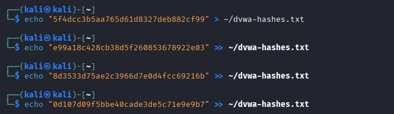
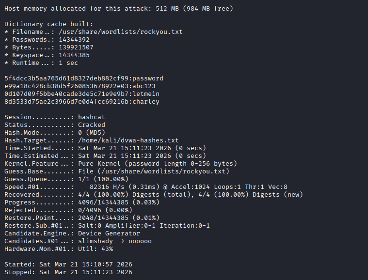
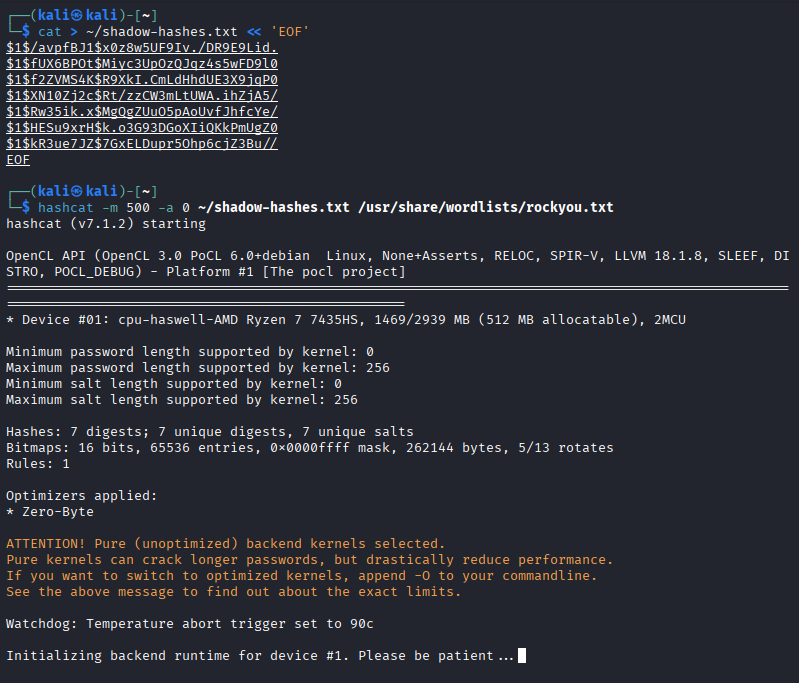
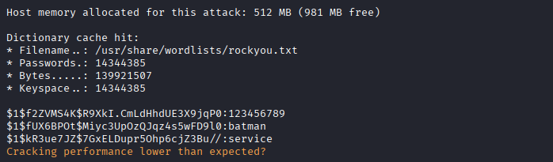
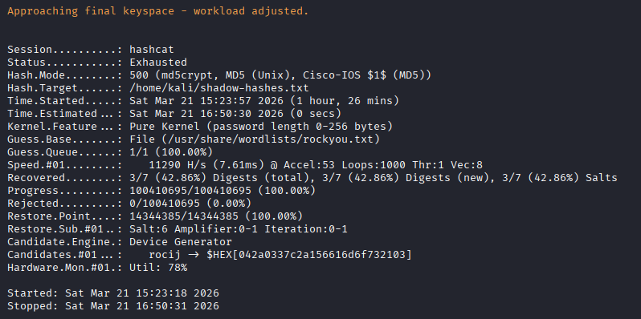

# Exercise 12 — Offline Password Cracking with Hashcat

**Date:** 21/03/2026
**Category:** Exploitation / Credential Access
**Tools:** Hashcat 7.1.2, Metasploit, rockyou.txt
**Attacker:** Kali Linux — 192.168.56.102
**Target:** Metasploitable2 — 192.168.1.100

---

## Objective
Crack MD5 password hashes dumped from DVWA (Exercise 10) and
MD5-crypt hashes retrieved from /etc/shadow (Exercise 05) using
Hashcat dictionary attacks, demonstrating the real-world impact
of weak password storage and common password usage.

---

## Background
Password cracking is a core red team technique and a fundamental
concept for SOC analysts. When an attacker obtains a hash file
through SQLi, privilege escalation, or a data breach, offline
cracking allows them to recover plaintext passwords without
touching the target system again.

**Two hash types covered in this exercise:**
- **MD5** (`$algorithm` = none, 32 hex chars) — used by DVWA.
  Broken, unsalted, cracks in milliseconds.
- **MD5-crypt** (`$1$` prefix) — used by Linux /etc/shadow.
  Salted and iterated, significantly slower to crack.

---

## Part A — DVWA MD5 Hashes

Hashes retrieved from DVWA's users table in Exercise 10 were
saved to a file:
```bash
echo "5f4dcc3b5aa765d61d8327deb882cf99" > ~/dvwa-hashes.txt
echo "e99a18c428cb38d5f260853678922e03" >> ~/dvwa-hashes.txt
echo "8d3533d75ae2c3966d7e0d4fcc69216b" >> ~/dvwa-hashes.txt
echo "0d107d09f5bbe40cade3de5c71e9e9b7" >> ~/dvwa-hashes.txt
```

### Screenshot — Hash File Created


Hashcat was run in dictionary attack mode against rockyou.txt:
```bash
hashcat -m 0 -a 0 ~/dvwa-hashes.txt /usr/share/wordlists/rockyou.txt
```

| Flag | Meaning |
|---|---|
| `-m 0` | Hash mode — plain MD5 |
| `-a 0` | Attack mode — dictionary |
| `~/dvwa-hashes.txt` | Target hash file |
| `rockyou.txt` | 14 million password wordlist |

**Result: 4/4 hashes cracked in under 1 second.**

| Hash | Username | Password |
|---|---|---|
| 5f4dcc3b5aa765d61d8327deb882cf99 | admin | `password` |
| e99a18c428cb38d5f260853678922e03 | gordonb | `abc123` |
| 8d3533d75ae2c3966d7e0d4fcc69216b | 1337 | `charley` |
| 0d107d09f5bbe40cade3de5c71e9e9b7 | pablo | `letmein` |

### Screenshot — All 4 DVWA Hashes Cracked Instantly


---

## Part B — Linux /etc/shadow MD5-Crypt Hashes

The /etc/shadow file was retrieved by re-running the distcc
exploit from Exercise 05 and escalating to root via SUID nmap.
7 accounts with password hashes were identified and saved:
```bash
cat > ~/shadow-hashes.txt << 'EOF'
$1$/avpfBJ1$x0z8w5UF9Iv./DR9E9Lid.
$1$fUX6BPOt$Miyc3UpOzQJqz4s5wFD9l0
$1$f2ZVMS4K$R9XkI.CmLdHhdUE3X9jqP0
$1$XN10Zj2c$Rt/zzCW3mLtUWA.ihZjA5/
$1$Rw35ik.x$MgQgZUuO5pAoUvfJhfcYe/
$1$HESu9xrH$k.o3G93DGoXIiQKkPmUgZ0
$1$kR3ue7JZ$7GxELDupr5Ohp6cjZ3Bu//
EOF
```

Hashcat was run with mode 500 for MD5-crypt:
```bash
hashcat -m 500 -a 0 ~/shadow-hashes.txt /usr/share/wordlists/rockyou.txt
```

| Flag | Meaning |
|---|---|
| `-m 500` | Hash mode — md5crypt / MD5 Unix (`$1$`) |
| `-a 0` | Attack mode — dictionary |

### Screenshot — Hashcat Running Against Shadow Hashes


**Result: 3/7 hashes cracked after 1 hour 26 minutes.**

| Hash | User | Password |
|---|---|---|
| `$1$fUX6BPOt$...` | sys | `batman` |
| `$1$f2ZVMS4K$...` | klog | `123456789` |
| `$1$kR3ue7JZ$...` | service | `service` |
| `$1$/avpfBJ1$...` | root | ❌ not in rockyou |
| `$1$XN10Zj2c$...` | msfadmin | ❌ not in rockyou |
| `$1$Rw35ik.x$...` | postgres | ❌ not in rockyou |
| `$1$HESu9xrH$...` | user | ❌ not in rockyou |

### Screenshot — 3 Shadow Hashes Cracked


### Screenshot — Hashcat Exhausted — Full Wordlist Complete


---

## Key Observations

**MD5 vs MD5-crypt performance gap:**
- MD5 (DVWA): 4 hashes cracked in < 1 second
- MD5-crypt (shadow): 3 hashes cracked in 1 hour 26 minutes

The difference is the salt and iteration count in MD5-crypt.
Each password attempt requires 1000 MD5 rounds — making brute
force ~1000x slower than plain MD5.

**msfadmin not in rockyou:** We know the password is `msfadmin`
from the SSH brute force exercise, but rockyou doesn't contain
username-as-password combinations. A real attacker would follow
up with a custom wordlist or rule-based attack:
```bash
hashcat -m 500 -a 0 ~/shadow-hashes.txt /usr/share/wordlists/rockyou.txt -r /usr/share/hashcat/rules/best64.rule
```

Rules apply transformations to each wordlist entry — adding
numbers, capitalising, reversing — dramatically expanding
coverage without needing a larger wordlist.

---

## Attack Chain Summary
```
SQLi dumps MD5 hashes from DVWA (Exercise 10)
    → Hashcat cracks all 4 in < 1 second
        → Plaintext credentials usable for login/reuse attacks

distcc exploit → root shell → /etc/shadow retrieved (Exercise 05)
    → Hashcat runs rockyou against MD5-crypt hashes
        → 3/7 cracked in 86 minutes
            → Remaining 4 require custom wordlist or rule attack
```

---

## Real-World Relevance

**Why offline cracking is dangerous:**
Once a hash file is obtained, cracking happens entirely on the
attacker's machine — no network traffic, no logs, no detection.
The target system has no visibility into the attack.

**GPU cracking is dramatically faster:** This exercise used CPU
only (Ryzen 7, ~11,000 H/s for MD5-crypt). A single consumer
GPU (RTX 4090) achieves ~1,000,000 H/s — roughly 90x faster.
The same 86-minute CPU job would complete in under 1 minute
on a GPU rig.

**Credential reuse:** The cracked passwords (`password`,
`abc123`, `letmein`, `batman`) are among the most common
passwords globally. Users who reuse these across systems are
vulnerable to credential stuffing attacks — attackers
automatically testing known credentials across hundreds of
services.

---

## Recommendation
- Never store passwords as plain MD5 — use bcrypt, scrypt,
  or Argon2 with unique per-user salts
- Enforce minimum password complexity to resist dictionary attacks
- Monitor for /etc/shadow access attempts — legitimate processes
  rarely read this file
- Implement credential breach monitoring — alert when employee
  emails appear in known breach databases
- Use a password manager to ensure unique passwords per service —
  eliminates credential reuse risk
