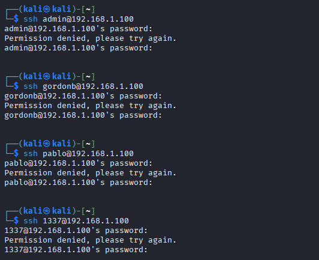
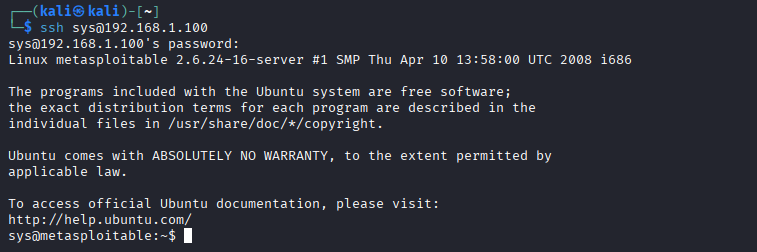
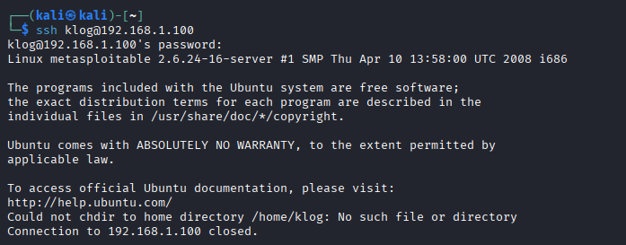
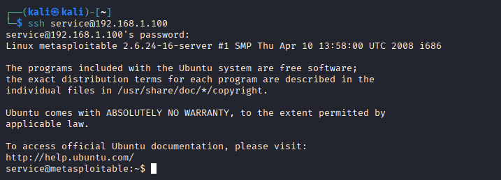

# Exercise 20 — Credential Reuse Attack

**Date:** 28/03/2026
**Category:** Exploitation / Credential Access
**Tools:** SSH, Hashcat (Exercise 12 results)
**Attacker:** Kali Linux — 192.168.56.102
**Firewall:** pfSense — WAN 192.168.56.104 / LAN 192.168.1.1
**Target:** Metasploitable2 — 192.168.1.100

---

## Objective
Use plaintext passwords recovered from DVWA (Exercise 12 — Hashcat)
and the Metasploitable `/etc/shadow` file to attempt SSH login on
Metasploitable2 — demonstrating how credentials stolen from one system
or application can unlock access to other services on the same target.

---

## Background
Credential reuse is one of the most common and effective post-exploitation
techniques. Once an attacker has obtained plaintext passwords — through
hash cracking, phishing, or data breach databases — they systematically
test those credentials against every accessible service on the target
network.

This exercise closes the loop across three previous exercises:
- **Exercise 10** — SQLi dumped DVWA user hashes
- **Exercise 12** — Hashcat cracked those hashes to plaintext
- **Exercise 20** — Those plaintexts are now tested against SSH

This is exactly the attack chain a real adversary follows after gaining
initial web application access. It demonstrates why credential isolation
between applications and systems is a fundamental security control.

**MITRE ATT&CK T1078** — Valid Accounts: using legitimate credentials
to access systems, bypassing authentication controls entirely.

---

## Lab Setup

VMs running from previous exercises. Routes already applied.

### Screenshot — Lab Setup: All VMs Running


---

## Part A — Testing DVWA Credentials Against SSH

The four plaintext passwords recovered from DVWA's MySQL database in
Exercise 12 were tested against SSH on Metasploitable2:

| Username | Password | Source |
|---|---|---|
| admin | password | DVWA users table |
| gordonb | abc123 | DVWA users table |
| pablo | letmein | DVWA users table |
| 1337 | charley | DVWA users table |
```bash
for user in admin gordonb pablo 1337; do
  ssh $user@192.168.1.100 -o ConnectTimeout=5 -o PasswordAuthentication=no 2>&1
done
```

**Result: All four failed — Permission denied for every account.**

This is an important finding. The DVWA accounts exist only within the
web application's MySQL database — they are not system-level OS
accounts. SSH authenticates against `/etc/passwd`, not the application
database. An attacker must understand the distinction between
application-layer credentials and system-level credentials.

### Screenshot — All DVWA Accounts Rejected by SSH


---

## Part B — Testing /etc/shadow Credentials Against SSH

The three passwords cracked from Metasploitable's `/etc/shadow` file
in Exercise 12 were tested next. These are OS-level accounts — valid
candidates for SSH authentication:

| Username | Password | Source |
|---|---|---|
| sys | batman | /etc/shadow (Exercise 12) |
| klog | 123456789 | /etc/shadow (Exercise 12) |
| service | service | /etc/shadow (Exercise 12) |

**sys:batman — SSH login successful:**
```bash
ssh sys@192.168.1.100
```

Password: `batman`

Full shell access granted as `sys`.

### Screenshot — sys:batman SSH Login Successful


**klog:123456789 — Partial success, auto-disconnected:**
```bash
ssh klog@192.168.1.100
```

Password: `123456789`

Authentication succeeded but the session immediately closed:
`Could not chdir to home directory /home/klog: No such file or directory`

The credentials are valid — the account simply has no home directory
configured, causing the shell to exit on login. In a real attack this
would still be useful for non-interactive command execution.

### Screenshot — klog Login Succeeds but No Home Directory


**service:service — SSH login successful:**
```bash
ssh service@192.168.1.100
```

Password: `service`

Full shell access granted as `service`.

### Screenshot — service:service SSH Login Successful


---

## Results Summary

| Username | Password | Source | SSH Result |
|---|---|---|---|
| admin | password | DVWA DB | ❌ No system account |
| gordonb | abc123 | DVWA DB | ❌ No system account |
| pablo | letmein | DVWA DB | ❌ No system account |
| 1337 | charley | DVWA DB | ❌ No system account |
| sys | batman | /etc/shadow | ✅ Full shell access |
| klog | 123456789 | /etc/shadow | ⚠️ Valid credentials, no home dir |
| service | service | /etc/shadow | ✅ Full shell access |

2 successful logins, 1 valid credential with access limitation,
4 application-only accounts with no system presence.

---

## Attack Chain Summary
```
Exercise 10 — SQLi dumps DVWA MD5 hashes
    → Exercise 12 — Hashcat cracks all hashes to plaintext
        → Exercise 20 — Plaintext passwords tested against SSH
            → DVWA accounts rejected (application layer only)
                → /etc/shadow accounts accepted (OS level)
                    → sys:batman and service:service — full SSH access
                        → Two additional footholds established on target
```

---

## Real-World Relevance

**Credential reuse is endemic.** Studies consistently show that a
significant percentage of users reuse passwords across multiple
services. An attacker who cracks credentials from one source —
a breached database, a phished login, a cracked hash — will
systematically test them everywhere else.

**Application credentials and system credentials are different
attack surfaces.** This exercise demonstrates a key distinction:
DVWA database accounts do not automatically translate to OS access.
However, administrators who reuse passwords between web applications
and system accounts create a direct bridge between these layers.

**Service accounts with predictable passwords are high-value targets.**
`service:service` is a textbook example of a default or weak service
account credential. These are found constantly in real environments —
especially on legacy systems — and are a reliable path to initial
access or lateral movement.

**The klog result is realistic.** Misconfigured accounts with valid
credentials but broken environments appear in real intrusions. Even
without an interactive shell, valid credentials can be used for
non-interactive SSH command execution (`ssh klog@host 'command'`),
SCP file transfers, or as a stepping stone for further exploitation.

**MITRE ATT&CK T1078** — Valid Accounts is one of the most frequently
observed techniques in real-world intrusions. Using legitimate
credentials bypasses most detection controls that focus on exploit
traffic and malware signatures.

---

## Recommendation
- Never reuse passwords between web applications and system accounts —
  a compromised web application database should not grant OS access
- Enforce unique, complex passwords for all service accounts —
  `service:service` should never exist on any system
- Disable SSH password authentication entirely — enforce key-based
  authentication to eliminate credential reuse as an SSH attack vector
- Audit all system accounts regularly — accounts with no home
  directory, no login shell, or default passwords should be
  identified and remediated
- Monitor `/var/log/auth.log` for successful SSH logins from
  unexpected accounts — `sys` and `service` logging in via SSH
  should trigger immediate investigation in a real environment
- Implement credential breach monitoring — alert when credentials
  matching internal accounts appear in public breach databases
  
