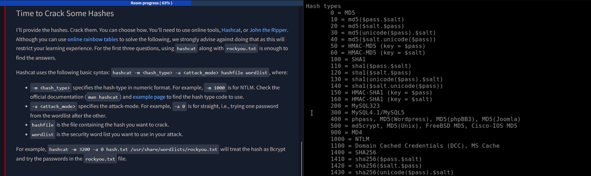
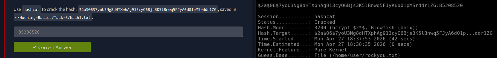
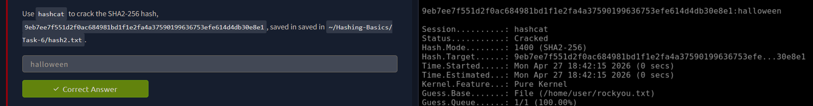
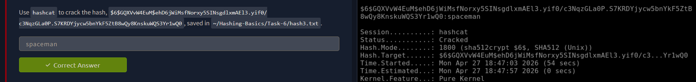
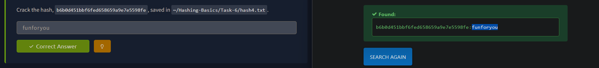

# Exercise 32 — Hash Cracking: Hashcat & Rainbow Tables

**Date:** 27/04/2026
**Category:** Exploitation / Credential Analysis
**Tools:** Hashcat, hashes.com
**Platform:** TryHackMe — Hashing Basics (Task 6)
**Attacker:** Kali Linux — 192.168.56.102

---

## Objective

Identify four unknown hash types, crack three using Hashcat with rockyou.txt,
and recover the fourth via a rainbow table lookup on hashes.com. Understand
the performance implications of different hashing algorithms and why algorithm
choice matters for defensive password policy.

---

## Background

Password hashes are one-way functions — you cannot decrypt them. Cracking
requires hashing candidate passwords and comparing the output against the
target. Two primary approaches exist:

- **Dictionary attack** — hash every word in a wordlist and compare
- **Rainbow table lookup** — use a precomputed hash-to-plaintext database

Tools like Hashcat leverage GPU parallelism to hash millions of candidates per
second. Some algorithms (Bcrypt, SHA-512 crypt) are intentionally slow and
resist GPU acceleration. Others (MD5, SHA-256) are fast by design and crack
in seconds.

Salted hashes defeat rainbow tables entirely. A salt is a random value
prepended to the password before hashing, making precomputed tables useless
— every salt produces a unique hash even for identical passwords.

---

## Lab Setup

Hashcat is pre-installed on Kali. Hash files were provided in the TryHackMe
AttackBox at `~/Hashing-Basics/Task-6/`. rockyou.txt is available locally at
`/usr/share/wordlists/rockyou.txt`.

### Screenshot — Hashcat Manpage: Hash Mode Reference



Basic Hashcat syntax used throughout this exercise:

```
hashcat -m <hash_type> -a <attack_mode> hashfile wordlist
```

| Flag | Value | Meaning |
|------|-------|---------|
| `-m` | Hash type number | Tells Hashcat which algorithm to use |
| `-a` | `0` | Straight attack — try each wordlist entry in order |
| `hashfile` | Path to file containing target hash | One hash per line |
| `wordlist` | `/usr/share/wordlists/rockyou.txt` | ~14M common passwords |

---

## Part A — Hash 1: Bcrypt

**Hash:** `$2a$06$7yoU3Ng8dHTXphAg913cyO6Bjs3K5lBnwq5FJyA6d01pMSrddr1ZG`

The `$2a$` prefix identifies this as **Bcrypt** (-m 3200). The `$06$` is the
cost factor — 2^6 = 64 rounds of hashing. Bcrypt is intentionally slow and
does not benefit from GPU acceleration.

```
hashcat -m 3200 -a 0 ~/Hashing-Basics/Task-6/hash1.txt /usr/share/wordlists/rockyou.txt
```

| Flag | Value | Meaning |
|------|-------|---------|
| `-m 3200` | Bcrypt | Matches `$2a$` prefix |
| `-a 0` | Straight | Sequential wordlist attack |

### Screenshot — Hash 1 Cracked



**Result:** Hash cracked successfully. Bcrypt's slow design means crack speed
is measured in hashes per second rather than millions — this is by design.

---

## Part B — Hash 2: SHA2-256

**Hash:** `9eb7ee7f551d2f0ac684981bd1f1e2fa4a37590199636753efe614d4db30e8e1`

64-character hex string with no prefix — consistent with SHA2-256 (-m 1400).
SHA-256 is a fast algorithm; crack speeds on a GPU can reach billions of
candidates per second.

```
hashcat -m 1400 -a 0 ~/Hashing-Basics/Task-6/hash2.txt /usr/share/wordlists/rockyou.txt
```

| Flag | Value | Meaning |
|------|-------|---------|
| `-m 1400` | SHA2-256 | 64-char hex, no prefix |
| `-a 0` | Straight | Sequential wordlist attack |

### Screenshot — Hash 2 Cracked



**Result:** Cracked significantly faster than Hash 1 — demonstrates the speed
gap between a fast hash (SHA-256) and a slow hash (Bcrypt).

---

## Part C — Hash 3: SHA-512 Crypt

**Hash:** `$6$GQXVvW4EuM$ehD6jWiMsfNorxy5SINsgdlxmAEl3...`

The `$6$` prefix identifies this as **SHA-512 crypt** (-m 1800), the default
Linux `/etc/shadow` format. The string between the second and third `$` is the
salt (`GQXVvW4EuM`). Because this hash is salted, rainbow table lookup is
ineffective — Hashcat must hash each candidate with the same salt and compare.

```
hashcat -m 1800 -a 0 ~/Hashing-Basics/Task-6/hash3.txt /usr/share/wordlists/rockyou.txt
```

| Flag | Value | Meaning |
|------|-------|---------|
| `-m 1800` | SHA-512 crypt | `$6$` prefix, Linux shadow format |
| `-a 0` | Straight | Hashcat applies extracted salt automatically |

### Screenshot — Hash 3 Cracked



**Result:** Cracked successfully. Slower than SHA-256 due to the iteration
count built into the crypt format, but faster than Bcrypt.

---

## Part D — Hash 4: MD5 via Rainbow Table

**Hash:** `b6b0d451bbf6fed658659a9e7e5598fe`

32-character hex string, no prefix — consistent with MD5 (-m 0). Rather than
running Hashcat, this hash was submitted directly to **hashes.com**, a public
rainbow table database. Because MD5 produces no unique salt, the same input
always produces the same output — making precomputed lookups viable.

URL: https://hashes.com

### Screenshot — Hash 4 Found in Rainbow Table



**Result:** Plaintext recovered instantly via lookup — no compute required.
This is why unsalted MD5 is considered cryptographically broken for password
storage.

---

## Attack Chain Summary

```
Target hash identified
    → Hash prefix / length analysed to determine algorithm
        → Salted hash (Bcrypt, SHA-512, SHA-256) → Hashcat + rockyou.txt
            → Unsalted hash (MD5) → Rainbow table lookup (hashes.com)
                → Plaintext recovered
```

---

## Real-World Relevance

Hash cracking is a core post-exploitation skill. After extracting hashes from
`/etc/shadow`, an Active Directory NTDS.dit, or a database dump, an attacker
attempts to recover plaintexts for credential reuse, lateral movement, or
privilege escalation. SOC analysts encounter this scenario when investigating
data breaches — understanding which algorithms are crackable (and how quickly)
informs incident severity assessment and remediation urgency.

Algorithm speed hierarchy (fastest to slowest to crack):
MD5 → SHA-256 → SHA-512 crypt → Bcrypt/scrypt/Argon2

---

## Analyst View

An analyst reviewing a credential dump would immediately triage by algorithm:
unsalted MD5 hashes represent an urgent exposure — any password in rockyou.txt
or a rainbow table is effectively already compromised. Bcrypt hashes buy time
but are not a long-term defence if passwords are weak. The presence of `$6$`
(SHA-512 crypt) in `/etc/shadow` is expected on modern Linux — it is not
itself an indicator of compromise.

---

## Indicators / IOCs

| Indicator | Type | Value | Severity |
|-----------|------|-------|----------|
| MD5 hash in password store | Algorithm weakness | `-m 0`, 32-char hex | High |
| Unsalted hash | Configuration weakness | No `$salt$` prefix | High |
| Bcrypt cost factor `$06$` | Acceptable | 64 rounds | Low |
| SHA-512 crypt in `/etc/shadow` | Expected | `$6$` prefix | Informational |

---

## Escalation / Remediation

1. If MD5 or unsalted hashes are found in a production system during an IR
   engagement, treat all associated accounts as compromised — force immediate
   password resets.
2. Cross-reference recovered plaintexts against other services (credential
   reuse check) — this is the standard next step after a hash dump.
3. Notify the system owner and document the algorithm in use — this is a
   finding in any security assessment.
4. Recommend migration to Bcrypt, scrypt, or Argon2 for all stored passwords.

---

## Recommendation

- **Never store passwords as unsalted MD5 or SHA-256** — these are trivially
  crackable via rainbow tables or GPU-accelerated dictionary attacks.
- **Prefer Bcrypt, scrypt, or Argon2** for password hashing — these are
  designed to be slow and memory-hard, resisting GPU acceleration.
- **Salting is non-negotiable** — even a slow algorithm benefits from a unique
  salt per user, defeating precomputed table attacks entirely.
- **Weak passwords defeat strong algorithms** — a Bcrypt hash of `password1`
  will still crack quickly because it appears early in rockyou.txt. Algorithm
  choice and password policy must work together.
- **Rainbow table lookup speed** demonstrates why password reuse is dangerous
  — a compromised MD5 dump from one site can unlock accounts on others
  instantly.
