# Exercise 25 — Suricata IDS Setup & Attack Detection

**Date:** 09/04/2026
**Category:** Defense / Detection
**Tools:** Suricata 8.0.4, Nmap, Hydra, pfSense
**Attacker:** Kali Linux — 192.168.56.102
**Firewall:** pfSense — WAN 192.168.56.104 / LAN 192.168.1.1
**Target:** Metasploitable2 — 192.168.1.100

---

## Objective
Deploy Suricata as a network-based IDS on Kali Linux, write custom
detection rules targeting port scanning, SSH brute force, FTP and SMB
connection attempts, generate real attack traffic from previous
exercises, and validate that Suricata fires accurate alerts — directly
addressing the detection gap identified in Exercise 09.

---

## Background
In Exercise 09, Splunk port scan detection was documented as limited
because pfSense syslog logs lack precise port-level field parsing —
making it difficult to distinguish scan traffic from legitimate
connections without additional tooling. Suricata addresses this
directly.

**Suricata** is an open-source network threat detection engine capable
of real-time intrusion detection (IDS), intrusion prevention (IPS),
and network security monitoring. Unlike firewall logs which record
connection decisions, Suricata inspects packet content and applies
signature-based rules to identify attack patterns at the network layer.

Suricata rules follow a standard format inherited from Snort — the
same rule syntax used in enterprise IDS deployments including Cisco
Firepower, Palo Alto Threat Prevention, and managed SIEM platforms.
Understanding how to write and tune these rules is a directly
transferable skill.

This exercise closes a gap explicitly documented in Exercise 09 and
demonstrates the layered defence principle: pfSense blocks and logs
at the firewall layer, Splunk aggregates and correlates at the SIEM
layer, and Suricata detects at the packet inspection layer.

---

## Lab Setup

All three VMs running in the correct boot order. Routes applied.

**Boot order:** pfSense → Metasploitable → Kali

```bash
# On Kali
sudo ip route add 192.168.1.0/24 via 192.168.56.104

# On Metasploitable
sudo route add default gw 192.168.1.1
```

### Screenshot — Lab Setup: All VMs Running
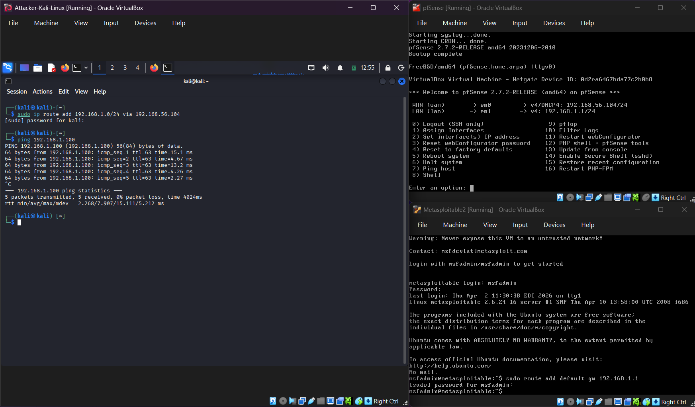

---

## Part A — Installation and Rule Update

Suricata was installed from the Kali repository:

```bash
sudo apt update && sudo apt install suricata -y
```

The community ruleset was then downloaded using suricata-update —
this pulls the Emerging Threats Open ruleset containing thousands
of signatures for known malware, exploits, and reconnaissance
techniques:

```bash
sudo suricata-update
```

### Screenshot — Suricata Rules Updated
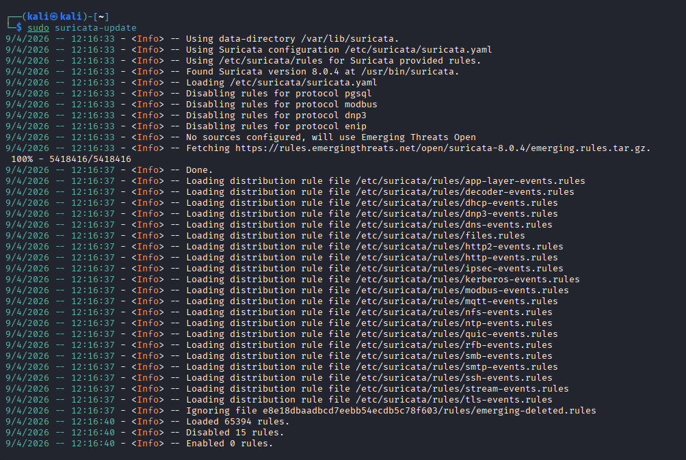

---

## Part B — Custom Rule Writing

Four custom detection rules were written targeting the specific attack
patterns used in this lab. Custom rules were created at:

```bash
sudo nano /etc/suricata/rules/local.rules
```

```bash
# Port scan detection
alert tcp any any -> $HOME_NET any (msg:"PORT SCAN DETECTED - Multiple ports"; flags:S; threshold:type threshold, track by_src, count 20, seconds 10; sid:1000001; rev:1;)

# SSH brute force detection
alert tcp any any -> $HOME_NET 22 (msg:"SSH BRUTE FORCE DETECTED"; flags:S; threshold:type threshold, track by_src, count 5, seconds 60; sid:1000002; rev:1;)

# FTP connection attempt
alert tcp any any -> $HOME_NET 21 (msg:"FTP CONNECTION ATTEMPT - Port 21"; flags:S; sid:1000003; rev:1;)

# SMB connection attempt
alert tcp any any -> $HOME_NET 445 (msg:"SMB CONNECTION ATTEMPT - Port 445"; flags:S; sid:1000004; rev:1;)
```

**Rule anatomy:**

| Component | Meaning |
|---|---|
| `alert` | Action — log the event |
| `tcp any any` | Protocol, source IP, source port |
| `-> $HOME_NET 22` | Direction and destination — inbound to lab network port 22 |
| `msg:` | Human-readable alert description |
| `flags:S` | Match only SYN packets — connection initiation |
| `threshold:` | Fire once per source IP after count threshold in time window |
| `sid:` | Unique rule identifier |
| `rev:` | Rule revision number |

### Screenshot — Custom Rules File
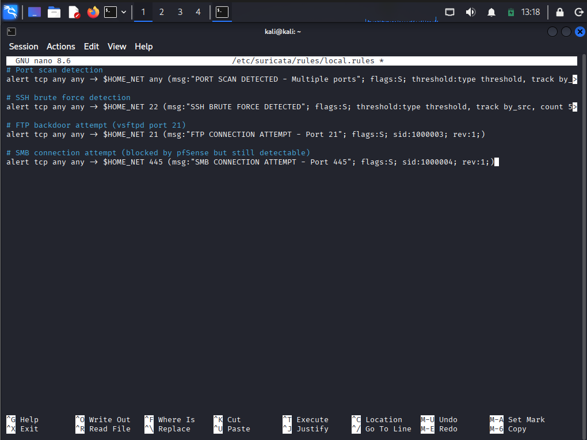

---

## Part C — Configuration

**suricata.yaml** was updated with two changes:

**1. HOME_NET updated to cover the full lab network:**
```yaml
HOME_NET: "[192.168.56.0/24,192.168.1.0/24]"
```

### Screenshot — HOME_NET Updated in suricata.yaml
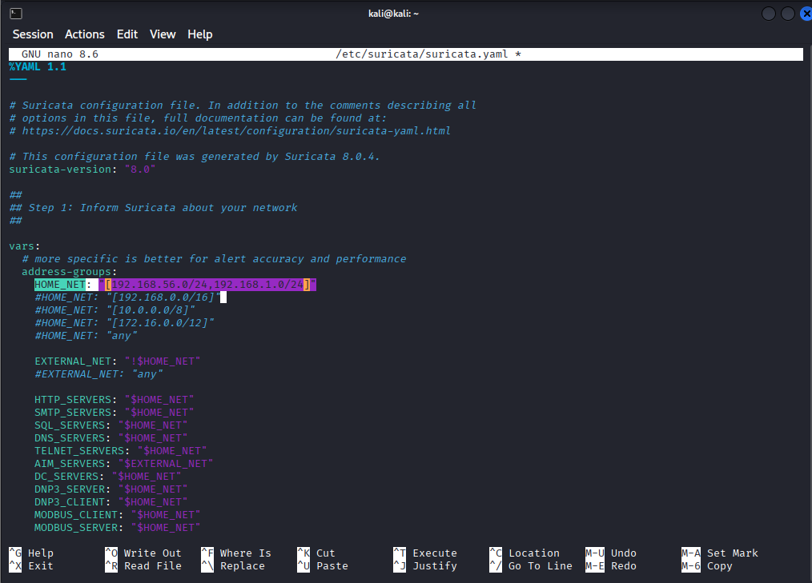

**2. local.rules added to the rule-files section:**
```yaml
rule-files:
  - suricata.rules
  - local.rules
```

### Screenshot — local.rules Added to Configuration
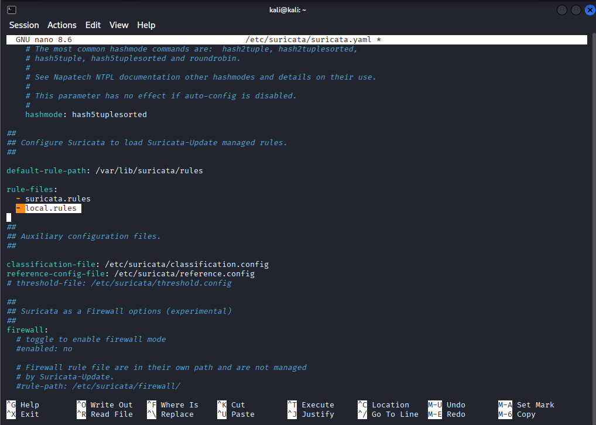

The custom rules file was copied to the correct rules directory:
```bash
sudo cp /etc/suricata/rules/local.rules /var/lib/suricata/rules/local.rules
```

**Configuration tested:**
```bash
sudo suricata -T -c /etc/suricata/suricata.yaml
```

### Screenshot — Configuration Test Successful
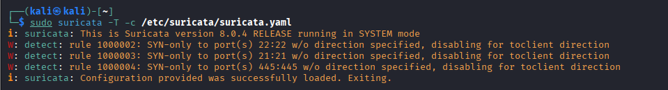

The warnings about SYN-only rules disabling for `toclient` direction
are expected and harmless — inbound SYN detection only is exactly
the intended behaviour for these rules.

---

## Part D — Starting Suricata

Suricata was launched as a daemon monitoring eth0:

```bash
sudo suricata -c /etc/suricata/suricata.yaml -i eth0 -D
```

| Flag | Meaning |
|---|---|
| `-c` | Path to configuration file |
| `-i eth0` | Network interface to monitor |
| `-D` | Run as daemon in background |

### Screenshot — Suricata Running and Monitoring
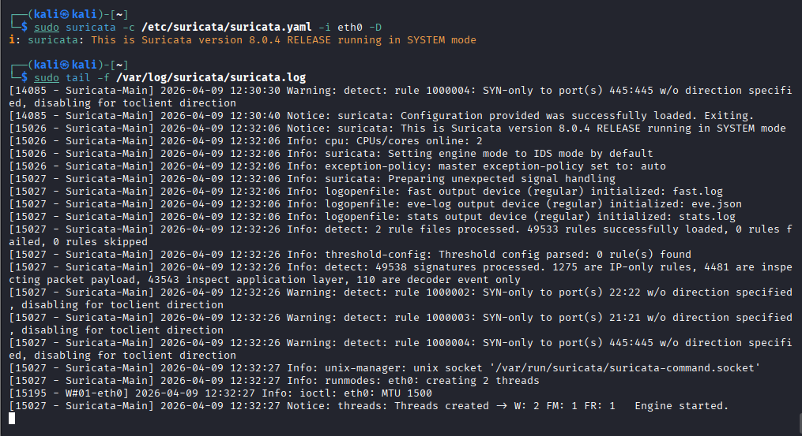

---

## Part E — Attack Traffic Generation

Attack traffic was generated using tools from previous exercises to
trigger each custom rule:

```bash
# Trigger port scan rule
nmap -sS -p 1-100 192.168.1.100

# Trigger SSH brute force rule
hydra -l msfadmin -P /usr/share/wordlists/rockyou.txt ssh://192.168.1.100 -t 4 -f

# Trigger FTP rule
nmap -p 21 192.168.1.100

# Trigger SMB rule
nmap -p 445 192.168.1.100
```

### Screenshot — Attack Traffic Generated from Kali
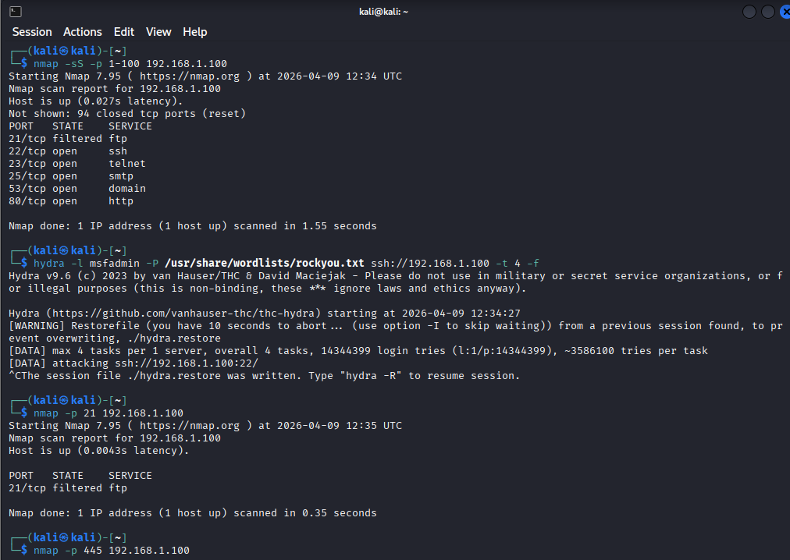

---

## Part F — Alert Validation

**fast.log** — human-readable alert stream:

```bash
sudo tail -f /var/log/suricata/fast.log
```

### Screenshot — Suricata Alerts Firing in fast.log
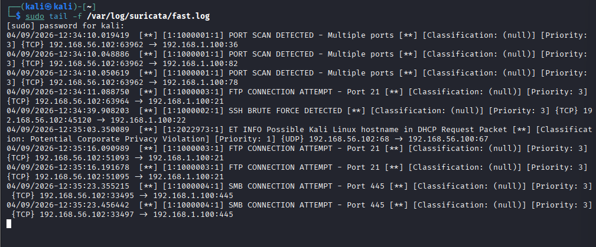

All four custom rules fired successfully:

| Rule | SID | Triggered By |
|---|---|---|
| PORT SCAN DETECTED | 1000001 | Nmap SYN scan |
| SSH BRUTE FORCE DETECTED | 1000002 | Hydra SSH attack |
| FTP CONNECTION ATTEMPT | 1000003 | Nmap port 21 probe |
| SMB CONNECTION ATTEMPT | 1000004 | Nmap port 445 probe |

**Bonus community rule fired:** `ET INFO Possible Kali Linux hostname
in DHCP Request Packet` — the Emerging Threats ruleset detected Kali's
hostname in a DHCP broadcast, classified as a Potential Corporate
Privacy Violation with Priority 1. This demonstrates the value of
community rulesets — attack-relevant signatures are detected
automatically without writing custom rules.

**eve.json** — structured JSON alert output for SIEM ingestion:

```bash
sudo tail -5 /var/log/suricata/eve.json
```

### Screenshot — eve.json Structured Alert Output
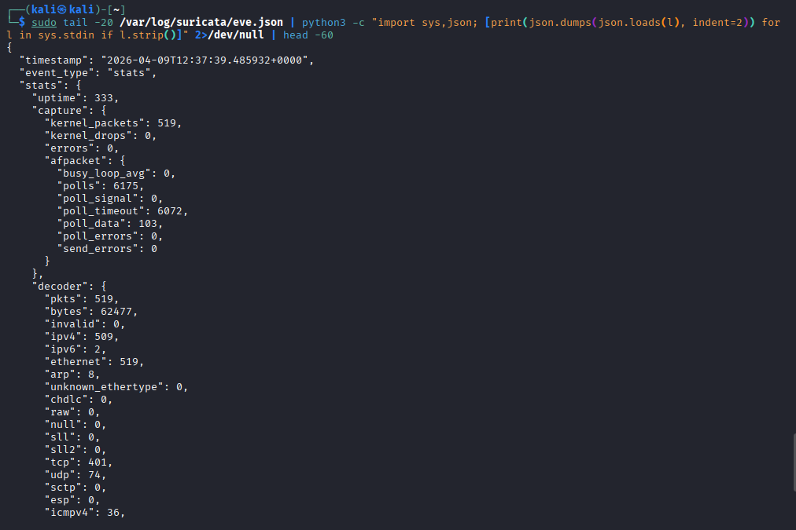

The eve.json format contains fully parsed fields — timestamp, alert
signature, source/destination IPs and ports, protocol, and severity.
This is the format used to feed Suricata alerts into Splunk, Elastic,
or any other SIEM via a log shipper.

**Alert summary by rule:**

```bash
sudo cat /var/log/suricata/fast.log | awk -F'\[\*\*\]' '{print $2}' | sort | uniq -c | sort -rn
```

### Screenshot — Alert Count Summary by Rule
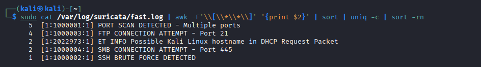

---

## Comparison with Exercise 09

In Exercise 09, Splunk port scan detection relied on pfSense syslog
events — the same search pattern used for SSH brute force, making
precise differentiation difficult without additional parsing. The
documented limitation was: "higher fidelity detection would require
a fully parsed data source or a dedicated IDS."

Suricata addresses this directly:

| Capability | pfSense + Splunk | Suricata |
|---|---|---|
| Port scan detection | Volume-based, indirect | Signature-based, precise |
| Protocol-specific rules | Limited — raw syslog | Full — per-protocol matching |
| Packet content inspection | No | Yes |
| Community rulesets | No | Yes — 40,000+ signatures |
| SIEM integration | Native via syslog | eve.json → any SIEM |
| False positive control | Threshold only | Threshold + content matching |

---

## Attack Chain Summary

```bash
Suricata installed and community rules downloaded
    → Custom rules written for lab-specific attack patterns
        → HOME_NET configured to cover both lab network ranges
            → Suricata started as daemon on eth0
                → Nmap SYN scan triggers PORT SCAN DETECTED rule
                    → Hydra SSH attack triggers SSH BRUTE FORCE DETECTED rule
                        → FTP and SMB probes trigger respective connection rules
                            → Community rule detects Kali hostname in DHCP
                                → All alerts logged to fast.log and eve.json
```

---

## Real-World Relevance

**Suricata is deployed in enterprise environments globally.** It
underpins many commercial security products and is the detection
engine behind several managed detection and response (MDR) platforms.
Understanding how to write and tune Suricata rules is a skill directly
applicable to SOC work.

**The layered detection model is industry standard.** Firewall →
IDS → SIEM is the foundation of modern network security architecture.
This lab now implements all three layers: pfSense blocks and logs,
Suricata inspects and alerts, Splunk aggregates and correlates.

**eve.json is the bridge between Suricata and SIEM.** In production
environments, a log shipper (Filebeat, Splunk Universal Forwarder)
reads eve.json and forwards structured alerts to the SIEM in real
time. The same Splunk detection queries from Exercise 23 could be
enriched with Suricata alert data for higher-fidelity detections.

**Custom rules demonstrate engineering ability.** Most SOC analysts
consume pre-written rules — analysts who can write their own are
significantly more valuable. The four rules in this exercise are
simplified but follow the exact same syntax used in production
Suricata deployments.

**The Kali hostname detection is a realistic blue team finding.**
The ET community rule fired on a DHCP broadcast — demonstrating
that well-maintained community rulesets catch attacker behaviour
that no custom rule would anticipate. Keeping rulesets updated
is as important as writing new rules.

---

## Analyst View Summary

| Alert | Source | Destination | Severity | Action |
|---|---|---|---|---|
| PORT SCAN DETECTED | 192.168.56.102 | 192.168.1.100 | High | Identify source, check authorisation |
| SSH BRUTE FORCE | 192.168.56.102 | 192.168.1.100:22 | High | Check auth logs for success |
| FTP CONNECTION ATTEMPT | 192.168.56.102 | 192.168.1.100:21 | Medium | Verify FTP is expected |
| SMB CONNECTION ATTEMPT | 192.168.56.102 | 192.168.1.100:445 | Medium | Check if SMB should be accessible |
| Kali hostname in DHCP | 192.168.56.102 | Broadcast | Priority 1 | Identify if Kali is authorised on network |

---

## Recommendation
- Feed Suricata eve.json into Splunk using a Universal Forwarder —
  combines packet-level precision with SIEM correlation and alerting
- Run `suricata-update` weekly — the Emerging Threats ruleset updates
  daily with new signatures for current threats
- Tune thresholds based on baseline traffic — the port scan threshold
  of 20 SYN packets in 10 seconds should be calibrated to normal
  scanning activity in the environment
- Deploy Suricata in IPS mode (`-q`) on critical network segments
  to actively block detected attacks rather than just alerting
- Use `classtype:` and `priority:` fields in custom rules to enable
  automatic severity classification in downstream SIEM platforms
- Review and suppress false positives regularly — an IDS that
  generates too many alerts will be ignored by analysts
