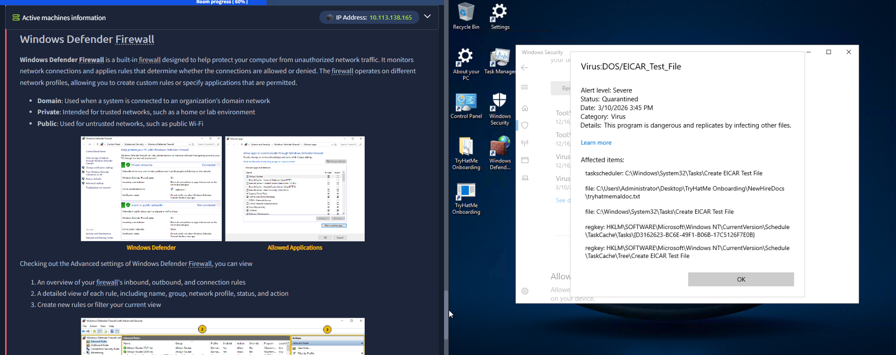

# SOC Analysis 01 — Alert Triage: EICAR Test File Detection

**Date:** 10/03/2026
**Category:** SOC Analysis / Alert Triage
**Platform:** TryHackMe — Pre-Security / Windows Fundamentals
**Tool:** Windows Defender Antivirus

---

## Scenario
During a TryHackMe exercise on Windows Defender Firewall, Windows 
Defender Antivirus fired a Severe alert on the lab machine, 
quarantining a detected file.

---

## Alert Details

| Field | Value |
|---|---|
| Threat Name | Virus:DOS/EICAR_Test_File |
| Alert Level | Severe |
| Status | Quarantined |
| Date | 10/03/2026 16:45 |
| Category | Virus |

**Affected items:**
- `C:\Users\Administrator\Desktop\TryHatMe Onboarding\NewHireDocs\tryhatmemaldoc.txt`
- `C:\Windows\System32\Tasks\Create EICAR Test File`
- Registry keys under `HKLM\SOFTWARE\Microsoft\Windows NT\CurrentVersion\Schedule\TaskCache`

---

## Analysis

**Is this a real threat?**
No. The EICAR test file is a standardised, completely harmless 
string developed by the European Institute for Computer Antivirus 
Research (EICAR) specifically to test antivirus detection without 
using real malware. It contains no malicious code and cannot cause 
any harm.

**Why did Defender flag it as Severe?**
Antivirus engines are designed to detect the EICAR string and 
treat it as a virus signature match — this is intentional and 
correct behaviour. The Severe rating reflects the signature match 
category, not actual risk level.

**What does the scheduled task mean?**
The registry keys and scheduled task entries show that the EICAR 
file was created programmatically via a Windows Task Scheduler 
job — part of the TryHackMe exercise simulating how malware 
establishes persistence through scheduled tasks.

---

## SOC Triage Decision

| Step | Action |
|---|---|
| Identify the threat name | EICAR_Test_File — known benign test string |
| Check file path | TryHackMe lab environment — controlled context |
| Check scheduled task | Created as part of exercise, not persistent malware |
| Verdict | **False Positive / Intended test detection** |
| Action | No escalation required — quarantine is correct response |

---

## Real-World Relevance
In a real SOC environment, EICAR detections occasionally appear 
when IT or security teams test AV coverage across endpoints. A 
junior analyst must be able to recognise EICAR signatures quickly 
to avoid unnecessary escalation. Key indicators:

- Threat name contains **EICAR**
- File is a `.txt` or `.com` file with no actual executable code
- Detection coincides with known AV testing activity

Misidentifying an EICAR test as a real incident wastes SOC 
resources and can cause alert fatigue. Correctly triaging it 
demonstrates sound analytical judgment.

---

## Recommendation
Document EICAR test activity in the SOC change log before 
conducting AV coverage tests. This prevents analysts from 
escalating expected detections as real incidents.
