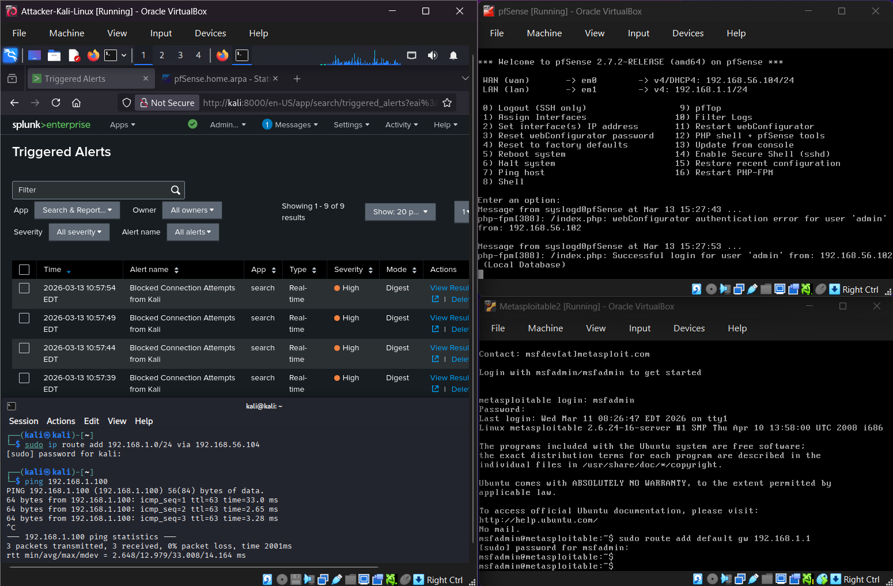
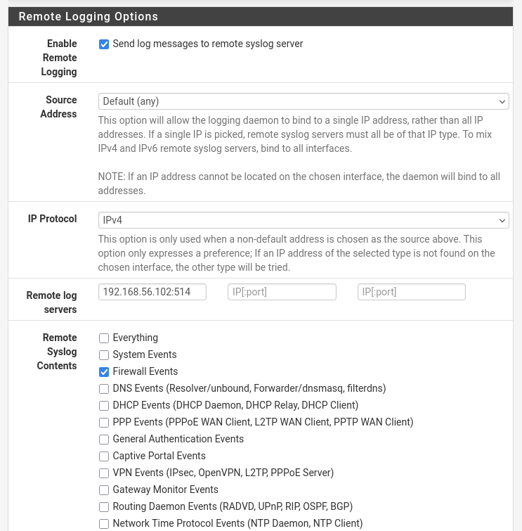
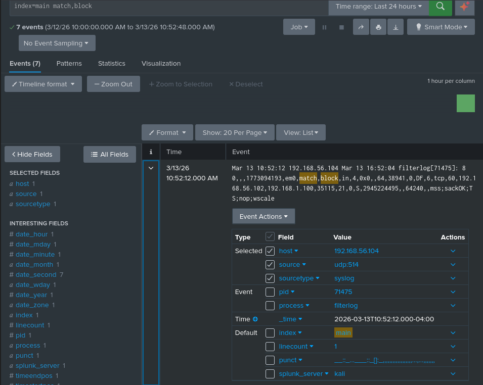
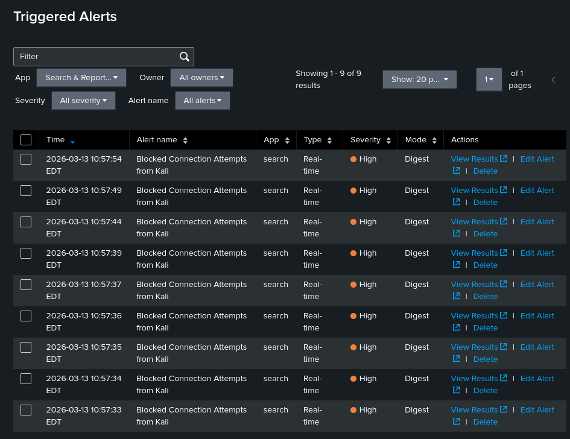

# Exercise 07 — Splunk SIEM Setup & Real-Time Detection

**Date:** 13/03/2026
**Category:** SOC Analysis / SIEM
**Tools:** Splunk Enterprise, pfSense 2.7.2, Metasploit
**Attacker:** Kali Linux — 192.168.56.102
**Firewall:** pfSense — WAN 192.168.56.104 / LAN 192.168.1.1
**Target:** Metasploitable2 — 192.168.1.100

---

## Objective
Install and configure Splunk Enterprise on Kali as a SIEM, ingest
pfSense firewall logs via syslog, and build a real-time detection
alert that fires when blocked connection attempts are detected from
a specific source IP.

---

## Architecture
```
Kali (192.168.56.102)
  ├── Runs Splunk Enterprise (port 8000)
  ├── Listens for syslog on UDP 514
  └── Runs exploit attempts → blocked by pfSense

pfSense (192.168.56.104 / 192.168.1.1)
  ├── Blocks traffic on ports 21, 139, 445
  └── Forwards firewall logs → Kali:514

Metasploitable2 (192.168.1.100)
  └── Protected behind pfSense firewall
```

### Screenshot — Full Lab: All Three VMs Running with Splunk Active


---

## Part A — Splunk Installation

Splunk Enterprise was installed on Kali Linux using the `.deb` package
(500MB/day free tier, sufficient for lab use).
```bash
sudo dpkg -i splunk-*.deb
sudo /opt/splunk/bin/splunk start --run-as-root
```

Web interface accessible at `http://localhost:8000`.

---

## Part B — Configure Syslog Input

A UDP syslog listener was created in Splunk to receive logs from
pfSense:

**Settings → Data Inputs → UDP → New Local UDP:**

| Field | Value |
|---|---|
| Port | 514 |
| Source Type | syslog |
| Index | main |

Splunk now listens on UDP port 514 for incoming syslog messages.

---

## Part C — Configure pfSense Remote Logging

pfSense was configured to forward firewall logs to Splunk:

**Status → System Logs → Settings → Remote Logging Options:**

| Field | Value |
|---|---|
| Enable Remote Logging | Checked |
| Remote Log Server | 192.168.56.102:514 |
| Remote Syslog Contents | Firewall Events |

### Screenshot — pfSense Remote Logging Configuration


---

## Part D — Verify Log Ingestion & Trigger Blocked Traffic

Splunk search confirmed logs were being received from pfSense:
```
index=main
```

**Result:** 74+ events from host `192.168.56.104` via `udp:514`,
sourcetype `syslog`. Raw pfSense filterlog format:
```
filterlog[71475]: 8,,,1773093081,em0,match,block,in,4,0x0,,64,
38941,0,DF,6,tcp,60,192.168.56.102,192.168.1.100,35115,21,0
```

Key fields visible in raw log: rule ID, interface, action
(match,block), protocol, source IP, destination IP, destination port.

The vsftpd exploit (port 21 blocked by pfSense from Exercise 06)
was run to generate blocked traffic:
```bash
use exploit/unix/ftp/vsftpd_234_backdoor
set RHOSTS 192.168.1.100
run
```

**Result:** `ConnectionTimeout` — pfSense blocked port 21 and logged
the event. Splunk search confirmed blocked events:
```
index=main match,block 192.168.56.102
```

**Result:** 7 blocked events from `192.168.56.102` targeting
`192.168.1.100:21`.

### Screenshot — Splunk Search Showing Blocked Events from pfSense


---

## Part E — Real-Time Detection Alert

A real-time alert was created in Splunk:

**Search & Reporting → Save As → Alert:**

| Field | Value |
|---|---|
| Title | Blocked Connection Attempts from Kali |
| Alert Type | Real-time |
| Trigger Condition | Number of results > 0 |
| Trigger Action | Add to Triggered Alerts |
| Severity | High |

**Result:** 9 alerts fired within seconds of the exploit running —
each blocked connection attempt triggered an immediate High severity
alert in Splunk's Triggered Alerts dashboard.

### Screenshot — Triggered Alerts Firing in Real-Time


---

## Detection Pipeline
```
Kali runs vsftpd exploit
    → pfSense Block FTP port 21 rule triggers
        → pfSense logs event to syslog
            → Splunk receives log via UDP 514
                → Search matches "match,block 192.168.56.102"
                    → High severity alert fires in real-time
```

---

## Real-World Relevance
This exercise replicates the core workflow of a SOC analyst:

**Log ingestion** — collecting logs from network devices (firewalls,
routers) into a central SIEM is the foundation of all SOC operations.
pfSense → Splunk via syslog mirrors how enterprise firewalls (Palo
Alto, Fortinet, Cisco ASA) ship logs to Splunk or Microsoft Sentinel
in real environments.

**Detection rules** — the alert built here is a simplified version
of what SOC teams call a correlation rule or analytic rule. In
enterprise SIEMs these rules are more sophisticated — counting events
over time windows, thresholding by volume, correlating across multiple
log sources.

**Alert triage** — in a real SOC, these triggered alerts would appear
in a ticketing system (ServiceNow, Jira) and a SOC L1 analyst would
investigate, determine if the source IP is internal or external,
check if it's a known asset, and escalate or close accordingly.

---

## Recommendation
- Ship logs from all network devices to a central SIEM — blind spots
  in log coverage are where attackers hide
- Build detection rules with thresholds to reduce alert fatigue —
  e.g. alert only after 5+ blocked attempts in 60 seconds
- Correlate firewall block events with endpoint logs to determine
  if the source machine itself is compromised
- Retain firewall logs for minimum 90 days for forensic investigation
