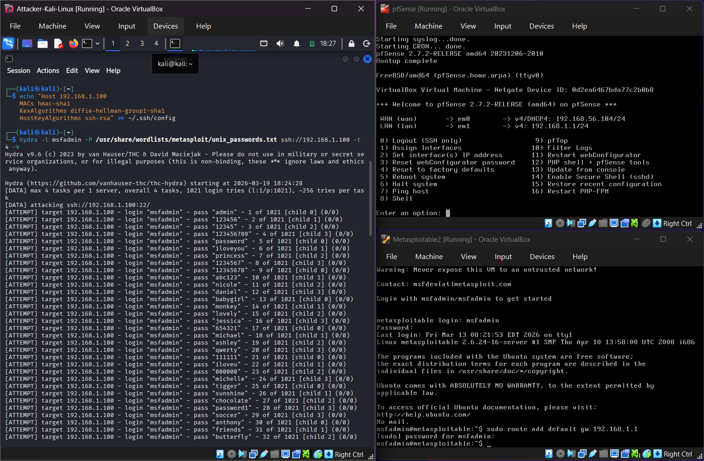
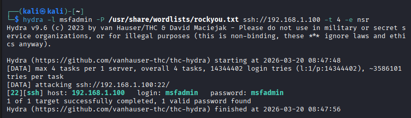
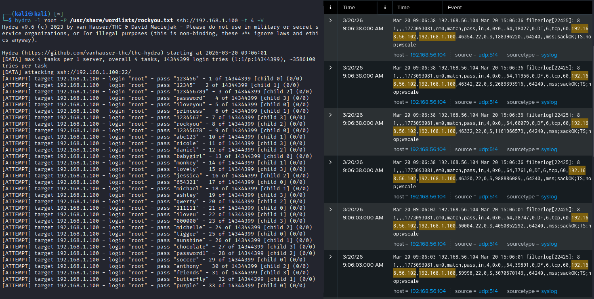
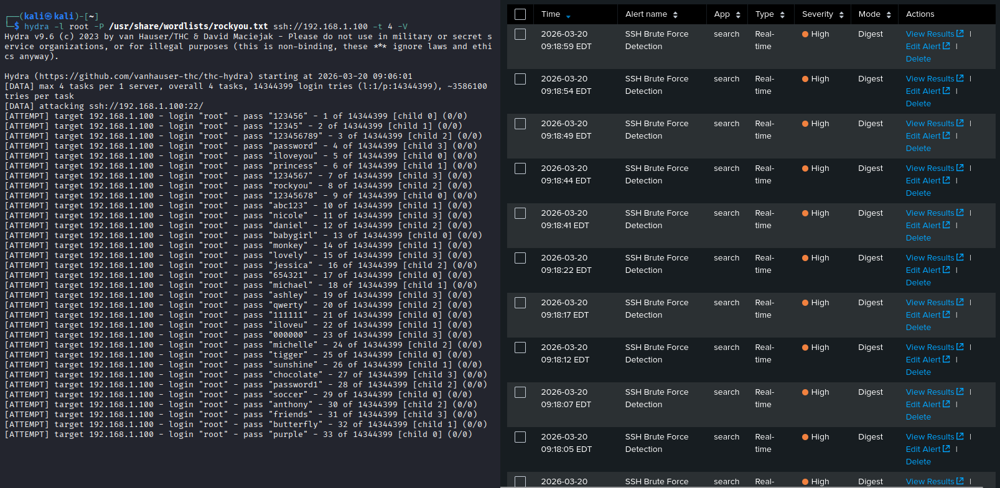

# Exercise 08 — SSH Brute Force Attack & Detection

**Date:** 20/03/2026
**Category:** SOC Analysis / Attack Detection
**Tools:** Hydra, Splunk Enterprise, pfSense 2.7.2
**Attacker:** Kali Linux — 192.168.56.102
**Firewall:** pfSense — WAN 192.168.56.104 / LAN 192.168.1.1
**Target:** Metasploitable2 — 192.168.1.100

---

## Objective
Perform an SSH brute force attack against Metasploitable2 using Hydra,
verify the attack traffic is captured in Splunk via pfSense syslog,
and build a real-time detection alert that fires during active brute
force activity.

---

## Background

SSH brute force is one of the most common attack patterns in the wild.
Automated tools like Hydra try thousands of username/password
combinations per minute against exposed SSH ports. In a real
environment, a SOC analyst watching SIEM alerts would see a spike in
connection attempts from a single source IP targeting port 22 —
a clear indicator of brute force activity.

**Key weakness exploited:** Metasploitable2 uses default credentials
(`msfadmin:msfadmin`) — username identical to password, cracked
instantly by any tool that tests this pattern.

---

## Lab Setup

All three VMs running simultaneously with full network routing through
pfSense. Splunk receiving pfSense firewall logs via UDP syslog on
port 514.

### Screenshot — Full Lab: All Three VMs Running


---

## Part A — Reconnaissance

Confirmed SSH is running on Metasploitable2:
```bash
nmap -p 22 192.168.1.100
```

**Result:**
```
PORT   STATE SERVICE
22/tcp open  ssh
```

---

## Part B — SSH Brute Force with Hydra

Metasploitable2 runs an old SSH version with legacy encryption
algorithms. A config entry was required to allow Hydra to connect:
```bash
echo "Host 192.168.1.100
    MACs hmac-sha1
    KexAlgorithms diffie-hellman-group1-sha1
    HostKeyAlgorithms ssh-rsa" >> ~/.ssh/config
```

Hydra was run using the rockyou wordlist with the `-e nsr` flag to
test the username as password on the first attempt:
```bash
hydra -l msfadmin -P /usr/share/wordlists/rockyou.txt \
ssh://192.168.1.100 -t 4 -V -e nsr
```

| Component | Meaning |
|---|---|
| `-l msfadmin` | Single username to test |
| `-P rockyou.txt` | Password wordlist — 14 million entries |
| `-t 4` | 4 parallel threads |
| `-V` | Verbose — show each attempt |
| `-e nsr` | Also test: empty password, username as password, reversed username |

**Result:** Password found on attempt 1 in under 7 seconds.
```
[22][ssh] host: 192.168.1.100   login: msfadmin   password: msfadmin
1 of 1 target successfully completed, 1 valid password found
```

### Screenshot — Hydra Finds Password Instantly


---

## Part C — Traffic Visible in Splunk

While Hydra ran against a non-existent user (`root`) to generate
sustained traffic, Splunk search confirmed pfSense was logging the
SSH connection attempts:
```
index=main 192.168.56.102 192.168.1.100
```

**Result:** 14 events showing rapid repeated TCP connections from
`192.168.56.102` to `192.168.1.100` on port 22 — the brute force
pattern clearly visible in the log volume and frequency.

### Screenshot — SSH Brute Force Traffic in Splunk


---

## Part D — Real-Time Detection Alert

A real-time alert was created in Splunk to detect active brute force:

**Search & Reporting → Save As → Alert:**

| Field | Value |
|---|---|
| Title | SSH Brute Force Detection |
| Search | `index=main 192.168.56.102 192.168.1.100 earliest=-1m` |
| Alert Type | Real-time |
| Trigger Condition | Number of results > 5 |
| Trigger Action | Add to Triggered Alerts |
| Severity | High |

The `earliest=-1m` scope ensures the alert only triggers on traffic
from the last 1 minute — preventing false positives from historical
data while catching live attacks.

**Result:** Alert fired repeatedly during active Hydra run — each
burst of SSH connection attempts triggered a High severity alert in
Triggered Alerts.

### Screenshot — SSH Brute Force Alerts Firing in Real-Time


---

## Detection Pipeline
```
Hydra tests passwords against SSH port 22
    → pfSense logs TCP connections to 192.168.1.100:22
        → Splunk receives logs via UDP 514
            → Search matches traffic between Kali and Metasploitable
                → More than 5 events in 1 minute triggers alert
                    → High severity alert fires in real-time
```

---

## Real-World Relevance

**Why brute force works:** Default credentials are still the most
common attack vector in real environments. The 2024 Verizon DBIR
reported that stolen or default credentials were involved in over
70% of breaches. `msfadmin:msfadmin` is trivially cracked — any
tool testing username=password finds it in milliseconds.

**What a SOC analyst looks for:**
- High volume of failed authentication attempts from a single IP
- Rapid sequential connections to port 22 in a short time window
- Successful login immediately following a burst of failures —
  indicates the password was found

**The `-e nsr` flag is critical** — most real attackers test
username=password, empty password, and reversed username before
running a full wordlist. A detection rule that only fires after
1000 attempts will miss attacks that succeed in the first 5.

---

## Recommendation
- Disable SSH password authentication — use key-based auth only
- Implement fail2ban or equivalent to auto-block IPs after 3-5
  failed attempts
- Change default credentials immediately on all systems
- Alert on more than 3 failed SSH attempts from the same IP in
  60 seconds — not just volume, but velocity
- Never expose SSH on port 22 to untrusted networks — use a
  non-standard port or VPN gateway
