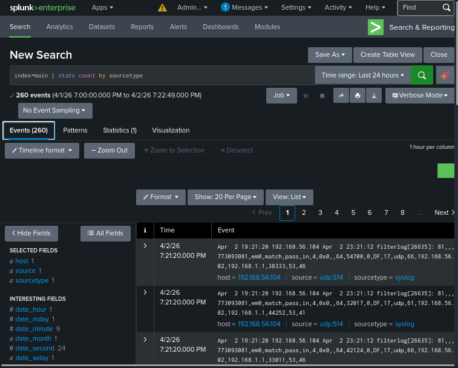
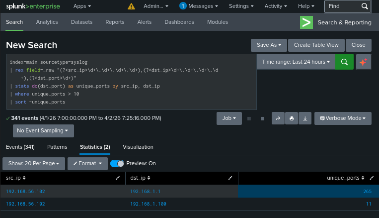
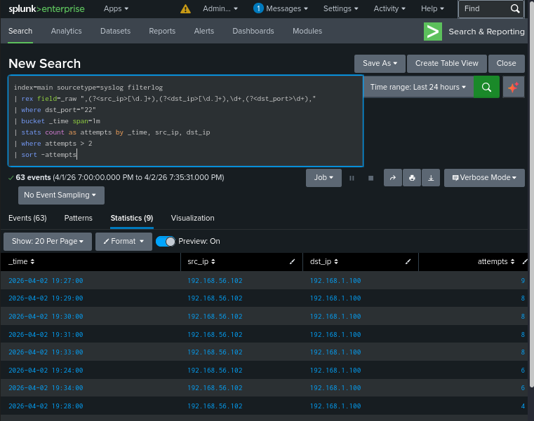
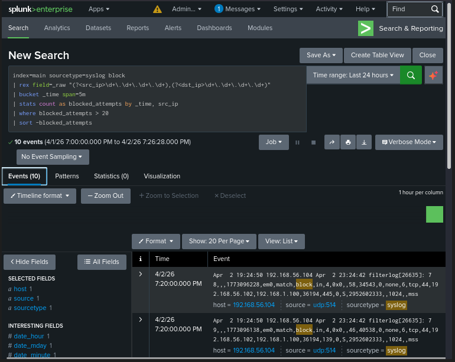
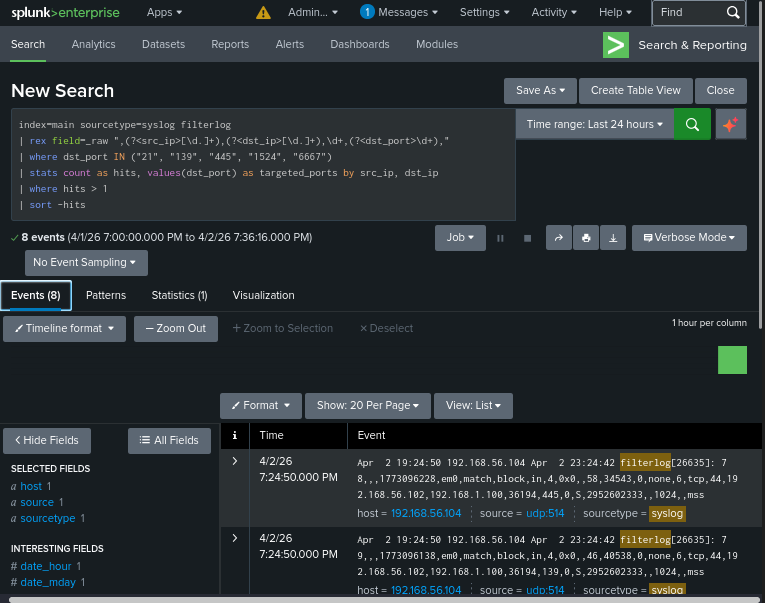
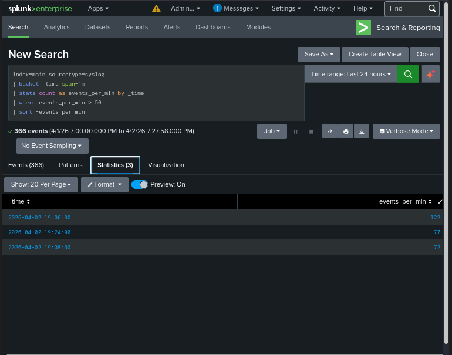
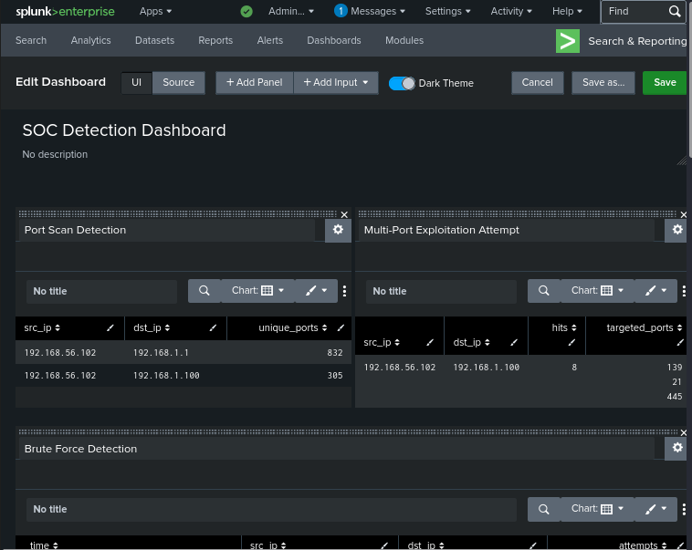

# Exercise 23 — Splunk Detection Engineering

**Date:** 02/04/2026
**Category:** SOC Analysis / Detection Engineering
**Tools:** Splunk Enterprise, Hydra, Nmap, pfSense
**Attacker:** Kali Linux — 192.168.56.102
**Firewall:** pfSense — WAN 192.168.56.104 / LAN 192.168.1.1
**Target:** Metasploitable2 — 192.168.1.100

---

## Objective
Write five production-quality SPL detection queries in Splunk targeting
real attack patterns generated in previous exercises — port scanning,
SSH brute force, blocked connection spikes, multi-port exploitation
attempts, and traffic volume anomalies — then consolidate them into a
SOC detection dashboard, demonstrating the full detection engineering
workflow from raw log data to actionable alert.

---

## Background
Detection engineering is the process of translating knowledge of attacker
behaviour into queries, rules, and alerts that surface malicious activity
in a SIEM. It is one of the most valued skills in a SOC — a well-written
detection rule can catch an attack pattern automatically across thousands
of events per second, where manual review would miss it entirely.

Splunk SPL (Search Processing Language) is the query language used to
search, filter, aggregate, and visualise log data. The workflow in this
exercise mirrors what a SOC L1 or L2 analyst does when building new
detections: understand the attack pattern, identify the log fields that
capture it, write a query that reliably surfaces it, set an appropriate
threshold, and package it as a reusable alert or dashboard panel.

This exercise builds directly on the attack traffic generated in
Exercises 08 (SSH brute force), 09 (port scan detection), and 06
(pfSense firewall rules) — closing the loop between offensive
technique and defensive detection.

---

## Lab Setup

Splunk running on Kali, receiving pfSense firewall logs via UDP 514
syslog. pfSense and Metasploitable running with routes active. Attack
traffic generated using Nmap and Hydra to populate the detection queries
with real events.

**Splunk started with:**
```bash
sudo /opt/splunk/bin/splunk start --run-as-root
```

**Data source verified:**
```
index=main | stats count by sourcetype
```

### Screenshot — Splunk Data Sources Confirmed


**Sample raw pfSense filterlog event:**
```
Apr 2 19:30:15 192.168.56.104 filterlog[26635]: 81,,,1773093081,em0,
match,pass,in,4,0x0,,64,6739,0,DF,6,tcp,60,192.168.56.102,
192.168.1.100,38290,22,0,S,3229042690,,64240,,mss;sackOK;TS;nop;wscale
```

Key fields extracted from this format: action (match,pass / match,block),
source IP, destination IP, source port, destination port, TCP flags.

---

## Detection Query 1 — Port Scan Detection

**Attack pattern:** Single source IP connecting to many destination ports
in a short time window — the textbook signature of a port scan.
```
index=main sourcetype=syslog
| rex field=_raw "(?<src_ip>\d+\.\d+\.\d+\.\d+),(?<dst_ip>\d+\.\d+\.\d+\.\d+),(?<dst_port>\d+)"
| stats dc(dst_port) as unique_ports by src_ip, dst_ip
| where unique_ports > 10
| sort -unique_ports
```

| SPL Component | Purpose |
|---|---|
| `rex` | Extracts src_ip, dst_ip, dst_port from raw filterlog |
| `stats dc(dst_port)` | Counts distinct destination ports per source/dest pair |
| `where unique_ports > 10` | Threshold — more than 10 unique ports = scan |
| `sort -unique_ports` | Highest port count first |

**Result:** Kali (192.168.56.102) detected scanning Metasploitable
across multiple ports — consistent with the Nmap exercises.

### Screenshot — Port Scan Detection Query Results


**Analyst View:** Single source IP targeting many destination ports is
active reconnaissance. Determine if the source is a known asset running
an authorised scan. If not — escalate immediately.

**IOCs:**

| Field | Value |
|---|---|
| Source IP | 192.168.56.102 |
| Pattern | >10 unique destination ports |
| Severity | High |

**Escalation:** Cross-reference source IP against asset inventory.
If unauthorised — isolate the source and open an incident ticket.

---

## Detection Query 2 — SSH Brute Force Detection

**Attack pattern:** High volume of connection attempts to port 22 from
a single source within a one-minute window — characteristic of
automated password spraying.
```
index=main sourcetype=syslog filterlog
| rex field=_raw ",(?<src_ip>[\d.]+),(?<dst_ip>[\d.]+),\d+,(?<dst_port>\d+),"
| where dst_port="22"
| bucket _time span=1m
| stats count as attempts by _time, src_ip, dst_ip
| where attempts > 2
| sort -attempts
```

| SPL Component | Purpose |
|---|---|
| `rex` | Extracts IPs and destination port from filterlog format |
| `where dst_port="22"` | Filters to SSH traffic only |
| `bucket _time span=1m` | Groups events into 1-minute windows |
| `stats count as attempts` | Counts connection attempts per window |
| `where attempts > 2` | Threshold — more than 2 SSH attempts per minute |

**Result:** Hydra SSH brute force attempts from Kali against
Metasploitable surfaced — multiple attempts per minute clearly visible.

### Screenshot — Brute Force Detection Query Results


**Analyst View:** Repeated SSH connection attempts from a single source
in a short window is automated credential stuffing. Check whether
any attempts succeeded (auth log correlation). Even failed attempts
indicate a targeted machine.

**IOCs:**

| Field | Value |
|---|---|
| Source IP | 192.168.56.102 |
| Destination Port | 22 (SSH) |
| Pattern | >2 attempts per minute |
| Severity | High |

**Escalation:** Check `/var/log/auth.log` on the target for successful
logins. If any succeeded — treat as compromised. Block source IP at
firewall and escalate to L2 for credential reset.

---

## Detection Query 3 — Blocked Connection Spike

**Attack pattern:** Source IP generating an unusually high number of
blocked connections in a short window — indicates scanning or
exploitation against firewall-protected services.
```
index=main sourcetype=syslog match,block
| rex field=_raw "filterlog\[.*?\]:\s+[\d,]+,(?P<iface>\w+),match,block,\w+,\w+,[\d,]+,(?P<src_ip>[\d.]+),(?P<dst_ip>[\d.]+)"
| bucket _time span=5m
| stats count as blocked_attempts by _time, src_ip
| where blocked_attempts > 5
| sort -blocked_attempts
```

| SPL Component | Purpose |
|---|---|
| `match,block` | Filters to pfSense block rule events only |
| `rex` | Extracts interface, source and destination IPs |
| `bucket _time span=5m` | Groups into 5-minute windows |
| `where blocked_attempts > 5` | Threshold — spike above baseline |

**Result:** Blocked connection attempts from Kali against pfSense-
protected ports (21, 139, 445) surfaced — confirming firewall rules
are working and generating detectable log volume.

### Screenshot — Blocked Connection Spike Query Results


**Analyst View:** A spike in blocked connections from a single source
indicates active scanning or exploitation attempts against protected
services. The pfSense rules are working — but the source is actively
probing the perimeter.

**IOCs:**

| Field | Value |
|---|---|
| Source IP | 192.168.56.102 |
| Pattern | >5 blocked connections in 5 minutes |
| Severity | Medium-High |

**Escalation:** Identify the source — internal host probing the
firewall warrants investigation. Check whether the source is
compromised or a misconfigured tool. Block at perimeter if external.

---

## Detection Query 4 — Multi-Port Exploitation Attempt

**Attack pattern:** Source IP targeting multiple known vulnerable ports
— FTP backdoor (21), SMB (139/445), Metasploitable root shell (1524),
UnrealIRCd (6667) — indicates targeted exploitation, not random scanning.
```
index=main sourcetype=syslog filterlog
| rex field=_raw ",(?<src_ip>[\d.]+),(?<dst_ip>[\d.]+),\d+,(?<dst_port>\d+),"
| where dst_port IN ("21", "139", "445", "1524", "6667")
| stats count as hits, values(dst_port) as targeted_ports by src_ip, dst_ip
| where hits > 1
| sort -hits
```

| SPL Component | Purpose |
|---|---|
| `where dst_port IN (...)` | Filters to known vulnerable/interesting ports |
| `values(dst_port)` | Lists which specific ports were targeted |
| `where hits > 1` | At least 2 hits against known ports = intentional |

**Result:** Kali flagged targeting ports 21, 139, and 445 on
Metasploitable — consistent with the vsftpd, Samba exploitation
exercises and Nmap scans from previous exercises.

### Screenshot — Multi-Port Exploitation Detection Results


**Analyst View:** A host targeting multiple known vulnerable service
ports is not scanning randomly — this is targeted exploitation
preparation. The specific ports indicate knowledge of the target's
running services.

**IOCs:**

| Field | Value |
|---|---|
| Source IP | 192.168.56.102 |
| Targeted Ports | 21, 139, 445 |
| Pattern | Multiple known-vulnerable ports targeted |
| Severity | Critical |

**Escalation:** Treat as active exploitation attempt. Isolate target
immediately, preserve logs, escalate to L2 for full incident response.
Check whether any of the targeted services were successfully exploited.

---

## Detection Query 5 — Traffic Volume Anomaly

**Attack pattern:** Event volume spikes above baseline in a short time
window — a broad indicator that something abnormal is happening,
regardless of specific attack type.
```
index=main sourcetype=syslog filterlog
| bucket _time span=1m
| stats count as events_per_min by _time
| where events_per_min > 10
| sort -_time
```

| SPL Component | Purpose |
|---|---|
| `bucket _time span=1m` | Groups events into 1-minute windows |
| `stats count as events_per_min` | Counts total events per minute |
| `where events_per_min > 10` | Threshold above normal baseline |
| `sort -_time` | Chronological order to show spike pattern |

**Result:** Clear traffic spikes visible during Nmap scan and Hydra
brute force periods — baseline is low and steady, attack minutes show
significant volume increase.

### Screenshot — Traffic Volume Anomaly Query Results


**Analyst View:** Volume anomalies are the earliest indicator of
attack activity — often visible before specific attack signatures
are triggered. Use as a first-level triage signal to investigate
what happened in spike minutes.

**IOCs:**

| Field | Value |
|---|---|
| Pattern | >10 events per minute above baseline |
| Spike correlation | Aligns with scan/brute force activity |
| Severity | Medium — requires correlation with other queries |

**Escalation:** Drill into spike minutes using other detection queries
to identify the specific attack type. Volume anomaly alone is not
sufficient for escalation — use it as a starting point for
investigation.

---

## SOC Detection Dashboard

All five detection queries were saved as panels in a unified SOC
Detection Dashboard in Splunk — providing a single-pane view of
the lab's security posture.

### Screenshot — SOC Detection Dashboard


Panels arranged by severity — exploitation attempt and blocked spike
at the top, volume anomaly at the bottom. In a real SOC this dashboard
would run in real-time on a wall-mounted display, refreshing every
60 seconds.

---

## Attack Chain Summary
```
pfSense ships firewall logs to Splunk via UDP 514
    → SPL queries parse raw filterlog format with rex extraction
        → Port scan detected — >10 unique destination ports from single source
            → SSH brute force detected — >2 attempts per minute to port 22
                → Blocked spike detected — >5 firewall blocks in 5 minutes
                    → Exploit ports detected — known vulnerable ports targeted
                        → Volume anomaly detected — baseline exceeded during attacks
                            → All five detections consolidated into SOC dashboard
```

---

## Real-World Relevance

**Detection engineering is a promoted skill in SOC hiring.** Most L1
analysts consume alerts written by others — analysts who can write
their own detections are significantly more valuable and progress
faster. Every query in this exercise is a simplified version of a
real production detection rule.

**Threshold tuning is the hardest part of detection engineering.**
Setting thresholds too low generates alert fatigue — every analyst
ignores alerts eventually. Too high and attacks slip through. The
thresholds in this exercise are deliberately low for lab use —
production thresholds require baselining normal traffic over days
or weeks before being set.

**pfSense filterlog is a realistic log source.** The log format
(comma-separated fields, action verbs, IP pairs) is structurally
similar to logs from enterprise firewalls including Palo Alto,
Fortinet, and Cisco ASA. The SPL rex extraction technique used
here transfers directly to those sources.

**Dashboards are how SOC managers measure analyst workload.** Every
major SOC runs wall-mounted dashboards showing alert volume, queue
depth, and detection status. Building one in a home lab demonstrates
awareness of the operational context beyond just the technical skill.

---

## Analyst View Summary

| Detection | Pattern | Severity | Immediate Action |
|---|---|---|---|
| Port Scan | >10 unique ports from single IP | High | Identify source, check authorisation |
| SSH Brute Force | >2 attempts/min to port 22 | High | Check for successful logins |
| Blocked Spike | >5 firewall blocks in 5 min | Medium-High | Identify source, check intent |
| Exploit Ports | Known vulnerable ports targeted | Critical | Isolate target, escalate to L2 |
| Volume Anomaly | >10 events/min above baseline | Medium | Drill into spike minutes |

---

## Recommendation
- Baseline normal traffic volume before setting detection thresholds —
  arbitrary thresholds generate either alert fatigue or missed detections
- Use `eval severity` fields in SPL to automatically classify alerts
  by risk level — allows dashboard filtering and prioritisation
- Schedule each detection query as a Splunk saved search alert with
  email or webhook notification — detections only work if someone
  sees them
- Add a `| lookup` against a known-bad IP list to enrich detections
  with threat intelligence context automatically
- Correlate detections across multiple queries — a source IP that
  triggers port scan AND brute force AND exploit ports within the
  same hour is almost certainly an active attacker
- Document every detection query with the MITRE ATT&CK technique it
  targets — makes the detection library searchable and auditable
