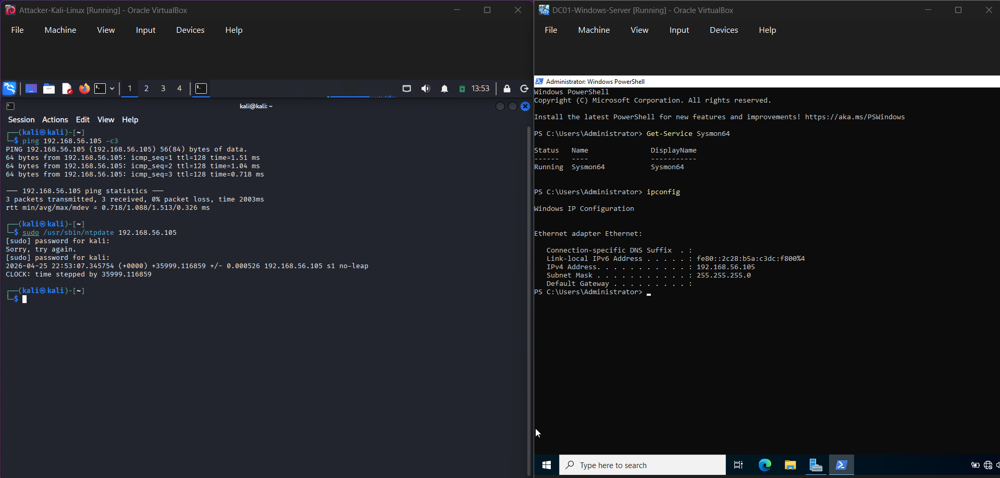
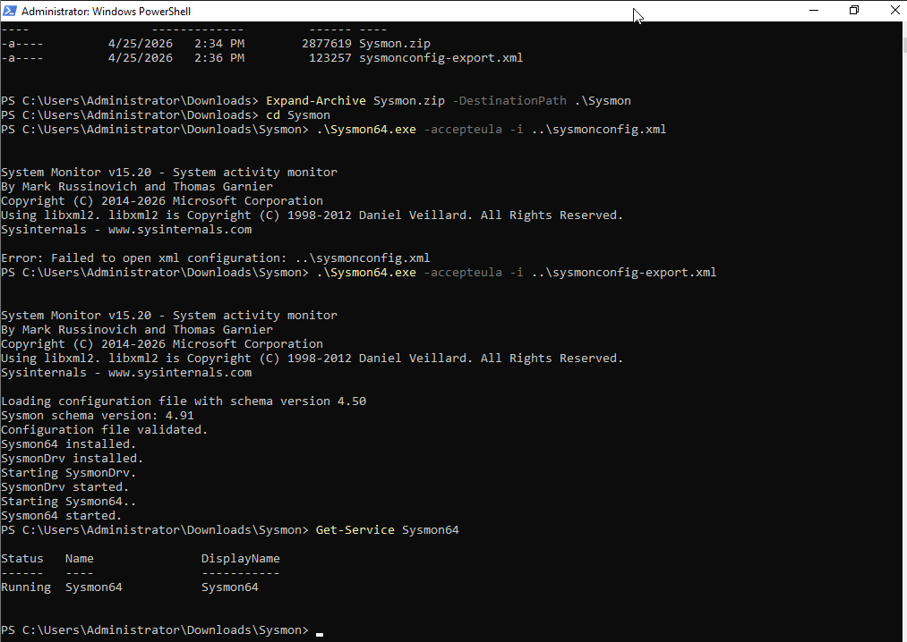
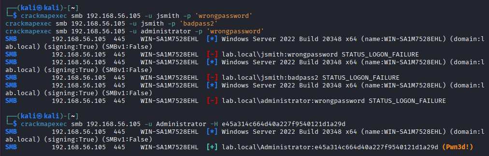
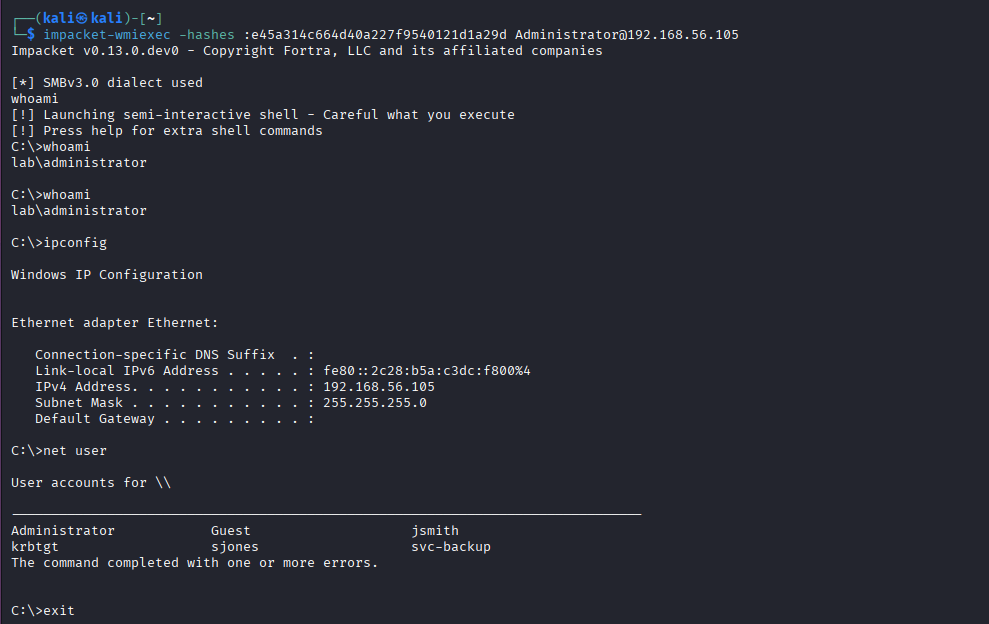
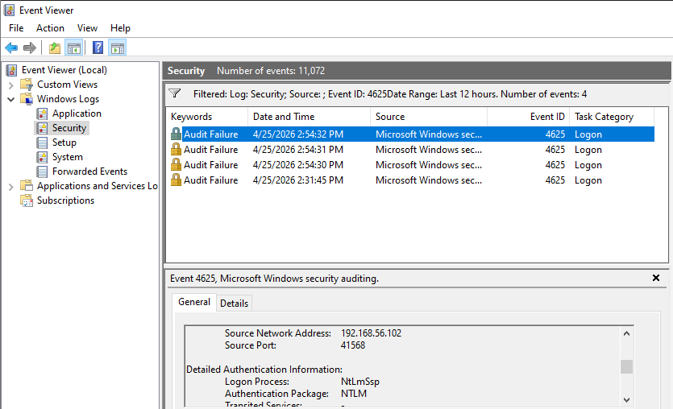
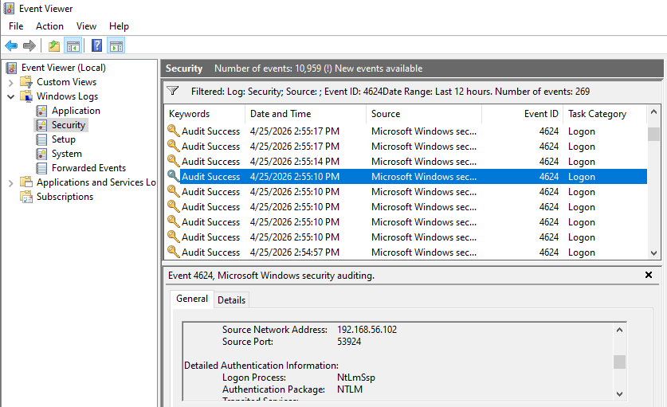
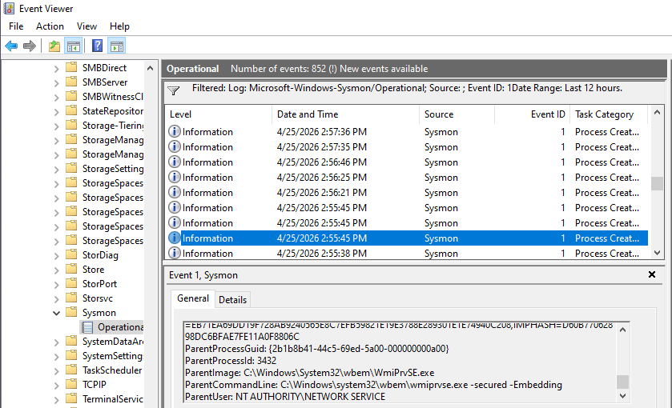

# Exercise 27 — Windows Event Log & Sysmon Investigation

**Date:** 25/04/2026
**Category:** SOC Analysis / Host-Based Detection
**Tools:** Sysmon, Windows Event Viewer, CrackMapExec, Impacket
**Attacker:** Kali Linux — 192.168.56.102
**Target:** DC01-Windows-Server — 192.168.56.105 (lab.local)

---

## Objective

Install Sysmon on the lab domain controller, generate realistic attack activity from Kali, then investigate the resulting Windows Security event logs and Sysmon telemetry as a SOC analyst — correlating native Windows event IDs with Sysmon process creation data to reconstruct the attack chain.

---

## Background

Windows Security event logs are the primary data source for host-based detection in most enterprise SOC environments. Key event IDs — 4625 (failed logon), 4624 (successful logon), and 4688 (process creation) — are generated natively by Windows and form the foundation of most SIEM detection rules.

However, native Windows logging has significant gaps. Process creation logging (4688) requires explicit audit policy configuration and provides limited detail. Sysmon fills this gap: it is a free Sysinternals tool that enriches host telemetry with detailed process creation events (Event ID 1), network connections (Event ID 3), file creation timestamps (Event ID 11), and more than 20 additional event types.

In a real SOC environment, Sysmon events are forwarded to a SIEM (Splunk, Sentinel, QRadar) where detection rules fire on patterns such as WMI-spawned child processes, NTLM authentication on domain-joined machines, or repeated failed logons from a single source IP. This exercise simulates that full pipeline at the host level.

---

## Lab Setup

Two VMs required for this exercise — no pfSense or Metasploitable needed:

- **Attacker:** Kali Linux — 192.168.56.102 (Host-Only)
- **Target:** DC01-Windows-Server — 192.168.56.105 (Host-Only, domain: lab.local)

Boot order: DC01 → Kali. Before starting, sync the Kali clock to avoid Kerberos skew errors:

```bash
sudo /usr/sbin/ntpdate 192.168.56.105
```

### Screenshot — Lab Setup


---

## Part A — Install Sysmon on the Domain Controller

**On DC01-Windows-Server:**

Temporarily add a NAT adapter to the DC in VirtualBox settings, then download:
- Sysmon: `https://download.sysinternals.com/files/Sysmon.zip`
- SwiftOnSecurity config: `https://raw.githubusercontent.com/SwiftOnSecurity/sysmon-config/master/sysmonconfig-export.xml`

Save both to `C:\Users\Administrator\Downloads\`. Then in PowerShell as Administrator:

```powershell
cd C:\Users\Administrator\Downloads
Expand-Archive Sysmon.zip -DestinationPath .\Sysmon
cd Sysmon
.\Sysmon64.exe -accepteula -i C:\Users\Administrator\Downloads\sysmonconfig.xml
```

| Flag | Meaning |
|------|---------|
| `-accepteula` | Accepts the licence agreement non-interactively |
| `-i` | Install Sysmon with the specified configuration file |

Verify Sysmon is running:

```powershell
Get-Service Sysmon64
```

Expected output: `Running`. Remove the NAT adapter from DC VirtualBox settings after installation — the DC should remain Host-Only only.

### Screenshot — Sysmon Service Running


---

## Part B — Generate Attack Traffic from Kali

With Sysmon active on the DC, the following activity is generated from Kali to produce realistic SOC-relevant log entries.

**Step 1 — Simulate failed logon attempts (generates Event ID 4625):**

```bash
crackmapexec smb 192.168.56.105 -u jsmith -p 'wrongpassword'
crackmapexec smb 192.168.56.105 -u jsmith -p 'badpass2'
crackmapexec smb 192.168.56.105 -u administrator -p 'wrongpassword'
```

| Flag | Meaning |
|------|---------|
| `smb` | Target SMB protocol (port 445) |
| `-u` | Username to authenticate with |
| `-p` | Password to attempt |

**Step 2 — Successful Pass-the-Hash (generates Event ID 4624 with NTLM):**

```bash
crackmapexec smb 192.168.56.105 -u Administrator -H e45a314c664d40a227f9540121d1a29d
```

| Flag | Meaning |
|------|---------|
| `-H` | NTLM hash to use instead of a plaintext password |

**Step 3 — Remote command execution via wmiexec (generates Sysmon Event ID 1):**

```bash
impacket-wmiexec -hashes :e45a314c664d40a227f9540121d1a29d Administrator@192.168.56.105
```

| Flag | Meaning |
|------|---------|
| `-hashes` | Pass-the-Hash format: `LMhash:NThash` (LM portion left empty) |

Once the shell opens, run several commands to generate process creation events on the DC:

```
whoami
ipconfig
net user
exit
```

### Screenshot — Attack Traffic Generated from Kali


### Screenshot — Remote Shell via Impacket wmiexec


---

## Part C — Investigate Windows Security Event Logs

On DC01, open **Event Viewer → Windows Logs → Security**.

### Failed Logon Events (Event ID 4625)

Right-click Security → Filter Current Log → Event ID: `4625`.

Double-click any matching event. Key fields in the event detail:

**Logon Information:**
```
Logon Type:    3
```
Type 3 is a network logon — authentication arriving over the network rather than at the local keyboard. This is the expected logon type for SMB-based attacks.

**Network Information:**
```
Source Network Address:    192.168.56.102
Source Port:               [ephemeral port]
```
The source IP confirms the logon attempt originated from Kali.

Multiple 4625 events from the same source IP in a short time window is the classic failed-logon brute force pattern — the foundation of most account lockout detection rules in production SIEM environments.

### Screenshot — Event ID 4625 Failed Logon


### Successful Logon via Pass-the-Hash (Event ID 4624)

Filter for Event ID `4624`. Locate the event timestamped during the CrackMapExec PtH command.

**Logon Information:**
```
Logon Type:    3
```

**Detailed Authentication Information:**
```
Logon Process:          NtLmSsp
Authentication Package: NTLM
```

On a domain-joined Windows machine, legitimate interactive logons use Kerberos. NTLM appearing on a domain controller for a network logon is a significant anomaly — it is the forensic fingerprint of a Pass-the-Hash attack. Kerberos requires a valid ticket obtained through normal credential exchange; PtH bypasses this entirely and authenticates using only the NTLM hash.

### Screenshot — Event ID 4624 Successful NTLM Logon


---

## Part D — Investigate Sysmon Logs

**Event Viewer → Applications and Services Logs → Microsoft → Windows → Sysmon → Operational.**

### Process Creation (Event ID 1)

Filter for Event ID `1`. Use Ctrl+F to search for `WmiPrvSE` — this is the Windows Management Instrumentation Provider Service, which wmiexec uses as its execution host on the remote machine.

Sysmon Event ID 1 captures:
- Full process image path
- Command line arguments
- Parent process name and PID
- User context the process ran under
- Timestamp

The wmiexec footprint is `WmiPrvSE.exe` spawning child processes (cmd.exe) under the Administrator account. In a real SOC environment, WMI spawning interactive shells is a high-fidelity detection signal — it is rare in legitimate operations and common in lateral movement.

### Screenshot — Sysmon Event ID 1 Process Creation


---

## Attack Chain Summary

```
Kali (192.168.56.102) initiates SMB connections to DC01 (192.168.56.105)
    → Three failed logon attempts → Windows logs Event ID 4625 x3
        → Pass-the-Hash with Administrator NTLM hash
            → Successful NTLM network logon → Windows logs Event ID 4624
                → wmiexec opens remote WMI shell
                    → WmiPrvSE.exe spawns cmd.exe → Sysmon logs Event ID 1
                        → Commands executed: whoami, ipconfig, net user
```

---

## Real-World Relevance

Windows Event IDs 4624 and 4625 are among the most commonly queried log sources in enterprise SOC environments. Detection rules built on these events — failed logon thresholds, NTLM on domain machines, logon type anomalies — are standard across every major SIEM platform.

Sysmon dramatically increases the fidelity of host-based detection. Without it, a SOC analyst sees that a process ran but not what command line arguments it used, who its parent was, or what it spawned. With Sysmon, the entire process tree is visible. The difference between detecting lateral movement and missing it often comes down to whether Sysmon is deployed.

WMI-based lateral movement (wmiexec, CrackMapExec) is a preferred technique for attackers precisely because it uses a legitimate Windows service as the execution host, making it harder to distinguish from normal administrative activity without rich process telemetry.

---

## Analyst View

From a SOC analyst perspective this activity would trigger at minimum two alerts in a production environment: a failed logon threshold alert (multiple 4625 events from a single external IP within a short window) and an NTLM authentication alert on a domain controller (4624 with Authentication Package: NTLM rather than Kerberos).

The Sysmon data provides the third piece: confirmation that the successful authentication was followed by remote command execution via WMI. Correlating 4624 + Sysmon Event ID 1 (WmiPrvSE spawning cmd.exe) within the same time window and under the same account builds a high-confidence lateral movement case requiring immediate escalation.

This is not ambiguous activity. An administrator managing the DC remotely would use RDP or a management tool — not raw WMI shells. The combination of NTLM authentication and WMI process spawning from an external IP is a confirmed incident, not a suspected one.

---

## Indicators / IOCs

| Indicator | Type | Value | Severity |
|-----------|------|-------|----------|
| Source IP | Network | 192.168.56.102 | Critical |
| Event ID 4625 x3 | Windows log | Failed network logons, Logon Type 3 | High |
| Event ID 4624 | Windows log | Successful logon, NTLM, Logon Type 3 | Critical |
| Authentication package | Auth | NTLM on domain controller (expected: Kerberos) | Critical |
| Sysmon Event ID 1 | Host | WmiPrvSE.exe spawning cmd.exe under Administrator | Critical |
| Commands executed | Process | whoami, ipconfig, net user | High |

---

## Escalation / Remediation

In a real SOC response:

1. **Immediate:** Disable the Administrator account or force a password reset. An NTLM hash is in attacker hands — the hash must be treated as fully compromised credentials.
2. **Containment:** Block 192.168.56.102 at the perimeter firewall. Isolate any systems the account accessed during the window the hash was valid.
3. **Investigation:** Review all 4624 events for the Administrator account in the 24 hours prior. Determine how the NTLM hash was obtained — likely via a secretsdump or credential dumping stage that preceded this exercise.
4. **Scope:** Query Sysmon Event ID 1 across all endpoints for WmiPrvSE.exe spawning shells. Lateral movement rarely stops at one machine.
5. **Hardening:** Enable Protected Users security group for all privileged accounts — this forces Kerberos and prevents NTLM authentication entirely for those accounts.
6. **Detection tuning:** Add a SIEM rule: `Event ID 4624 AND Authentication Package = NTLM AND Logon Type = 3 AND account = privileged account → HIGH alert`.

---

## Recommendation

- **Deploy Sysmon on all Windows endpoints.** Native Windows logging alone lacks the process-level detail required for modern threat detection. The SwiftOnSecurity config is a solid starting baseline for any environment.
- **Alert on NTLM authentication for privileged accounts on domain controllers.** In a properly configured domain, Kerberos handles authentication — NTLM appearing for a domain admin is an immediate red flag.
- **Correlate failed logons (4625) with subsequent success (4624) from the same source IP.** A burst of failures followed by a success is a textbook credential attack pattern.
- **Treat WmiPrvSE.exe spawning interactive shells as a high-fidelity lateral movement indicator.** Legitimate remote administration does not look like this.
- **Rotate NTLM hashes (force password resets) after any suspected credential exposure.** NTLM hashes do not expire and can be reused indefinitely until the password changes.
