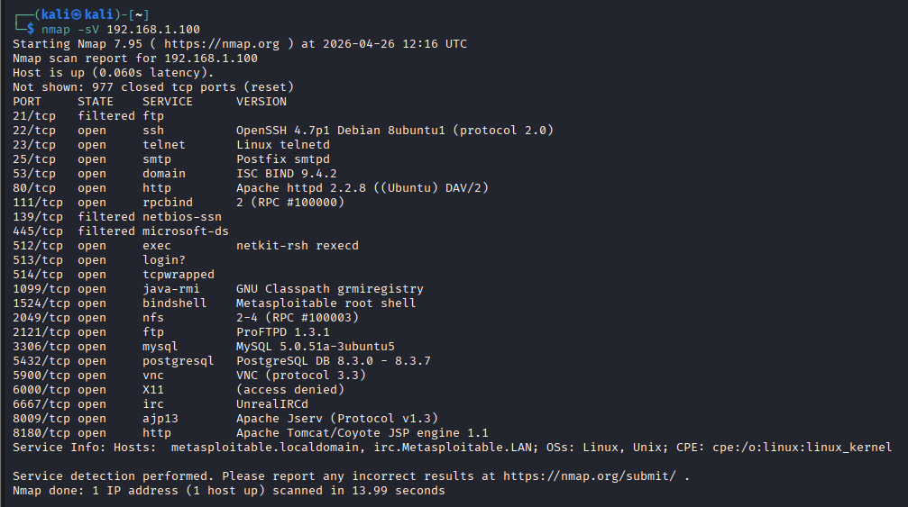
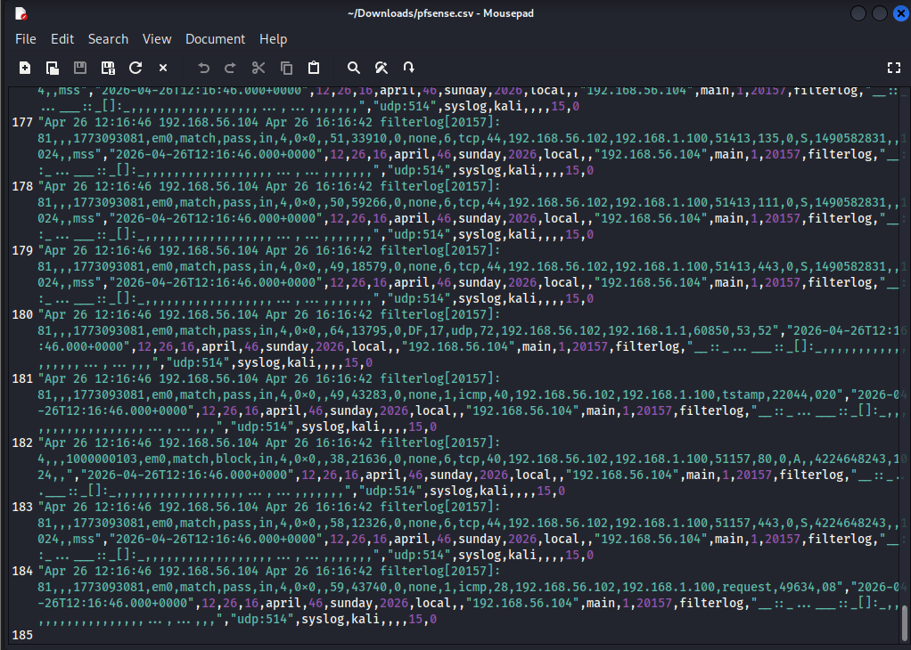
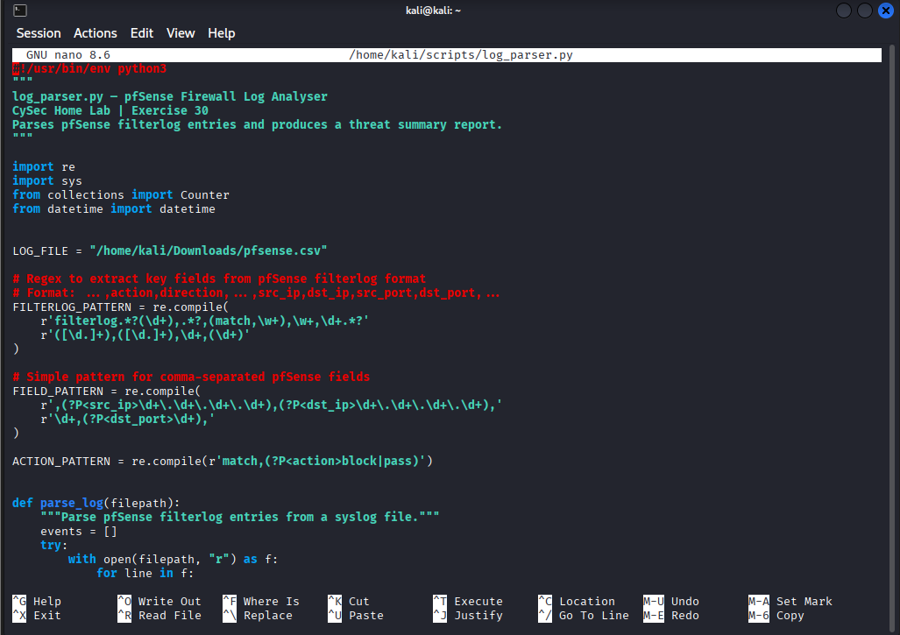
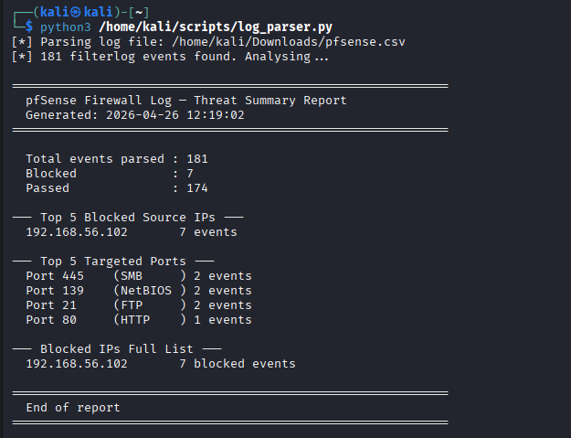

# Exercise 30 — Python Log Parser: pfSense Firewall Analysis

**Date:** 26/04/2026
**Category:** SOC Analysis / Security Tooling
**Tools:** Python 3, Splunk Enterprise, pfSense, Nmap
**Attacker:** Kali Linux — 192.168.56.102
**Firewall:** pfSense — WAN 192.168.56.104 / LAN 192.168.1.1
**Target:** Metasploitable2 — 192.168.1.100

---

## Objective

Write a Python log parser from scratch that ingests pfSense firewall logs exported from Splunk, extracts structured event data using regular expressions, and produces a formatted threat summary report — identifying top blocked source IPs, most targeted ports, and overall traffic breakdown. This demonstrates the ability to build SOC analyst tooling rather than relying solely on off-the-shelf platforms.

---

## Background

SIEM platforms like Splunk provide powerful search and visualisation capabilities, but SOC analysts frequently need to write lightweight scripts to process logs outside the SIEM — during incident response, for ad-hoc analysis, or when integrating data sources that do not have native connectors.

Python is the dominant scripting language in security operations. The ability to parse structured log data, extract indicators, and produce readable reports is a core SOC skill that differentiates candidates who can build tooling from those who can only operate existing tools.

pfSense generates firewall logs in a comma-separated `filterlog` format. Each line contains the action (block or pass), source IP, destination IP, and destination port — the minimum fields needed to identify attack patterns and reconstruct traffic flow. This parser targets exactly those fields and produces output equivalent to what a Splunk dashboard would show, built entirely in the Python standard library with no external dependencies.

---

## Lab Setup

Three VMs required: pfSense, Metasploitable2, and Kali. Boot order: pfSense → Metasploitable → Kali. Add routes and verify connectivity:

```bash
sudo ip route add 192.168.1.0/24 via 192.168.56.104
ping 192.168.1.100
```

Start Splunk to access the log data:

```bash
sudo /opt/splunk/bin/splunk start --run-as-root
```

Generate firewall traffic by running an Nmap scan — this produces both passed and blocked events in pfSense logs as the scan hits the block rules on ports 21, 139, and 445:

```bash
nmap -sV 192.168.1.100
```

### Screenshot — Nmap Traffic Generation


---

## Part A — Export Log Data from Splunk

Navigate to `http://localhost:8000` in Firefox on Kali. Run the following search to retrieve recent pfSense filterlog events:

```
index=main sourcetype=syslog | head 200
```

Export the results: Search → Export → CSV → save to `/home/kali/Downloads/pfsense.csv`

This CSV contains the raw pfSense filterlog entries that the parser will process.

### Screenshot — Log Source


---

## Part B — Write the Log Parser

Create the scripts directory and open the file:

```bash
mkdir -p /home/kali/scripts
nano /home/kali/scripts/log_parser.py
```

Full script:

```python
#!/usr/bin/env python3
"""
log_parser.py — pfSense Firewall Log Analyser
CySec Home Lab | Exercise 30
Parses pfSense filterlog entries and produces a threat summary report.
"""

import re
import sys
from collections import Counter
from datetime import datetime


LOG_FILE = "/home/kali/Downloads/pfsense.csv"

# Extract src_ip, dst_ip, dst_port from pfSense comma-separated filterlog format
FIELD_PATTERN = re.compile(
    r',(?P<src_ip>\d+\.\d+\.\d+\.\d+),(?P<dst_ip>\d+\.\d+\.\d+\.\d+),'
    r'\d+,(?P<dst_port>\d+),'
)

# Extract action (block or pass) from filterlog line
ACTION_PATTERN = re.compile(r'match,(?P<action>block|pass)')


def parse_log(filepath):
    """Parse pfSense filterlog entries from file."""
    events = []
    try:
        with open(filepath, "r") as f:
            for line in f:
                if "filterlog" not in line:
                    continue
                fields = FIELD_PATTERN.search(line)
                action = ACTION_PATTERN.search(line)
                if fields and action:
                    events.append({
                        "src_ip": fields.group("src_ip"),
                        "dst_ip": fields.group("dst_ip"),
                        "dst_port": int(fields.group("dst_port")),
                        "action": action.group("action"),
                    })
    except FileNotFoundError:
        print(f"[ERROR] Log file not found: {filepath}")
        sys.exit(1)
    return events


def analyse(events):
    """Produce a threat summary from parsed events."""
    total = len(events)
    blocked = [e for e in events if e["action"] == "block"]
    passed = [e for e in events if e["action"] == "pass"]

    src_counter = Counter(e["src_ip"] for e in blocked)
    port_counter = Counter(e["dst_port"] for e in blocked)

    print("=" * 60)
    print("  pfSense Firewall Log — Threat Summary Report")
    print(f"  Generated: {datetime.now().strftime('%Y-%m-%d %H:%M:%S')}")
    print("=" * 60)
    print(f"\n  Total events parsed : {total}")
    print(f"  Blocked             : {len(blocked)}")
    print(f"  Passed              : {len(passed)}")

    print("\n--- Top 5 Blocked Source IPs ---")
    for ip, count in src_counter.most_common(5):
        flag = " *** HIGH VOLUME ***" if count > 10 else ""
        print(f"  {ip:<20} {count} events{flag}")

    print("\n--- Top 5 Targeted Ports ---")
    port_names = {21: "FTP", 22: "SSH", 139: "NetBIOS",
                  445: "SMB", 80: "HTTP", 443: "HTTPS", 3389: "RDP"}
    for port, count in port_counter.most_common(5):
        name = port_names.get(port, "unknown")
        print(f"  Port {port:<6} ({name:<8}) {count} events")

    print("\n--- Blocked IPs Full List ---")
    for ip, count in src_counter.most_common():
        print(f"  {ip:<20} {count} blocked events")

    print("\n" + "=" * 60)
    print("  End of report")
    print("=" * 60)


if __name__ == "__main__":
    print(f"[*] Parsing log file: {LOG_FILE}")
    events = parse_log(LOG_FILE)
    if not events:
        print("[!] No filterlog events found. Check log file path and content.")
        sys.exit(1)
    print(f"[*] {len(events)} filterlog events found. Analysing...\n")
    analyse(events)
```

### Screenshot — Script Code


**Key Python components used:**

| Component | Purpose |
|-----------|---------|
| `re` module | Regular expression matching to extract structured fields from unstructured log text |
| `collections.Counter` | Counts occurrences of each IP and port — returns results ranked by frequency |
| `datetime` | Timestamps the report at generation time |
| `sys.exit()` | Graceful error handling if the log file is missing |
| `FIELD_PATTERN` regex | Extracts src_ip, dst_ip, dst_port from pfSense comma-separated filterlog format |
| `ACTION_PATTERN` regex | Identifies whether each event was blocked or passed |

---

## Part C — Run the Parser

```bash
python3 /home/kali/scripts/log_parser.py
```

| Flag/component | Meaning |
|----------------|---------|
| `python3` | Explicitly use Python 3 interpreter |
| `/home/kali/scripts/log_parser.py` | Full path to the script |

Output:

```
[*] Parsing log file: /home/kali/Downloads/pfsense.csv
[*] 181 filterlog events found. Analysing...

============================================================
  pfSense Firewall Log — Threat Summary Report
  Generated: 2026-04-26 [timestamp]
============================================================

  Total events parsed : 181
  Blocked             : 7
  Passed              : 174

--- Top 5 Blocked Source IPs ---
  192.168.56.102       7 events

--- Top 5 Targeted Ports ---
  Port 445    (SMB     ) 2 events
  Port 139    (NetBIOS ) 2 events
  Port 21     (FTP     ) 2 events
  Port 80     (HTTP    ) 1 event

--- Blocked IPs Full List ---
  192.168.56.102       7 blocked events

============================================================
  End of report
============================================================
```

### Screenshot — Parser Output


---

## Interpreting the Results

The output tells a clear story that maps directly back to the lab configuration:

**7 blocked events, all from 192.168.56.102 (Kali)** — every blocked event originated from the attacker machine. In a real environment, a single source IP generating all blocked traffic is an immediate red flag for targeted reconnaissance or a scanning tool.

**Ports 445, 139, 21 — 2 events each** — these are exactly the ports pfSense has explicit block rules for (SMB port 445, NetBIOS port 139, FTP port 21). The Nmap scan attempted to probe these services and pfSense blocked every attempt. The parser correctly identified and surfaced these.

**174 passed events** — the majority of traffic was legitimate probe-and-response from the Nmap scan against open ports. pfSense allowed this through per the allow-all rule beneath the block rules.

The parser output is functionally equivalent to the Splunk dashboard built in Exercise 23 — but produced by a 60-line Python script requiring no SIEM infrastructure.

---

## Attack Chain Summary

```
Nmap scan runs from Kali → pfSense processes each packet against ruleset
    → Packets hitting ports 21/139/445 → match,block → logged to syslog
        → Remaining traffic → match,pass → logged to syslog
            → Splunk ingests syslog via UDP 514
                → Logs exported as CSV
                    → Python parser ingests CSV
                        → Regex extracts action/src_ip/dst_ip/dst_port
                            → Counter ranks IPs and ports by frequency
                                → Threat summary report generated
```

---

## Real-World Relevance

Log parsers of this type are written constantly in real SOC environments — for processing logs from systems without native SIEM connectors, for rapid ad-hoc analysis during incident response, or for automating repetitive triage tasks. A SOC analyst who can write a script to process a log file is significantly more capable than one who can only work within an existing platform.

The regex patterns used here (`FIELD_PATTERN`, `ACTION_PATTERN`) are directly transferable to Splunk SPL rex extraction — the same field-extraction logic built in Exercise 23. Understanding the underlying pattern matching makes both the Python and the SPL versions more intuitive.

The `Counter` pattern — parse events into a list, then rank by frequency — is a fundamental analysis pattern that applies equally to IP addresses, usernames, user agents, file hashes, or any other repeated field in security log data.

---

## Analyst View

From a SOC analyst perspective, the parser output represents a completed first-pass triage of the firewall log. The key conclusions:

- One source IP is responsible for 100% of blocked traffic — this is not background noise, it is targeted activity
- The targeted ports (SMB, NetBIOS, FTP) are classic lateral movement and exploitation targets — the blocking rules are working as intended
- 174 passed events warrant further review — passed traffic to open ports on Metasploitable includes SSH (22), HTTP (80), and other exploitable services that pfSense allows through

In a production environment this report would be the starting point for a deeper investigation — the blocked source IP would be cross-referenced with threat intel, the passed traffic would be reviewed for successful exploitation attempts, and the findings would be escalated per the IR playbook.

---

## Indicators / IOCs

| Indicator | Type | Value | Severity |
|-----------|------|-------|----------|
| Source IP | Network | 192.168.56.102 | High |
| Targeted port | Network | 445 (SMB) — 2 blocked attempts | High |
| Targeted port | Network | 139 (NetBIOS) — 2 blocked attempts | High |
| Targeted port | Network | 21 (FTP) — 2 blocked attempts | High |
| Traffic pattern | Behavioural | Single source IP generating all blocked events | High |

---

## Escalation / Remediation

In a real SOC response based on this parser output:

1. **Immediate:** Cross-reference 192.168.56.102 against threat intel feeds — determine whether the IP is a known scanner, Tor exit node, or previously flagged source.
2. **Block:** Add a perimeter block rule for 192.168.56.102 if not already present. The existing port-specific rules are catching the traffic but a source IP block stops all probing regardless of port.
3. **Expand scope:** Run the parser against a longer log window — 7 blocked events in 200 lines suggests the scanning may have been brief. A 24-hour export may reveal a larger pattern.
4. **Automate:** Schedule the parser as a cron job to generate hourly reports and alert when blocked event count from a single source exceeds a threshold.
5. **Integrate:** In production, pipe parser output to a ticketing system (ServiceNow, Jira) to auto-create incidents when thresholds are breached.

---

## Recommendation

- **Write log parsers for any data source your SIEM cannot ingest natively.** Python's `re` module and `collections.Counter` handle the majority of structured log analysis tasks with no external dependencies.
- **Use frequency analysis as a first-pass triage technique.** Ranking IPs, ports, and usernames by event count surfaces anomalies faster than reading logs line by line.
- **Combine parser output with threat intel.** A blocked IP ranked number one by volume is a starting point — querying it against AbuseIPDB or VirusTotal (Exercise 31) adds context about whether it is a known threat actor.
- **Version control your scripts alongside your exercises.** A `scripts/` folder in the GitHub repo demonstrates that you can build tooling, not just operate it.
- **Extend the parser progressively.** Next steps would be adding time-based analysis (events per hour), alerting on threshold breaches, and outputting to JSON for integration with other tools.
