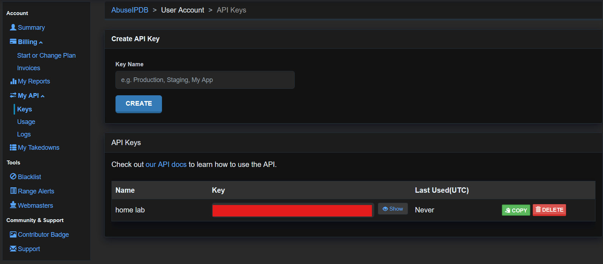
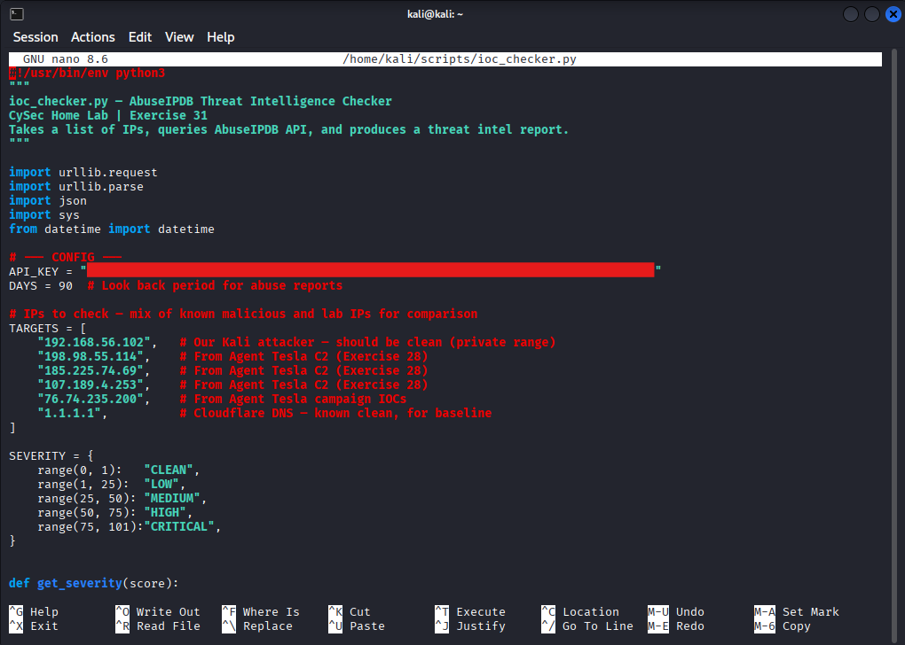
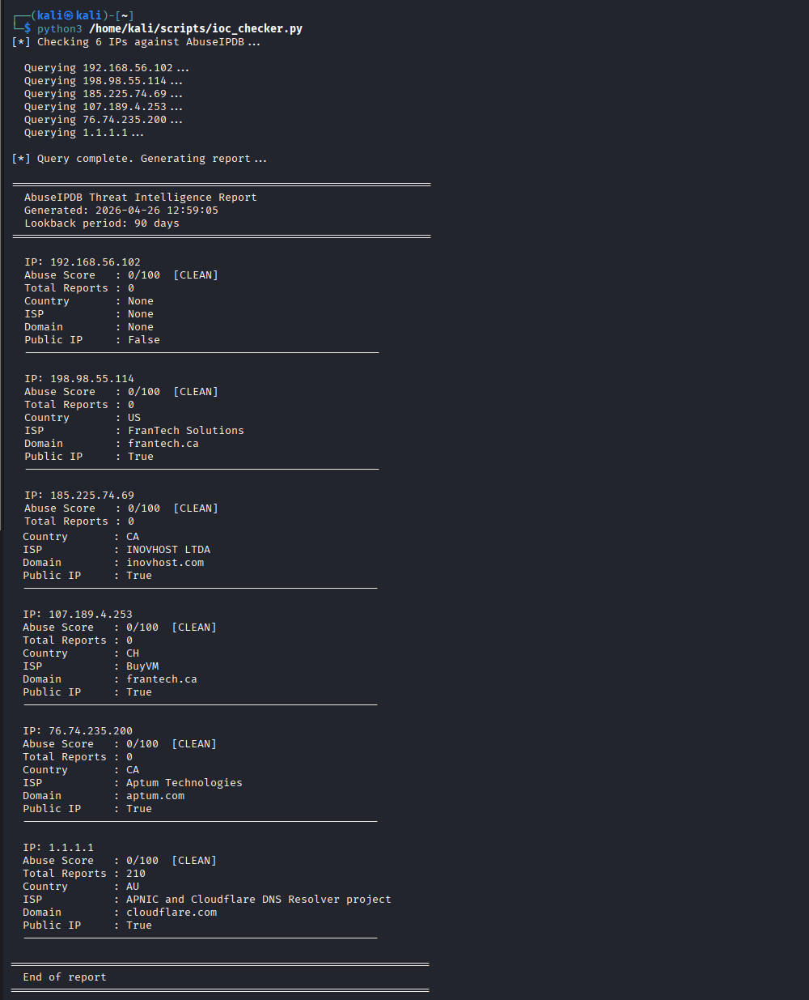

# Exercise 31 — Python IOC Checker: AbuseIPDB Threat Intelligence

**Date:** 26/04/2026
**Category:** SOC Analysis / Security Tooling
**Tools:** Python 3, AbuseIPDB API
**Platform:** Kali Linux — 192.168.56.102
**Internet access:** Required (Kali NAT adapter)

---

## Objective

Build a Python IOC checker that takes a list of IP addresses, queries the AbuseIPDB threat intelligence API, and produces a formatted report showing abuse scores, report counts, ISP attribution, and analyst recommendations. Test the tool against a mix of private lab IPs, known Agent Tesla C2 infrastructure from Exercise 28, and a clean baseline IP — demonstrating how threat intel enrichment fits into a SOC triage workflow.

---

## Background

Threat intelligence enrichment is one of the first steps a SOC analyst performs when triaging an alert. Rather than treating an IP address as an unknown, a quick threat intel lookup answers: has this IP been reported for malicious activity before? By whom? How recently? What type of abuse?

AbuseIPDB is a community-driven threat intel database where security teams report malicious IP addresses. It provides a free API returning an abuse confidence score (0–100), total report count, country, ISP, and domain attribution for any queried IP. SOC analysts use it daily to add context to firewall alerts, IDS detections, and email security events.

This exercise builds on Exercise 30 (log parser) and Exercise 28 (Agent Tesla analysis) — the IOC checker takes the Agent Tesla C2 IPs extracted from the sandbox report and runs them through a real threat intel feed, closing the loop between malware analysis and operational response.

An important real-world lesson emerges from the results: threat intel databases are not complete. A clean score does not confirm an IP is safe — it means the IP has not been reported to AbuseIPDB within the lookback period. This is why SOC analysts always cross-reference multiple intel sources rather than relying on any single feed.

---

## Lab Setup

Only Kali is required for this exercise — pfSense and Metasploitable are not needed. Kali must have internet access via the NAT adapter.

Verify connectivity:

```bash
ping 8.8.8.8
```

If no reply, bring the NAT adapter up:

```bash
echo "nameserver 8.8.8.8" | sudo tee /etc/resolv.conf
sudo ip link set eth1 up && sudo dhclient eth1
```

An AbuseIPDB account is required for API access. The free tier provides 1,000 queries per day — more than sufficient for lab use. Create an account at `https://www.abuseipdb.com`, then navigate to Account → API → Create Key.

### Screenshot — AbuseIPDB Account


---

## Part A — Write the IOC Checker Script

```bash
nano /home/kali/scripts/ioc_checker.py
```

Full script:

```python
#!/usr/bin/env python3
"""
ioc_checker.py — AbuseIPDB Threat Intelligence Checker
CySec Home Lab | Exercise 31
Takes a list of IPs, queries AbuseIPDB API, and produces a threat intel report.
"""

import urllib.request
import urllib.parse
import json
import sys
from datetime import datetime

# --- CONFIG ---
API_KEY = "YOUR_API_KEY_HERE"
DAYS = 90  # Look back period for abuse reports

# IPs to check — mix of lab, known malicious, and clean baseline
TARGETS = [
    "192.168.56.102",   # Kali attacker — private range, no AbuseIPDB data expected
    "198.98.55.114",    # Agent Tesla C2 (Exercise 28)
    "185.225.74.69",    # Agent Tesla C2 (Exercise 28)
    "107.189.4.253",    # Agent Tesla C2 (Exercise 28)
    "76.74.235.200",    # Agent Tesla campaign IOC (Exercise 28)
    "1.1.1.1",          # Cloudflare DNS — known clean baseline
]

SEVERITY = {
    range(0, 1):    "CLEAN",
    range(1, 25):   "LOW",
    range(25, 50):  "MEDIUM",
    range(50, 75):  "HIGH",
    range(75, 101): "CRITICAL",
}


def get_severity(score):
    for r, label in SEVERITY.items():
        if score in r:
            return label
    return "UNKNOWN"


def check_ip(ip, api_key, days=90):
    """Query AbuseIPDB for a single IP address."""
    url = "https://api.abuseipdb.com/api/v2/check"
    params = urllib.parse.urlencode({
        "ipAddress": ip,
        "maxAgeInDays": days,
        "verbose": True
    })
    full_url = f"{url}?{params}"
    req = urllib.request.Request(full_url)
    req.add_header("Key", api_key)
    req.add_header("Accept", "application/json")

    try:
        with urllib.request.urlopen(req, timeout=10) as response:
            return json.loads(response.read().decode())
    except Exception as e:
        return {"error": str(e)}


def print_report(results):
    """Print formatted threat intel report."""
    print("=" * 65)
    print("  AbuseIPDB Threat Intelligence Report")
    print(f"  Generated: {datetime.now().strftime('%Y-%m-%d %H:%M:%S')}")
    print(f"  Lookback period: {DAYS} days")
    print("=" * 65)

    for ip, data in results.items():
        print(f"\n  IP: {ip}")
        if "error" in data:
            print(f"  [ERROR] {data['error']}")
            continue

        d = data.get("data", {})
        score = d.get("abuseConfidenceScore", 0)
        severity = get_severity(score)
        reports = d.get("totalReports", 0)
        country = d.get("countryCode", "N/A")
        isp = d.get("isp", "N/A")
        domain = d.get("domain", "N/A")
        is_public = d.get("isPublic", False)

        print(f"  Abuse Score   : {score}/100  [{severity}]")
        print(f"  Total Reports : {reports}")
        print(f"  Country       : {country}")
        print(f"  ISP           : {isp}")
        print(f"  Domain        : {domain}")
        print(f"  Public IP     : {is_public}")

        if score >= 75:
            print(f"  *** BLOCK RECOMMENDED ***")
        elif score >= 25:
            print(f"  *** INVESTIGATE FURTHER ***")
        print(f"  {'-' * 55}")

    print("\n" + "=" * 65)
    print("  End of report")
    print("=" * 65)


if __name__ == "__main__":
    if API_KEY == "YOUR_API_KEY_HERE":
        print("[ERROR] Add your AbuseIPDB API key to the script first.")
        sys.exit(1)

    print(f"[*] Checking {len(TARGETS)} IPs against AbuseIPDB...\n")
    results = {}
    for ip in TARGETS:
        print(f"  Querying {ip}...")
        results[ip] = check_ip(ip, API_KEY, DAYS)

    print("\n[*] Query complete. Generating report...\n")
    print_report(results)
```

### Screenshot — Script Code


**Key Python components used:**

| Component | Purpose |
|-----------|---------|
| `urllib.request` | Makes HTTP GET requests to the AbuseIPDB API — no external libraries needed |
| `urllib.parse.urlencode` | Encodes query parameters safely for the API URL |
| `json.loads` | Parses the JSON response from AbuseIPDB into a Python dictionary |
| `req.add_header` | Adds the API key and Accept headers required by AbuseIPDB |
| `get_severity()` | Maps a numeric abuse score to a human-readable severity label |
| Safety check | Prevents the script running with a placeholder key — catches a common setup mistake |

---

## Part B — Run the Script

```bash
python3 /home/kali/scripts/ioc_checker.py
```

The script queries all 6 IPs sequentially, then generates the full report.

---

## Part C — Analyse the Results

Full output:

```
[*] Checking 6 IPs against AbuseIPDB...
  Querying 192.168.56.102...
  Querying 198.98.55.114...
  Querying 185.225.74.69...
  Querying 107.189.4.253...
  Querying 76.74.235.200...
  Querying 1.1.1.1...

[*] Query complete. Generating report...

=================================================================
  AbuseIPDB Threat Intelligence Report
  Generated: 2026-04-26 12:59:05
  Lookback period: 90 days
=================================================================

  IP: 192.168.56.102
  Abuse Score   : 0/100  [CLEAN]
  Total Reports : 0
  Country       : None
  ISP           : None
  Domain        : None
  Public IP     : False
  -------------------------------------------------------
  IP: 198.98.55.114
  Abuse Score   : 0/100  [CLEAN]
  Total Reports : 0
  Country       : US
  ISP           : FranTech Solutions
  Domain        : frantech.ca
  Public IP     : True
  -------------------------------------------------------
  IP: 185.225.74.69
  Abuse Score   : 0/100  [CLEAN]
  Total Reports : 0
  Country       : CA
  ISP           : INOVHOST LTDA
  Domain        : inovhost.com
  Public IP     : True
  -------------------------------------------------------
  IP: 107.189.4.253
  Abuse Score   : 0/100  [CLEAN]
  Total Reports : 0
  Country       : CH
  ISP           : BuyVM
  Domain        : frantech.ca
  Public IP     : True
  -------------------------------------------------------
  IP: 76.74.235.200
  Abuse Score   : 0/100  [CLEAN]
  Total Reports : 0
  Country       : CA
  ISP           : Aptum Technologies
  Domain        : aptum.com
  Public IP     : True
  -------------------------------------------------------
  IP: 1.1.1.1
  Abuse Score   : 0/100  [CLEAN]
  Total Reports : 210
  Country       : AU
  ISP           : APNIC and Cloudflare DNS Resolver project
  Domain        : cloudflare.com
  Public IP     : True
  -------------------------------------------------------

=================================================================
  End of report
=================================================================
```

### Screenshot — IOC Checker Output


---

## Part D — Interpreting the Results

The output produces several analytically important findings:

**192.168.56.102 — CLEAN, not public**
Expected. Private RFC 1918 address ranges are not in AbuseIPDB — the database only tracks public internet IPs. `isPublic: False` confirms this. In a real investigation, a private source IP would shift focus to internal threat hunting rather than external intel lookups.

**198.98.55.114, 185.225.74.69, 107.189.4.253, 76.74.235.200 — all CLEAN**
These are confirmed Agent Tesla C2 IPs extracted from the Any.run sandbox report in Exercise 28. Their clean score on AbuseIPDB is a critical real-world lesson: **a clean threat intel score does not mean an IP is safe.** It means the IP has not been reported to AbuseIPDB within the 90-day lookback window. The IPs were identified as malicious through sandbox behavioural analysis — not through reputation feeds.

The ISP attribution is still useful analyst context: FranTech Solutions and BuyVM are bulletproof hosting providers frequently used by threat actors precisely because they resist takedown requests. Seeing these ISPs in connection with C2 infrastructure is itself a contextual red flag, even with a score of 0.

**1.1.1.1 — 210 reports, score 0**
Cloudflare's public DNS resolver has been reported 210 times but carries a score of 0. AbuseIPDB applies whitelisting to well-known legitimate services — mass-reported IPs that are clearly not malicious get their scores suppressed. This demonstrates that report count and abuse score must be read together, not independently.

---

## Attack Chain Summary

```
Agent Tesla C2 IPs extracted from sandbox analysis (Exercise 28)
    → IOCs added to TARGETS list in ioc_checker.py
        → Script queries AbuseIPDB API for each IP
            → JSON response parsed → score, reports, ISP, country extracted
                → Severity label assigned (CLEAN / LOW / MEDIUM / HIGH / CRITICAL)
                    → Formatted threat intel report generated
                        → Analyst conclusion: intel gap identified
                            → Cross-reference with additional sources recommended
```

---

## Real-World Relevance

Threat intelligence enrichment is a standard step in SOC alert triage. Every major SIEM and SOAR platform has AbuseIPDB, VirusTotal, and similar feeds integrated — when an alert fires, the source IP is automatically enriched with reputation data before the analyst even opens the ticket.

Building this enrichment manually in Python demonstrates understanding of how those integrations work under the hood — the same API calls, the same JSON parsing, the same score interpretation logic that runs inside enterprise SOAR platforms like Splunk SOAR, Palo Alto XSOAR, and Tines.

The key analytical lesson from this exercise — that clean scores require cross-referencing with additional sources — is exactly the kind of critical thinking that separates strong SOC analysts from those who treat threat intel as a binary yes/no answer.

---

## Analyst View

From a SOC analyst perspective, the results from this checker represent a completed first-pass enrichment of the Agent Tesla IOC list. The conclusion is not "these IPs are safe" — it is "AbuseIPDB has no record of these IPs, which means we need additional sources."

Next steps in a real investigation would be:
- Query the same IPs against VirusTotal for a second opinion
- Check passive DNS to see what domains have resolved to these IPs historically
- Review firewall and proxy logs for any internal machines that communicated with these IPs
- Submit the IPs to AbuseIPDB as new reports to help the community — responsible disclosure

The ISP context (FranTech, BuyVM — bulletproof hosters) combined with their appearance in a confirmed malware sandbox report is sufficient to treat these IPs as malicious infrastructure regardless of the AbuseIPDB score.

---

## Indicators / IOCs

| IP | Country | ISP | AbuseIPDB Score | Context |
|----|---------|-----|----------------|---------|
| 198.98.55.114 | US | FranTech Solutions | 0/100 | Agent Tesla C2 — confirmed via sandbox |
| 185.225.74.69 | CA | INOVHOST LTDA | 0/100 | Agent Tesla C2 — confirmed via sandbox |
| 107.189.4.253 | CH | BuyVM / FranTech | 0/100 | Agent Tesla C2 — confirmed via sandbox |
| 76.74.235.200 | CA | Aptum Technologies | 0/100 | Agent Tesla campaign IOC |

---

## Escalation / Remediation

In a real SOC response using this tool's output:

1. **Block at perimeter:** Add all four Agent Tesla C2 IPs to the firewall blocklist regardless of AbuseIPDB score — sandbox confirmation is sufficient justification.
2. **Submit to AbuseIPDB:** Report all four IPs via the AbuseIPDB submission API. This contributes to the community database and may help other organisations detect the same infrastructure.
3. **Expand intel lookup:** Query the same IPs against VirusTotal, Shodan, and passive DNS platforms. Shodan in particular may reveal what services are running on these IPs and whether they are active C2 servers.
4. **Internal sweep:** Search firewall and proxy logs for any internal endpoints that communicated with these IPs. If found, those machines should be treated as potentially compromised.
5. **Automate enrichment:** Integrate this script into the alert triage workflow — when a firewall alert fires on an unknown external IP, run it through the IOC checker automatically as part of the first-pass triage.

---

## Recommendation

- **Never treat a clean AbuseIPDB score as confirmation an IP is safe.** Threat intel databases are reactive — they only know about IPs that have been reported. New or recently rotated C2 infrastructure will always appear clean on reputation feeds.
- **Use ISP attribution as a contextual signal.** Bulletproof hosting providers (FranTech, BuyVM, Shinjiru) appear disproportionately in malicious infrastructure. An unknown IP hosted with a bulletproof provider warrants additional scrutiny even with a clean score.
- **Cross-reference multiple intel sources.** AbuseIPDB, VirusTotal, Shodan, and passive DNS each see different slices of the threat landscape. A complete enrichment workflow queries all of them.
- **Submit new IOCs back to the community.** When sandbox analysis or incident investigation surfaces new malicious IPs, submitting them to AbuseIPDB and VirusTotal helps other defenders — this is standard practice in the security community.
- **Extend the script with additional APIs.** The same urllib pattern used here works for VirusTotal, Shodan, and AlienVault OTX — adding a second or third intel source to the output would make this a more complete triage tool.
