# Exercise 35 — Phishing Email Analysis: Header Forensics & IOC Extraction

**Date:** 09/05/2026
**Category:** SOC Analysis / Threat Intelligence
**Tools:** MXToolbox, cat, WhoIsDomain
**Attacker:** Multiple threat actors
**Target:** Personal inbox (job application context)

---

## Objective

Analyse four phishing email samples using raw header forensics and
authentication checks. Identify IOCs across three distinct attack techniques:
classic domain spoofing, legitimate platform abuse, and callback phishing
delivered via compromised business infrastructure. Demonstrate why technical
authentication checks alone are insufficient for phishing detection.

---

## Background

Email authentication protocols — SPF, DKIM, and DMARC — were designed to
verify that a sending server is authorised to send on behalf of a domain.
When all three pass, most email gateways treat the message as legitimate.
Attackers have adapted by abusing legitimate platforms (Xero, Google
AppSheet, Mailgun) whose infrastructure passes all checks by design.

This exercise analyses four samples across three attack categories:

- **Classic spoofing** — fake domain, all auth fails (GitHub/Leroy Merlin sample)
- **Platform abuse** — legitimate Xero invoice API abused by a single threat
  actor to impersonate two separate recruitment agencies (Adecco, Hays)
- **Free-tier abuse** — Google's own AppSheet platform used to send fake
  Google HR outreach, passing all Google authentication checks

The Adecco and Hays samples were received personally during a job search
and are real-world examples of callback phishing — a technique where the
email itself contains no malware, instead directing victims toward a
meeting link where social engineering and malware delivery occur later.

---

## Lab Setup

Three `.eml` files downloaded from Gmail and transferred to Kali via shared
folder. GitHub sample pulled directly from the phishing_pot repository.
Headers extracted using `cat` and analysed via MXToolbox Email Header Analyzer.

### Screenshot — EML Files on Kali

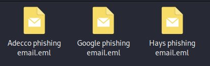

---

## Part A — Classic Domain Spoofing: Leroy Merlin (GitHub Sample)

**Source:** https://github.com/rf-peixoto/phishing_pot

This sample represents the most technically detectable form of phishing.
The attacker registered a lookalike domain (`ml.tv-news.fr`) and sent email
claiming to be Leroy Merlin — a French home improvement retailer. No
authentication infrastructure was configured on the sending domain, making
the fraud immediately visible at the header level.

### Screenshot — GitHub Sample and Raw Headers

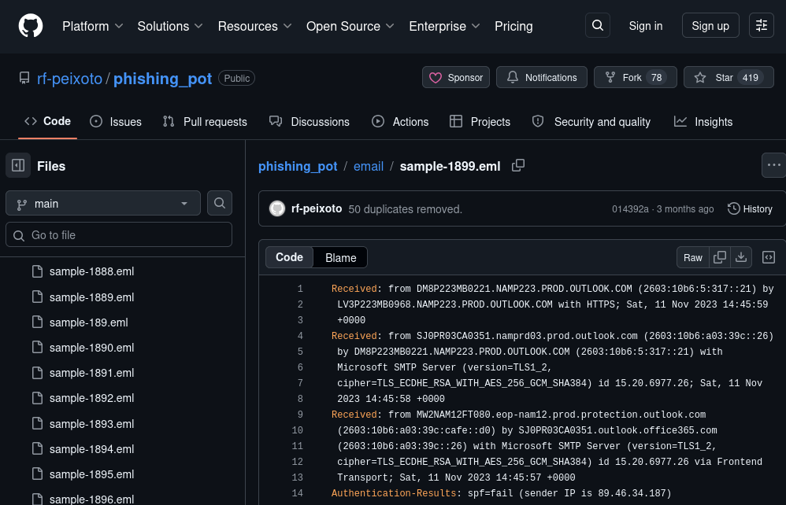

Key header findings extracted via `cat`:

```
From:        programme_tv@ml.tv-news.fr  (claims Leroy Merlin)
Sender IP:   89.46.34.187
HELO:        opuafauvct.pmaixspmorme.ptq
SPF:         FAIL — 89.46.34.187 not authorised by ml.tv-news.fr
DKIM:        none (message not signed)
DMARC:       none
SCL:         9 (Microsoft spam confidence — maximum)
```

| Field | Value | Significance |
|-------|-------|--------------|
| HELO hostname | `opuafauvct.pmaixspmorme.ptq` | Gibberish — no legitimate server uses this |
| SPF result | FAIL | Sending IP not in domain's authorised list |
| DKIM | None | Domain has no signing key configured |
| SCL: 9 | Maximum spam score | Microsoft's filter flagged this immediately |
| Tracking pixel | `stabrino.info/op/...` | Confirms email open to attacker |

### Screenshot — MXToolbox: GitHub Sample (All Auth Failed)

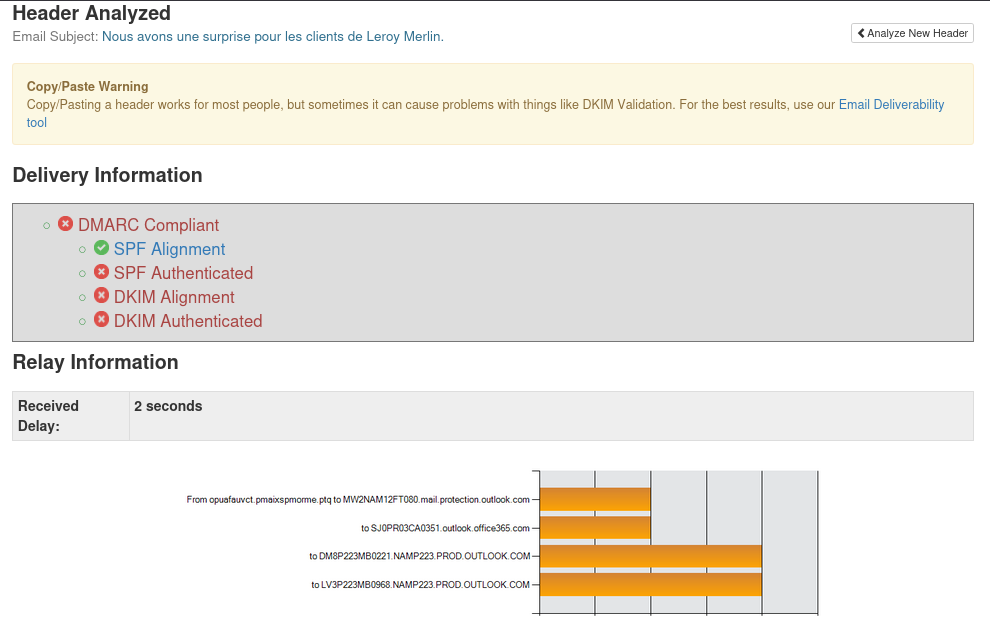

The stabrino.info domain was additionally checked on WhoIsDomain and showed
29 IP address changes over three years — a pattern consistent with bulletproof
hosting, where operators rapidly rotate infrastructure to evade blocklists.

### Screenshot — stabrino.info IP Rotation History

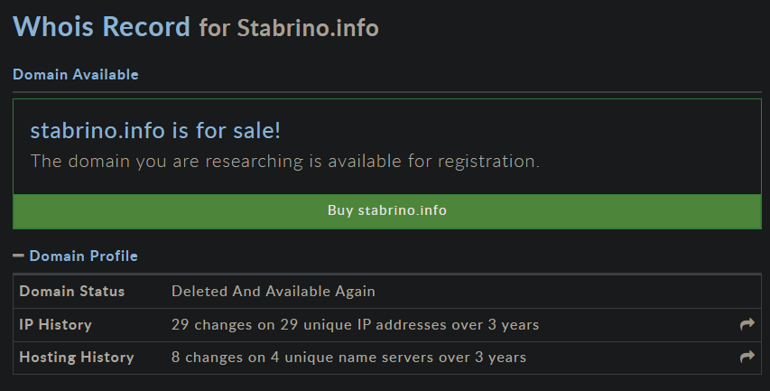

### Screenshot — GitHub Sample IOCs

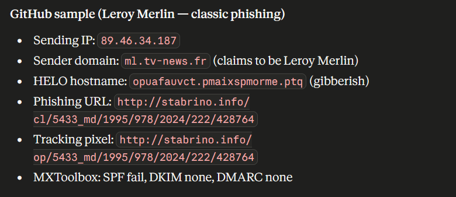

---

## Part B — Callback Phishing via Xero Platform Abuse: Adecco

**Received:** January 2026, during active job search

This email passed all authentication checks because it was genuinely sent
through Xero's legitimate invoice messaging infrastructure. The threat actor
registered a Xero account and used its API — intended for sending invoices —
to deliver phishing at scale to job seekers. The email appears to come from
Adecco but the real IOCs are hidden in the headers.

### Screenshot — Adecco Raw Headers (Email Redacted)

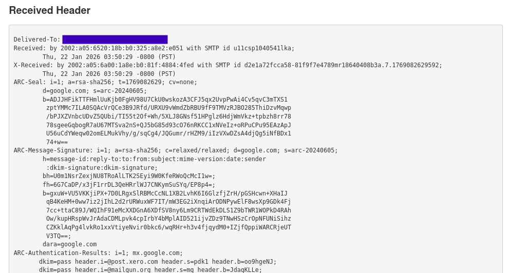

Key header findings:

```
From (display):  Adecco Careers
From (actual):   messaging-service@post.xero.com
Reply-To:        support@mail.dawfgawdawd.ladesk.com
Sending IP:      198.244.57.62
Mailgun pool:    High Risk Pool
xero-clientId:   77
Meeting link:    calendly.appointments-talent.com (NOT calendly.com)
```

| Field | Value | Significance |
|-------|-------|--------------|
| Actual sender | `post.xero.com` | Xero invoice API — not Adecco infrastructure |
| Reply-To | `dawfgawdawd.ladesk.com` | Gibberish throwaway domain |
| Mailgun pool | High Risk Pool | Mailgun's own system flagged this account |
| Meeting URL | `appointments-talent.com` | Typosquatting Calendly's brand |
| xero-clientId | 77 | Links this account to the Hays sample |

### Screenshot — MXToolbox: Adecco (All Auth Passed)

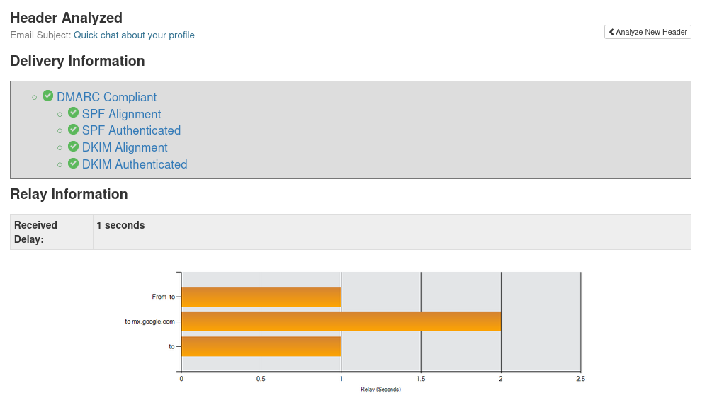

All authentication passes — because the email genuinely did come from Xero's
servers. This is the core teaching point: a clean auth result does not mean
a clean email.

### Screenshot — Adecco IOCs

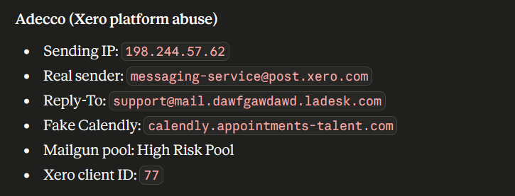

---

## Part C — Same Threat Actor: Hays Recruitment

**Received:** December 2025, during active job search

Cross-referencing the Adecco and Hays headers reveals they originated from
the same threat actor using the same Xero account. Three fields are
identical across both emails: sending IP, sender address, and Xero client ID.

### Screenshot — Hays Raw Headers (Email Redacted)

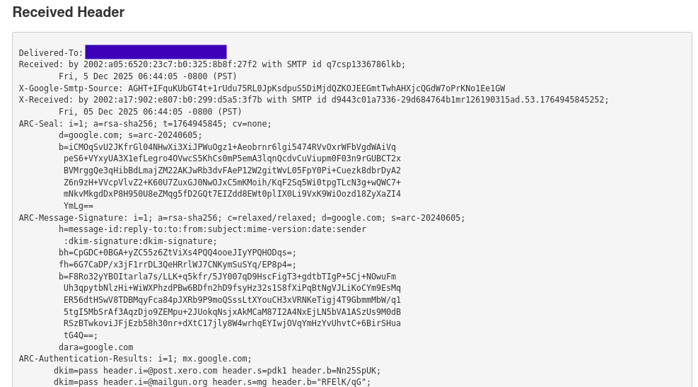

```
From (display):  Hays Recruitment (Unicode-obfuscated display name)
From (actual):   messaging-service@post.xero.com   ← identical to Adecco
Sending IP:      198.244.57.62                     ← identical to Adecco
xero-clientId:   77                                ← identical to Adecco
Reply-To:        details.meeting@haysremotestaffing.com
Meeting link:    jobs-schedule.com/id-320632014/schedule
```

The display name uses Unicode diacritic characters to visually mimic normal
text while evading simple string-matching detection rules. The meeting links
in both emails point to attacker-controlled domains designed to resemble
legitimate scheduling platforms.

| Attribute | Adecco | Hays | Conclusion |
|-----------|--------|------|------------|
| Sending IP | 198.244.57.62 | 198.244.57.62 | Same server |
| Sender | messaging-service@post.xero.com | messaging-service@post.xero.com | Same account |
| Xero client ID | 77 | 77 | Same Xero subscription |
| Mailgun pool | High Risk Pool | High Risk Pool | Same flagged account |

### Screenshot — MXToolbox: Hays (All Auth Passed)


### Screenshot — Hays IOCs

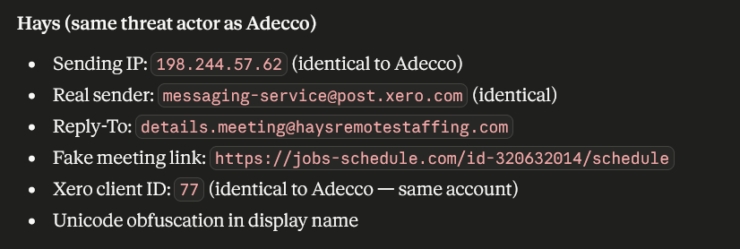

---

## Part D — Free-Tier Google Service Abuse: Fake Google HR

**Received:** March 2026, during active job search

The most technically sophisticated sample. The attacker created a free
Google AppSheet account and used it to send email claiming to be Google's
own HR team. Because AppSheet is a Google product, the email originates
from Google's mail infrastructure and passes all Google authentication checks.

### Screenshot — Google Raw Headers (Email Redacted)

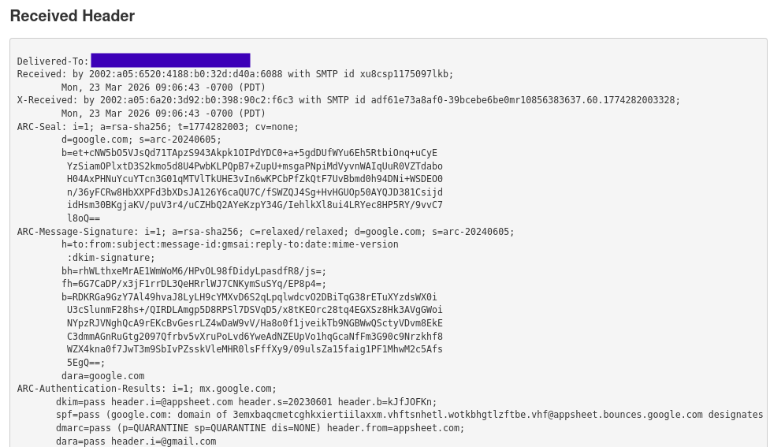

```
From (display):  GG Ads | Team HR
From (actual):   noreply@appsheet.com
Reply-To:        noreply@appsheet.com
DKIM:            pass (appsheet.com)
DMARC:           pass (p=QUARANTINE)
SPF alignment:   FAIL (envelope sender differs from From domain)
Meeting button:  go2.noithatgolam.com (Vietnamese furniture website redirect)
Logo image:      benchmarkemail.com (third-party email platform)
```

| Field | Value | Significance |
|-------|-------|--------------|
| Sender | `noreply@appsheet.com` | Genuine Google infrastructure |
| SPF alignment | FAIL | Envelope sender is bounces.google.com not appsheet.com |
| Meeting link | `noithatgolam.com` | Vietnamese furniture site used as redirect |
| Logo host | `benchmarkemail.com` | Third-party platform — not Google's own CDN |
| Team name | `GG Ads | Team HR` | Not a real Google team name |

The SPF alignment failure is the only technical indicator here. Everything
else passes because the email was genuinely sent by Google's own systems.

### Screenshot — MXToolbox: Google (SPF Alignment Failed)

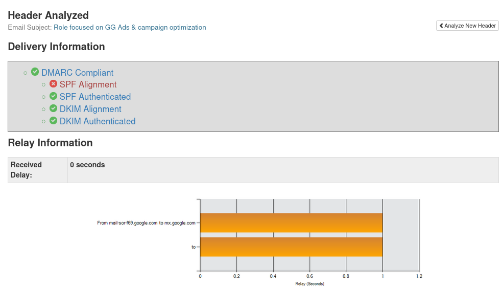

### Screenshot — Google Sample IOCs

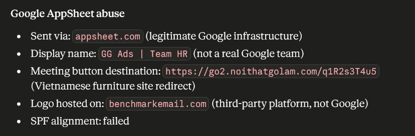

---

## Attack Chain Summary

```
Classic spoofing (Leroy Merlin)
    → Fake domain ml.tv-news.fr → SPF/DKIM/DMARC all fail
        → Immediately detectable at gateway level

Platform abuse (Adecco + Hays — same actor)
    → Xero invoice API abused → all auth passes
        → IOCs only visible in Reply-To, meeting URLs, and Mailgun pool flag
            → Callback phishing: meeting link → social engineering → malware

Free-tier abuse (fake Google HR)
    → AppSheet free account → sent from Google infrastructure
        → All auth passes except SPF alignment
            → Redirect through Vietnamese furniture site → unknown payload
```

---

## Real-World Relevance

Callback phishing via legitimate platform abuse is one of the fastest-growing
attack vectors in 2025-2026. Groups like Luna Moth and STRT have used this
technique at scale, targeting professionals through fake recruitment, IT
support, and invoice emails. The attraction for attackers is clear: clean
authentication results bypass most email gateway rules, and no malicious
attachment or URL needs to be included in the initial email — meaning
sandboxes and URL scanners find nothing to flag.

In a SOC context, detecting this class of attack requires behavioural rules
rather than purely technical ones: Reply-To domain mismatch, meeting link
domain age, display name Unicode anomalies, and correlation across multiple
received samples from the same sending infrastructure.

---

## Analyst View

A SOC analyst reviewing these samples would triage them into two buckets.
The Leroy Merlin sample is a straightforward escalation — failed auth,
gibberish HELO, known bulletproof hosting IP. The three job-search samples
require deeper analysis. The Adecco and Hays emails are the most
operationally interesting: identical infrastructure across two supposedly
unrelated organisations is a high-confidence indicator of a single threat
actor campaign. The Google sample is the hardest to catch automatically —
the SPF alignment failure is the only technical hook, and many organisations
do not alert on SPF alignment failures alone when DKIM and DMARC pass.

---

## Indicators / IOCs

| Indicator | Type | Value | Severity |
|-----------|------|-------|----------|
| Sender domain | Domain | `ml.tv-news.fr` | High |
| Sending IP (Leroy Merlin) | IP | `89.46.34.187` | High |
| HELO hostname | String | `opuafauvct.pmaixspmorme.ptq` | High |
| Phishing URL | URL | `stabrino.info/cl/...` | High |
| Tracking pixel | URL | `stabrino.info/op/...` | Medium |
| Bulletproof hosting | Behaviour | 29 IP rotations / 3 years | High |
| Shared sending IP (Adecco+Hays) | IP | `198.244.57.62` | High |
| Shared Xero account | ID | `xero-clientId: 77` | High |
| Mailgun classification | String | High Risk Pool | High |
| Reply-To mismatch (Adecco) | Domain | `dawfgawdawd.ladesk.com` | High |
| Fake Calendly domain | Domain | `calendly.appointments-talent.com` | High |
| Reply-To mismatch (Hays) | Domain | `haysremotestaffing.com` | Medium |
| Fake meeting domain (Hays) | Domain | `jobs-schedule.com` | High |
| Unicode display name | String | Diacritic-obfuscated Hays name | Medium |
| Redirect domain (Google) | Domain | `go2.noithatgolam.com` | High |
| SPF alignment failure | Auth | AppSheet envelope/From mismatch | Medium |
| Third-party logo host | Domain | `benchmarkemail.com` | Low |

---

## Escalation / Remediation

1. **Leroy Merlin sample**: Block sending IP `89.46.34.187` and domain
   `ml.tv-news.fr` at the email gateway. Report `stabrino.info` to the
   hosting provider abuse desk.
2. **Adecco/Hays campaign**: Report Xero client ID `77` to Xero's abuse
   team — the account is sending phishing at scale from their platform.
   Block `198.244.57.62` and both meeting domains. Flag as coordinated
   campaign — same actor, multiple brand impersonations.
3. **Google AppSheet sample**: Report to Google via
   https://support.google.com/appsheet/contact. Block `noithatgolam.com`
   redirect domain. Alert on SPF alignment failures where DKIM/DMARC pass
   and Reply-To differs from From.
4. **User awareness**: All three callback phishing samples would pass most
   technical filters. Train users to verify recruiter identity independently
   before clicking any meeting link — call the agency directly using a
   number from their official website.

---

## Recommendation

- **Authentication passing does not mean safe** — this exercise demonstrates
  that all three real-world samples pass most or all technical checks.
  Behavioural analysis is required alongside protocol validation.
- **Reply-To mismatch is a high-value detection rule** — legitimate
  organisations almost never set Reply-To to a different domain than their
  From address. This single rule would have flagged both Adecco and Hays.
- **Shared infrastructure across supposedly unrelated senders** is a strong
  campaign indicator — correlating sending IPs and account IDs across
  multiple received emails is a technique that pays off in SOC investigations.
- **Bulletproof hosting behaviour** (rapid IP rotation, unresolvable domains)
  is an IOC in itself, even when the URL content is no longer accessible.
- **Free-tier service abuse** is an emerging blind spot — attacker emails
  sent from Google, Microsoft, or AWS infrastructure will always pass
  authentication. Detection must shift to content and behavioural signals.
