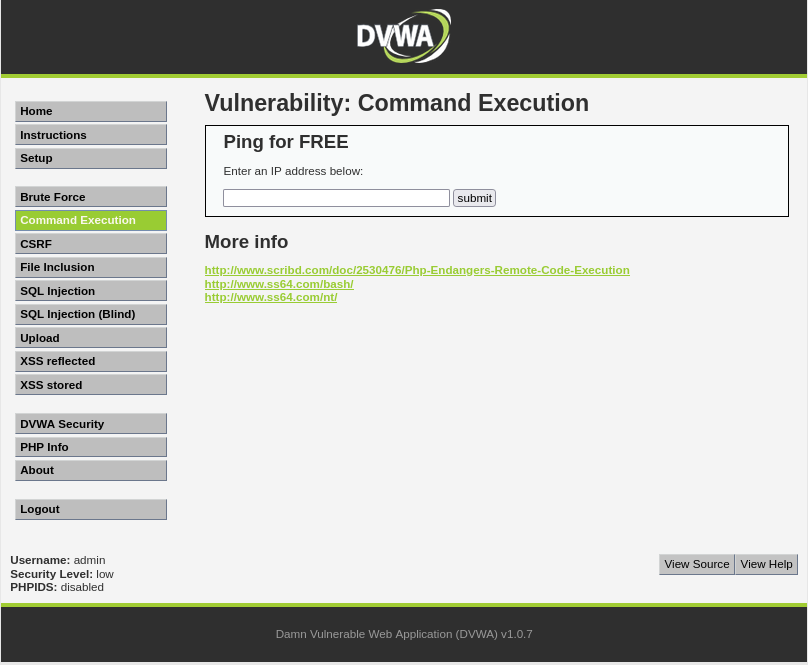
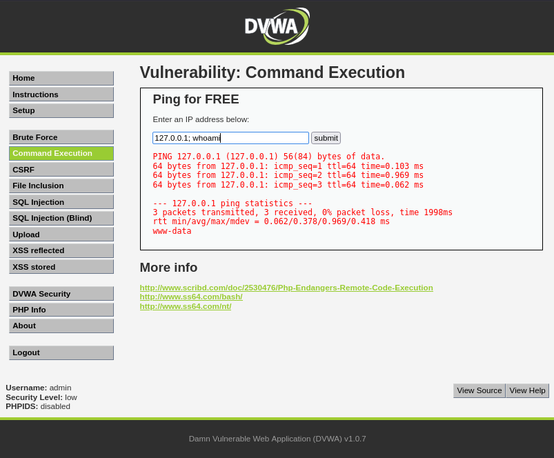
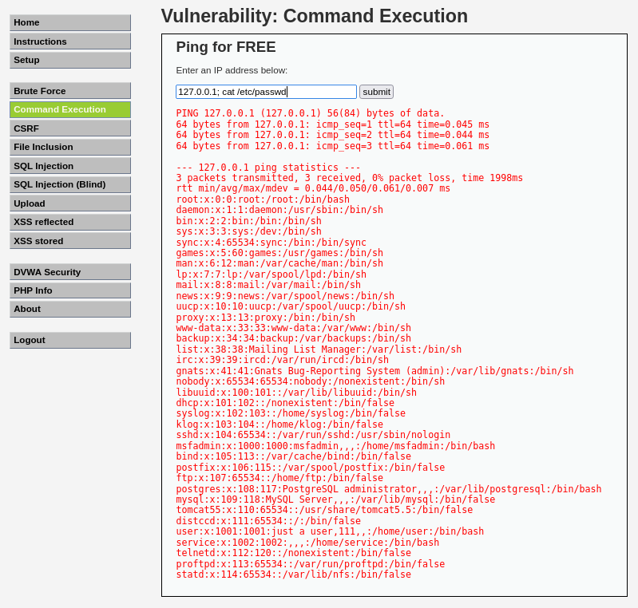
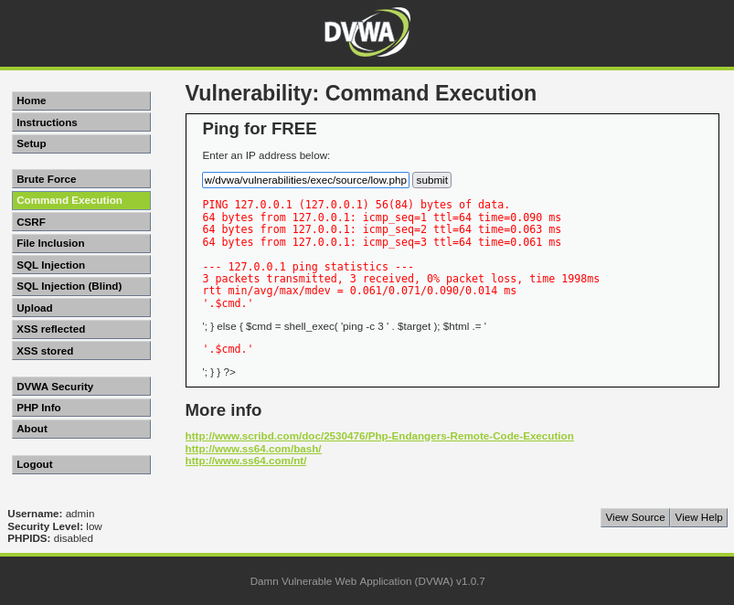

# Exercise 17 — Command Injection Attack (DVWA)

**Date:** 28/03/2026
**Category:** Web Attacks
**Tools:** DVWA, Firefox
**Attacker:** Kali Linux — 192.168.56.102
**Firewall:** pfSense — WAN 192.168.56.104 / LAN 192.168.1.1
**Target:** Metasploitable2 — 192.168.1.100 (DVWA on port 80)

---

## Objective
Exploit a command injection vulnerability in DVWA to execute arbitrary
operating system commands through a web form, escalating from a simple
ping utility to full system reconnaissance — demonstrating how
unsanitised user input in web applications can lead to complete server
compromise.

---

## Background
Command injection occurs when a web application passes user-supplied
input directly to a system shell without sanitisation. Unlike SQL
injection which targets the database layer, command injection targets
the operating system itself — giving the attacker direct access to the
underlying server.

This is listed under **OWASP Top 10 A03:2021 — Injection**, the same
category as SQL injection. It is consistently found in real-world
applications wherever user input is used to construct shell commands —
ping utilities, DNS lookups, file conversion tools, and network
diagnostic pages are common targets.

The impact is severe: a successful command injection gives the attacker
the ability to read files, dump credentials, establish reverse shells,
and pivot to other systems on the network.

---

## Lab Setup

All three VMs started in the correct boot order and routes applied:
```bash
# On Kali
sudo ip route add 192.168.1.0/24 via 192.168.56.104

# On Metasploitable
sudo route add default gw 192.168.1.1
```

DVWA accessed via Firefox at `http://192.168.1.100/dvwa`. Logged in
with `admin:password`. Security level set to **Low** to demonstrate
unsanitised input handling.

### Screenshot — Lab Setup: All VMs Running


---

## Part A — Identifying the Injection Point

The DVWA Command Execution module presents a simple ping utility — the
user enters an IP address and the server pings it. At security level
Low, the input is passed directly to the OS shell with no filtering.

### Screenshot — DVWA Command Execution Page


The vulnerability was tested by appending a second command using the
`;` separator:
```
127.0.0.1; whoami
```

**How it works:** The `;` character terminates the ping command and
instructs the shell to execute the next command. The server processes:
```bash
ping -c 3 127.0.0.1; whoami
```

Instead of the intended:
```bash
ping -c 3 127.0.0.1
```

**Result:** The ping completed normally and `www-data` was returned —
confirming OS command execution as the web server user.

### Screenshot — whoami Confirms Command Execution as www-data


---

## Part B — System Reconnaissance via Injection

With command execution confirmed, the injection was used to extract
sensitive system information. The `/etc/passwd` file was read directly
through the web form:
```
127.0.0.1; cat /etc/passwd
```

**Result:** Full `/etc/passwd` dump returned in the browser — all 35
system accounts exposed including `root`, `msfadmin`, `postgres`,
`mysql`, and `user`. This file reveals every account on the system,
their home directories, and their default shells.

### Screenshot — /etc/passwd Dumped via Command Injection


---

## Part C — Source Code Analysis

The vulnerable PHP source code was read directly from the server to
confirm the root cause of the vulnerability:
```
127.0.0.1; cat /var/www/dvwa/vulnerabilities/exec/source/low.php
```

**Result:** The source code confirmed that user input (`$target`) is
passed directly into `shell_exec()` with zero sanitisation:
```php
$cmd = shell_exec('ping -c 3 ' . $target);
```

There is no input validation, no character filtering, and no
allowlisting of expected input. Any character — including `;`, `|`,
`&&`, and backticks — is passed straight to the shell.

### Screenshot — Vulnerable PHP Source Code Retrieved


---

## Attack Chain Summary
```
Web form accepts unsanitised user input
    → Semicolon terminates ping command
        → Arbitrary OS command appended and executed as www-data
            → /etc/passwd read — all 35 system accounts exposed
                → Source code retrieved — root cause confirmed
                    → Full server filesystem accessible via web browser
```

---

## Real-World Relevance

**Command injection is consistently in the OWASP Top 10** because it
appears repeatedly in real applications wherever developers use shell
commands to process user input. Network diagnostic tools, file
processors, and reporting utilities are frequent culprits.

**The impact goes beyond file reading.** With command injection
established, an attacker can download malware, establish a reverse
shell, read `/etc/shadow` for offline password cracking, or pivot to
internal network targets. The `www-data` user in this exercise has
read access to the entire web application including configuration
files containing database credentials.

**Web application firewalls detect this pattern.** The `;` and `|`
characters in a form field that expects only an IP address are
immediately suspicious. Modern WAFs flag and block these payloads
automatically — but only if deployed and correctly configured.

**Source code exposure is a compounding vulnerability.** Being able
to read the application's own PHP source through command injection
reveals the exact logic of every other function — accelerating the
discovery of additional vulnerabilities elsewhere in the application.

---

## Recommendation
- Never pass user input directly to shell functions — use language
  built-in alternatives where possible (e.g. PHP's `exec()` with
  `escapeshellarg()` wrapping all user-supplied values)
- Implement strict input validation — a ping utility should only
  accept valid IPv4 or IPv6 addresses. Reject anything else at the
  application layer before it reaches the shell
- Apply the principle of least privilege to web server processes —
  `www-data` should not have read access to `/etc/passwd` or
  application source files outside the web root
- Deploy a Web Application Firewall configured to detect and block
  shell metacharacters (`;`, `|`, `&&`, backticks) in form inputs
- Conduct regular web application penetration testing — command
  injection is reliably discovered through both manual testing and
  automated scanners like Nikto or Burp Suite
  
