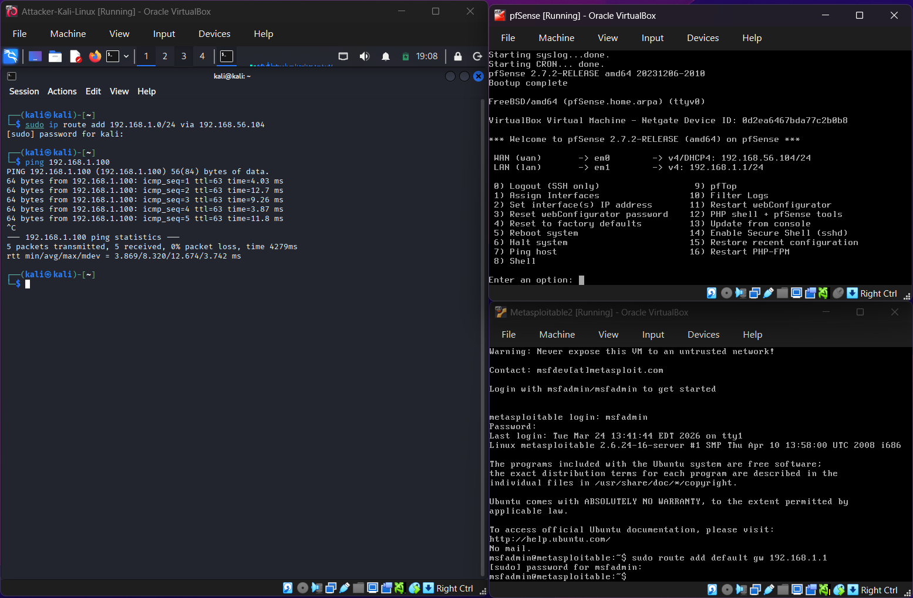
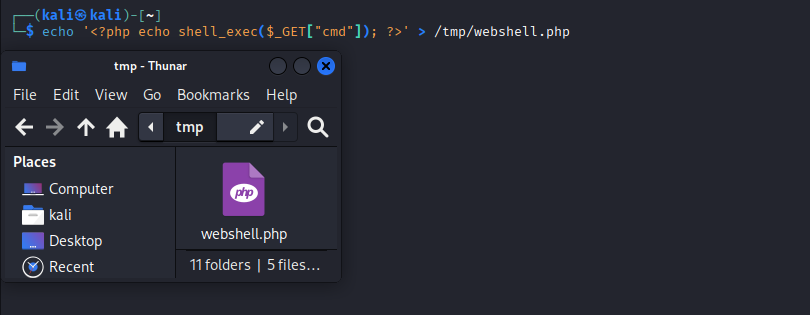
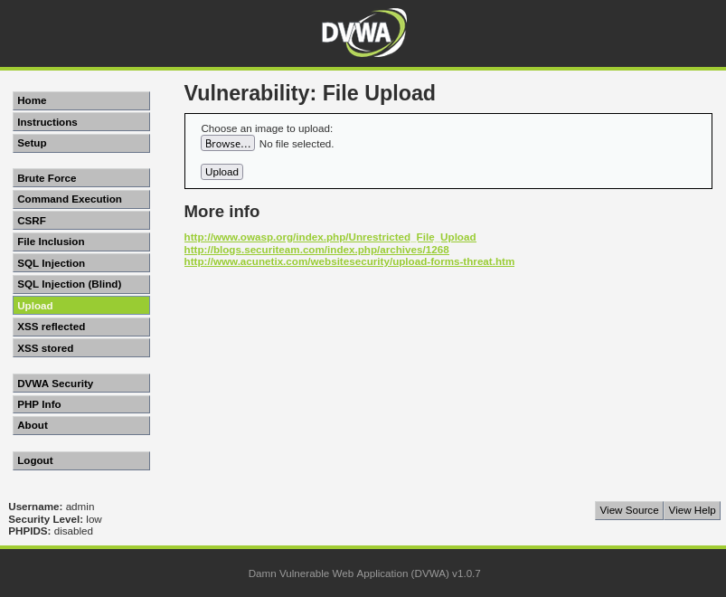
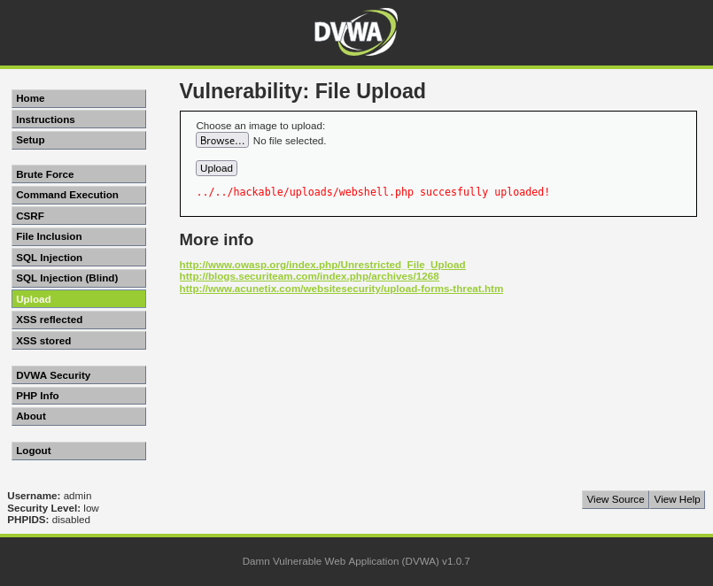
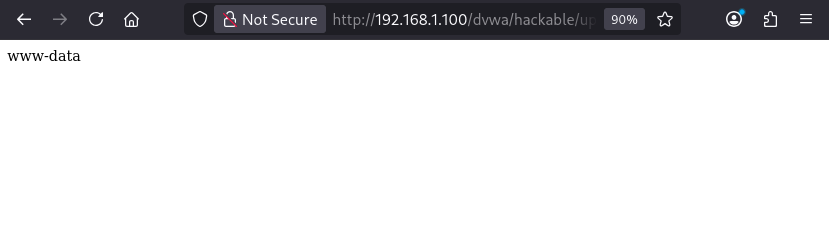
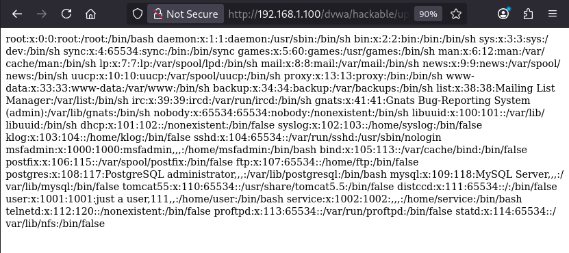

# Exercise 18 — File Upload Attack & PHP Webshell (DVWA)

**Date:** 28/03/2026
**Category:** Web Attacks
**Tools:** DVWA, Firefox
**Attacker:** Kali Linux — 192.168.56.102
**Firewall:** pfSense — WAN 192.168.56.104 / LAN 192.168.1.1
**Target:** Metasploitable2 — 192.168.1.100 (DVWA on port 80)

---

## Objective
Upload a malicious PHP webshell through DVWA's unrestricted file upload
functionality, then execute arbitrary OS commands via the browser by
accessing the uploaded file directly — demonstrating how insecure file
upload handling leads to full Remote Code Execution (RCE) on the server.

---

## Background
Unrestricted file upload is listed under **OWASP Top 10 A04:2021 —
Insecure Design** and is one of the most severe web vulnerabilities an
attacker can find. When a web application allows users to upload files
without validating the file type, an attacker can upload executable
code — in this case a PHP webshell — and trigger it through the browser.

A **webshell** is a script uploaded to a web server that provides the
attacker with a persistent, browser-accessible interface to execute OS
commands. Unlike a reverse shell which requires a listener, a webshell
is always available as long as the file remains on the server and the
web server can execute it.

This technique is used in real-world attacks to establish persistent
access after initial exploitation — the webshell survives reboots and
session timeouts, making it a reliable foothold on the compromised server.

---

## Lab Setup

VMs running from the previous exercise (Exercise 17). Routes already
applied. DVWA accessed at `http://192.168.1.100/dvwa`, security level
set to **Low**.

### Screenshot — Lab Setup: All VMs Running


---

## Part A — Creating the PHP Webshell

A minimal PHP webshell was created on Kali. The file accepts a `cmd`
parameter from the URL and passes it directly to `shell_exec()`,
returning the output to the browser:
```bash
echo '' > /tmp/webshell.php
```

**How it works:** When the file is accessed via browser with a `cmd`
parameter — e.g. `?cmd=whoami` — PHP executes the value as an OS
command and prints the output. This gives full command execution
through a simple HTTP GET request.

### Screenshot — Webshell Created on Kali


---

## Part B — Uploading the Webshell via DVWA

The DVWA File Upload module presents a standard file upload form with
no server-side validation of file type or content at security level Low.

### Screenshot — DVWA File Upload Page


The `webshell.php` file was uploaded from `/tmp/webshell.php`.

**Result:**
```
../../hackable/uploads/webshell.php successfully uploaded!
```

The server confirms the upload path — `hackable/uploads/` — which is
directly accessible via the browser. No filtering, no extension
blocking, no content inspection.

### Screenshot — Webshell Successfully Uploaded


---

## Part C — Remote Code Execution via Webshell

With the webshell uploaded to a known path, it was accessed directly
via Firefox to execute OS commands:
```
http://192.168.1.100/dvwa/hackable/uploads/webshell.php?cmd=whoami
```

**How the URL works:**

| Component | Meaning |
|---|---|
| `/dvwa/hackable/uploads/webshell.php` | Path to the uploaded file |
| `?cmd=whoami` | GET parameter passed to `shell_exec()` |

**Result:** `www-data` returned in the browser — confirming the PHP
file was executed by the web server and OS commands are running as
the web server user.

### Screenshot — RCE Confirmed via Browser


---

## Part D — System Reconnaissance via Webshell

With RCE established, the webshell was used to dump system credentials:
```
http://192.168.1.100/dvwa/hackable/uploads/webshell.php?cmd=cat+/etc/passwd
```

**Note:** Spaces in URL parameters are encoded as `+` or `%20` —
`cat+/etc/passwd` is equivalent to `cat /etc/passwd` in the shell.

**Result:** Full `/etc/passwd` contents returned in the browser —
all 35 system accounts exposed, identical to the command injection
result in Exercise 17 but achieved through an entirely different
attack vector.

### Screenshot — /etc/passwd Dumped via Webshell


---

## Attack Chain Summary
```
Insecure file upload — no extension or content validation
    → PHP webshell uploaded to publicly accessible directory
        → Webshell accessed via browser with cmd parameter
            → OS commands execute as www-data
                → /etc/passwd dumped — all system accounts exposed
                    → Persistent RCE established — webshell survives reboots
```

---

## Real-World Relevance

**File upload vulnerabilities appear constantly in real-world
assessments.** Content management systems, profile picture uploaders,
document submission forms, and support ticket attachments are all
frequent targets. Any feature that accepts user-uploaded files is a
potential attack surface.

**Webshells are a staple of real intrusions.** Major threat actors
including APT groups and ransomware operators routinely deploy webshells
after initial access to maintain persistence. CISA and the NSA have
published joint advisories specifically about webshell detection and
remediation — reflecting how common this technique is in real attacks.

**The attack is entirely browser-based.** No Metasploit, no special
tools, no listener required — just a text file and a browser. This
makes it accessible to low-skilled attackers and difficult to attribute.

**Combining with Exercise 17:** Both command injection and file upload
achieved the same outcome — OS command execution as `www-data` and
`/etc/passwd` exposure. This demonstrates a key SOC principle: the
same impact can be reached via multiple attack paths. Defenders must
address both vectors independently.

**MITRE ATT&CK T1505.003** — Server Software Component: Web Shell,
is documented as a technique used by over 30 tracked threat groups
in real-world campaigns.

---

## Recommendation
- Validate file type server-side using a strict allowlist of permitted
  extensions — never rely on client-side validation alone
- Validate file content using magic bytes, not just the extension —
  a PHP file renamed to `.jpg` still executes if the server is
  misconfigured
- Store uploaded files outside the web root so they cannot be
  executed directly via browser — serve them through a controller
  that strips executable permissions
- Disable PHP execution in upload directories using `.htaccess` or
  server configuration — even if a PHP file is uploaded it cannot run
- Rename uploaded files to a random string on the server — prevents
  attackers from knowing the path to their uploaded file
- Implement a Web Application Firewall to detect and alert on
  webshell signatures in uploaded content
- Monitor upload directories for new `.php`, `.asp`, `.jsp` files —
  legitimate applications rarely need to store executable scripts
  in upload folders
  
