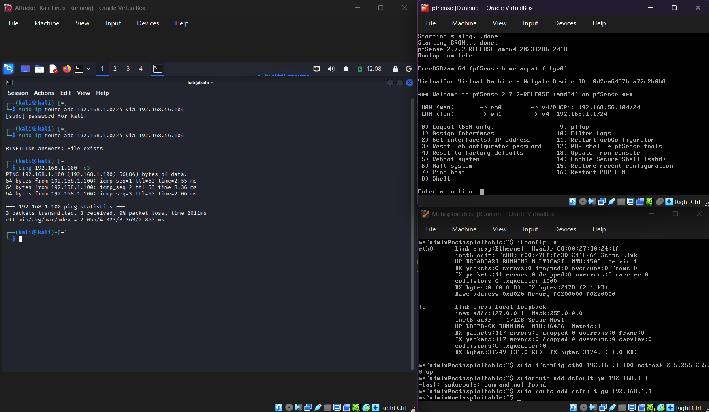
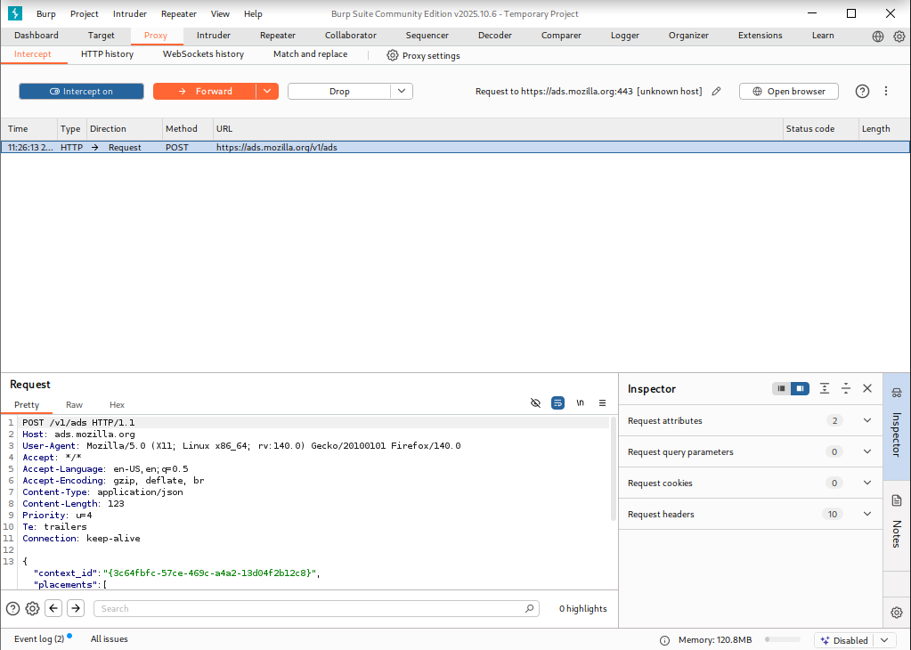
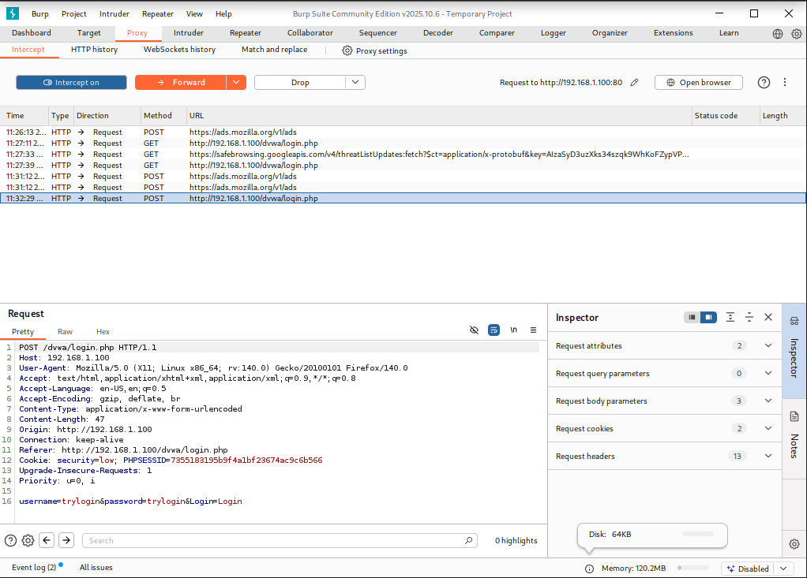
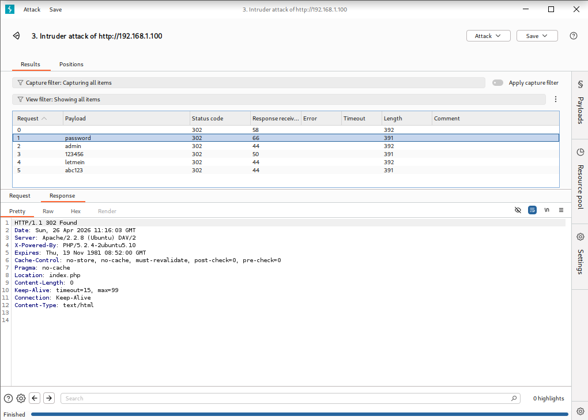
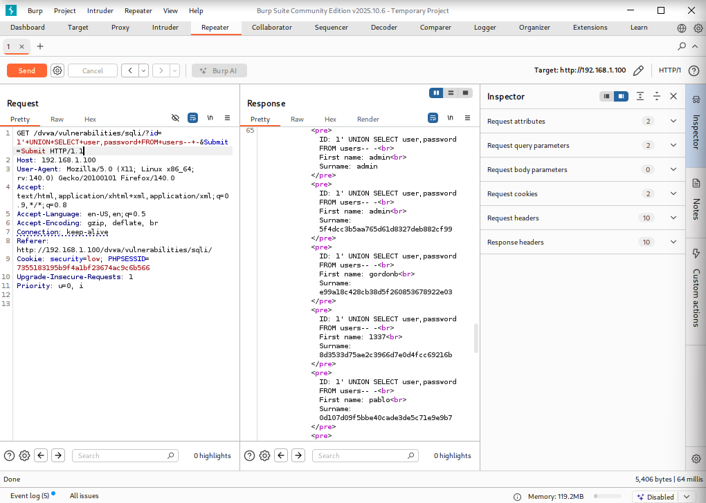
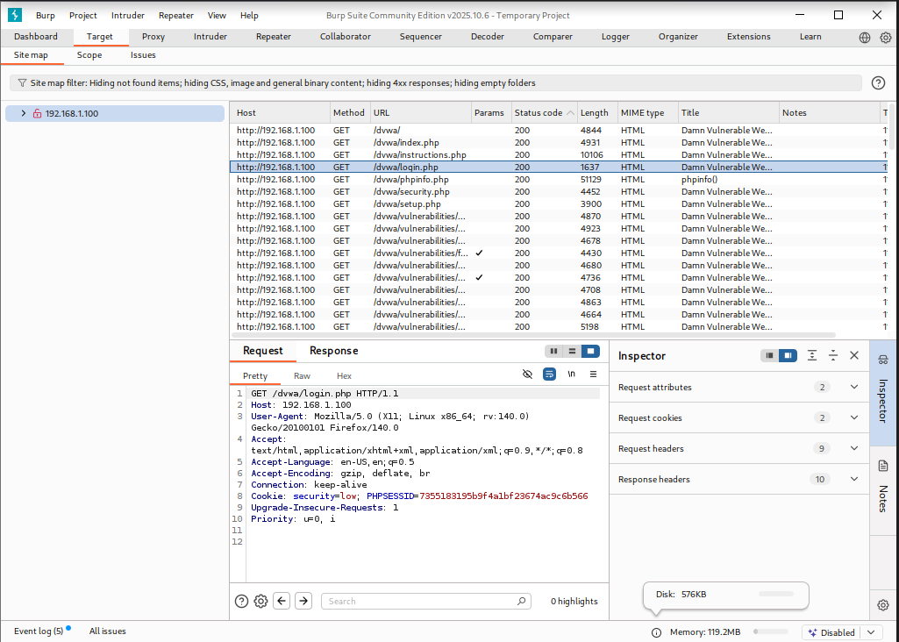

# Exercise 29 — Burp Suite Web Application Testing

**Date:** 26/04/2026
**Category:** Web Attacks / Security Testing
**Tools:** Burp Suite Community Edition, Firefox, DVWA
**Attacker:** Kali Linux — 192.168.56.102
**Firewall:** pfSense — WAN 192.168.56.104 / LAN 192.168.1.1
**Target:** Metasploitable2 — 192.168.1.100 (DVWA at http://192.168.1.100/dvwa)

---

## Objective

Use Burp Suite Community Edition as an intercepting proxy to capture, inspect, and manipulate HTTP traffic against DVWA. Demonstrate credential brute forcing via Burp Intruder, manual SQL injection via Burp Repeater, and passive traffic analysis via the site map — covering the core Burp workflow used in web application security testing and SOC triage.

---

## Background

Burp Suite is the industry-standard tool for web application security testing. It sits between the browser and the server as an intercepting proxy, giving the analyst full visibility and control over every HTTP request and response. It is used daily by penetration testers, SOC analysts triaging web application alerts, and bug bounty hunters.

The Community Edition (free) provides the core proxy, Intruder, Repeater, and site map functionality used in this exercise. Burp Pro adds automated scanning, but the manual workflow demonstrated here covers the techniques most relevant to SOC L1 and junior pentester roles.

This exercise builds directly on the SQL injection and brute force techniques demonstrated in Exercises 10 and 08 — the difference is that Burp gives the analyst precise control over the raw HTTP layer rather than working through a browser interface.

---

## Lab Setup

Three VMs required: pfSense, Metasploitable2, and Kali. Boot order: pfSense → Metasploitable → Kali.

After boot, add the route on Kali and verify connectivity:

```bash
sudo ip route add 192.168.1.0/24 via 192.168.56.104
ping 192.168.1.100
```

If Metasploitable's interface has picked up a DHCP address instead of its static IP, set it manually from the Metasploitable console:

```bash
sudo ifconfig eth0 192.168.1.100 netmask 255.255.255.0 up
sudo route add default gw 192.168.1.1
```

Verify Apache is running on Metasploitable:

```bash
sudo /etc/init.d/apache2 start
```

Set DVWA security to Low: navigate to `http://192.168.1.100/dvwa` → log in as `admin / password` → DVWA Security → Low → Submit.

### Screenshot — Lab Setup


---

## Part A — Configure Burp Suite as an Intercepting Proxy

Install Burp Suite Community on Kali if not already present:

```bash
sudo apt update && sudo apt install burpsuite -y
burpsuite &
```

Accept defaults → Temporary project → Use Burp defaults → Start Burp.

Burp listens on `127.0.0.1:8080` by default. Configure Firefox to route all traffic through it:

Firefox → Settings → search "proxy" → Manual proxy configuration:
- HTTP Proxy: `127.0.0.1` Port: `8080`
- Enable: Also use this proxy for HTTPS

**Important:** Leave Intercept **off** by default. Only turn it on immediately before submitting a specific form you want to capture — otherwise every page load is held waiting for manual approval.

| Burp component | Purpose |
|----------------|---------|
| Proxy | Intercepts and displays raw HTTP traffic between browser and server |
| Intruder | Automated payload injection for brute force and fuzzing |
| Repeater | Manual request modification and resending |
| Target / Site map | Passive map of all URLs observed through the proxy |
| Dashboard | Summary of findings and active tasks |

### Screenshot — Burp Proxy Setup


---

## Part B — Intercept a Login Request

With intercept **on**, navigate to `http://192.168.1.100/dvwa/login.php` and submit any credentials. Burp holds the request before it reaches the server.

The raw POST request is visible in the Proxy tab:

```
POST /dvwa/login.php HTTP/1.1
Host: 192.168.1.100
...
username=admin&password=password&Login=Login
```

This demonstrates a core web security principle: credentials submitted via a standard HTML form travel in plaintext over HTTP. Any proxy — including a malicious one — can read and modify them in transit. Burp makes this visible at the raw protocol level rather than through the browser abstraction.

Click **Forward** to pass the request through to the server.

### Screenshot — Intercepted Login Request


---

## Part C — Brute Force Login with Burp Intruder

Intruder automates payload injection into any parameter in a captured request.

1. Intercept the DVWA login POST request
2. Right-click → **Send to Intruder**
3. Intruder → Positions tab → click **Clear §** to remove all markers
4. Highlight only the password value → click **Add §**
5. Ensure username is set to `admin` (no markers around it)
6. Payloads tab → Payload type: Simple list → add:

```
password
admin
123456
letmein
abc123
```

7. Click **Start attack**

DVWA's login returns HTTP 302 for both success and failure, making the Status code column unreliable. Instead, click each result row and inspect the **Response** tab — look for the `Location:` header:

| Location header | Meaning |
|----------------|---------|
| `Location: index.php` | Successful login |
| `Location: login.php` | Failed login — wrong password |

The request with `password` as the payload returns `Location: index.php` — confirming the correct credential.

In a production environment this technique is used to test account lockout policies. A well-configured application should lock the account or introduce delays after 3–5 failed attempts. DVWA at Low security has no such protection.

### Screenshot — Intruder Attack Results


---

## Part D — SQL Injection via Burp Repeater

Repeater allows manual modification and resending of a single request — useful for testing injection payloads precisely without going through the browser each time.

1. Browse to the DVWA SQL Injection page with intercept on
2. Submit `1` in the User ID field — Burp captures the GET request
3. Right-click → **Send to Repeater**
4. In Repeater, find the `id=` parameter and replace the value with a UNION injection payload — spaces must be URL-encoded as `+` in GET requests:

```
1'+UNION+SELECT+user,password+FROM+users--+-
```

5. Click **Send**

The response panel returns the full DVWA users table including usernames and MD5 password hashes — identical to the manual browser injection in Exercise 10, but now performed at the raw HTTP layer with full control over the exact payload format.

| Part of payload | Meaning |
|----------------|---------|
| `1'` | Closes the legitimate SQL string, injecting into the query |
| `UNION SELECT` | Appends a second query to the original |
| `user,password` | Columns to retrieve — must match column count of original query |
| `FROM users` | Table containing the credentials |
| `--+-` | SQL comment — ignores the rest of the original query |

Repeater is particularly useful for iterating on injection payloads — each modification is one click to resend rather than re-navigating through the browser UI.

### Screenshot — Repeater SQL Injection


---

## Part E — Passive Traffic Analysis via Site Map

With intercept **off**, browse normally through several DVWA sections — SQL Injection, XSS, Command Execution, File Upload. Burp records every URL it observes in the background.

Target tab → Site map shows the complete structure of the application as Burp has discovered it: every endpoint, parameter, and subdirectory seen during the session.

This passive mapping is useful for understanding an application's attack surface before beginning active testing — it answers the question "what endpoints exist?" without sending any additional probing requests.

Note: automated active and passive scanning requires Burp Pro. Community edition provides the site map and manual testing workflow demonstrated in this exercise.

### Screenshot — Burp Site Map


---

## Attack Chain Summary

```
Firefox configured to proxy through Burp (127.0.0.1:8080)
    → Login POST request intercepted — credentials visible in plaintext
        → Request sent to Intruder → password field fuzzed with wordlist
            → Correct password identified via Location: index.php response
                → SQLi GET request intercepted → sent to Repeater
                    → UNION SELECT payload injected → full credential dump returned
                        → Passive browsing → site map built automatically
```

---

## Real-World Relevance

Burp Suite is present in virtually every penetration testing engagement and is increasingly used by SOC analysts for web application triage. Understanding how to intercept and manipulate HTTP traffic at the raw level is foundational knowledge for anyone working with web application security.

The Intruder brute force demonstration highlights why account lockout policies and rate limiting are critical controls — without them, any attacker with network access and a wordlist can automate credential testing. The Repeater SQLi demonstration shows how an analyst can precisely test whether a parameter is injectable without relying on browser behaviour.

The site map feature reflects how real assessments begin: passive reconnaissance of application structure before any active testing. Knowing what endpoints exist is the prerequisite for knowing what to test.

---

## Analyst View

From a SOC analyst perspective, the traffic patterns generated in this exercise produce distinct signatures in web server and proxy logs:

The Intruder brute force generates a rapid sequence of POST requests to `/dvwa/login.php` from the same source IP — identical to the pattern that triggers account lockout alerts and failed authentication threshold rules in production SIEMs. The key observable is volume: legitimate users do not submit five login attempts in under a second.

The Repeater SQLi produces a GET request with SQL syntax in the `id=` parameter. Web application firewalls and IDS rules specifically look for UNION, SELECT, and comment sequences (`--`) in URL parameters — this is a high-confidence injection indicator that would trigger an alert in any monitored environment.

---

## Indicators / IOCs

| Indicator | Type | Value | Severity |
|-----------|------|-------|----------|
| Rapid POST requests | Network pattern | Multiple login attempts to `/dvwa/login.php` in <1 second | High |
| SQL syntax in URL | Web log | `id=` parameter containing UNION, SELECT, `--` | Critical |
| Proxy user-agent | HTTP header | Burp Suite identified in User-Agent string | Medium |
| Source IP | Network | 192.168.56.102 | High |

---

## Escalation / Remediation

In a real environment where this activity was detected:

1. **Brute force:** Block the source IP at the WAF or perimeter firewall. Review whether account lockout policy is configured — if the targeted account was not locked after repeated failures, that is a separate finding requiring remediation.
2. **SQL injection:** If a UNION-based injection returned data, assume full database exposure. Identify what data the database contains and treat it as compromised. Notify relevant stakeholders per the incident response plan.
3. **Root cause:** Both vulnerabilities stem from the same underlying issue — insufficient input validation and no rate limiting. Both require code-level fixes, not just firewall rules.
4. **Web application firewall:** Deploy or tune WAF rules to block SQL syntax in URL parameters. ModSecurity with the OWASP Core Rule Set covers UNION SELECT patterns by default.
5. **Logging:** Ensure web server access logs are forwarded to the SIEM. Both attacks are invisible to network-layer monitoring but obvious in HTTP access logs.

---

## Recommendation

- **Use Burp Suite as a standard tool when investigating web application alerts.** The ability to inspect and replay raw HTTP requests is faster and more precise than reproducing attacks through a browser.
- **Test account lockout policies on all web applications.** If an Intruder attack against a login form runs to completion without triggering a lockout or CAPTCHA, the application has no brute force protection.
- **Parameterise all database queries.** SQL injection is entirely preventable with prepared statements — the vulnerability demonstrated here requires a code fix, not a configuration change.
- **Forward web server access logs to your SIEM.** Burp-generated attack patterns (rapid identical requests, SQL syntax in parameters) are clearly visible in access logs and trivial to alert on if the logs are being ingested.
- **Upgrade to Burp Pro for engagements requiring automated scanning.** Community edition covers manual testing well but active vulnerability scanning requires the Pro licence.
