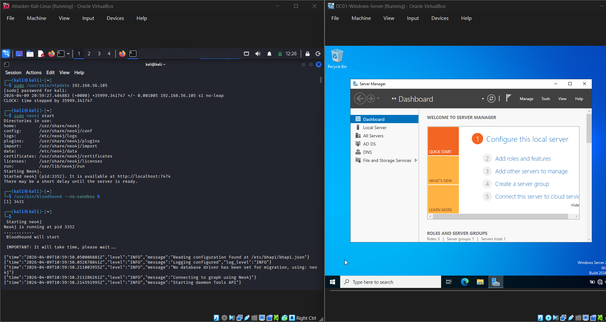
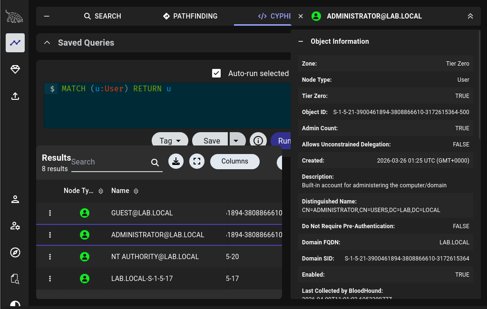
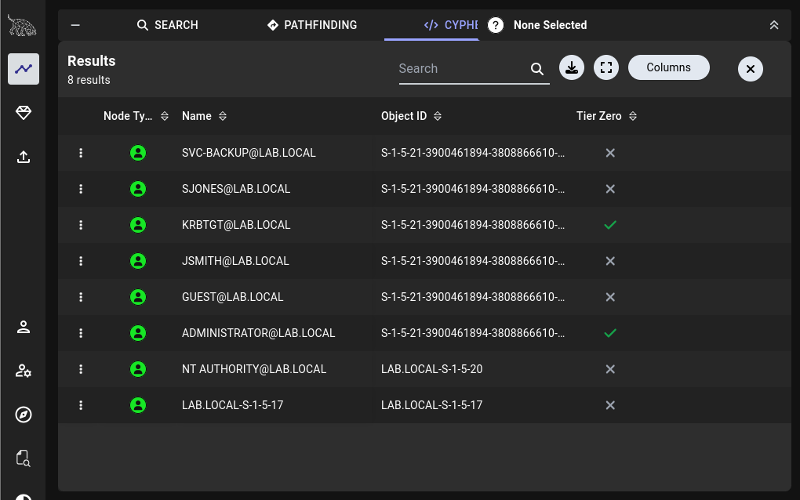
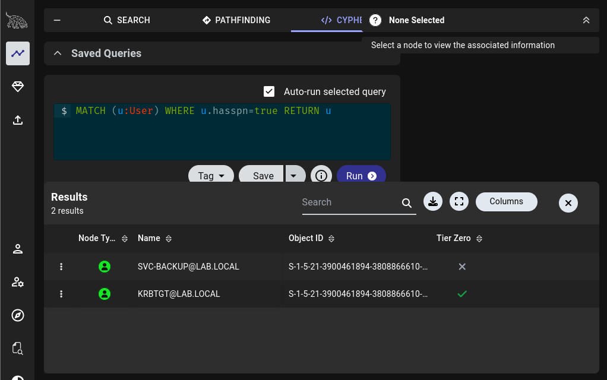
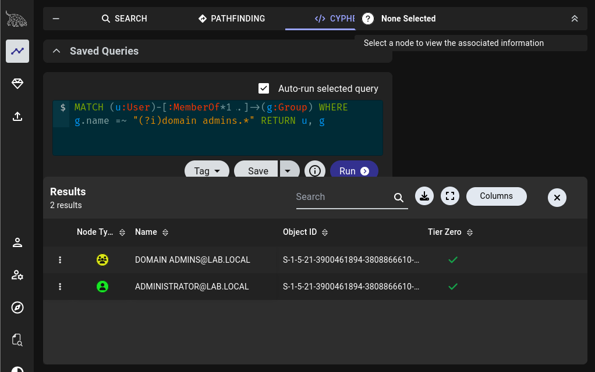
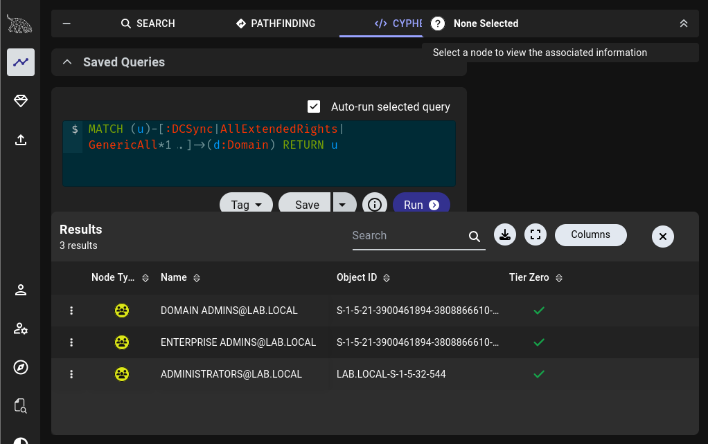

# Exercise 24 — BloodHound Attack Path Analysis

**Date:** 09/04/2026
**Category:** Active Directory / Threat Analysis
**Tools:** BloodHound CE, Neo4j, bloodhound-python
**Attacker:** Kali Linux — 192.168.56.102
**Target:** Windows Server 2022 Domain Controller — 192.168.56.105 (lab.local)

---

## Objective
Use BloodHound CE to map the Active Directory domain attack surface,
identify Tier Zero assets, Kerberoastable accounts, DCSync-capable
groups, and document attack paths — demonstrating how both red teams
and blue teams use graph-based AD analysis to understand domain risk.

---

## Background
BloodHound is an Active Directory reconnaissance and attack path
analysis tool that uses graph theory to map relationships between
users, groups, computers, and permissions in a domain. It was
originally built as an offensive tool to find the shortest path
to Domain Admin — but is now widely used defensively by blue teams
to identify and remediate attack paths before attackers exploit them.

**Graph-based analysis** reveals privilege relationships that are
invisible in traditional flat views of AD. A standard user may appear
harmless in the AD Users and Computers console, but BloodHound might
show they have GenericAll rights over a group that has DCSync
privileges — a three-hop path to domain compromise.

**Tier Zero** is BloodHound's classification for the most critical
assets in a domain — accounts and groups whose compromise leads
directly to full domain takeover. Protecting Tier Zero assets is
the foundation of AD security hardening.

This exercise builds directly on Exercises 15 (Kerberoasting) and
21 (Pass-the-Hash) by providing the analytical framework that would
have guided those attacks in a real engagement.

---

## Lab Setup

Kali and Windows Server DC running on the Host-Only network
(192.168.56.x). Clock synchronised before starting:

```bash
sudo /usr/sbin/ntpdate 192.168.56.105
```

Neo4j and BloodHound started:
```bash
sudo neo4j start
/usr/bin/bloodhound --no-sandbox &
```

Domain data collected using bloodhound-python and uploaded to
BloodHound CE:
```bash
bloodhound-python -u jsmith -p 'Password123!' -d lab.local \
  -dc WIN-SA1M7528EHL.lab.local -ns 192.168.56.105 -c all
```

### Screenshot — Lab Setup: Kali and DC Running


---

## Part A — Full Domain Inventory

The first query returned all domain objects — users, computers,
groups, and the domain node itself:
MATCH (u:User) RETURN u

**Result:** 8 nodes returned including all domain accounts created
in Exercise 15 plus built-in accounts.

### Screenshot — Full Domain Node Map


**Analyst View:** A full domain inventory is the starting point of
any AD assessment. The node count, account types, and relationships
visible here give an immediate picture of the domain's size and
complexity. In a real engagement this query would return hundreds
or thousands of nodes — the graph relationships between them are
where the risk lives.

---

## Part B — Tier Zero Asset Identification

Tier Zero nodes were identified by clicking each node and reviewing
the classification:

**Tier Zero accounts identified:**
- `ADMINISTRATOR@LAB.LOCAL` — built-in Domain Admin
- `KRBTGT@LAB.LOCAL` — Kerberos service account, controls ticket issuance

### Screenshot — Tier Zero Nodes Highlighted


**Analyst View:** Tier Zero assets are the crown jewels of any AD
domain. Compromise of either account leads to complete domain
takeover — Administrator directly, krbtgt via Golden Ticket attack
(forging Kerberos tickets valid for any account indefinitely).
These accounts require the highest level of monitoring and access
restriction.

**IOCs / Risk Indicators:**

| Account | Risk | Tier |
|---|---|---|
| ADMINISTRATOR@LAB.LOCAL | Direct domain admin access | Zero |
| KRBTGT@LAB.LOCAL | Golden Ticket attack if hash compromised | Zero |

**Escalation:** Any authentication event, password change, or
unusual activity involving Tier Zero accounts should trigger
immediate investigation regardless of time of day.

---

## Part C — Kerberoastable Account Identification
MATCH (u:User) WHERE u.hasspn=true RETURN u

**Result:** Two Kerberoastable accounts identified:
- `SVC-BACKUP@LAB.LOCAL` — service account with HTTP SPN registered
- `KRBTGT@LAB.LOCAL` — built-in Kerberos account with SPN by default

### Screenshot — Kerberoastable Accounts


**Analyst View:** Any account with a Service Principal Name (SPN)
can be Kerberoasted by any domain user — no special privileges
required. svc-backup was successfully Kerberoasted in Exercise 15,
with its hash cracked to `Backup2024!` in under a second. BloodHound
surfaces this risk automatically, allowing defenders to audit SPN
registrations and enforce strong passwords on service accounts
before an attacker exploits them.

**IOCs / Risk Indicators:**

| Account | SPN | Risk |
|---|---|---|
| SVC-BACKUP | HTTP/dc01.lab.local | Weak password — cracked in Exercise 15 |
| KRBTGT | Default Kerberos SPN | Tier Zero — Golden Ticket risk |

**Remediation:** Migrate service accounts to Group Managed Service
Accounts (gMSA) — 120-character auto-rotating passwords that cannot
be Kerberoasted.

---

## Part D — Domain Admin Membership
MATCH (u:User)-[:MemberOf1..]->(g:Group)
WHERE g.name =~ "(?i)domain admins."
RETURN u, g

**Result:** Domain Admins group contains `ADMINISTRATOR@LAB.LOCAL`
only — no unexpected accounts with Domain Admin privileges.

### Screenshot — Domain Admins Group Membership


**Analyst View:** Domain Admin membership should be minimal — ideally
a single break-glass account used only for emergency domain
administration. Finding only Administrator here is a correctly
configured domain. In real enterprise environments BloodHound
frequently reveals dozens of accounts with Domain Admin rights
accumulated over years of poor access hygiene — each one is a
potential path to full domain compromise.

**Remediation:** Audit Domain Admin membership quarterly. Remove
any account that does not require persistent DA rights. Use
just-in-time privileged access for administrative tasks.

---

## Part E — DCSync Rights Analysis

DCSync is a technique that allows an account to replicate all
password hashes from a Domain Controller — effectively dumping
the entire domain credential store without touching the DC locally.
Any account or group with DCSync rights is a critical risk.
MATCH (u)-[:DCSync|AllExtendedRights|GenericAll*1..]->(d:Domain)
RETURN u

**Result:** Three groups identified with DCSync rights:
- `DOMAIN ADMINS@LAB.LOCAL`
- `ENTERPRISE ADMINS@LAB.LOCAL`
- `ADMINISTRATORS@LAB.LOCAL`

### Screenshot — DCSync Rights Holders


**Analyst View:** DCSync rights are legitimately held by Domain
Admins and Enterprise Admins — this is expected AD behaviour.
The risk arises when non-admin accounts are granted DCSync rights
through misconfiguration or privilege creep. In this lab the
results are correct. In real environments BloodHound frequently
surfaces unexpected accounts — service accounts, helpdesk users,
or application accounts — with DCSync rights granted inadvertently
through ACL inheritance or explicit assignment.

**IOCs / Risk Indicators:**

| Group | DCSync Rights | Expected |
|---|---|---|
| DOMAIN ADMINS | Yes | ✅ Expected |
| ENTERPRISE ADMINS | Yes | ✅ Expected |
| ADMINISTRATORS | Yes | ✅ Expected |

**Remediation:** Run this query quarterly — any account outside
these three groups with DCSync rights is a critical misconfiguration
requiring immediate remediation.

---

## Attack Path Finding — jsmith to Domain Admin

A shortest path query was run to determine whether jsmith (standard
domain user) had any exploitable path to Domain Admin:
MATCH (u:User {name:"JSMITH@LAB.LOCAL"}),
(g:Group {name:"DOMAIN ADMINS@LAB.LOCAL"}),
p=shortestPath((u)-[*1..]->(g))
RETURN p

**Result:** No path found.

**Analyst View:** This is the correct result for a well-configured
domain — a standard user should have no path to Domain Admin through
ACL abuse, group membership, or privilege delegation. In real
enterprise environments this query frequently returns paths through
misconfigured ACLs, over-privileged service accounts, or GPO
editing rights. The absence of a path here confirms the lab AD
is correctly configured with least-privilege principles.

---

## Attack Chain Summary
bloodhound-python collects all domain objects and relationships
→ BloodHound maps 8 nodes across users, groups, and domain
→ Tier Zero identified — Administrator and krbtgt are crown jewels
→ Kerberoastable accounts found — svc-backup already cracked in Ex.15
→ Domain Admins confirmed — Administrator only, correctly configured
→ DCSync rights held by expected admin groups only
→ No path from jsmith to Domain Admin — least privilege working

---

## Real-World Relevance

**BloodHound is used by both attackers and defenders.** Red teams
use it to find the fastest path to Domain Admin. Blue teams use
it to find and close those paths before attackers do. Understanding
both perspectives is the core competency of an AD security specialist.

**Most enterprise AD environments are misconfigured.** Studies by
security vendors consistently show that the majority of AD
environments have at least one path from a standard user to Domain
Admin through misconfigured ACLs, over-privileged service accounts,
or group nesting. BloodHound finds these paths in minutes that
would take manual analysis weeks to uncover.

**Tier Zero protection is the foundation of AD security.** The
NIST and Microsoft AD tiering model exists specifically to isolate
Tier Zero assets from lower-privilege environments. A compromised
helpdesk account should never be able to reach the Domain Controller
— BloodHound shows whether that isolation is actually in place.

**The krbtgt account is uniquely dangerous.** Compromise of the
krbtgt hash enables Golden Ticket attacks — forged Kerberos tickets
valid for any account in the domain, with any expiry, indefinitely.
Detection requires monitoring for tickets with abnormal lifetimes
or encryption types, which most organisations do not have configured.

**MITRE ATT&CK T1069.002** — Permission Groups Discovery: Domain
Groups, and **T1482** — Domain Trust Discovery are both covered
by the BloodHound analysis performed in this exercise.

---

## Analyst View Summary

| Finding | Risk Level | Status | Remediation |
|---|---|---|---|
| Administrator — Tier Zero | Critical | Expected | Monitor all auth events |
| krbtgt — Tier Zero | Critical | Expected | Rotate password twice, monitor |
| svc-backup — Kerberoastable | High | Misconfigured | Migrate to gMSA |
| krbtgt — Kerberoastable | High | Expected | Enforce AES encryption |
| Domain Admins membership | Low | Correctly configured | Audit quarterly |
| DCSync rights | Low | Correctly configured | Audit quarterly |
| jsmith path to DA | None | Correctly configured | Maintain least privilege |

---

## Recommendation
- Run BloodHound quarterly as a defensive audit — export findings
  as a risk report and track remediation over time
- Migrate all service accounts with SPNs to **Group Managed Service
  Accounts (gMSA)** — eliminates Kerberoasting entirely for those
  accounts
- Rotate the **krbtgt password twice** (two rotations invalidate
  all existing Kerberos tickets) whenever a domain compromise is
  suspected — this is the primary Golden Ticket remediation
- Implement **AD Tiering** — Tier 0 (DC/domain admin), Tier 1
  (servers), Tier 2 (workstations) — prevent credential flows
  between tiers
- Monitor **Event ID 4769** (Kerberos service ticket requests with
  RC4 encryption) — the specific signature of Kerberoasting in
  Windows event logs
- Enable **Microsoft Defender for Identity** or equivalent in
  production environments — provides real-time detection of
  BloodHound collection, Pass-the-Hash, Kerberoasting, and
  DCSync attacks
