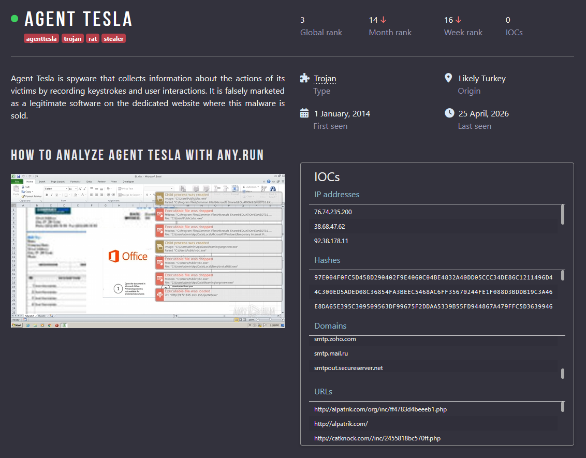
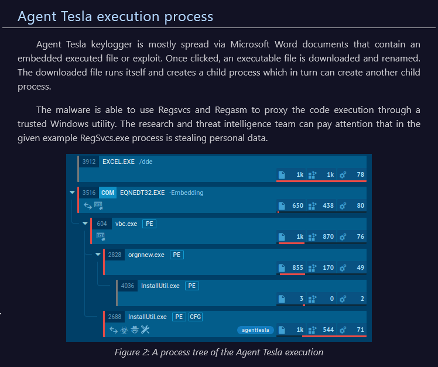
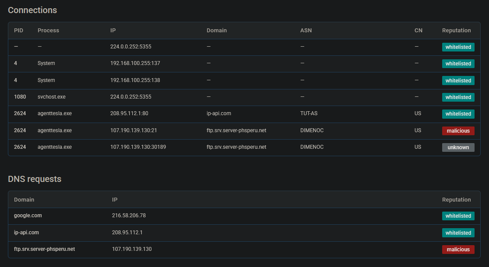
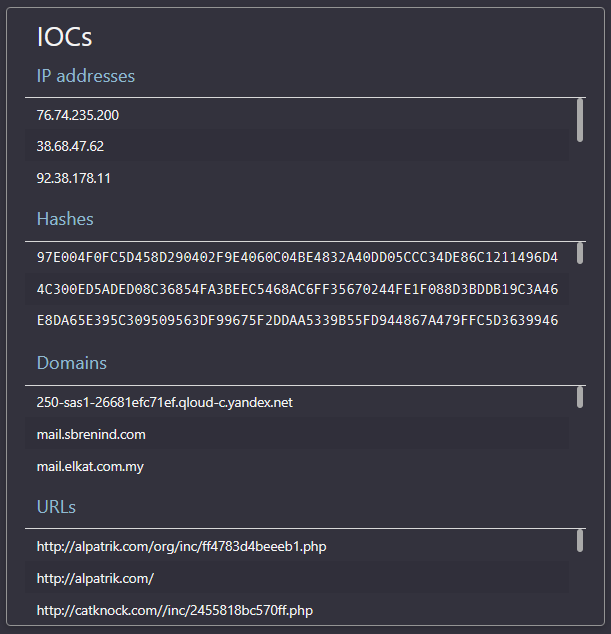
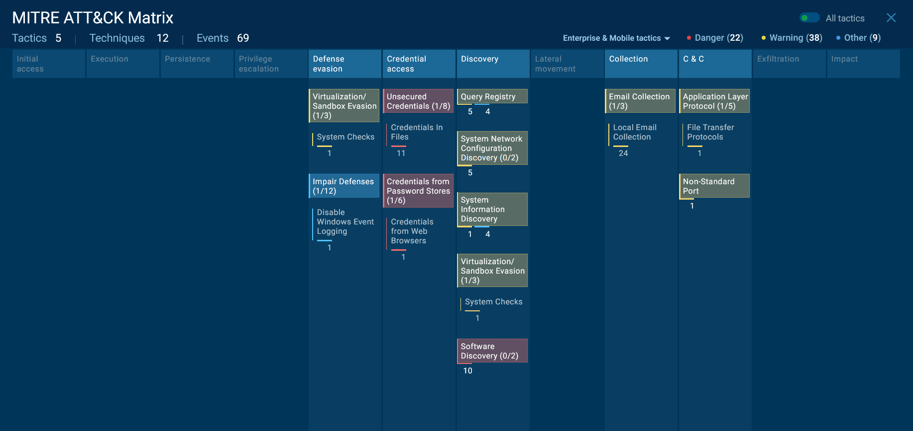

# Exercise 28 — Malware Analysis: Agent Tesla via Any.run Sandbox

**Date:** 25/04/2026
**Category:** Malware Analysis / Threat Intelligence
**Tools:** Any.run Interactive Sandbox
**Platform:** Any.run public sandbox (app.any.run)
**Sample:** agenttesla.exe — public submission, May 2025

---

## Objective

Analyse a confirmed Agent Tesla malware sample using the Any.run interactive sandbox. Extract behavioural indicators, map activity to MITRE ATT&CK techniques, and document findings in SOC analyst format — practising the triage workflow used when investigating endpoint alerts in a real SOC environment.

---

## Background

Agent Tesla is a commodity Remote Access Trojan and keylogger, first observed in 2014 and consistently ranked among the most prevalent malware families in phishing campaigns globally. It is sold as a commercial product on underground forums, making it accessible to low-skilled threat actors and resulting in extremely high submission volumes on public sandboxes.

Its primary function is credential theft: it targets browser saved passwords, email clients, FTP clients, and VPN credentials, then exfiltrates everything to an attacker-controlled server via SMTP, FTP, or HTTP. Keylogging and screenshot capture run in parallel, capturing anything not stored in a credential store.

Despite being over a decade old, Agent Tesla remains highly effective because it is actively developed, frequently repacked with commercial protectors (Themida is common), and delivered almost exclusively via phishing — a delivery vector that does not require any technical vulnerability to exploit.

---

## Lab Setup

This exercise uses Any.run's public sandbox — no local VM required. The sample analysed is a public submission available at:

`https://app.any.run/tasks/03db8c35-882c-4d89-8077-56c9d3e65669`

IOC data supplemented from the Any.run Agent Tesla Malware Trends Tracker:

`https://any.run/malware-trends/agenttesla/`

The sample was executed in a Windows 7 SP1 32-bit environment with network access enabled, reflecting a realistic enterprise endpoint configuration for the malware's typical target demographic.

### Screenshot — Any.run Overview Panel


---

## Part A — Sample Identification

**File name:** agenttesla.exe
**Analysis date:** 11 May 2025
**Sandbox OS:** Windows 7 Professional SP1 (build 7601, 32-bit)
**Verdict:** Malicious activity
**Malware family:** Agent Tesla (Stealer / RAT)

**File hashes:**

| Hash type | Value |
|-----------|-------|
| MD5 | 6A2DC21C0F947DAFEA19DE8A0B3DFFD2 |
| SHA1 | 09A87DDA6F10C3F249CCA01BE074F4D8B3B4C20C |
| SHA256 | 6A4C2AB91073F064DED4D65103254B49A0708A6C79FF9455F995068C8DC9A8FC |

**File type:** PE32 executable (GUI) Intel 80386 — a standard 32-bit Windows executable.

**Tags assigned by sandbox:** `stealer` `evasion` `ftp` `exfiltration` `agenttesla` `themida`

The `themida` tag is significant — Themida is a commercial software protector used by the malware author to pack the executable, making static analysis and signature detection significantly harder. Antivirus engines that rely on signature matching against unpacked code will miss packed variants.

---

## Part B — Process Behaviour Analysis

Agent Tesla's execution chain follows a consistent pattern observed across thousands of sandbox submissions:

1. **Initial execution** — agenttesla.exe launches and immediately begins anti-analysis checks (Themida protector runs first, detecting sandbox/debugger environments)
2. **Process injection** — Agent Tesla injects into a legitimate Windows process to hide its activity from process listings and avoid termination
3. **Persistence** — writes itself to a startup location (registry Run key or startup folder) to survive reboots
4. **Data collection** — keylogging begins, credential stores are scraped from browsers and email clients
5. **Exfiltration** — collected data is staged and sent to attacker infrastructure via SMTP or FTP

The `evasion` tag confirms anti-sandbox behaviour was observed during this run. The `ftp` tag confirms FTP was used as an exfiltration channel alongside or instead of SMTP.

### Screenshot — Process Tree


---

## Part C — Network Activity

Agent Tesla's network behaviour is one of its most distinctive characteristics. Rather than using a custom C2 protocol, it abuses legitimate email and file transfer infrastructure to blend exfiltrated data into normal-looking traffic.

**Exfiltration channels observed across Agent Tesla campaigns:**

| Protocol | Infrastructure abused | Purpose |
|----------|-----------------------|---------|
| SMTP | smtp.gmail.com, smtp.zoho.com, smtp.yandex.ru, smtp.mail.ru | Email credentials and keylog data to attacker inbox |
| FTP | Attacker-controlled FTP servers | File-based exfiltration of credential dumps |
| HTTP | Attacker panel URLs (`/inc/*.php` endpoints) | C2 check-in and data upload |

**IP addresses associated with this campaign:**

| IP | Notes |
|----|-------|
| 76.74.235.200 | C2 infrastructure |
| 38.68.47.62 | C2 infrastructure |
| 92.38.178.11 | C2 infrastructure |
| 198.23.221.13 | C2 infrastructure |

**External IP check:** Agent Tesla commonly queries `checkip.amazonaws.com` to retrieve the victim machine's public IP address — this is included in the exfiltrated data package sent to the attacker.

### Screenshot — Network Connections


---

## Part D — Indicators of Compromise

IOCs extracted from the sandbox report and the Any.run Agent Tesla Malware Trends Tracker:

**File indicators:**

| Type | Value |
|------|-------|
| MD5 | 6A2DC21C0F947DAFEA19DE8A0B3DFFD2 |
| SHA256 | 6A4C2AB91073F064DED4D65103254B49A0708A6C79FF9455F995068C8DC9A8FC |
| File type | PE32 executable, packed with Themida |

**Network indicators:**

| Type | Value | Severity |
|------|-------|----------|
| IP | 76.74.235.200 | Critical |
| IP | 38.68.47.62 | Critical |
| IP | 92.38.178.11 | Critical |
| IP | 198.23.221.13 | Critical |
| Domain | smtp.zoho.com (abused for exfil) | High |
| Domain | smtp.gmail.com (abused for exfil) | High |
| Domain | smtp.yandex.ru (abused for exfil) | High |
| Domain | checkip.amazonaws.com (IP discovery) | Medium |
| URL | http://198.98.55.114/rights/inc/0b221f05c8d6c3.php | Critical |
| URL | http://185.225.74.69/mad/inc/1c468152070648.php | Critical |
| URL | http://107.189.4.253/zipone/inc/10c5bcaaef047d.php | Critical |

**Behavioural indicators:**

| Indicator | Description |
|-----------|-------------|
| Themida packer | Executable is commercially packed — high AV evasion capability |
| checkip.amazonaws.com query | Victim IP reconnaissance before exfiltration |
| SMTP authentication to webmail | Data exfiltrated to attacker-controlled inbox |
| FTP connection outbound | Secondary exfiltration channel |

### Screenshot — IOC Panel


---

## Part E — MITRE ATT&CK Mapping

| Technique ID | Name | Observed Behaviour |
|-------------|------|--------------------|
| T1566.001 | Phishing: Spearphishing Attachment | Primary delivery vector for Agent Tesla campaigns |
| T1027 | Obfuscated Files or Information | Themida commercial packer applied to binary |
| T1056.001 | Input Capture: Keylogging | Keylogger active post-execution |
| T1555 | Credentials from Password Stores | Browser and email client credential scraping |
| T1113 | Screen Capture | Periodic screenshots taken and staged for exfiltration |
| T1082 | System Information Discovery | OS, hostname, username, public IP collected |
| T1071.003 | Application Layer Protocol: Mail Protocols | SMTP used for data exfiltration |
| T1071.002 | Application Layer Protocol: File Transfer Protocols | FTP used as secondary exfiltration channel |
| T1547.001 | Boot or Logon Autostart: Registry Run Keys | Persistence via registry startup entry |

### Screenshot — MITRE ATT&CK Mapping


---

## Attack Chain Summary

```
Phishing email with malicious attachment delivered to victim
    → Victim opens attachment → agenttesla.exe executes
        → Themida unpacks → anti-sandbox checks run
            → Process injection into legitimate Windows process
                → Persistence written to registry Run key
                    → Keylogger activates / credential stores scraped
                        → checkip.amazonaws.com queried (victim IP retrieved)
                            → Exfiltration via SMTP to attacker inbox
                                → Parallel FTP exfiltration of credential dump
```

---

## Real-World Relevance

Agent Tesla is not a sophisticated nation-state tool — it is a commodity RAT available to anyone willing to pay for it. This is precisely what makes it dangerous at scale: it is deployed in massive phishing campaigns targeting finance, manufacturing, and logistics sectors, and it appears in SOC alert queues daily across virtually every industry.

For a SOC analyst, recognising Agent Tesla's behavioural fingerprint is a core skill. The combination of SMTP connections to webmail providers immediately after execution, external IP discovery via checkip.amazonaws.com, and a Themida-packed PE32 executable are collectively distinctive. No single indicator is definitive; the pattern of all three together is.

The sandbox workflow practised here — submitting or opening a report, reading the process tree, extracting network IOCs, and mapping to MITRE ATT&CK — is the daily triage process for malware-related alerts in a SOC environment.

---

## Analyst View

Receiving an alert for this sample in a production SOC, the triage conclusion would be: **confirmed malware infection, credential compromise likely, immediate containment required**.

Key reasoning:
- The Themida packer indicates deliberate AV evasion — this is not accidental or benign software
- SMTP connections from an endpoint to webmail providers (Yandex, Gmail, Zoho) that are not sanctioned corporate mail servers are a strong exfiltration signal
- The checkip.amazonaws.com query is a well-documented Agent Tesla behaviour — its presence alone is high-confidence attribution
- Keylogging and credential scraping mean the blast radius extends beyond the compromised machine to any account the user authenticated to during the infection window

The infection likely arrived via a phishing email. The first question to answer in the investigation is: who else received the same email?

---

## Indicators / IOCs

| Indicator | Type | Value | Severity |
|-----------|------|-------|----------|
| agenttesla.exe | File hash (SHA256) | 6A4C2AB91073F064DED4D65103254B49A0708A6C79FF9455F995068C8DC9A8FC | Critical |
| agenttesla.exe | File hash (MD5) | 6A2DC21C0F947DAFEA19DE8A0B3DFFD2 | Critical |
| C2 server | IP | 76.74.235.200 | Critical |
| C2 server | IP | 38.68.47.62 | Critical |
| C2 server | IP | 92.38.178.11 | Critical |
| Exfil panel | URL | http://198.98.55.114/rights/inc/0b221f05c8d6c3.php | Critical |
| Exfil panel | URL | http://185.225.74.69/mad/inc/1c468152070648.php | Critical |
| SMTP exfil | Domain | smtp.zoho.com / smtp.gmail.com / smtp.yandex.ru | High |
| IP discovery | Domain | checkip.amazonaws.com | Medium |
| Packer | Behavioural | Themida — commercial executable protector | High |

---

## Escalation / Remediation

In a real SOC response to an Agent Tesla alert:

1. **Immediate:** Isolate the affected endpoint from the network. Credential exfiltration may have already occurred — containment limits further keylogging.
2. **Credential reset:** Force password resets for all accounts authenticated on the machine during the infection window — email, VPN, browser-saved credentials, corporate SSO.
3. **Phishing investigation:** Pull the original delivery email from mail gateway logs. Extract sender, subject, and attachment hash. Search for the same email across all mailboxes — other users may have the same attachment.
4. **IOC deployment:** Block the C2 IPs and exfiltration panel URLs at the perimeter firewall and web proxy. Add the SHA256 hash to EDR blocklist.
5. **Persistence cleanup:** Remove the registry Run key entry used for persistence. Verify no scheduled tasks were also created.
6. **Scope check:** Query EDR telemetry for the file hash across all endpoints. If Agent Tesla was delivered via a phishing campaign, multiple machines may be infected.

---

## Recommendation

- **Treat any SMTP connection from an endpoint to a non-corporate webmail provider as suspicious.** Agent Tesla and similar stealers routinely abuse Gmail, Zoho, and Yandex for exfiltration precisely because outbound port 587 is often allowed through corporate firewalls.
- **Block or alert on queries to checkip.amazonaws.com from endpoints.** Legitimate business applications rarely need to discover their own public IP. This query is a high-fidelity indicator for multiple stealer malware families.
- **Deploy email gateway scanning with attachment sandboxing.** Agent Tesla arrives almost exclusively via phishing attachments. Sandbox detonation at the mail gateway catches it before it reaches the endpoint.
- **Use sandbox analysis as a first-line triage step for unknown executables.** Any.run, Joe Sandbox, and similar tools give analysts a full behavioural report in under two minutes — faster and safer than any manual analysis of an untrusted binary.
- **Hash-block known Agent Tesla samples in EDR.** The SHA256 from this report should be added immediately to the blocklist — known bad hashes cost nothing to block and stop identical reuse of the same packed binary.
