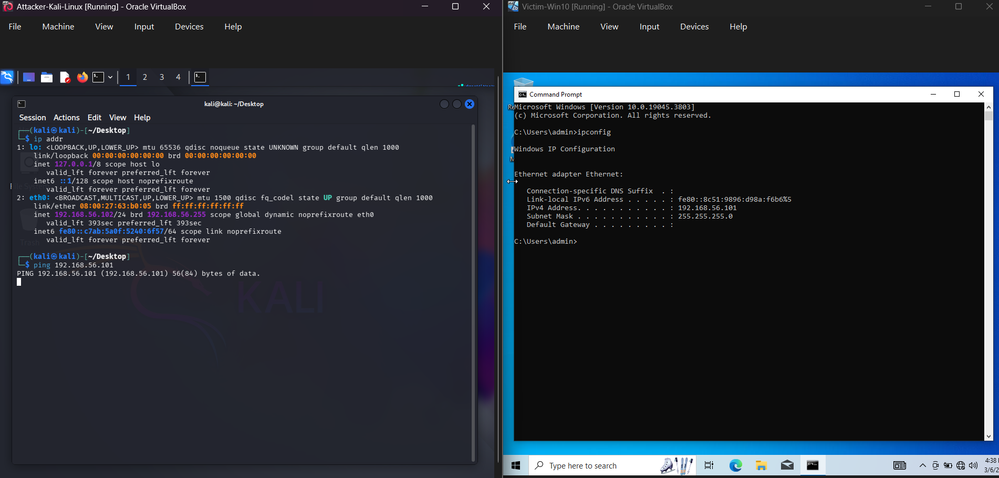

# 🖥️ Lab Environment Setup

## Overview
A fully isolated virtual home lab built on a Windows 11 host machine 
using Oracle VirtualBox. All attack simulations are performed within 
a Host-Only network — no traffic can reach the internet or the host 
machine during exercises.

## Host Machine
- **OS:** Windows 11
- **RAM:** 32GB
- **Hypervisor:** Oracle VirtualBox 7.2.6

## Virtual Machines

| VM | OS | Role | IP Address |
|---|---|---|---|
| Attacker-Kali-Linux | Kali Linux 2025.4 | Attacker / Analyst machine | 192.168.56.102 |
| Victim-Win10 | Windows 10 (10.0.19045) | Target machine | 192.168.56.101 |
| Metasploitable2 | Ubuntu Linux (Kernel 2.6.24) | Intentionally vulnerable target | 192.168.56.103 |

## Network Configuration
All VMs run on a **Host-Only network adapter**, fully isolated from 
the internet and the host machine. The attacker VM is switched to 
NAT only when downloading tools or updates, and immediately returned 
to Host-Only before any exercises are run.

## Screenshot

